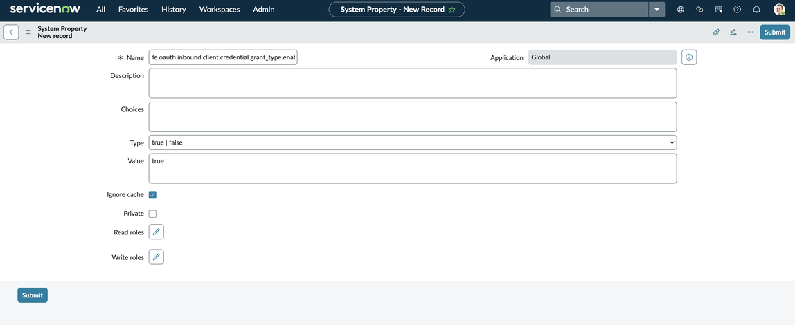
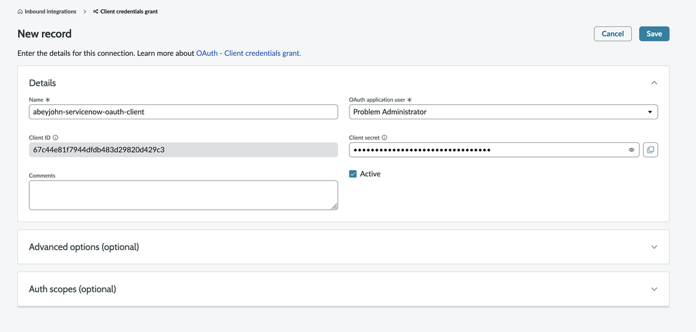
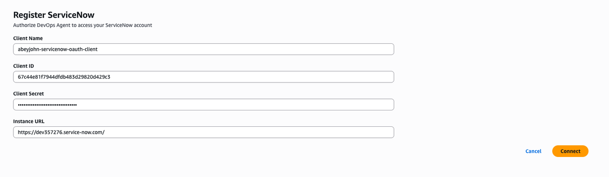
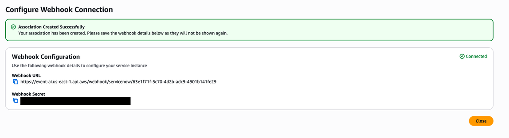
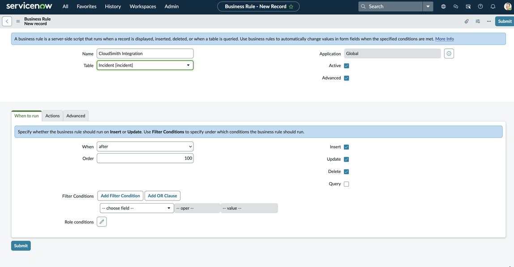
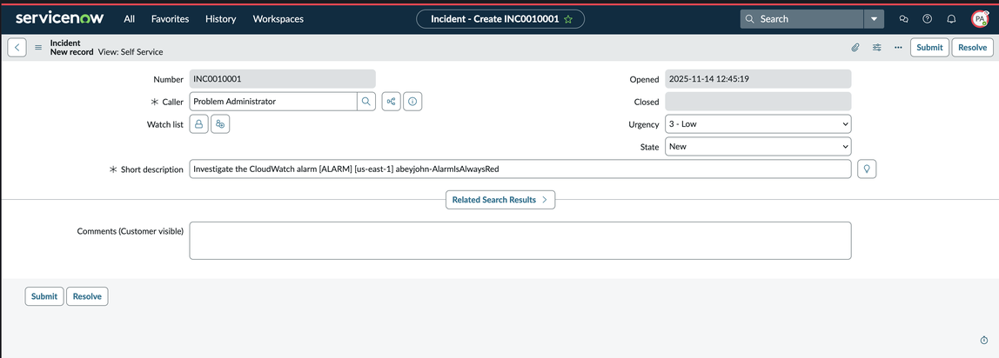
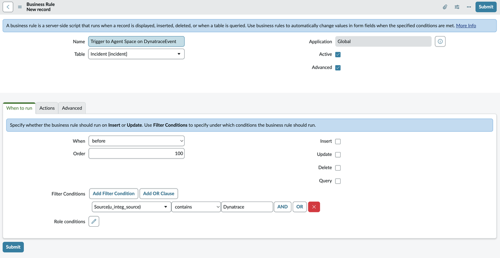
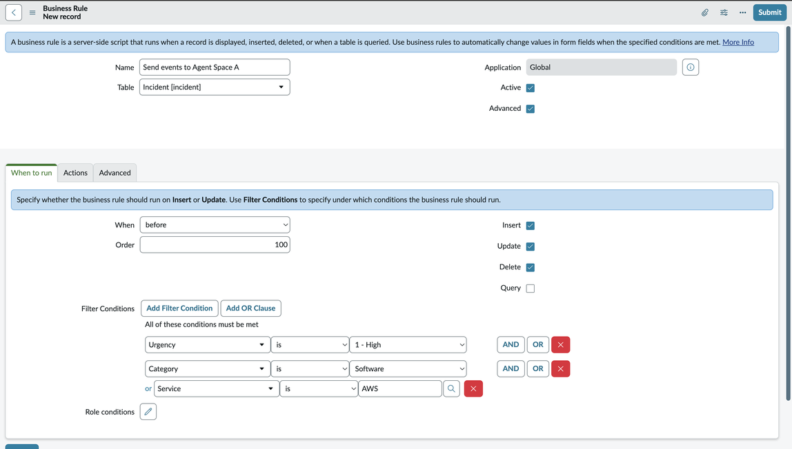
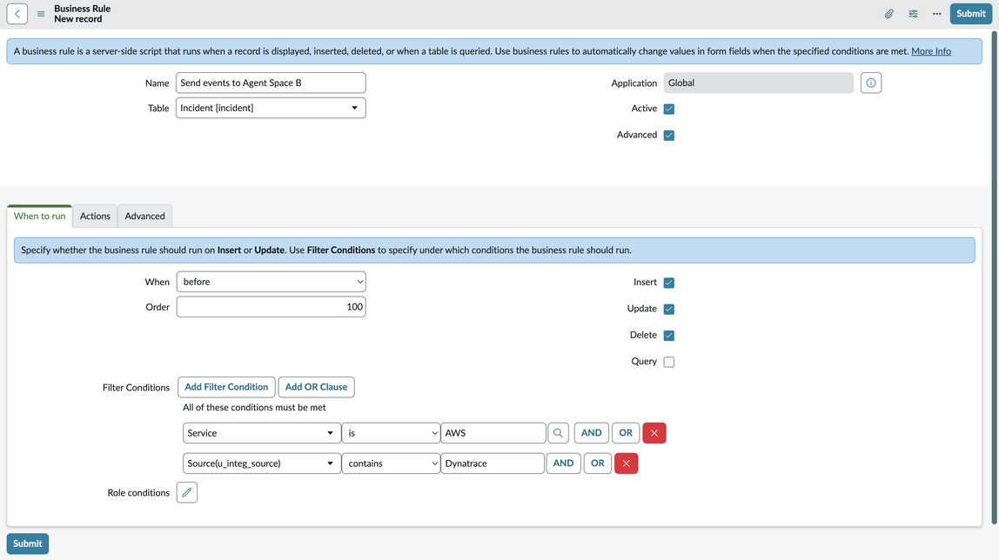

# ServiceNow

setup

This tutorial walks you through connecting a ServiceNow instance to AWS DevOps Agent to enable it to automatically initiate incident response Investigations when a ticket is created and post its key findings into the originating ticket. It also contains examples for how to configure your ServiceNow instance to send only specific tickets to a DevOps Agent Space and how to orchestrate ticket routing across multiple DevOps Agent Spaces.

## Initial setup

The first step is to create in ServiceNow an OAuth application client that AWS DevOps can use to access your ServiceNow instance.

### Create a ServiceNow OAuth application client

1. Enable your instance's client credential system property
2. Search `sys_properties.list` in the filter search box and then hit enter (it will not show the option but hitting enter works)
3. Then click on New
4. Add the name as `glide.oauth.inbound.client.credential.grant_type.enabled` and the value to true with type as true | false

 5. Navigate to System OAuth > Application Registry from the filter search box 6. Click "New" > "New Inbound Integration Experience" → "New Integration" → "OAuth - Client Credentials Grant" 7. Pick a name and set the OAuth application user to "Problem Administrator", click "Save"



### Connect your ServiceNow OAuth client to AWS DevOps Agent

1. You can start this process in two places. First, by navigating to AWS DevOps Agent → Settings → Communications, selecting ServiceNow from the list, and clicking register. Alternatively you can select any DevOps Agent Space you may have created and navigate to Capabilities → Communications → Add → ServiceNow and click Register.
2. Next, authorize DevOps Agent to access your ServiceNow instance using the OAuth application client you just created.



- Follow the next steps, and save the resulting information about the webhook

###### Important

You will not see this information again.



### Configure your ServiceNow Business Rule

Once you have established connectivity, you'll need to configure a business rule in ServiceNow to send tickets to your DevOps Agent Space(s).

1. Navigate to Activity Subscriptions → Administration → Business Rules, and click New.
2. Set the "Table" field to "Incident [incident]", check the "Advanced" box, and set the rule to run after Insert, Update, and Delete.



186. Navigate to the "Advanced" tab and add the following webhook script, inserting your webhook secret and URL where indicated, and click Submit.

```
(function executeRule(current, previous /*null when async*/ ) {

    var WEBHOOK_CONFIG = {
        webhookSecret: GlideStringUtil.base64Encode('<<< INSERT WEBHOOK SECRET HERE >>>'),
        webhookUrl: '<<< INSERT WEBHOOK URL HERE >>>'
    };

    function generateHMACSignature(payloadString, secret) {
        try {
            var mac = new GlideCertificateEncryption();
            var signature = mac.generateMac(secret, "HmacSHA256", payloadString);
            return signature;
        } catch (e) {
            gs.error('HMAC generation failed: ' + e);
            return null;
        }
    }

    function callWebhook(payload, config) {
        try {
            var payloadString = JSON.stringify(payload);


            var signature = generateHMACSignature(payloadString, config.webhookSecret);

            if (!signature) {
                gs.error('Failed to generate signature');
                return false;
            }

            gs.info('Generated signature: ' + signature);

            var request = new sn_ws.RESTMessageV2();
            request.setEndpoint(config.webhookUrl);
            request.setHttpMethod('POST');

            request.setRequestHeader('Content-Type', 'application/json');
            request.setRequestHeader('x-amzn-event-signature', signature);

            request.setRequestBody(payloadString);

            var response = request.execute();
            var httpStatus = response.getStatusCode();
            var responseBody = response.getBody();

            if (httpStatus >= 200 && httpStatus < 300) {
                gs.info('Webhook sent successfully. Status: ' + httpStatus);
                return true;
            } else {
                gs.error('Webhook failed. Status: ' + httpStatus + ', Response: ' + responseBody);
                return false;
            }

        } catch (ex) {
            gs.error('Error sending webhook: ' + ex.getMessage());
            return false;
        }
    }

    function createReference(field) {
        if (!field || field.nil()) {
            return null;
        }

        return {
            link: field.getLink(true),
            value: field.toString()
        };
    }

    function getStringValue(field) {
        if (!field || field.nil()) {
            return null;
        }
        return field.toString();
    }

    function getIntValue(field) {
        if (!field || field.nil()) {
            return null;
        }
        var val = parseInt(field.toString());
        return isNaN(val) ? null : val;
    }

    var eventType = (current.operation() == 'insert') ? "create" : "update";

    var incidentEvent = {
        eventType: eventType.toString(),
        sysId: current.sys_id.toString(),
        priority: getStringValue(current.priority),
        impact: getStringValue(current.impact),
        active: getStringValue(current.active),
        urgency: getStringValue(current.urgency),
        description: getStringValue(current.description),
        shortDescription: getStringValue(current.short_description),
        parent: getStringValue(current.parent),
        incidentState: getStringValue(current.incident_state),
        severity: getStringValue(current.severity),
        problem: createReference(current.problem),
        additionalContext: {}
    };

    incidentEvent.additionalContext = {
        number: current.number.toString(),
        opened_at: getStringValue(current.opened_at),
        opened_by: current.opened_by.nil() ? null : current.opened_by.getDisplayValue(),
        assigned_to: current.assigned_to.nil() ? null : current.assigned_to.getDisplayValue(),
        category: getStringValue(current.category),
        subcategory: getStringValue(current.subcategory),
        knowledge: getStringValue(current.knowledge),
        made_sla: getStringValue(current.made_sla),
        major_incident: getStringValue(current.major_incident)
    };

    for (var key in incidentEvent.additionalContext) {
        if (incidentEvent.additionalContext[key] === null) {
            delete incidentEvent.additionalContext[key];
        }
    }

    gs.info(JSON.stringify(incidentEvent, null, 2)); // Pretty print for logging only

    if (WEBHOOK_CONFIG.webhookUrl && WEBHOOK_CONFIG.webhookSecret) {
        callWebhook(incidentEvent, WEBHOOK_CONFIG);
    } else {
        gs.info('Webhook not configured.');
    }

})(current, previous);
```

If you chose to register your ServiceNow connection from the AWS DevOps Agent Setting tab, you now need to navigate to the DevOps Agent Space you want to investigate ServiceNow incident tickets, select Capabilities → Communications and then register the ServiceNow instance you connected to in the Settings tab. Now, everything should be set up, and all incidents where the caller is set to "Problem Administrator" (to mimic the permissions you gave the AWS DevOps OAuth client) will trigger a incident response investigation in the configured DevOps Agent Space. You can test this by creating a new incident in ServiceNow and setting the Caller field of the incident as "Problem Administrator."



### ServiceNow ticket updates

During all triggered incident response Investigations, your DevOps Agent will provide updates of its key findings, root cause analyses, and mitigation plans into the originating ticket. The agent findings are posted to the comments of an incident, and we'll currently only post agent records of type `finding`, `cause`, `investigation_summary`, `mitigation_summary` , and investigation status updates (e.g `AWS DevOps Agent started/finished its investigation`).

## Ticket routing and orchestration examples

### Scenario: Filtering which incidents are sent to a DevOps Agent Space

This is a simple scenario but needs some configuration in ServiceNow to create a field in ServiceNow to track incident source. For the purpose of this example, create a new Source (u_source) field using the SNOW form builder. This will enable tracking the incident source and use it to route requests from a particular source to a DevOps Agent Space. Routing is accomplished by creating a Service Now Business Rule and in the When to run tab setting "When" triggers and "Filter Conditions." In this example the filter conditions are set as follows:



### Scenario: Routing incidents across multiple DevOps Agent Spaces

This example shows how to trigger an Investigation in DevOps Agent Space B when the urgency is `1`, category is `Software` , or Service is `AWS`, and trigger an Investigation in DevOps Agent Space A when the service is `AWS`, and source is `Dynatrace`. This scenario can be accomplished in two ways. The webhook script itself can be updated to include this business logic. In this scenario we will show how to accomplish it with a ServiceNow Business Rule, for transparency and simplify debugging. Routing is accomplished by creating two Service Now Business Rules.

- Create a Business Rule in ServiceNow for DevOps Agent Space A and create a condition using the condition builder to only send the events based on our specified condition.



- Next, create another Business Rule in ServiceNow for AgentSpace B for which the business rule will only trigger when Service is AWS and source is Dynatrace.



Now, when you create a new Incident that matches the condition specified, it will either trigger an investigation on DevOps Agent Space A or DevOps Agent Space B, providing you with fine grained control over incident routing.
