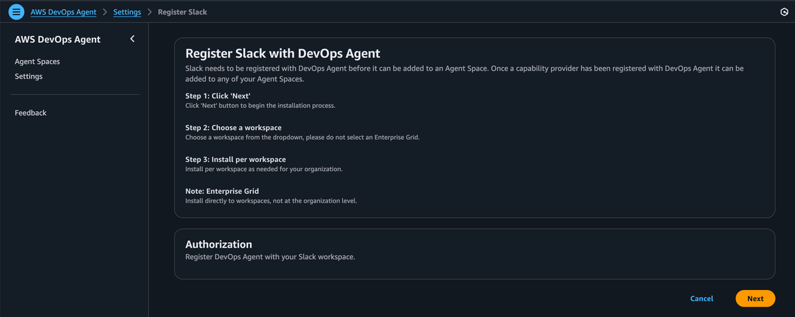

# Slack setup

You can configure AWS DevOps Agent to update a Slack channel you select with incident response investigation key findings, root cause analyses, and generated mitigation plans.

## Before you begin

Slack needs to be registered with DevOps Agent before it can be added to an Agent Space. To integrate AWS DevOps Agent with Slack you must meet these requirements:

- Have a Slack workspace with administrative permissions to install and authorize third-party applications
- Have identified the Slack channels where you want AWS DevOps Agent to send notifications

## Register Slack integration with AWS DevOps Agent

1. From the **Settings** tab in the AWS DevOps Agent console, navigate to **Communications → Slack.**
2. Click the **Register** button.
3. You will be redirected to Slack to authorize the AWS AIDevOps application for your workspace.
4. Install directly to workspaces, not at the organization level.
5. Choose a workspace from the dropdown. Do not select an Enterprise Grid.
6. Install per workspace as needed for your organization.
7. Review the requested permissions and click **Allow** to authorize the integration.
8. After authorization, you'll return to the AWS DevOps Agent console.

## Associate Slack with your DevOps Agent Space(s)

After registering Slack in your DevOps Agent Space, you can associate it with your DevOps Agent Space(s):

1. From the **Capabilities** tab within your configured AgentSpace, navigate to **Communications** → **Slack**.
2. Select **Add Slack**
3. Enter the Channel ID
4. Click **Create** to complete the Slack configuration.
