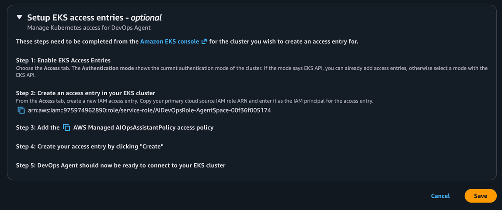

# AWS EKS access setup

You can enable AWS DevOps Agent to describe your Kubernetes cluster objects, retrieve pod logs and cluster events, for either public or private AWS EKS clusters (only accessible with a VPC).

Within a DevOps Agent Space navigate to Capabilities > Cloud > Primary Source > Edit and follow the setup instructions.

