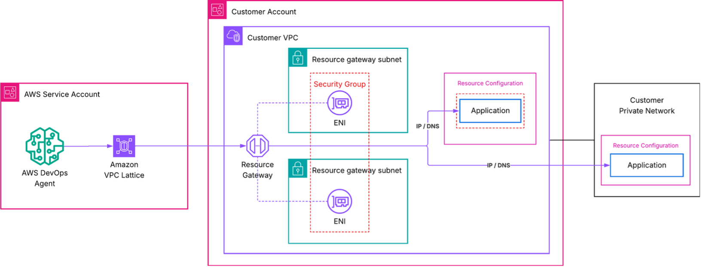
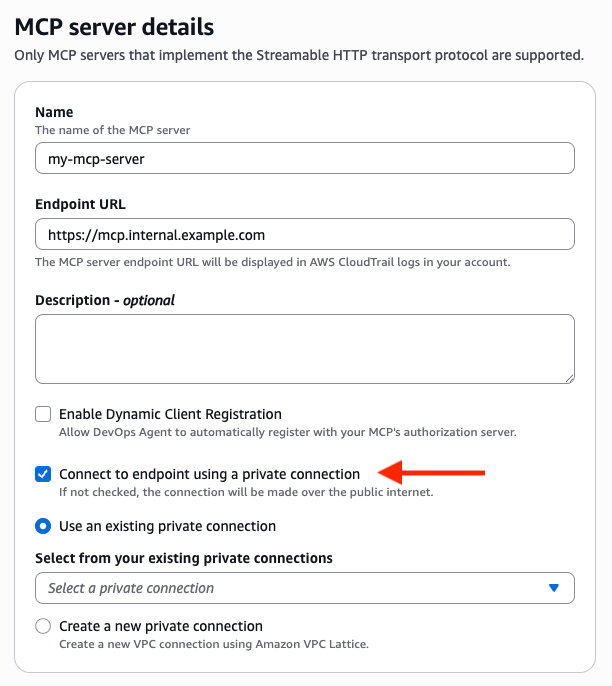

# Connecting to privately hosted tools

## Private connections overview

AWS DevOps Agent can be extended with custom Model Context Protocol (MCP) tools and other integrations that give the agent access to internal systems such as private package registries, self-hosted observability platforms, internal documentation APIs, and source control instances (see: [Configuring capabilities for AWS DevOps Agent](configuring-capabilities-for-aws-devops-agent.md "configuring-capabilities-for-aws-devops-agent.md")). These services often run inside an [Amazon Virtual Private Cloud (Amazon VPC)](../../../vpc/latest/userguide.md "../../../vpc/latest/userguide.md") with restricted or no public internet access, which means AWS DevOps Agent can't reach them by default.

Private connections for AWS DevOps Agent let you securely connect your Agent Space to services running in your VPC without exposing them to the public internet. Private connections work with any integration that needs to reach a private endpoint, including MCP servers, self-hosted Grafana or Splunk instances, and source control systems like GitHub Enterprise Server and GitLab Self-Managed.

###### Note

If your privately hosted tools make outbound requests to the AWS DevOps Agent from within your VPC, this traffic can also be secured by using a VPC Endpoint so it stays within the AWS network. For example, this can be used with tools that trigger the DevOps Agent via webhook events (see: [Invoking DevOps Agent through Webhook](configuring-capabilities-for-aws-devops-agent-invoking-devops-agent-through-webhook.md "configuring-capabilities-for-aws-devops-agent-invoking-devops-agent-through-webhook.md")). For more information, see [VPC Endpoints (AWS PrivateLink)](aws-devops-agent-security-vpc-endpoints-aws-privatelink.md "aws-devops-agent-security-vpc-endpoints-aws-privatelink.md").

### How private connections work

A private connection creates a secure network path between AWS DevOps Agent and a target resource in your VPC. Under the hood, AWS DevOps Agent uses Amazon [VPC Lattice](../../../vpc-lattice/latest/ug.md "../../../vpc-lattice/latest/ug.md") to establish this secure private connectivity path. VPC Lattice is an application networking service that lets you connect, secure, and monitor communication between applications across VPCs, accounts, and compute types, without managing the underlying network infrastructure.

When you create a private connection, the following occurs:

- You provide the VPC, subnets, and (optionally) security groups that have network connectivity to your target service.
- AWS DevOps Agent creates a service-managed [resource gateway](../../../vpc/latest/privatelink/resource-gateway.md "../../../vpc/latest/privatelink/resource-gateway.md") and provisions its elastic network interfaces (ENIs) in the subnets you specified.
- The agent uses the resource gateway to route traffic to your target service's IP address or DNS name over the private network path.

The resource gateway is fully managed by AWS DevOps Agent and appears as a read-only resource in your account (named `aidevops-{your-private-connection-name}`). You don't need to configure or maintain it. The only resources created in your VPC are ENIs in the subnets you specify. These ENIs serve as the entry point for private traffic and are managed entirely by the service. They don't accept inbound connections from the internet, and you retain full control over their traffic through your own security groups.

### Security

Private connections are designed with multiple layers of security:

- **No public internet exposure** – All traffic between AWS DevOps Agent and your target service stays on the AWS network. Your service never needs a public IP address or internet gateway.
- **Service-controlled resource gateway** – The service-managed resource gateway is read-only in your account. It can only be used by AWS DevOps Agent, and no other service or principal can route traffic through it. You can verify this in [AWS CloudTrail](../../../awscloudtrail/latest/userguide.md "../../../awscloudtrail/latest/userguide.md") logs, which record all VPC Lattice API calls.
- **Your security groups, your rules** – You control inbound and outbound traffic to the ENIs through security groups that you own and manage. If you don't specify security groups, AWS DevOps Agent creates a default security group scoped to the ports you define.
- **Service-linked roles with least privilege** – AWS DevOps Agent uses a [service-linked role](../../../IAM/latest/UserGuide/using-service-linked-roles.md "../../../IAM/latest/UserGuide/using-service-linked-roles.md") to create only the necessary VPC Lattice and Amazon EC2 resources. This role is scoped to resources tagged with `AWSAIDevOpsManaged` and cannot access any other resources in your account.

###### Note

If your organization has [service control policies (SCPs)](../../../organizations/latest/userguide/orgs_manage_policies_scps.md "../../../organizations/latest/userguide/orgs_manage_policies_scps.md") that restrict VPC Lattice API actions, the service-managed resource gateway is created through a service-linked role. Ensure your SCPs permit the necessary actions for the service-linked role.

### Architecture

The following diagram shows the network path for a private connection.



In this architecture:

- AWS DevOps Agent initiates a request to your target service.
- Amazon VPC Lattice routes the request through the service-managed resource gateway in your VPC. For advanced setups using your own VPC Lattice resources, see [Advanced setup using existing VPC Lattice resources](#advanced-setup-using-existing-vpc-lattice-resources "#advanced-setup-using-existing-vpc-lattice-resources").
- An ENI in your VPC receives the traffic and forwards it to your target service's IP address or DNS name.
- Your security groups govern which traffic is allowed through the ENIs.
- From your target service's perspective, the request originates from private IP addresses of ENIs within your VPC.

## Create a private connection

You can create a private connection using the AWS Management Console or the AWS CLI.

###### Note

The following Availability Zones aren't supported by VPC Lattice: `use1-az3`, `usw1-az2`, `apne1-az3`, `apne2-az2`, `euc1-az2`, `euw1-az4`, `cac1-az3`, `ilc1-az2`.

### Prerequisites

Before creating a private connection, verify that you have the following:

- **An active Agent Space** – You need an existing Agent Space in your account. If you don't have one, see [Getting started with AWS DevOps Agent](getting-started-with-aws-devops-agent.md "getting-started-with-aws-devops-agent.md").
- **A privately reachable target service** – Your MCP server, observability platform, or other service must be reachable at a known private IP address or DNS name from the VPC where the resource gateway is deployed. The service can run in the same VPC, a peered VPC, or on-premises, as long as it's routable from the resource gateway subnets. The service must serve HTTPS traffic with a minimum TLS version of 1.2 on a port that you specify when creating the connection.
- **Subnets in your VPC** – Identify 1–20 subnets where the ENIs will be created. We recommend selecting subnets in multiple Availability Zones for high availability. These subnets must have network connectivity to your target service. One subnet per Availability Zone can be used by VPC Lattice.
- **(Optional) Security groups** – If you want to control traffic with specific rules, prepare up to five security group IDs to attach to the ENIs. If you omit security groups, AWS DevOps Agent creates a default security group.

Private connections are account-level resources. After you create a private connection, you can reuse it across multiple integrations and Agent Spaces that need to reach the same host.

### Create a private connection using the console

1. Open the AWS DevOps Agent console.
2. In the navigation pane, choose **Capability providers**, then choose **Private connections**.
3. Choose **Create a new connection**.
4. For **Name**, enter a descriptive name for the connection, such as `my-mcp-tool-connection`.
5. For **VPC**, select the VPC where the resource gateway ENIs will be deployed.
6. For **Subnets**, select one or more subnets (up to 20). We recommend choosing subnets in at least two Availability Zones.
7. For **IP address type**, select the type of IP address of your target service (`IPv4`, `IPv6`, or `DualStack`).
8. (Optional) For **Number of IPv4 addresses**, if you selected IPv4 or Dualstack for the IP address type, you can enter the number of IPv4 addresses per ENI for your resource gateway. The default is 16 IPv4 addresses per ENI.
9. (Optional) For **Security groups**, select existing security groups (up to 5) to restrict what traffic is allowed to reach your target service. If you don't select any, a default security group is created.
10. (Optional) For **Port ranges**, specify the TCP ports your target application listens on (for example, `443` or `8080-8090`). You can specify up to 11 port ranges.
11. For **Host address**, enter the IP address or DNS name of your target service (for example, `mcp.internal.example.com` or `10.0.1.50`). The service must be reachable from the selected VPC. If you choose a DNS name, it must be resolvable from the selected VPC.
12. (Optional) For **Certificate public key**, if the host address you specified uses TLS certificates issued by a private certificate authority, enter the PEM-encoded public key of the certificate. This allows AWS DevOps Agent to trust the TLS connection to your target service.
13. Choose **Create connection**.

The connection status changes to **Create in progress**. This process can take up to 10 minutes. When the status changes to **Active**, the network path is ready.

If the status changes to **Create failed**, verify the following:

- The subnets you specified have available IP addresses.
- Your account has not reached VPC Lattice service quotas.
- No restrictive IAM policies are preventing the service-linked role from creating resources.

###### Note

These steps can also be performed by selecting `Create a new private connection` during the registration of a capability provider. For more information, see [Use a private connection with a capability provider](#use-a-private-connection-with-a-capability-provider "#use-a-private-connection-with-a-capability-provider").

### Create a private connection using the AWS CLI

Run the following command to create a private connection. Replace the placeholder values with your own.

```
aws devops-agent create-private-connection \
    --name my-mcp-tool-connection \
    --mode '{
        "serviceManaged": {
            "hostAddress": "mcp.internal.example.com",
            "vpcId": "vpc-0123456789abcdef0",
            "subnetIds": [
                "subnet-0123456789abcdef0",
                "subnet-0123456789abcdef1"
            ],
            "securityGroupIds": [
                "sg-0123456789abcdef0"
            ],
            "portRanges": ["443"]
        }
    }'
```

The response includes the connection name and a status of `CREATE_IN_PROGRESS`:

```
{
    "name": "my-mcp-tool-connection",
    "status": "CREATE_IN_PROGRESS",
    "resourceGatewayId": "rgw-0123456789abcdef0",
    "hostAddress": "mcp.internal.example.com",
    "vpcId": "vpc-0123456789abcdef0"
}
```

To check the connection status, use the `describe-private-connection` command:

```
aws devops-agent describe-private-connection \
    --name my-mcp-tool-connection
```

When the status is `ACTIVE`, your private connection is ready to use.

## Use a private connection with a capability provider

To use a private connection, you can link to it during the registration of a capability provider. Supported capabilities that can be used with private connections include: `GitHub`, `GitLab`, `MCP Server`, and `Grafana`. You can perform this step using the AWS Management Console or the AWS CLI.

###### Note

When registering a capability provider, AWS DevOps Agent validates that the endpoint is reachable and responding. Ensure your target service is running and accepting connections before completing registration.

### Use a private connection with a capability provider using the console

In the AWS DevOps Agent console, private connections can be linked to a capability during registration by selecting the "Connect to endpoint using a private connection" option.



1. Open the AWS DevOps Agent console and navigate to your Agent Space.
2. In the **Capability Providers** section, choose **Registration**.
3. Select **Register** for the capability type you want to use with the private connection.
4. On the registration details view, enter the Endpoint URL you want to connect to using the private connection (for example, `https://mcp.internal.example.com`).
5. Select **Connect to endpoint using a private connection**.
6. Either select an existing private connection that corresponds to the Endpoint URL you want to connect to, or select **Create a new private connection** to create one.
7. Complete the registration process for the capability provider.

###### Note

When you select a private connection for a capability provider that uses OAuth authentication (Client Credentials or 3LO), the private connection applies to both the capability provider endpoint and the token exchange endpoint. Ensure the private connection is configured with a host address that can route traffic to both endpoints.

### Use a private connection with a capability provider using the AWS CLI

You can register capabilities with a private connection by including the `private-connection-name` argument. Below is an example of registering an MCP Server with API Key authorization using the `my-mcp-tool-connection` private connection. Replace the placeholder values with your own.

```
aws devops-agent register-service \
    --service mcpserver \
    --private-connection-name my-mcp-tool-connection \
    --service-details '{
        "mcpserver": {
            "name": "my-mcp-tool",
            "endpoint": "https://mcp.internal.example.com",
            "authorizationConfig": {
                "apiKey": {
                    "apiKeyName": "api-key",
                    "apiKeyValue": "secret-value",
                    "apiKeyHeader": "x-api-key"
                }
            }
        }
    }' \
    --region us-east-1
```

## Verify a private connection

After the private connection reaches the **Active** state and has been utilized by a capability provider, verify that AWS DevOps Agent can reach your target service:

1. Open the AWS DevOps Agent console and navigate to your Agent Space.
2. Start a new chat session.
3. Invoke a command that uses the integration backed by your private connection. For example, if your MCP tool provides access to an internal knowledge base, ask the agent a question that requires that knowledge base.
4. Confirm that the agent returns results from the private service.

If the connection fails, check the following:

- **VPC Lattice limits** - Verify that you have not reached any resource gateway or other [VPC Lattice quota](../../../vpc-lattice/latest/ug/quotas.md "../../../vpc-lattice/latest/ug/quotas.md") limits
- **Security group rules** – Verify that the security groups attached to the ENIs allow outbound traffic on the port your service listens on. Also verify that your service's security group allows inbound traffic on the target port. Traffic arrives from VPC Lattice data plane IPs within your VPC CIDR range. You can use security group referencing (allowing the ENI security group as a source) or allow inbound from the VPC CIDR.
- **Subnet connectivity** – Verify that the subnets you selected can route traffic to your service. If the service runs in a different subnet, confirm that the route tables allow traffic between them.
- **Service availability** – Confirm that your service is running and accepting connections on the expected port.
- **Unsupported Availability Zone** - Verify your subnets are in supported Availability Zones. Run `aws ec2 describe-subnets --subnet-ids <your-subnet-ids> --query 'Subnets[*].[SubnetId,AvailabilityZoneId]'` and check against the unsupported Availability Zones listed above.

## Delete a private connection

You can delete unused private connections using the AWS Management Console or the AWS CLI.

### Delete a private connection using the console

1. Open the AWS DevOps Agent console.
2. In the navigation pane, choose **Capability providers**, then choose **Private connections**.
3. Select the **Actions** menu for the private connection you want to delete, and select **Remove**.

The private connection will be displayed with a status of "Removing connection" while AWS DevOps Agent removes the managed resource gateway and ENIs from your VPC. After deletion completes, the connection no longer appears in your list of private connections.

### Delete a private connection using the AWS CLI

```
aws devops-agent delete-private-connection \
    --name my-mcp-tool-connection
```

The response returns a status of `DELETE_IN_PROGRESS`. AWS DevOps Agent removes the managed resource gateway and ENIs from your VPC. After deletion completes, the connection no longer appears in your list of private connections.

## Advanced setup using existing VPC Lattice resources

If your organization already uses Amazon VPC Lattice and manages your own resource configurations, you can create a private connection in self-managed mode. Instead of having AWS DevOps Agent create a resource gateway for you, you provide the Amazon Resource Name (ARN) of an existing resource configuration that points to your target service.

This approach is useful when you:

- Want full control over the resource gateway and resource configuration lifecycle.
- Need to share resource configurations across multiple AWS accounts or services.
- Require VPC Lattice access logs for detailed traffic monitoring.
- Run a hub-and-spoke network architecture.

To create a self-managed private connection with the AWS CLI:

```
aws devops-agent create-private-connection \
    --name my-advanced-connection \
    --mode '{
        "selfManaged": {
            "resourceConfigurationId": "arn:aws:vpc-lattice:us-east-1:123456789012:resourceconfiguration/rcfg-0123456789abcdef0"
        }
    }'
```

For more details on setting up VPC Lattice resource gateways and resource configurations, see the [Amazon VPC Lattice User Guide](../../../vpc-lattice/latest/ug.md "../../../vpc-lattice/latest/ug.md").

## Related topics

- [VPC Endpoints (AWS PrivateLink)](aws-devops-agent-security-vpc-endpoints-aws-privatelink.md "aws-devops-agent-security-vpc-endpoints-aws-privatelink.md")
- [Connecting MCP Servers](configuring-capabilities-for-aws-devops-agent-connecting-mcp-servers.md "configuring-capabilities-for-aws-devops-agent-connecting-mcp-servers.md")
- [Configuring capabilities for AWS DevOps Agent](configuring-capabilities-for-aws-devops-agent.md "configuring-capabilities-for-aws-devops-agent.md")
- [AWS DevOps Agent Security](aws-devops-agent-security.md "aws-devops-agent-security.md")
- [DevOps Agent IAM permissions](aws-devops-agent-security-devops-agent-iam-permissions.md "aws-devops-agent-security-devops-agent-iam-permissions.md")
