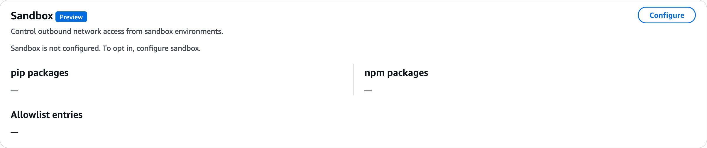
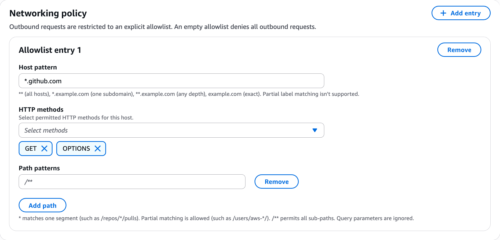
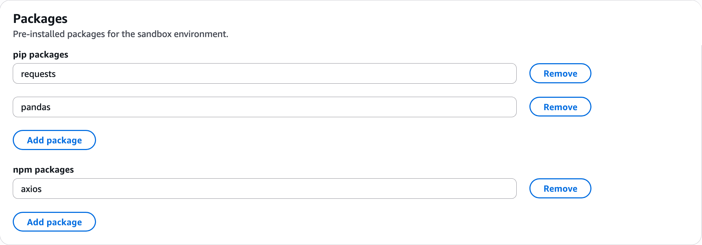

# Set up a Sandbox

Sandbox is a preview feature that gives AWS DevOps Agent a secure, isolated Linux environment where it can write and run code during investigations. Some problems are faster and more reliable to solve with code than through reasoning alone. With Sandbox, the agent complements its reasoning with computation—for example, to analyze a large log file, calculate statistics across a set of metrics, or parse and correlate data from multiple sources during an investigation.

Each sandbox is ephemeral and scoped to a single investigation, so the code the agent runs stays isolated from your other resources. You control the environment's outbound network access and the packages that come pre-installed. By default, the sandbox restricts outbound network access: until you add an entry to the networking allowlist, it can reach only AWS service endpoints.

###### Note

Sandbox is available in preview and is subject to change.

During preview, Sandbox is available only in the following AWS Regions:

- US East (N. Virginia) `us-east-1`
- US West (Oregon) `us-west-2`
- Asia Pacific (Tokyo) `ap-northeast-1`
- Europe (Ireland) `eu-west-1`
  For more information, see [Feature availability by Region](about-aws-devops-agent-supported-regions.md "about-aws-devops-agent-supported-regions.md").

## How Sandbox works

When Sandbox is configured for an Agent Space, AWS DevOps Agent automatically provisions a fresh Linux environment while it works on an investigation. In this environment, the agent can run shell commands and read and write files, then read the results back into its analysis. The environment lasts only for the duration of that investigation, and no two investigations share one.

The environment comes with pre-configured AWS profiles for the AWS accounts connected to your Agent Space. The agent can use these profiles to make AWS CLI and boto3 (AWS SDK for Python) calls to those accounts, scoped to the same permissions the agent already has. This lets the agent query and correlate AWS resources programmatically with code during an investigation.

The agent can also make HTTP requests from the sandbox—using command line tools or Python and Node.js libraries—to any host and path permitted by your networking policy.

Two settings control what the environment can do:

- **Networking policy** – An explicit allowlist of the hosts, HTTP methods, and paths the environment may reach. An empty allowlist denies all outbound requests except to AWS service endpoints.
- **Packages** – The `pip` and `npm` packages that are pre-installed in the environment. The agent's code can import them without fetching them at runtime.

###### Note

During preview, the agent uses Sandbox only during investigations. Support for chat, custom agents, and other DevOps Agent capabilities is coming soon.

### Skills in the sandbox

With Sandbox enabled, the agent reads your [DevOps Agent Skills](about-aws-devops-agent-devops-agent-skills.md "about-aws-devops-agent-devops-agent-skills.md") from the sandbox's filesystem rather than from a virtual filesystem. This changes how the agent works with skills in two ways:

- **Search and read with command line tools** – The agent can use standard command line tools to search across your skills and read their files, instead of loading them through a virtual filesystem. This helps it find and apply the right skill for the task.
- **Run bundled code** – The agent can run and adapt code bundled with a skill. Without Sandbox, a skill can include only non-executable files such as Markdown instructions, references, and data files. With Sandbox, a skill can include executable code that the agent can run in the environment.

## Before you begin

Sandbox is not configured by default, so until you opt in, the agent cannot run code. The following image shows the **Sandbox** section before you configure it.

Before you configure Sandbox, determine the following:

- The hosts, HTTP methods, and paths the agent's code needs to reach, if any. Until you add an allowlist entry, the sandbox can reach only AWS service endpoints.
- The `pip` and `npm` packages you want pre-installed in the environment.

## Configure Sandbox for an Agent Space

1. Sign in to the AWS Management Console and open the AWS DevOps Agent console.
2. Select your Agent Space and choose the **Capabilities** tab.
3. In the **Sandbox** section, choose **Configure**.
4. Configure a networking policy and pre-installed packages as described in the following sections.
5. Save your configuration.

After you configure Sandbox, the **Sandbox** section shows your pre-installed `pip` and `npm` packages and the number of allowlist entries. To remove the configuration later, see [Remove Sandbox](#remove-sandbox "#remove-sandbox").

### Configure the networking policy

The sandbox restricts outbound requests to an explicit allowlist. An empty allowlist denies all outbound requests except to AWS service endpoints. To let the environment reach any other host, add an allowlist entry for it.

Choose **Add entry**, then configure the following for the allowlist entry:

- **Host pattern** – The host the entry applies to. Partial label matching isn't supported. Use one of the following forms:

  - `**` – All hosts.
  - `*.example.com` – One subdomain level.
  - `**.example.com` – Any subdomain depth.
  - `example.com` – An exact host.

- **HTTP methods** – The HTTP methods permitted for this host. Choose one or more methods, such as `GET` and `OPTIONS`, from the dropdown list.
- **Path patterns** – The paths permitted for this host. Choose **Add path** to add one or more patterns:

  - `*` matches one segment, such as `/repos/*/pulls`.
  - Partial matching is allowed, such as `/users/aws-*/`.
  - `/**` permits all sub-paths.
  - Query parameters are ignored.

The following image shows a completed allowlist entry.

Choose **Add entry** for each additional host the agent's code needs to reach. To remove an entry, choose **Remove**.

### Configure pre-installed packages

In the **Packages** section, specify the `pip` and `npm` packages to pre-install in the sandbox environment. The agent's code can then import these packages directly, and the environment does not need outbound access to a package registry to use them. The following image shows the **Packages** section with example packages configured.

- **pip packages** – Choose **Add package** and enter a package name, such as `requests` or `pandas`, for each Python package to pre-install.
- **npm packages** – Choose **Add package** and enter a package name, such as `axios`, for each Node.js package to pre-install.

To remove a package, choose **Remove** next to it.

## Remove Sandbox

To opt out, remove the Sandbox configuration: select your Agent Space, go to the **Capabilities** tab, and in the **Sandbox** section, choose **Remove**. After you remove the configuration, the agent no longer provisions sandbox environments for new investigations.

## Sandbox configuration limits

The following limits apply to each Sandbox configuration during preview.

| Limit                             | Value      |
| --------------------------------- | ---------- |
| pip packages                      | 50         |
| npm packages                      | 50         |
| Networking allowlist entries      | 100        |
| Path patterns per allowlist entry | 50         |
| HTTP methods per allowlist entry  | At least 1 |

## Security considerations

AWS DevOps Agent isolates each investigation in its own sandbox environment, so code and data from one investigation are never shared with another. AWS DevOps Agent inspects and filters all traffic leaving the sandbox so that only safe, permitted requests reach their destinations. It permits requests to AWS service endpoints and to hosts that match your networking allowlist, and denies all other requests.

The agent generates and runs code in the sandbox. Keep the following in mind when you configure it:

- **Keep the allowlist minimal.** With an empty allowlist, the sandbox reaches only AWS service endpoints. Add allowlist entries only for the specific hosts, methods, and paths the agent needs.
- **Scope allowlist entries narrowly.** Use exact host patterns and specific path patterns rather than broad wildcards such as `**` and `/**`, and grant only the HTTP methods that are required.
- **Pre-install packages instead of allowlisting registries.** When you pre-install the packages the agent needs, you avoid granting outbound access to a package registry at runtime.

For more information about the AWS DevOps Agent security model, see [AWS DevOps Agent Security](aws-devops-agent-security.md "aws-devops-agent-security.md").
