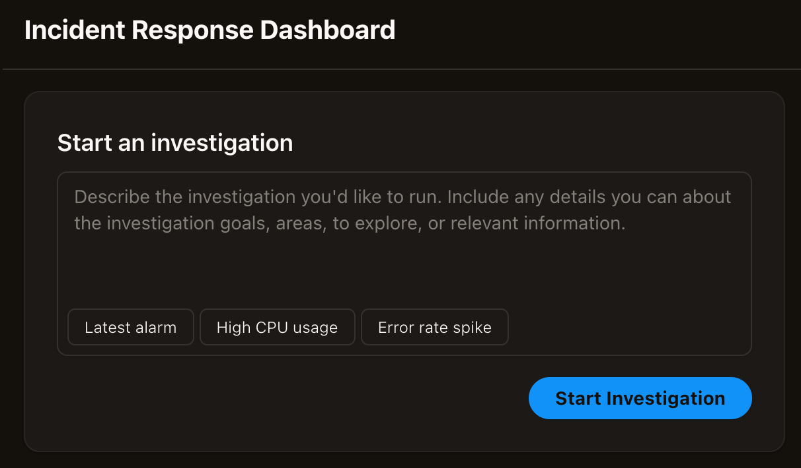

# Starting investigations

Incident response investigations can be started in one of three ways:

1. Built-in integrations – You can connect a DevOps Agent Space to ticketing systems like ServiceNow using built-in integrations. Once connected, DevOps Agent incident response investigations will be automatically triggered from support tickets, and your DevOps Agent will provide updates of its key findings, root cause analyses, and mitigation plans into the originating ticket.
2. WebSockets – You can send events using AWS DevOps Agent WebSockets that you configure. For example you can leverage trigger incident response investigations from PagerDuty tickets or Grafana alarms.
3. Manually – You can manually start incident response investigations from the Incident Response tab of the any DevOps Agent Space web app. You can either enter free form text that describes the incident you want your DevOps Agent to investigation, and it will create an investigation plan, collect finds, determine a root cause, and offer to generate a mitigation plan. You can also choose from several pre-configured starting points to quickly begin your Investigation: Latest alarm to investigate your most recent triggered alarm and analyze the underlying metrics and logs to determine the root cause, High CPU usage to investigate high CPU utilization metrics across your compute resources and identify which processes or services are consuming excessive resources, or Error rate spike to investigate the recent increase in application error rates by analyzing metrics, application logs, and identifying the source of failures.

Once you click “Start Investigation” you’ll be asked to provide some additional (optional)
details to help the agent focus its work. Provide any additional details you may have, and click
Start Investigation. You will then be taken to the investigation details page where you can see
your DevOps Agent in action.
