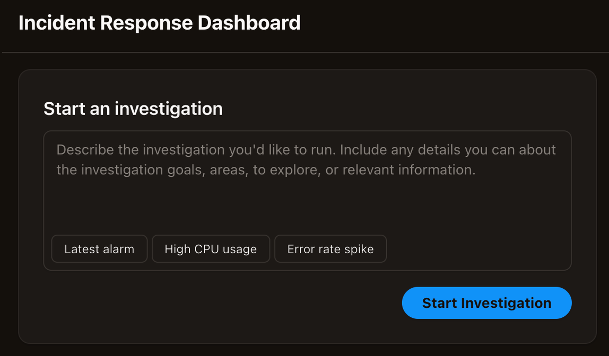

# Autonomous incident response

## Starting Investigations

Incident response investigations can be started in one of three ways.

- **Built-in integrations** - You can connect a DevOps Agent Space to ticketing systems like ServiceNow using built-in integrations. Once connected, DevOps Agent incident response investigations will be automatically triggered from support tickets, and your DevOps Agent will provide updates of its key findings, root cause analyses, and mitigation plans into the originating ticket.
- **Webhooks** - You can use webhooks to send events to AWS DevOps Agent. For example you can use webhooks to trigger incident response investigations from PagerDuty tickets or Grafana alarms.
- **Manually** - You can manually start incident response investigations from the Incident Response tab of any DevOps Agent Space web app. You can either enter free form text that describes the incident you want your DevOps Agent to investigate, and it will create an investigation plan, collect findings, determine a root cause, and offer to generate a mitigation plan. You can also choose from several pre-configured starting points to quickly begin your Investigation: Latest alarm to investigate your most recent triggered alarm and analyze the underlying metrics and logs to determine the root cause, High CPU usage to investigate high CPU utilization metrics across your compute resources and identify which processes or services are consuming excessive resources, or Error rate spike to investigate the recent increase in application error rates by analyzing metrics, application logs, and identifying the source of failures.

Once you choose "Start Investigation" you'll be asked to provide some additional details to help the agent focus its work. The investigation dialog includes the following fields:

- **Investigation details** – Pre-filled with your description. You can edit this to refine the investigation scope.
- **Investigation starting point** – Optionally describe a specific alarm, metric, log snippet, or other starting point for the agent.
- **Date and time of incident** – Auto-filled with the current time in UTC format. Adjust if the incident occurred earlier.
- **Name your investigation** – Auto-generated with a timestamp. You can customize this (maximum 400 characters).
- **Priority** – Select the investigation priority from the dropdown (Medium is the default).

Review and adjust these fields as needed, then choose "Start investigating..." to begin. You will then be taken to the investigation details page where you can see your DevOps Agent in action!

### Viewing authentication steps

When AWS DevOps Agent authenticates to a downstream system during an investigation, you can see that step directly in the investigation timeline. For each authentication step, you can see its success or error status. If authentication fails, you can see the failure message and the underlying browser steps the agent took. This replaces a silent gap with actionable detail.

## Incident triage

The triage phase is the first stage of AWS DevOps Agent's incident response system. When an external event triggers, such as an alarm from Datadog, an incident ticket from ServiceNow, or a problem from Dynatrace, AWS DevOps Agent automatically processes it within seconds to determine whether it should be investigated independently or linked to an existing investigation.

The primary function of the triage stage is incident correlation — identifying related incidents and consolidating them into a single investigation to avoid duplicate work and resource waste. When a new incident arrives, AWS DevOps Agent analyzes it alongside active investigations within a look-back window (typically 20 minutes). Using AI-powered analysis, it examines factors like component similarities, geographic region, and timing patterns to determine relationships between incidents.

AWS DevOps Agent makes one of three decisions:

- **Linked** – Correlates the incident to an existing investigation and sends a steering message to that investigation with context about the new incident.
- **Skipped** – The incident matches skip criteria defined in a skill and is automatically dismissed without investigation. For more information, see [DevOps Agent Skills](about-aws-devops-agent-devops-agent-skills.md "about-aws-devops-agent-devops-agent-skills.md").
- **Proceed** – Schedules a new independent investigation for the incident.

### Viewing triage decisions

When incidents are linked, the primary investigation receives a steering message containing the linked incident's details and correlation reasoning. On your AWS DevOps Agent Space web app, you'll see a status of **LINKED** along with correlation reasoning explaining why incidents were linked. The primary investigation displays a list of all linked incidents, allowing you to see the full scope of related issues being investigated together. Your external ticket system (ServiceNow, PagerDuty, etc.) and communication channel (Slack) will receive a notification that the incident was linked along with correlation reasoning.

When incidents are skipped, the AWS DevOps Agent Space web app displays a status of **SKIPPED** along with the reason explaining why the incident was filtered. Your external ticket system and communication channel also receive a notification that the incident was skipped along with the skip reason.

### Correcting triage decisions

If AWS DevOps Agent incorrectly links an incident, you can manually unlink it through the AWS DevOps Agent Space web app. This reschedules the unlinked incident as an independent investigation. You can also provide custom correlation rules by creating an AWS DevOps Agent Skill containing your correlation logic and associating it with the triage stage.

If AWS DevOps Agent incorrectly skips an incident, you can manually unskip it through the AWS DevOps Agent Space web app. This reschedules the incident for investigation. To adjust which incidents are skipped, modify or deactivate the skill that defines the skip criteria.

## Inline mitigation proposals

When an alarm triggers an investigation, AWS DevOps Agent now presents mitigation proposals directly in the investigation view. The agent completes its root cause analysis and then surfaces the proposals inline. You do not need to start a separate mitigation step.

Each proposal describes the recommended action, its expected outcome, and any conditions or prerequisites. You can review each proposal, refine its parameters, and choose whether to apply it.

Investigation and mitigation run as a single automated flow. This eliminates the handoff between the two stages, so you spend less time switching between views.

## Provide feedback on investigations

After an investigation completes, you can provide feedback on the root cause analysis. This feedback improves future investigation accuracy and enables reporting across your Agent Space.

### How to provide feedback

You can provide feedback through two methods:

- **Web app** – In a completed investigation, choose **Add feedback** from the investigation details. A feedback modal opens. You can rate the root cause as correct or incorrect. If incorrect, you can provide the actual root cause. You can also indicate whether steering was needed, assess mitigation correctness, and add additional notes.
- **Chat** – Tell the agent that the investigation root cause was correct or incorrect during conversation. The agent collects structured feedback conversationally, asking follow-up questions one at a time.

### Feedback fields

When providing feedback, you can specify the following:

- **Verdict** (required) – Whether the root cause was correct or incorrect.
- **Actual root cause** – The real root cause if the agent's analysis was wrong.
- **Steering needed** – Whether the agent needed human guidance during the investigation.
- **Mitigation correctness** – Whether the suggested mitigation was correct. If incorrect, you can describe what the correct mitigation was.
- **Additional notes** – Free-form notes about the investigation quality.

### Updating feedback

You can update previously submitted feedback at any time. The most recent submission replaces all prior feedback for that investigation.

### Viewing accuracy metrics

You can ask the agent in chat to summarize your feedback history. The agent reports total feedback count, accuracy percentage, and breakdown by verdict.

### Reporting to AWS

When providing feedback, you can opt in to share your feedback with AWS for troubleshooting purposes. Before submitting with this option enabled, the system shows the following disclaimer:

You must explicitly confirm before feedback is shared with AWS.

## Ask for human support

AWS DevOps Agent can connect directly with AWS Support to streamline your incident response process. When you need additional help from AWS Support, from your DevOps Agent Space web app you can create support cases that automatically share investigation context with AWS Support engineers, reducing the time needed to explain your issue.

### How it works

When investigating an incident, AWS DevOps Agent builds a comprehensive log of its analysis, including:

- Root cause investigation findings
- Metrics, logs, and traces analyzed
- Code changes and deployment history reviewed
- Remediation actions recommended
- Timeline of events and system behavior

You can escalate your investigation to AWS Support directly from the AWS DevOps Agent Space web app. When you do, AWS DevOps Agent automatically passes its investigation log to AWS Support, providing the support engineer with full context about your investigation without requiring you to manually gather and explain the details.

### Chatting with AWS Support

Once you create a support case, you can communicate with AWS Support in a separate chat window within your AWS DevOps Agent Space web app. This allows you to:

- Discuss your issue with AWS Support engineers alongside your AWS DevOps Agent's investigation timeline
- View both AWS DevOps Agent's automated analysis and AWS Support's expert guidance in the same interface
- Seamlessly share additional information or clarification as needed

The chat experience keeps your AWS DevOps Agent investigation and AWS Support conversation readily accessible, enabling faster collaboration and resolution.

### Support case language

When you create a support case through AWS DevOps Agent, the case is automatically created in the language configured in your Agent Space's **Agent response language** setting. This ensures that your support case is routed to a support engineer who speaks your preferred language.

For example, if your Agent Space language is set to Japanese, your support case will be routed to a Japanese-speaking support engineer. If no language is configured, or if the configured language is not supported by AWS Support for the selected case category, the case defaults to English.

AWS Support currently supports the following languages for case routing: Chinese, English, French, Japanese, Korean, Portuguese, and Spanish. To change the language used for support cases, update the **Agent response language** setting in your Agent Space configuration. For more information, see [Creating an Agent Space](getting-started-with-aws-devops-agent-creating-an-agent-space.md "getting-started-with-aws-devops-agent-creating-an-agent-space.md").

### Support plan requirements

Your ability to create and interact with support cases through AWS DevOps Agent depends on your AWS Support plan. Please refer to the [Support Plans user guide](../../../awssupport/latest/user/aws-support-plans.md "../../../awssupport/latest/user/aws-support-plans.md") to learn more about your entitlements.

**Note** Basic Support customers cannot create technical support cases and therefore cannot escalate AWS DevOps Agent investigations to AWS Support **Developer Support customers** can create cases through AWS DevOps Agent, but must visit the [AWS Support Center](https://console.aws.amazon.com/support/ "https://console.aws.amazon.com/support/") to correspond with Support engineers, as Developer Support does not include chat-based support **All other plans** can use the integrated chat experience within AWS DevOps Agent. For complete details about support plan entitlements, including response times and available case severities, see the [AWS Support Plans User Guide](../../../awssupport/latest/user/aws-support-plans.md "../../../awssupport/latest/user/aws-support-plans.md").

### What information is shared with AWS Support

When you create a support case from AWS DevOps Agent Space web app, the following information is automatically shared with AWS Support:

- **Investigation timeline**: Chronological record of AWS DevOps Agent's analysis
- **Resource information**: Affected AWS resources
- **Observability data**: Relevant metrics, logs, and traces from your integrated monitoring tools
- **Recent changes**: Code deployments, infrastructure changes, and configuration updates
- **Remediation attempts**: Actions AWS DevOps Agent recommended
- **Impact assessment**: Scope and severity of the incident

All data shared with AWS Support follows your existing AWS data residency and security configurations. AWS DevOps Agent shares only information related to your specific investigation and respects your organization's data governance policies.

### Getting started

To use AWS DevOps Agent's AWS Support integration:

1. Ensure you have an active AWS Support plan.
2. Verify your AWS DevOps Agent’s IAM permissions include support case creation (support:CreateCase, support:DescribeCases).
3. When AWS DevOps Agent is investigating an issue and you need AWS Support assistance, choose **Ask for human support** from your DevOps Agent Space web app.
4. Review the investigation summary that will be shared with AWS Support.
5. Select the appropriate case severity based on your support plan entitlements.
6. Submit the case - AWS DevOps Agent automatically includes your investigation log.

The chat window opens automatically, allowing you to begin collaborating with AWS Support immediately.
