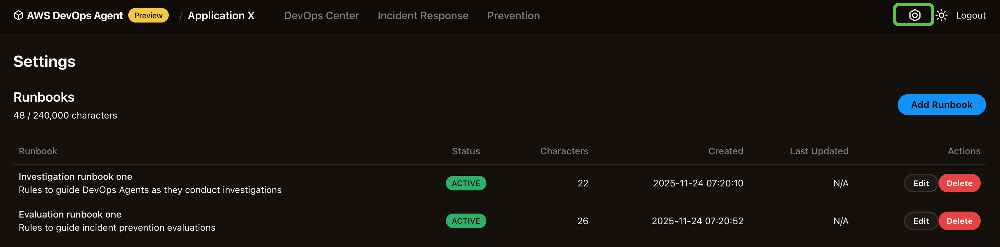

# DevOps Agent runbooks

You can configure runbooks to guide the AWS DevOps Agent as it performs incident response investigations and incident prevention evaluations. Click on the settings icon in the top right of your DevOps Agent
web app and enter one or more runbooks.

Investigation and evaluation performance can be further enhanced by using AWS DevOps Agent Runbooks to provide investigation hints and guidance for non-standard configurations across all connection types.
You can also use Investigation chat/steering to test runbook concepts by steering live investigations or restarting completed ones with additional hints.

## Example use case

If your environment uses Dynatrace for alarms and metrics, Splunk for logs, and CloudWatch for serverless logs, document this in your runbook to accelerate issue resolution.
