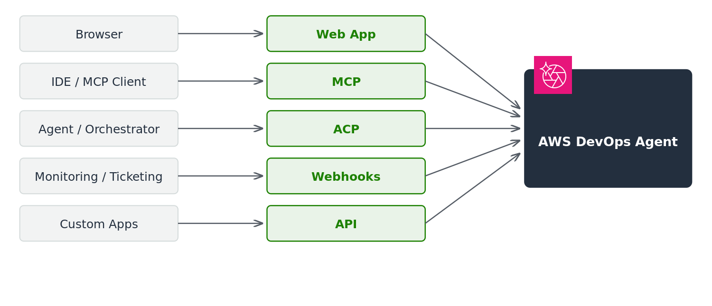

# Interfacing with the DevOps Agent

AWS DevOps Agent supports five access methods: the web app console, Model Context Protocol (MCP) integration, Agent Client Protocol (ACP) integration, webhooks for event-driven automation, and direct API access. Choose the method that best fits your workflow and technical requirements.

The following diagram illustrates these access methods and how they connect to the DevOps Agent service.

## DevOps Agent web app

The web app is the primary interface for DevOps Agent. Use conversational chat to investigate incidents, query your infrastructure, and manage recommendations. For more information, see [What is a DevOps Agent Web App?](about-aws-devops-agent-what-is-a-devops-agent-web-app.md "about-aws-devops-agent-what-is-a-devops-agent-web-app.md").

## Model Context Protocol (MCP) integration

You can access AWS DevOps Agent capabilities directly from MCP-compatible clients and IDEs. Use the [AWS MCP Server](../../../aws-mcp/latest/userguide/what-is-mcp-server.md "../../../aws-mcp/latest/userguide/what-is-mcp-server.md") to connect. You can investigate incidents, optimize costs, review architecture, and map topology without leaving your development environment.

For [Kiro](https://kiro.dev/ "https://kiro.dev/") users, a dedicated **aws-devops-agent** power is available in the [Kiro powers repository](https://github.com/kirodotdev/powers "https://github.com/kirodotdev/powers"). This power connects Kiro to AWS DevOps Agent through the AWS MCP Server. It delivers AI-powered operational intelligence directly in your IDE.

For [Claude Code](https://docs.anthropic.com/en/docs/claude-code "https://docs.anthropic.com/en/docs/claude-code") users, the [sample-aws-devops-agent-claude-plugin](https://github.com/aws-samples/sample-aws-devops-agent-claude-plugin "https://github.com/aws-samples/sample-aws-devops-agent-claude-plugin") provides a pre-configured plugin that connects Claude Code to AWS DevOps Agent through the AWS MCP Server.

## Agent Client Protocol (ACP) integration

You can invoke AWS DevOps Agent programmatically using the [Agent Client Protocol (ACP)](https://agentclientprotocol.com/get-started/introduction "https://agentclientprotocol.com/get-started/introduction"). For a sample implementation, see the [sample-aws-devops-agent-acp-mcp](https://github.com/aws-samples/sample-aws-devops-agent-acp-mcp "https://github.com/aws-samples/sample-aws-devops-agent-acp-mcp") repository on GitHub.

## Webhooks

Webhooks allow external systems to automatically trigger AWS DevOps Agent investigations. External systems such as ticketing platforms and monitoring tools can send HTTP requests when incidents occur. For more information, see [Invoking DevOps Agent through Webhook](configuring-capabilities-for-aws-devops-agent-invoking-devops-agent-through-webhook.md "configuring-capabilities-for-aws-devops-agent-invoking-devops-agent-through-webhook.md").

## AWS DevOps Agent API

AWS DevOps Agent provides APIs for programmatic access to agent capabilities. You can create and manage Agent Spaces, trigger investigations, and retrieve findings. For more information, see the [AWS DevOps Agent API Reference](../APIReference.md "../APIReference.md").
