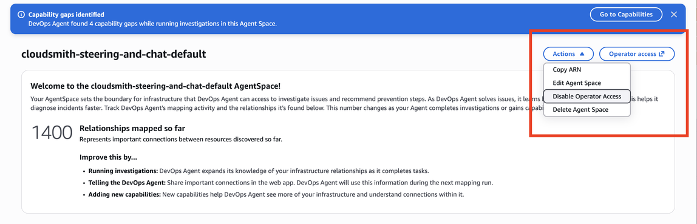
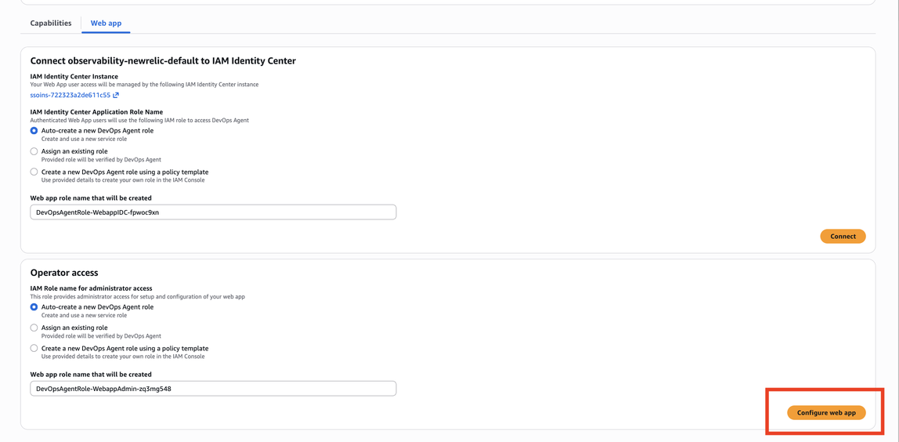

# On Demand DevOps Tasks

AWS DevOps Agent On Demand Tasks is a generative artificial intelligence (AI) powered conversational assistant that enables operations teams to query their application architecture, analyze system health, and access investigation insights using natural language. You can ask questions about your AWS resources, system metrics, alarm status, deployment history, and incident patterns. Chat provides immediate answers grounded in your actual infrastructure and operations data, eliminating the need to navigate between multiple AWS consoles or monitoring tools.

Chat is integrated throughout the DevOps Agent Space web app and provides context-aware responses based on the page you are viewing. The interface maintains conversation history, enabling you to continue previous discussions and build on earlier queries.

## Tasks capabilities

AWS DevOps Agent On Demand Tasks provides comprehensive capabilities to help you manage and understand your infrastructure:

**Resource queries** – Ask about AWS resources in your Agent Space, including Lambda functions, DynamoDB tables, EKS deployments, certificates, and infrastructure configurations. Chat can filter and analyze resources based on attributes like runtime versions, capacity settings, or deployment status. For example, ask "How many Lambdas are using Python 3.8?" or "Do I have any certificates about to expire?"

**System health analysis** – Query current and historical system health metrics, including alarm status, error rates, CPU utilization, and service availability. Chat can generate health summaries covering specific time periods and identify trends in system behavior. Ask questions like "Which alarms fired in the last 24 hours?" or "Any 5xx errors in the last hour?"

**Investigation insights** – Access information from completed and in-progress investigations, including root cause analysis, hypotheses explored, logs reviewed, and resolution patterns. Chat can identify common incident causes and provide recommendations based on historical data. Query "What is the most common cause of incidents last month?" or "What's the average resolution time for completed investigations?"

**Investigation steering** – When viewing an investigation detail page, guide the investigation by directing the agent to focus on specific logs, explore particular hypotheses, or update root cause analysis. Provide steering input like "Focus on logs for the payment service and update your RCA" or "Explore the hypothesis that DynamoDB throttling caused the issue."

**Chat artifacts** – Generate structured reports and documents, such as operational health summaries, error reports, and incident analyses. Artifacts appear in a dedicated panel and support versioned editing within the conversation.

**File attachments** – Attach images, documents, and code files to your messages so Chat can analyze them in context. For example, attach a screenshot of an alarm dashboard, a YAML configuration file, or a runbook PDF, and ask Chat what to do next. See [Sending file attachments](#sending-file-attachments "#sending-file-attachments") for details.

**Recommendation filtering** – Query incident prevention recommendations with specific criteria, such as recommendations related to particular services or operational concerns. Chat explains the impact and implementation considerations for each recommendation. For example, "Show me recommendations that will prevent incidents involving DynamoDB" or "Which recommendations would help me detect request latency issues quicker?"

## Accessing Chat

Chat is available as a persistent panel in the DevOps Agent Space web app. The left sidebar includes a **+ New chat** button, a **Pages** section for navigating to Incidents, Improvements, and Topology, and a **Chats** section that displays your recent conversations. Choose **View all** to see your full conversation history.

You can also start a new chat by adding the `?newChat` query parameter to any DevOps Agent web app URL for your Agent Space. Use this parameter to link to a fresh conversation from external tools, runbooks, or bookmarks.

Chat provides context-aware responses based on where you access it:

**Topology** – Ask general questions about your Agent Space resources, architecture, and operational health. Chat has full visibility into all connected accounts and services. From this context, you can query resource configurations, deployment history, topology information, and observability tool integrations.

**Incident Response** – When viewing the incident response page, ask questions about investigation trends, resolution times, and incident patterns across your Agent Space. Chat can analyze historical investigation data to identify common causes and improvement opportunities.

**Investigation Detail** – While viewing a specific investigation, Chat provides context-aware responses about that investigation. Ask about logs reviewed, hypotheses explored, root cause conclusions, and mitigation plans. You can also provide steering input to guide the investigation focus.

**Prevention** – From the prevention page, query recommendations with filters, understand why recommendations were made, and explore implementation approaches. Chat helps you prioritize and understand the impact of incident prevention recommendations.

The chat interface remains available as you switch between pages, but the context changes to provide relevant information for your current view. When you start a new conversation, it begins without prior context. When you continue an existing conversation, Chat maintains the full conversation history for follow-up questions.

## Context-aware responses

Chat adapts its responses based on the page you are viewing in the DevOps Agent Space web app. This context awareness ensures you receive relevant information without needing to specify which investigation or resource scope you are asking about.

When viewing an investigation detail page, Chat automatically understands you are asking about that specific investigation. Questions like "What logs did you look at?" or "Which hypotheses did you explore?" refer to the investigation currently displayed. When you provide steering input, Chat applies it to the active investigation and creates a new root cause version if appropriate.

On the prevention page, Chat understands you are interested in incident prevention recommendations. Queries automatically filter and analyze recommendations within your Agent Space context. The system recognizes whether you are asking about general recommendations or specific recommendation details.

When accessing Chat from the Topology page, Chat provides broad visibility across all resources, metrics, and historical data in your Agent Space. You can ask about any resource, service, or operational concern without specifying the investigation or recommendation context.

This context awareness eliminates the need to repeatedly specify which investigation, recommendation, or resource scope you are referencing, creating a more natural conversational flow.

## Managing conversations

Chat maintains conversation history to enable you to continue previous discussions and reference earlier queries.

**Creating new conversations** – Choose the "New session" button in the chat panel to start a fresh conversation without prior context. New conversations do not carry over information from previous chats, allowing you to ask unrelated questions without confusion.

**Accessing conversation history** – Choose "History" to view all previous conversations within your Agent Space. Conversations are organized chronologically with timestamps and preview text. Conversation history is retained for 90 days and is private to your user account within the Agent Space.

**Continuing conversations** – Select any conversation from your history to resume where you left off. Chat maintains the full context of previous messages, enabling you to ask follow-up questions that reference earlier parts of the conversation. When you switch pages while viewing a conversation, the conversation context remains but page-specific context updates based on your current location.

Note that conversation history is isolated within each Agent Space. Conversations in one Agent Space are not visible or accessible from other Agent Spaces. This isolation ensures that sensitive information remains compartmentalized according to your organizational boundaries.

## Generating artifacts

AWS DevOps Agent supports chat artifacts — structured, versioned documents generated by the agent during a conversation. Artifacts provide a dedicated, interactive panel in the chat UI for reviewing and editing AI-generated content, such as operational reports, error summaries, and health assessments.

You can request artifacts from any page in the DevOps Agent Space web app. Chat uses the current page context to scope the artifact content.

### How artifacts work

When you ask Chat to create or update content, Chat generates an artifact — typically a formatted document — and displays it in the artifact panel alongside the conversation.

**Generate** – Send a natural language request to create a report or document. For example, ask "Generate a weekly operational health report for my Agent Space" or "Show me a report for my 4xx errors from last week".

**Review** – The artifact appears in a dedicated panel alongside the conversation. You can review the full content while continuing to interact with Chat.

**Edit** – Request changes to the artifact through Chat. For example, ask "Add a section on Lambda cold starts" or "Update the report to include last month's data". Chat creates a new version of the artifact with your requested changes.

### Viewing and retrieving artifacts

You can read and list the artifacts Chat has generated for you directly in the conversation, without leaving chat. For example, ask Chat "List the artifacts you've created in this conversation" or "Show me the health report you generated earlier." Chat displays the artifact or a list of all artifacts directly in the conversation.

With this feature, you can find and reuse agent output at any point in the conversation. You do not need to remember where an artifact appeared or scroll back through chat history to find it.

## Sending file attachments

You can attach files to your chat messages so Chat can read them along with your question. Use attachments to share what you are looking at — a screenshot of a dashboard or alarm, a configuration file, source code, an operational runbook — and ask the agent to reason about it directly.

Files are scoped to your Agent Space – they are not visible from other Agent Spaces, and access is bounded by the same IAM permissions that gate the rest of Chat. Files upload to managed Agent Space storage as soon as you attach them.

### How to attach files

You can add files to a message in three ways:

- Choose the upload icon in the chat input toolbar and select one or more files from your device.
- Drag and drop one or more files onto the chat input area.
- Paste an image directly from your clipboard, for example after taking a screenshot.

Each file you attach appears as a chip in the chat input with an upload progress indicator. To preview a file, choose its chip. To remove a file, choose the X on the chip. The Send button stays disabled while any attached file is still uploading.

### Supported file types

Chat accepts the following three categories of files:

- **Images** – `png`, `jpeg`, `jpg`, `gif`, `webp`
- **Documents** – `pdf`, `csv`, `doc`, `docx`, `xls`, `xlsx`, `html`, `txt`, `md`
- **Text and code files** – `json`, `yaml`, `yml`, `xml`, `js`, `ts`, `py`, `java`, `rb`, `go`, `rs`, `sh`, `bash`, `log`, `cfg`, `ini`, `toml`

Files outside these categories are rejected before upload.

### Limits

The following limits apply to each message:

| Limit                                                  | Value   |
| ------------------------------------------------------ | ------- |
| Maximum file size                                      | 3.75 MB |
| Attachments per message (any mix of types)             | 20      |
| Of those, binary documents (PDF, DOC, DOCX, XLS, XLSX) | up to 5 |

In addition, your message text and attachment content together must fit within the model's per-message context window. If a message and its attachments are too large, Chat rejects the message and asks you to reduce the size or number of attachments before sending.

### Use cases

Common ways to use file attachments with the DevOps Agent:

- Attach a screenshot of an alarm or error dashboard and ask Chat to interpret what is failing and where to look next.
- Attach service source code and ask Chat to review the change, suggest fixes, or explain its behavior.
- Attach a configuration file (for example, a YAML, JSON, or TOML config) and ask Chat to troubleshoot why a deployment, alarm, or integration is misbehaving.
- Attach an operational runbook or post-incident report PDF and ask Chat to convert it into a skill — the agent extracts the procedure and saves it to your Agent Space so future investigations can apply it automatically.

## Sample queries

The following examples demonstrate the types of questions you can ask Chat. These examples are organized by use case and context.

### Artifact generation queries

From any page in the DevOps Agent Space web app:

- Generate a weekly operational health summary for my Agent Space
- Create a report of all 4xx errors from last week
- Build an incident summary report for the last 30 days
- Create a summary of alarm activity for the payment service this week
- Generate a deployment history report for the last 7 days
- Summarize all open recommendations into a report

### Resource information queries

From any page in the DevOps Agent Space web app:

- How many Lambda functions are using Python 3.8?
- Do I have any certificates about to expire?
- List all DynamoDB tables with on-demand billing
- Show me EKS clusters in production
- Which Lambda functions have not been deployed in the last 90 days?
- List S3 buckets without versioning enabled
- What RDS instances are running database version X?

### System health queries

From Topology or Incident Response pages:

- Which alarms fired in the last 24 hours?
- Any 5xx errors in the last hour?
- Show me Lambda error trends for the payment service
- What is the CPU utilization for my ECS cluster?
- Are there any unhealthy targets in my load balancers?
- Show me API Gateway throttling events from yesterday
- Which services had the highest error rate last week?
- Give me an overall health report covering the last 24 hours

### Observability tool queries

From Topology:

- List Splunk log groups
- Show me Prometheus metrics and their alarm thresholds
- What Datadog monitors are configured for this service?
- List New Relic alert policies
- Show me Dynatrace dashboard configurations

### Investigation insights queries

From Incident Response page:

- What is the most common cause of incidents last month?
- What's the average resolution time for completed investigations?
- Summarize investigations from last week and their RCA
- How many incidents were caused by DynamoDB throttling?
- Show me investigation trends over the past quarter
- Which services have the most frequent incidents?

### Investigation detail queries

From Investigation Detail page:

- What logs did you look at?
- Which hypotheses did you explore?
- How risky is the mitigating action you propose?
- What was the timeline of events during this incident?
- Why did you conclude this was the root cause?
- What evidence supports your root cause analysis?
- Who provided steering during your investigation?
- Give me a summary of this incident investigation

### Investigation steering queries

From Investigation Detail page:

- Focus on logs for the payment service between 14:00-15:00 UTC and update your RCA
- Explore the hypothesis that DynamoDB throttling caused the issue
- Check the ECS cluster configuration to see if that caused the alarm
- Only check logs for the last 2 hours, not the full day
- Investigate the spike in errors at 3 PM
- Look at the API Gateway logs instead of Lambda logs

### Prevention recommendation queries

From Prevention page:

- What are my top 3 incident prevention recommendations?
- Show me recommendations that will prevent incidents involving DynamoDB
- Which recommendations would help me detect request latency issues quicker?
- List observability improvements that could prevent similar incidents
- Show me infrastructure recommendations for the payment service
- Which recommendations have the highest impact on system resilience?

## Enabling Chat in your Agent Space

Chat is available in all DevOps Agent Space web apps. The setup process depends on whether you have a new or existing Agent Space.

### New Agent Spaces

Chat is **automatically enabled** when you create a new Agent Space. No additional configuration or IAM permissions setup is required. After you configure your DevOps Agent Space web app, Chat is immediately available as a persistent panel in the web app.

### Existing Agent Spaces

If you created your Agent Space before Chat was released, you must enable the required IAM permissions. You have two options:

**Option 1: Revoke and re-enable operator app access**

Navigate to the AWS DevOps Agent Admin Console, locate the **Action** dropdown, and disable the current operator access configuration.

Then enable the auto-create option for operator access.

This automatically applies the required IAM permissions for Chat along with all other current operator permissions.

**Option 2: Add IAM permissions manually**

Add the following IAM permissions to your existing operator access role:

- `aidevops:ListChats` – View chat conversation history
- `aidevops:CreateChat` – Create new chat conversations
- `aidevops:SendMessage` – Send messages and receive responses

Navigate to the AWS IAM console, locate your DevOps Agent operator role, and add these permissions to the role policy. Chat becomes available immediately after the permissions are added.

After completing either option, refresh your DevOps Agent Space web app, and the chat panel appears in the web app.
