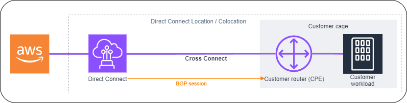
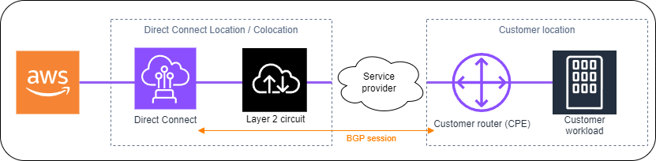
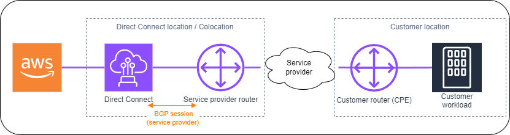

# Requesting cross connects at AWS Direct Connect locations

After you have downloaded your Letter of Authorization and Connecting Facility Assignment
(LOA-CFA), you must complete your cross-network connection, also known as a _cross
connect_. If you already have equipment located in an AWS Direct Connect location,
contact the appropriate provider to complete the cross connect. For specific instructions
for each provider, see the tables below. Partners and contact information are organized by
Region. For specific cross connect pricing you'll need to contact the Direct Connect Partner
directly. After the cross connect is established, you can create the virtual interfaces
using the AWS Direct Connect console.

Some locations are set up as a campus. For more information, including available speeds
available at each location, see [AWS Direct Connect
Locations](https://aws.amazon.com/directconnect/details/#AWS_Direct_Connect_Locations "https://aws.amazon.com/directconnect/details/#AWS_Direct_Connect_Locations").

If you do not already have equipment located in an AWS Direct Connect location, you can work with one
of the partners in the AWS Partner Network (APN). They help you to connect to an AWS Direct Connect
location. For more information, see [APN Partners supporting AWS Direct Connect](https://aws.amazon.com/directconnect/partners/ "https://aws.amazon.com/directconnect/partners/"). You must share the LOA-CFA with your selected
provider to facilitate your cross connect request.

An AWS Direct Connect connection can provide access to resources in other Regions. For more
information, see [Access to remote AWS Direct Connect Regions](remote_regions.md "remote_regions.md").

###### Note

If the cross connect is not completed within 90 days, the authority granted by the LOA-CFA
expires. To renew a LOA-CFA that has expired, you can download it again from the
AWS Direct Connect console. For more information, see [Letter of Authorization and Connecting Facility
Assignment (LOA-CFA)](dedicated_connection.md#create-connection-loa-cfa "dedicated_connection.md#create-connection-loa-cfa").

## Connectivity options

The options available to connect to a Direct Connect location might vary by Partner and AWS
Region. You can work with one of the partners in the AWS Partner Network (APN) who can
provide one or more of the following connectivity options:

- If you have resources deployed in the same data center/colocation facility as the
  Direct Connect location, the facility can provide a cross-connect between the
  AWS Direct Connect equipment and your resources. You must first provide LOA-CFA to the
  facility for this. See [Letter of Authorization and Connecting Facility
  Assignment (LOA-CFA)](dedicated_connection.md#create-connection-loa-cfa "dedicated_connection.md#create-connection-loa-cfa") for more information. The
  following shows an example of this Direct Connect connectivity option:

- Extend the Direct Connect connection at Layer 2 (data link layer) via a "circuit" from the
  Direct Connect location to the customer location by working with Direct Connect Partners.
  The router installed at the customer location will directly form a BGP session
  with the AWS equipment. For example, technologies that can be used are Metro
  Ethernet, Dark Fibre, or Wavelength. The following shows an example of this
  Direct Connect connectivity option.

- Extend the Direct Connect connection at Layer 3 (Network layer) from the Direct Connect location to
  your location by working with Direct Connect Partners. For this connectivity option,
  the Direct Connect Partner provides a router within the Direct Connect location that forms
  a Border Gateway Protocol (BGP) session with the AWS equipment. The Direct Connect
  partner then established another BGP with you; for example, this might be over
  Multiprotocol Label Switching (MPLS). The following shows an example of this
  Direct Connect connectivity option.

## US East (Ohio)

| Location                                        | How to request a connection                                                                                             |
| ----------------------------------------------- | ----------------------------------------------------------------------------------------------------------------------- |
| Cologix COL2, Columbus                          | Contact Cologix at [sales@cologix.com](mailto:sales@cologix.com "mailto:sales@cologix.com").                            |
| Cologix MIN3, Minneapolis                       | Contact Cologix at [sales@cologix.com](mailto:sales@cologix.com "mailto:sales@cologix.com").                            |
| CyrusOne West III, Houston                      | Submit a request using the [customer contact](https://cyrusone.com/contact/ "https://cyrusone.com/contact/") form.      |
| Equinix CH2, Chicago                            | Contact Equinix at [awsdealreg@equinix.com](mailto:awsdealreg@equinix.com "mailto:awsdealreg@equinix.com").             |
| QTS, Chicago                                    | Contact QTS at [AConnect@qtsdatacenters.com](mailto:AConnect@qtsdatacenters.com "mailto:AConnect@qtsdatacenters.com").  |
| Netrality Data Centers, 1102 Grand, Kansas City | Contact Netrality Data Centers at [support@netrality.com](mailto:support@netrality.com "mailto:support@netrality.com"). |

## US East (N. Virginia)

| Location                                            | How to request a connection                                                                                                                                                                                                                                      |
| --------------------------------------------------- | ---------------------------------------------------------------------------------------------------------------------------------------------------------------------------------------------------------------------------------------------------------------- |
| 165 Halsey Street, Newark                           | Contact [operations@165halsey.com](mailto:operations@165halsey.com "mailto:operations@165halsey.com").                                                                                                                                                           |
| CoreSite 32k, New York                              | Place an order using the [CoreSite Customer Portal](https://mycoresite.coresite.com/login "https://mycoresite.coresite.com/login"). After you complete the form, review the order for accuracy, and then approve it using the website.                        |
| CoreSite VA1-VA2, Reston                            | Place an order at the [CoreSite Customer Portal](https://mycoresite.coresite.com/login "https://mycoresite.coresite.com/login"). After you complete the form, review the order for accuracy, and then approve it using the website.                           |
| Digital Realty ATL1 &ATL2, Atlanta                  | Contact Digital Realty at [amazon.orders@digitalrealty.com](mailto:amazon.orders@digitalrealty.com "mailto:amazon.orders@digitalrealty.com").                                                                                                                    |
| Digital Realty IAD38, Ashburn                       | Contact Digital Realty at [amazon.orders@digitalrealty.com](mailto:amazon.orders@digitalrealty.com "mailto:amazon.orders@digitalrealty.com").                                                                                                                    |
| Equinix DC1-DC6 & DC10-D12, Ashburn                 | Contact Equinix at [awsdealreg@equinix.com](mailto:awsdealreg@equinix.com "mailto:awsdealreg@equinix.com").                                                                                                                                                      |
| Equinix DAA1-DC3 & DC6, Dallas                      | Contact Equinix at [awsdealreg@equinix.com](mailto:awsdealreg@equinix.com "mailto:awsdealreg@equinix.com").                                                                                                                                                      |
| Equinix MI1, Miami                                  | Contact Equinix at [awsdealreg@equinix.com](mailto:awsdealreg@equinix.com "mailto:awsdealreg@equinix.com").                                                                                                                                                      |
| Equinix NY5, Seacaucus                              | Contact Equinix at [awsdealreg@equinix.com](mailto:awsdealreg@equinix.com "mailto:awsdealreg@equinix.com").                                                                                                                                                      |
| KIO Networks QRO1, Queretaro, MX                    | Contact [KIO Networks](https://www.kio.tech/en/#formcontacto "https://www.kio.tech/en/#formcontacto")".                                                                                                                                                       |
| Markley, One Summer Street, Boston                  | For current customers, create a request using the [customer portal](https://support.markleygroup.com/ "https://support.markleygroup.com/"). For new queries, contact [sales@markleygroup.com](mailto:sales@markleygroup.com "mailto:sales@markleygroup.com"). |
| Netrality Data Centers, 2nd floor MMR, Philadelphia | Contact Netrality Data Centers at [support@netrality.com](mailto:support@netrality.com "mailto:support@netrality.com").                                                                                                                                          |
| QTS ATL1, Atlanta                                   | Contact QTS at [AConnect@qtsdatacenters.com](mailto:AConnect@qtsdatacenters.com "mailto:AConnect@qtsdatacenters.com").                                                                                                                                           |

## US West (N. California)

| Location                    | How to request a connection                                                                                                                                                                                                                                                                                                                                             |
| --------------------------- | ----------------------------------------------------------------------------------------------------------------------------------------------------------------------------------------------------------------------------------------------------------------------------------------------------------------------------------------------------------------------- |
| CoreSite, LA1, Los Angeles  | Place an order using the [CoreSite Customer Portal](https://mycoresite.coresite.com/login "https://mycoresite.coresite.com/login"). After you complete the form, review the order for accuracy, and then approve it using the website.                                                                                                                               |
| CoreSite SV2, Milpitas      | Place an order using the [CoreSite Customer Portal](https://mycoresite.coresite.com/login "https://mycoresite.coresite.com/login"). After you complete the form, review the order for accuracy, and then approve it using the website.                                                                                                                            |
| CoreSite SV4, Santa Clara   | Place an order using the [CoreSite Customer Portal](https://mycoresite.coresite.com/login "https://mycoresite.coresite.com/login"). After you complete the form, review the order for accuracy, and then approve it using the MyCoreSite website.                                                                                                                 |
| EdgeConneX, Phoenix         | Place an order using the [EdgeOS Customer Portal](https://edgeos.edgeconnex.com/portal/ "https://edgeos.edgeconnex.com/portal/"). After you have submitted the form, EdgeConneX will provide a service order form for approval. You can send questions to [cloudaccess@edgeconnex.com](mailto:cloudaccess@edgeconnex.com "mailto:cloudaccess@edgeconnex.com"). |
| Equinix LA3, El Segundo     | Contact Equinix at [awsdealreg@equinix.com](mailto:awsdealreg@equinix.com "mailto:awsdealreg@equinix.com").                                                                                                                                                                                                                                                             |
| Equinix SV1 & SV5, San Jose | Contact Equinix at [awsdealreg@equinix.com](mailto:awsdealreg@equinix.com "mailto:awsdealreg@equinix.com").                                                                                                                                                                                                                                                             |
| PhoenixNAP, Phoenix         | Contact phoenixNAP Provisioning at [provisioning@phoenixnap.com](mailto:provisioning@phoenixnap.com "mailto:provisioning@phoenixnap.com").                                                                                                                                                                                                                              |

## US West (Oregon)

| Location                                       | How to request a connection                                                                                                                                                                                                                                                                                                                                          |
| ---------------------------------------------- | -------------------------------------------------------------------------------------------------------------------------------------------------------------------------------------------------------------------------------------------------------------------------------------------------------------------------------------------------------------------- |
| CoreSite DE1, Denver                           | Place an order using the [CoreSite Customer Portal](https://mycoresite.coresite.com/login "https://mycoresite.coresite.com/login"). After you complete the form, review the order for accuracy, and then approve it using the website.                                                                                                                            |
| Digital Realty SEA10, Westin Building, Seattle | Contact Digital Realty at [amazon.orders@digitalrealty.com](mailto:amazon.orders@digitalrealty.com "mailto:amazon.orders@digitalrealty.com").                                                                                                                                                                                                                        |
| EdgeConneX, Portland                           | Place an order using the [EdgeOS Customer Portal](https://edgeos.edgeconnex.com/portal/ "https://edgeos.edgeconnex.com/portal/"). After you have submitted the form, EdgeConneX will provide a service order form for approval. You can send questions to [cloudaccess@edgeconnex.com](mailto:cloudaccess@edgeconnex.com "mailto:cloudaccess@edgeconnex.com"). |
| Equinix SE2, Seattle                           | Contact Equinix at [support@equinix.com](mailto:support@equinix.com "mailto:support@equinix.com").                                                                                                                                                                                                                                                                   |
| Pittock Block, Portland                        | Send requests by email to [crossconnect@pittock.com](mailto:crossconnect@pittock.com "mailto:crossconnect@pittock.com") or by phone at +1 503 226 6777.                                                                                                                                                                                                           |
| Switch SUPERNAP 8, Las Vegas                   | Contact Switch SUPERNAP at [orders@supernap.com](mailto:orders@supernap.com "mailto:orders@supernap.com").                                                                                                                                                                                                                                                           |
| TierPoint Seattle                              | Contact TierPoint at [sales@tierpoint.com](mailto:sales@tierpoint.com "mailto:sales@tierpoint.com").                                                                                                                                                                                                                                                                 |

## Africa (Cape Town)

| Location                                         | How to request a connection                                                                                                                                                                                                                     |
| ------------------------------------------------ | ----------------------------------------------------------------------------------------------------------------------------------------------------------------------------------------------------------------------------------------------- |
| Cape Town Internet Exchange/ Teraco Data Centres | Contact Teraco at [support@teraco.co.za](mailto:support@teraco.co.za "mailto:support@teraco.co.za") for existing Teraco customers or [connect@teraco.co.za](mailto:connect@teraco.co.za "mailto:connect@teraco.co.za") for new customers. |
| Teraco JB1, Johannesburg, South Africa           | Contact Teraco at [support@teraco.co.za](mailto:support@teraco.co.za "mailto:support@teraco.co.za") for existing Teraco customers or [connect@teraco.co.za](mailto:connect@teraco.co.za "mailto:connect@teraco.co.za") for new customers.    |

## Asia Pacific (Jakarta)

| Location                   | How to request a connection                                                                                            |
| -------------------------- | ---------------------------------------------------------------------------------------------------------------------- |
| DCI JK3, Jakarta           | Contact DCI Indonesia at [awsdx@dci-indonesia.com](mailto:awsdx@dci-indonesia.com "mailto:awsdx@dci-indonesia.com").   |
| NTT 2 Data Center, Jakarta | Contact NTT at [tps.cms.presales@global.ntt](mailto:tps.cms.presales@global.ntt "mailto:tps.cms.presales@global.ntt"). |

## Asia Pacific (Mumbai)

| Location                       | How to request a connection                                                                                                                                                             |
| ------------------------------ | --------------------------------------------------------------------------------------------------------------------------------------------------------------------------------------- |
| Equinix, Mumbai                | Contact Equinix at [awsdealreg@equinix.com](mailto:rawsdealreg@equinix.com "mailto:rawsdealreg@equinix.com").                                                                           |
| NetMagic DC2, Bangalore        | Contact NetMagic Sales and Marketing toll-free at 18001033130 or at [marketing@netmagicsolutions.com](mailto:marketing@netmagicsolutions.com "mailto:marketing@netmagicsolutions.com"). |
| Sify Rabale, Mumbai            | Contact Sify at [aws.directconnect@sifycorp.com](mailto:aws.directconnect@sifycorp.com "mailto:aws.directconnect@sifycorp.com").                                                        |
| STT Delhi DC2, Delhi           | Contact STT at [enquiry.AWSDX@sttelemediagdc.in](mailto:enquiry.AWSDX@sttelemediagdc.in "mailto:enquiry.AWSDX@sttelemediagdc.in").                                                      |
| STT GDC Pvt. Ltd. VSB, Chennai | Contact STT at [enquiry.AWSDX@sttelemediagdc.in](mailto:enquiry.AWSDX@sttelemediagdc.in "mailto:enquiry.AWSDX@sttelemediagdc.in").                                                      |
| STT Hyderabad DC1, Hyderabad   | Contact STT at [enquiry.AWSDX@sttelemediagdc.in](mailto:enquiry.AWSDX@sttelemediagdc.in "mailto:enquiry.AWSDX@sttelemediagdc.in").                                                      |

## Asia Pacific (Seoul)

| Location                             | How to request a connection                                                                                                                                                                         |
| ------------------------------------ | --------------------------------------------------------------------------------------------------------------------------------------------------------------------------------------------------- |
| Digital Realty ICN1, Seoul           | Contact Digital Realty at [amazon.orders@digitalrealty.com](mailto:amazon.orders@digitalrealty.com "mailto:amazon.orders@digitalrealty.com").                                                       |
| KINX Gasan Data Center, Seoul        | Contact KINX at [sales@kinx.net](mailto:sales@kinx.net "mailto:sales@kinx.net").                                                                                                                    |
| LG U+ Pyeong-Chon Mega Center, Seoul | Submit the LOA document to [kidcadmin@lguplus.co.kr](mailto:kidcadmin@lguplus.co.kr "mailto:kidcadmin@lguplus.co.kr") and [center8@kidc.net](mailto:center8@kidc.net "mailto:center8@kidc.net"). |

## Asia Pacific (Singapore)

| Location                                   | How to request a connection                                                                                                                                                                                                                                                                                                       |
| ------------------------------------------ | --------------------------------------------------------------------------------------------------------------------------------------------------------------------------------------------------------------------------------------------------------------------------------------------------------------------------------- |
| Equinix HK1, Tsuen Wan N.T., Hong Kong SAR | Contact Equinix at [awsdealreg@equinix.com](mailto:awsdealreg@equinix.com "mailto:awsdealreg@equinix.com").                                                                                                                                                                                                                       |
| Equinix SG2, Singapore                     | Contact Equinix at [awsdealreg@equinix.com](mailto:awsdealreg@equinix.com "mailto:awsdealreg@equinix.com").                                                                                                                                                                                                                       |
| Global Switch, Singapore                   | Contact Global Switch at [salessingapore@globalswitch.com](mailto:salessingapore@globalswitch.com "mailto:salessingapore@globalswitch.com").                                                                                                                                                                                      |
| GPX, Mumbai                                | Contact GPX (Equinix) at [awsdealreg@equinix.com](mailto:awsdealreg@equinix.com "mailto:awsdealreg@equinix.com").                                                                                                                                                                                                                 |
| iAdvantage Mega-i, Hong Kong               | Contact iAdvantage at [cs@iadvantage.net](mailto:cs@iadvantage.net "mailto:cs@iadvantage.net") or place an order using [iAdvantage Cabling Order e-Form](https://cable.iadvantage.net "https://cable.iadvantage.net").                                                                                                         |
| Menara AIMS, Kuala Lumpur                  | Existing AIMS custom ers can request an X-Connect order using the Customer Service portal by filling out the Engineering Work Order Request Form. Contacting [service.delivery@aims.com.my](mailto:service.delivery@aims.com.my "mailto:service.delivery@aims.com.my") if there are any problems submitting the request. |
| TCC Data Center, Bangkok                   | Contact TCC Technology Co., Ltd at [gateway.ne@tcc-technology.com](mailto:gateway.ne@tcc-technology.com "mailto:gateway.ne@tcc-technology.com").                                                                                                                                                                                  |

## Asia Pacific (Sydney)

| Location               | How to request a connection                                                                                                                                                      |
| ---------------------- | -------------------------------------------------------------------------------------------------------------------------------------------------------------------------------- |
| CDC Hume 2, Canberra   | Log in to the customer portal at [CDC Customer Portal](https://cdcdatacentres.freshworks.com/ "https://cdcdatacentres.freshworks.com/").                                         |
| Datacom DH6, Auckland  | Contact Datacom at [Datacom Orbit –Auckland](https://datacom.com/au/en/products/data-centres/orbit-auckland/ "https://datacom.com/au/en/products/data-centres/orbit-auckland/"). |
| Equinix ME2, Melbourne | Contact Equinix at [awsdealreg@equinix.com](mailto:awsdealreg@equinix.com "mailto:awsdealreg@equinix.com").                                                                      |
| Equinix SY3, Sydney    | Contact Equinix at [awsdealreg@equinix.com](mailto:awsdealreg@equinix.com "mailto:awsdealreg@equinix.com").                                                                      |
| Global Switch, Sydney  | Contact Global Switch at [salessydney@globalswitch.com](mailto:salessydney@globalswitch.com "mailto:salessydney@globalswitch.com").                                              |
| NEXTDC C1, Canberra    | Contact NEXTDC at [nxtops@nextdc.com](mailto:nxtops@nextdc.com "mailto:nxtops@nextdc.com").                                                                                      |
| NEXTDC M1, Melbourne   | Contact NEXTDC at [nxtops@nextdc.com](mailto:nxtops@nextdc.com "mailto:nxtops@nextdc.com").                                                                                      |
| NEXTDC P1, Perth       | Contact NEXTDC at [nxtops@nextdc.com](mailto:nxtops@nextdc.com "mailto:nxtops@nextdc.com").                                                                                      |
| NEXTDC S2, Sydney      | Contact NEXTDC at [nxtops@nextdc.com](mailto:nxtops@nextdc.com "mailto:nxtops@nextdc.com").                                                                                      |

## Asia Pacific (Tokyo)

| Location                         | How to request a connection                                                                                                                        |
| -------------------------------- | -------------------------------------------------------------------------------------------------------------------------------------------------- |
| AT Tokyo Chuo Data Center, Tokyo | Contact AT TOKYO at [at-sales@attokyo.co.jp](mailto:at-sales@attokyo.co.jp "mailto:at-sales@attokyo.co.jp").                                       |
| Chief Telecom LY, Taipei         | Contact Chief Telecom at [vicky_chan@chief.com.tw](mailto:vicky_chan@chief.com.tw "mailto:vicky_chan@chief.com.tw").                               |
| Chunghwa Telecom, Taipei         | Contact CHT Taipei IDC NOC at [taipei_idc@cht.com.tw](mailto:taipei_idc@cht.com.tw "mailto:taipei_idc@cht.com.tw").                                |
| Equinix OS1, Osaka               | Contact Equinix at [awsdealreg@equinix.com](mailto:awsdealreg@equinix.com "mailto:awsdealreg@equinix.com").                                        |
| Equinix TY2, Tokyo               | Contact Equinix at [awsdealreg@equinix.com](mailto:awsdealreg@equinix.com "mailto:awsdealreg@equinix.com").                                        |
| NEC Inzai, Inzai                 | Contact NEC Inzai at [connection_support@ices.jp.nec.com](mailto:connection_support@ices.jp.nec.com "mailto:connection_support@ices.jp.nec.com") . |

## Canada (Central)

| Location                           | How to request a connection                                                                                                      |
| ---------------------------------- | -------------------------------------------------------------------------------------------------------------------------------- |
| Telehouse, 250 Front St W, Toronto | Contact [product@ca.telehouse.com](mailto:product@ca.telehouse.com "mailto:product@ca.telehouse.com").                           |
| Cologix MTL3, Montreal             | Contact Cologix at [sales@cologix.com](mailto:sales@cologix.com "mailto:sales@cologix.com").                                     |
| Cologix VAN2, Vancouver            | Contact Cologix at [sales@cologix.com](mailto:sales@cologix.com "mailto:sales@cologix.com").                                     |
| eStruxture, Montreal               | Contact eStruxture at [directconnect@estruxture.com](mailto:directconnect@estruxture.com "mailto:directconnect@estruxture.com"). |

## China (Beijing)

| Location                        | How to request a connection                                                                      |
| ------------------------------- | ------------------------------------------------------------------------------------------------ |
| CIDS Jiachuang IDC, Beijing     | Contact [dx-order@sinnet.com.cn](mailto:dx-order@sinnet.com.cn "mailto:dx-order@sinnet.com.cn"). |
| Sinnet Jiuxianqiao IDC, Beijing | Contact [dx-order@sinnet.com.cn](mailto:dx-order@sinnet.com.cn "mailto:dx-order@sinnet.com.cn"). |
| GDS No. 3 Data Center, Shanghai | Contact [dx@nwcdcloud.cn](mailto:ddx@nwcdcloud.cn "mailto:ddx@nwcdcloud.cn").                    |
| GDS No. 3 Data Center, Shenzhen | Contact [dx@nwcdcloud.cn](mailto:ddx@nwcdcloud.cn "mailto:ddx@nwcdcloud.cn").                    |

## China (Ningxia)

| Location                     | How to request a connection                                                 |
| ---------------------------- | --------------------------------------------------------------------------- |
| Industrial Park IDC, Ningxia | Contact [dx@nwcdcloud.cn](mailto:dx@nwcdcloud.cn "mailto:dx@nwcdcloud.cn"). |
| Shapotou IDC, Ningxia        | Contact [dx@nwcdcloud.cn](mailto:dx@nwcdcloud.cn "mailto:dx@nwcdcloud.cn"). |

## Europe (Frankfurt)

| Location                            | How to request a connection                                                                                                              |
| ----------------------------------- | ---------------------------------------------------------------------------------------------------------------------------------------- |
| CE Colo, Prague, Czech Republic     | Contact CE Colo at [info@cecolo.com](mailto:info@cecolo.com "mailto:info@cecolo.com").                                                   |
| DigiPlex Ulven, Oslo, Norway        | Contact DigiPlex at [helpme@digiplex.com](mailto:helpme@digiplex.com "mailto:helpme@digiplex.com").                                      |
| Equinix AM3, Amsterdam, Netherlands | Contact Equinix at [awsdealreg@equinix.com](mailto:awsdealreg@equinix.com "mailto:awsdealreg@equinix.com").                              |
| Equinix FR5, Frankfurt              | Contact Equinix at [awsdealreg@equinix.com](mailto:awsdealreg@equinix.com "mailto:awsdealreg@equinix.com").                              |
| Equinix HE6, Helsinki               | Contact Equinix at [awsdealreg@equinix.com](mailto:awsdealreg@equinix.com "mailto:awsdealreg@equinix.com").                              |
| Equinix MU1, Munich                 | Contact Equinix at [awsdealreg@equinix.com](mailto:awsdealreg@equinix.com "mailto:awsdealreg@equinix.com").                              |
| Equinix WA1, Warsaw                 | Contact Equinix at [awsdealreg@equinix.com](mailto:awsdealreg@equinix.com "mailto:awsdealreg@equinix.com").                              |
| Interxion AMS7, Amsterdam           | Contact Interxion at [customer.services@interxion.com](mailto:customer.services@interxion.com "mailto:customer.services@interxion.com"). |
| Interxion CPH2, Copenhagen          | Contact Interxion at [customer.services@interxion.com](mailto:customer.services@interxion.com "mailto:customer.services@interxion.com"). |
| Interxion FRA6, Frankfurt           | Contact Interxion at [customer.services@interxion.com](mailto:customer.services@interxion.com "mailto:customer.services@interxion.com"). |
| Interxion MAD2, Madrid              | Contact Interxion at [customer.services@interxion.com](mailto:customer.services@interxion.com "mailto:customer.services@interxion.com"). |
| Interxion VIE2, Vienna              | Contact Interxion at [customer.services@interxion.com](mailto:customer.services@interxion.com "mailto:customer.services@interxion.com"). |
| Interxion ZUR1, Zurich              | Contact Interxion at [customer.services@interxion.com](mailto:customer.services@interxion.com "mailto:customer.services@interxion.com"). |
| IPB, Berlin                         | Contact IPB at [kontakt@ipb.de](mailto:kontakt@ipb.de "mailto:kontakt@ipb.de").                                                          |
| Equinix ITConic MD2, Madrid         | Contact Equinix at [awsdealreg@equinix.com](mailto:awsdealreg@equinix.com "mailto:awsdealreg@equinix.com").                              |

## Europe (Ireland)

| Location                       | How to request a connection                                                                                                                        |
| ------------------------------ | -------------------------------------------------------------------------------------------------------------------------------------------------- |
| Digital Realty (UK), Docklands | Contact Digital Realty (UK) at [amazon.orders@digitalrealty.com](mailto:amazon.orders@digitalrealty.com "mailto:amazon.orders@digitalrealty.com"). |
| Eircom Clonshaugh              | Contact Eircom at [datacentre@eirevo.ie](mailto:datacentre@eirevo.ie "mailto:datacentre@eirevo.ie").                                               |
| Equinix DX1, Dublin            | Contact Equinix at [awsdealreg@equinix.com](mailto:awsdealreg@equinix.com "mailto:awsdealreg@equinix.com").                                        |
| Equinix LD5, London (Slough)   | Contact Equinix at [awsdealreg@equinix.com](mailto:awsdealreg@equinix.com "mailto:awsdealreg@equinix.com").                                        |
| Interxion DUB2, Dublin         | Contact Interxion at [customer.services@interxion.com](mailto:customer.services@interxion.com "mailto:customer.services@interxion.com").           |
| Interxion MRS1, Marseille      | Contact Interxion at [customer.services@interxion.com](mailto:customer.services@interxion.com "mailto:customer.services@interxion.com").           |

## Europe (Milan)

| Location                         | How to request a connection                                                                                 |
| -------------------------------- | ----------------------------------------------------------------------------------------------------------- |
| CDLAN srl Via Caldera 21, Milano | Contact CDLAN at [sales@cdlan.it](mailto:mailto:sales@cdlan.it "mailto:mailto:sales@cdlan.it").             |
| Equinix, ML2, Milano, Italy      | Contact Equinix at [awsdealreg@equinix.com](mailto:awsdealreg@equinix.com "mailto:awsdealreg@equinix.com"). |

## Europe (London)

| Location                       | How to request a connection                                                                                                                        |
| ------------------------------ | -------------------------------------------------------------------------------------------------------------------------------------------------- |
| Digital Realty (UK), Docklands | Contact Digital Realty (UK) at [amazon.orders@digitalrealty.com](mailto:amazon.orders@digitalrealty.com "mailto:amazon.orders@digitalrealty.com"). |
| Equinix LD5, London (Slough)   | Contact Equinix at [awsdealreg@equinix.com](mailto:awsdealreg@equinix.com "mailto:awsdealreg@equinix.com").                                        |
| Equinix MA3, Manchester        | Contact Equinix at [awsdealreg@equinix.com](mailto:awsdealreg@equinix.com "mailto:awsdealreg@equinix.com").                                        |
| Telehouse West, London         | Contact Telehouse UK at [sales.support@uk.telehouse.net](mailto:sales.support@uk.telehouse.net "mailto:sales.support@uk.telehouse.net").           |

## Europe (Paris)

| Location                  | How to request a connection                                                                                                                                |
| ------------------------- | ---------------------------------------------------------------------------------------------------------------------------------------------------------- |
| Equinix PA3, Paris        | Contact Equinix at [awsdealreg@equinix.com](mailto:awsdealreg@equinix.com "mailto:awsdealreg@equinix.com").                                                |
| Interxion PAR7, Paris     | Contact Interxion at [customer.services@interxion.com](mailto:customer.services@interxion.com "mailto:customer.services@interxion.com").                   |
| Telehouse Voltaire, Paris | Contact Telehouse Paris Voltaire using the [Contact Us](https://www.telehouse.net/contact-telehouse/ "https://www.telehouse.net/contact-telehouse/") page. |

## Europe (Stockholm)

| Location                  | How to request a connection                                                                                                              |
| ------------------------- | ---------------------------------------------------------------------------------------------------------------------------------------- |
| Interxion STO1, Stockholm | Contact Interxion at [customer.services@interxion.com](mailto:customer.services@interxion.com "mailto:customer.services@interxion.com"). |

## Europe (Zurich)

| Location                                    | How to request a connection                                                                                 |
| ------------------------------------------- | ----------------------------------------------------------------------------------------------------------- |
| Equinix ZRH51, Oberengstringen, Switzerland | Contact Equinix at [awsdealreg@equinix.com](mailto:awsdealreg@equinix.com "mailto:awsdealreg@equinix.com"). |

## Israel (Tel Aviv)

| Location             | How to request a connection                                                                            |
| -------------------- | ------------------------------------------------------------------------------------------------------ |
| MedOne, Haifa        | Contact MedOne at [support@Medone.co.il](mailto:support@Medone.co.il "mailto:support@Medone.co.il")    |
| EdgeConnex, Herzliya | Contact EdgeConnect at [info@edgeconnecx.com](mailto:info@dgeconnecx.com "mailto:info@dgeconnecx.com") |

## Middle East (Bahrain)

| Location                 | How to request a connection                                                                                                                                                                                                                                                                                                                                                                                                                                                                                           |
| ------------------------ | --------------------------------------------------------------------------------------------------------------------------------------------------------------------------------------------------------------------------------------------------------------------------------------------------------------------------------------------------------------------------------------------------------------------------------------------------------------------------------------------------------------------- |
| AWS Bahrain DC53, Manama | To complete the connection, you can work with one of our [network provider partners](https://aws.amazon.com/directconnect/partners/ "https://aws.amazon.com/directconnect/partners/") at the location to establish connectivity. You will then provide a Letter of Authorization (LOA) from the network provider to AWS through the [AWS Support Center](https://console.aws.amazon.com/support/home "https://console.aws.amazon.com/support/home"). AWS completes the cross-connect at this location. |
| AWS Bahrain DC52, Manama | To complete the connection, you can work with one of our [network provider partners](https://aws.amazon.com/directconnect/partners/ "https://aws.amazon.com/directconnect/partners/") at the location to establish connectivity. You will then provide a Letter of Authorization (LOA) from the network provider to AWS through the [AWS Support Center](https://console.aws.amazon.com/support/home "https://console.aws.amazon.com/support/home"). AWS completes the cross-connect at this location. |

## Middle East (UAE)

| Location                                     | How to request a connection                                                                                                                           |
| -------------------------------------------- | ----------------------------------------------------------------------------------------------------------------------------------------------------- |
| Equinix DX1, Dubai, UAE                      | Contact Equinix at [awsdealreg@equinix.com](mailto:awsdealreg@equinix.com "mailto:awsdealreg@equinix.com").                                           |
| Etisalat SmartHub Data Centre, Fujairah, UAE | Contact Etisalat SmartHub Data Centre at [IntlSales-C&WS@etisalat.ae](mailto:UAE IntlSales-C&WS@etisalat.ae "mailto:UAE IntlSales-C&WS@etisalat.ae"). |

## South America (São Paulo)

| Location                      | How to request a connection                                                                                                                          |
| ----------------------------- | ---------------------------------------------------------------------------------------------------------------------------------------------------- |
| Cirion BNARAGMS, Buenos Aires | Contact Cirion at [cloud.connect@ciriontechnologies.com](mailto:cloud.connect@ciriontechnologies.com "mailto:cloud.connect@ciriontechnologies.com"). |
| Equinix RJ2, Rio de Janeiro   | Contact Equinix at [awsdealreg@equinix.com](mailto:awsdealreg@equinix.com "mailto:awsdealreg@equinix.com").                                          |
| Equinix SP4, São Paulo        | Contact Equinix at [awsdealreg@equinix.com](mailto:awsdealreg@equinix.com "mailto:awsdealreg@equinix.com").                                          |
| Tivit                         | Contact Tivit at [aws@tivit.com.br](mailto:aws@tivit.com.br "mailto:aws@tivit.com.br").                                                              |

## AWS GovCloud (US-East)

You can't order connections in this Region.

## AWS GovCloud (US-West)

| Location              | How to request a connection                                                                                 |
| --------------------- | ----------------------------------------------------------------------------------------------------------- |
| Equinix SV5, San Jose | Contact Equinix at [awsdealreg@equinix.com](mailto:awsdealreg@equinix.com "mailto:awsdealreg@equinix.com"). |
