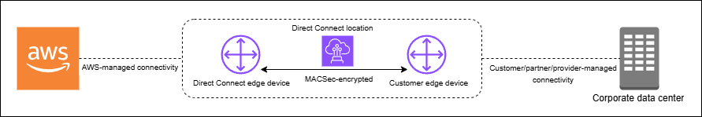

# MAC Security in AWS Direct Connect

MAC Security (MACsec) is an IEEE standard that provides data confidentiality, data integrity,
and data origin authenticity. MACsec provides Layer 2 point-to-point encryption over the
cross-connect to AWS, operating between two Layer 3 routers. While MACsec secures the
connection between your router and Direct Connect location at Layer 2, AWS provides
additional security by encrypting all data at the physical layer as it flows across the network
between AWS Direct Connect locations and AWS Regions. This creates a layered security
approach where your traffic is protected both during initial entry into AWS and during
transit across the AWS network.

In the following diagram, the AWS Direct Connect cross-connect must be connected to a MACsec-capable
interface on the customer's edge device. MACsec over Direct Connect provides layer 2
encryption for point-to-point traffic between the Direct Connect edge device and the
customer's edge device. This encryption occurs after security keys are exchanged and
verified between the interfaces at both ends of the cross-connect.

###### Note

MACsec provides point-to-point security on Ethernet links; therefore it does not
provide end-to-end encryption across multiple sequential Ethernet or other network
segments.

## MACsec concepts

The following are the key concepts for MACsec:

- MAC Security (MACsec) — An IEEE 802.1 Layer 2
  standard that provides data confidentiality, data integrity, and data origin
  authenticity. For more information about the protocol, see [802.1AE: MAC Security
  (MACsec)](https://1.ieee802.org/security/802-1ae/ "https://1.ieee802.org/security/802-1ae/").
- **Secure association key (SAK)** — A session key that establishes the
  MACsec connectivity between the customer on-premises router and the connection
  port at the Direct Connect location. The SAK is not pre-shared, but rather
  automatically derived from the CKN/CAK pair through a cryptographic key
  generation process. This derivation happens at both ends of the connection after
  you provide and provision the CKN/CAK pair. The SAK is regenerated periodically
  for security purposes and whenever a MACsec session is established.
- Connectivity Association Key Name (CKN) and Connectivity Association Key (CAK) — The values
  in this pair are used to generate the MACsec key. You generate the pair values,
  associate them with an AWS Direct Connect connection, and then provision them on your edge
  device at your end of the AWS Direct Connect connection. Direct Connect supports only
  static CAK mode but not dynamic CAK mode. Since only static CAK mode is
  supported, it's recommended that you follow your own key management policies for
  key generation, distribution, and rotation.
- **Key format** — The key format should use hexadecimal characters,
  exactly 64 characters in length. Direct Connect supports only Advanced
  Encryption Standard (AES) 256-bit keys for dedicated connections, which
  corresponds to a 64-character hexadecimal string.
- **Encryption modes** — Direct Connect supports two MACsec
  encryption modes:

      + must\_encrypt — In this mode, the connection requires MACsec encryption
       for all traffic. If MACsec negotiation fails or encryption cannot be
       established, the connection will not transmit any traffic. This mode
       provides the highest security guarantee but may impact availability if
       there are any MACsec-related issues.
      + should\_encrypt — In this mode, the connection attempts to establish
       MACsec encryption but will fall back to unencrypted communication if
       MACsec negotiation fails. This mode provides more flexibility and higher
       availability but may allow unencrypted traffic in certain failure
       scenarios.

  The encryption mode can be set during connection configuration and can be modified later.
  By default, new MACsec-enabled connections are set to "should_encrypt" mode to
  prevent potential connectivity issues during initial setup.

## MACsec key rotation

- **CNN/CAK rotation (manual)**

Direct Connect MACsec supports MACsec keychains with capacity for storing up
to three CKN/CAK pairs. This allows you to manually rotate these long-term keys
without connection disruption. When you associate a new CKN/CAK pair using the
`associate-mac-sec-key` command, you must configure the same pair
on your device. The Direct Connect device attempts to use the most recently
added key. If that key doesn't match your device's key, it falls back to the
previous working key, ensuring connection stability during rotation.

For information on using `associate-mac-sec-key`, see [associate-mac-sec-key](https://awscli.amazonaws.com/v2/documentation/api/latest/reference/directconnect/associate-mac-sec-key.html "https://awscli.amazonaws.com/v2/documentation/api/latest/reference/directconnect/associate-mac-sec-key.html").

- **Secure Association Key (SAK) rotation (automatic)**

The SAK, which is derived from the active CKN/CAK pair, undergoes automatic
rotation based on the following:

    + time intervals
    + volume of encrypted traffic
    + MACsec session establishment

This rotation is handled automatically by the protocol, occurs transparently
without disrupting the connection, and requires no manual intervention. The SAK
is never stored persistently and is regenerated through a secure key derivation
process that follows the IEEE 802.1X standard.

## Supported connections

MACsec is available on dedicated Direct Connect connections and link aggregation
groups:

###### Supported MACsec connections

- [Dedicated connections](#direct-connect-mac-sec-dedicated "#direct-connect-mac-sec-dedicated")
- [LAGs](#direct-connect-mac-sec-lags "#direct-connect-mac-sec-lags")
- [Partner interconnects](#direct-connect-mac-sec-partners "#direct-connect-mac-sec-partners")

###### Note

Partners using supported devices can use MACsec to encrypt the Layer 2 connection between
their edge network device and the Direct Connect device. Partners who enable the
feature can encrypt all traffic traversing the secured link. MACsec encryption
operates between the two specific devices on Layer 2 and is not supported on hosted
connections.

For information about how to order connections that support MACsec, see [AWS Direct Connect](https://aws.amazon.com/directconnect/?nc=sn&loc=0 "https://aws.amazon.com/directconnect/?nc=sn&loc=0").

### Dedicated connections

The following helps you become familiar with MACsec on AWS Direct Connect dedicated connections.
There are no additional charges for using MACsec. The steps to configure MACsec on a
dedicated connection can be found in [Get started with MACsec on a dedicated connection](create-macsec-dedicated.md "create-macsec-dedicated.md").

Partner interconnect operations follow the same procedures as dedicated connections. When
you run CLI or SDK commands for partner interconnects, the responses will include
MACsec-related information where applicable.

#### MACsec prerequisites for dedicated connections

Note the following requirements for MACsec on dedicated connections:

- MACsec is supported on 10 Gbps , 100 Gbps, and 400 Gbps dedicated
  Direct Connect connections at selected points of presence. For these
  connections, the following MACsec cipher suites are supported:
  - For 10Gbps connections, GCM-AES-256 and
    GCM-AES-XPN-256.
  - For 100 Gbps and 400 Gbps connections, GCM-AES-XPN-256.

- Only 256-bit MACsec keys are supported.
- Extended Packet Numbering (XPN) is required for 100Gbps and 400 Gbps
  connections. For 10Gbps connections Direct Connect supports both
  GCM-AES-256 and GCM-AES-XPN-256. High-speed connections, such as 100
  Gbps and 400 Gbps dedicated connections, can quickly exhaust MACsec’s
  original 32-bit packet numbering space, which would require you to
  rotate your encryption keys every few minutes to establish a new
  Connectivity Association. To avoid this situation, the IEEE Std
  802.1AEbw-2013 amendment introduced extended packet numbering,
  increasing the numbering space to 64-bits, easing the timeliness
  requirement for key rotation.
- Secure Channel Identifier (SCI) is required and must be turned on.
  This setting can't be adjusted.
- IEEE 802.1Q (Dot1q/VLAN) tag offset/dot1q-in-clear is not supported
  for moving a VLAN tag outside of an encrypted payload.

In addition you should complete the following tasks before you configure MACsec on a
dedicated connection.

- Create a CKN/CAK pair for the MACsec key.

You can create the pair using an open standard tool. The pair must meet the
requirements specified in [Step 4: Configure your on-premises router](create-macsec-dedicated.md#associate-key-router "create-macsec-dedicated.md#associate-key-router").

- Make sure that you have a device on your end of the connection that supports
  MACsec.
- Secure Channel Identifier (SCI) must be turned on.
- Only 256-bit MACsec keys are supported, providing the latest advanced data
  protection.

### LAGs

The following requirements help you become familiar with MACsec for Direct Connect link
aggregation groups (LAGs):

- LAGs must be composed of MACsec-capable dedicated connections support
  MACsec encryption
- All connections within a LAG must be of the same bandwidth and support
  MACsec
- MACsec configuration applies uniformly across all connections in the
  LAG
- Enabling LAG creation and MACsec can be done simultaneously
- Only a single MACsec key can be utilized across all LAG links at any time.
  The ability to support multiple MACsec keys is for key rotation purposes
  only.

### Partner interconnects

The partner account that owns the interconnect can use MACsec on that physical connection
or LAG. The operations are the same as for dedicated connections, however they are
performed using the partner-specific API/SDK calls.

## Service-Linked roles

AWS Direct Connect uses AWS Identity and Access Management (IAM) [service-linked roles](../../../IAM/latest/UserGuide/id_roles_terms-and-concepts.md#iam-term-service-linked-role "../../../IAM/latest/UserGuide/id_roles_terms-and-concepts.md#iam-term-service-linked-role"). A service-linked role is a unique type of IAM role
that is linked directly to AWS Direct Connect. Service-linked roles are predefined by AWS Direct Connect and
include all of the permissions that the service requires to call other AWS services on
your behalf. A service-linked role makes setting up AWS Direct Connect easier because you don’t
have to manually add the necessary permissions. AWS Direct Connect defines the permissions of its
service-linked roles, and unless defined otherwise, only AWS Direct Connect can assume its roles.
The defined permissions include the trust policy and the permissions policy, and that
permissions policy cannot be attached to any other IAM entity. For more information,
see [Service-linked
roles for Direct Connect](security_iam_service-with-iam.md#security_iam_service-with-iam-roles-service-linked "security_iam_service-with-iam.md#security_iam_service-with-iam-roles-service-linked").

## MACsec pre-shared CKN/CAK key considerations

AWS Direct Connect uses AWS managed CMKs for the pre-shared keys that you associate with
connections or LAGs. Secrets Manager stores your pre-shared CKN and CAK pairs as a secret
that the Secrets Manager’s root key encrypts. For more information, see [AWS
managed CMKs](../../../kms/latest/developerguide/concepts.md#master_keys "../../../kms/latest/developerguide/concepts.md#master_keys") in the _AWS Key Management Service Developer
Guide_.

The stored key is read-only by design, but you can schedule a seven- to thirty-day
deletion using the AWS Secrets Manager console or API. When you schedule a deletion, the CKN
cannot be read, and this might affect your network connectivity. We apply the following
rules when this happens:

- If the connection is in a pending state, we disassociate the CKN from the
  connection.
- If the connection is in an available state, we notify the connection owner by
  email. If you do not take any action within 30 days, we disassociate the CKN
  from your connection.

When we disassociate the last CKN from your connection and the connection
encryption mode is set to "must encrypt", we set the mode to "should_encrypt" to prevent
sudden packet loss.
