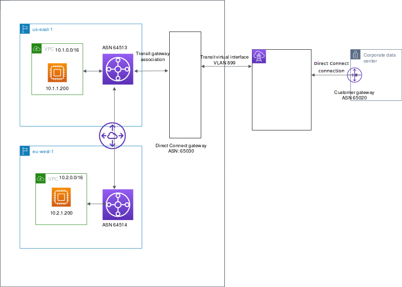

# Allowed prefixes interactions for Direct Connect gateways

Learn how allowed prefixes interact with transit gateways and virtual private gateways. For
more information, see [Routing policies and BGP communities](routing-and-bgp.md "routing-and-bgp.md").

## Virtual private gateway associations

The prefix list (IPv4 and IPv6) acts as a filter that allows the same CIDRs,
or a smaller range of CIDRs to be advertised to the Direct Connect gateway. You must
set the prefixes to a range that is the same or wider than the VPC CIDR
block.

###### Note

The allowed list only functions as a filter, and only the associated VPC CIDR
will be advertised to the customer gateway.

Consider the scenario where you have a VPC with CIDR 10.0.0.0/16 is attached
to a virtual private gateway.

- When the allowed prefixes list is set to 22.0.0.0/24, you do not
  receive any route because 22.0.0.0/24 is not the same as, or wider than
  10.0.0.0/16.
- When the allowed prefixes list is set to 10.0.0.0/24, you do not
  receive any route because 10.0.0.0/24 is not the same as 10.0.0.0/16.
- When the allowed prefixes list is set to 10.0.0.0/15, you do receive
  10.0.0.0/16, because the IP address is wider than 10.0.0.0/16.

When you remove or add an allowed prefix, traffic which doesn't use that prefix is not
impacted. During updates the status changes from `associated` to
`updating`. Modifying an existing prefix can delay or drop only that
traffic which uses that prefix.

## Transit gateway associations

For a transit gateway association, you provision the allowed prefixes list on the Direct Connect
gateway. The list routes on-premises traffic to or from a Direct Connect gateway to the
transit gateway, even when the VPCs attached to the transit gateway do not have assigned CIDRs. Allowed
prefixes work differently, depending on the gateway type:

- For transit gateway associations, only the allowed prefixes entered will be
  advertised to on-premises. These will show as originating from the Direct Connect
  gateway ASN.
- For virtual private gateways, the allowed prefixes entered act as a filter
  to allow the same or smaller CIDRs.

Consider the scenario where you have a VPC with CIDR 10.0.0.0/16 attached to a
transit gateway.

- When the allowed prefixes list is set to 22.0.0.0/24, you receive 22.0.0.0/24
  through BGP on your transit virtual interface. You do not receive
  10.0.0.0/16 because we directly provision the prefixes that are in the
  allowed prefix list.
- When the allowed prefixes list is set to 10.0.0.0/24, you receive 10.0.0.0/24
  through BGP on your transit virtual interface. You do not receive
  10.0.0.0/16 because we directly provision the prefixes that are in the
  allowed prefix list.
- When the allowed prefixes list is set to 10.0.0.0/8, you receive 10.0.0.0/8
  through BGP on your transit virtual interface.

Allowed prefix overlaps are not allowed when multiple transit gateways are associated with a
Direct Connect gateway. For example, if you have a transit gateway with an allowed prefix
list that includes 10.1.0.0/16, and a second transit gateway with an allowed prefix list that
includes 10.2.0.0/16 and 0.0.0.0/0, you can't set the associations from the second
transit gateway to 0.0.0.0/0. Since 0.0.0.0/0 includes all IPv4 networks, you can't configure
0.0.0.0/0 if multiple transit gateways are associated with a Direct Connect gateway. An error is
returned indicating that the allowed routes overlap one or more existing allowed
routes on the Direct Connect gateway.

When you remove or add an allowed prefix, traffic which doesn't use that prefix is not
impacted. During updates the status changes from `associated` to
`updating`. Modifying an existing prefix can delay or drop only that
traffic which uses that prefix.

## Example: Allowed to prefixes in a transit gateway configuration

Consider the configuration where you have instances in two different AWS Regions which need
to access the corporate data center. You can use the following resources for this
configuration:

- A transit gateway in each Region.
- A transit gateway peering connection.
- A Direct connect gateway.
- A transit gateway association between one of the transit gateways (the one in
  us-east-1) to the Direct Connect gateway.
- A transit virtual interface from the on-premises location and the Direct Connect
  location.

Configure the following options for the resources:

- Direct Connect gateway: Set the ASN to 65030. For more information, see [Create a Direct Connect gateway](create-direct-connect-gateway.md "create-direct-connect-gateway.md").
- Transit virtual interface: Set the VLAN to 899, and the customer router peer ASN to 65020. For more
  information, see [Create a transit virtual interface to the Direct Connect
  gateway](create-transit-vif-dx.md "create-transit-vif-dx.md").
- Direct Connect gateway association with the transit gateway: Set the allowed prefixes to 10.0.0.0/8.

This CIDR block encompasses both VPC CIDR blocks (10.0.0.0/16 and 10.2.0.0/16). For more information, see [Associate or disassociate a transit gateway with Direct Connect.](associate-tgw-with-direct-connect-gateway.md "associate-tgw-with-direct-connect-gateway.md").

- VPC route: To route traffic from the 10.2.0.0/16 VPC, create a route in the VPC route
  table with a Destination of 0.0.0.0/0 and the transit gateway ID as the Target. This enables traffic from the VPC to reach the Direct Connect gateway. For more information about routing to a transit gateway, see [Routing for
  a transit gateway](../../../vpc/latest/userguide/route-table-options.md#route-tables-tgw "../../../vpc/latest/userguide/route-table-options.md#route-tables-tgw") in the _Amazon VPC User Guide_.
