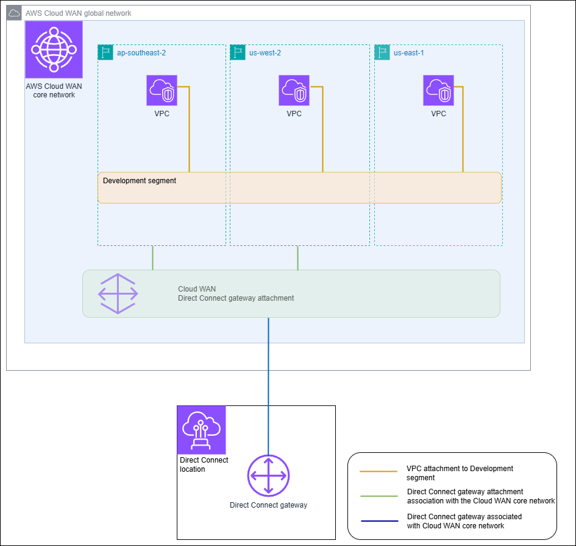

# Direct Connect gateway and AWS Cloud WAN core

network associations

Associate an Direct Connect gateway to an AWS Cloud WAN core network using a Direct Connect attachment
type in Cloud WAN. This direct association routes traffic between your core network’s
selected edge locations and your Direct Connect connections using the shortest available
path

The Direct Connect gateway attachment type supports BGP (Border Gateway protocol) for
automatic propagation of routing information between your core network and on-premises
locations. The Direct Connect attachment also supports the standard Cloud WAN features such
as central policy-based management, tag-based attachment automation, and segmentation for
advanced security configurations.

###### Note

The association between a core network and a Direct Connect gateway is created,
deleted, and managed from the Cloud WAN Console in Network Manager. When using a Direct
Connect gateway with Cloud WAN, the Direct Connect Console and the APIs and CLI will
reflect the association, but cannot be used to modify it. You can, however, use the
Direct Connect API or command line to verify if an association was created.

The following example shows a Cloud WAN global network with three Regions within the
Cloud WAN core network. Each Region has its own VPC connected to a core network Development
segment shared across those three Regions. Using Cloud WAN, a Direct Connect gateway
attachment is created within Cloud WAN using a Direct Connect gateway, which was created
using Direct Connect. The attachment is associated with two of the three Regions,
ap-southeast-2 and us-west-2 and is allowed access to the Development segment. Even though
us-east-1 shares the same Development segment, the Direct Connect gateway attachment is not
shared with that Region and is therefore not available.

###### Topics

- [Prerequisites](#direct-connect-cloud-wan-prereq "#direct-connect-cloud-wan-prereq")
- [Considerations](#direct-connect-cloud-wan-limits "#direct-connect-cloud-wan-limits")
- [Direct Connect
  gateway associations to a Cloud WAN core network](#associate-cloudwan-with-direct-connect-gateway "#associate-cloudwan-with-direct-connect-gateway")
- [Verify a
  Direct Connect gateway association](edit-cloudwan-with-direct-connect-gateway.md "edit-cloudwan-with-direct-connect-gateway.md")

## Prerequisites

A Direct Connect gateway association with a Cloud WAN core network requires the
following:

- An existing Direct Connect gateway. For the steps to create a Direct Connect
  gateway, see [Create a Direct Connect gateway](create-direct-connect-gateway.md "create-direct-connect-gateway.md").
- An AWS Cloud WAN core network. For information about Cloud WAN, see the [_AWS Cloud WAN
  User Guide_](../../../network-manager/latest/cloudwan/what-is-cloudwan.md "../../../network-manager/latest/cloudwan/what-is-cloudwan.md").

## Considerations

The following limits apply for Direct Connect gateway associations with a Cloud
WAN core network:

- A Direct Connect gateway can be associated with a single Cloud WAN core
  network and to a single segment of that core network. Once an association is
  created, that gateway cannot associated to other resources in AWS regions. If
  you disassociate the gateway from the core network, you can then use that
  gateway for other association types.
- The Cloud WAN Direct Connect gateway attachment uses the transit virtual
  interface type for connectivity.
- The Cloud WAN attachment does not support allowed prefixes lists. All prefixes
  in a core network segment will be advertised to the Direct Connect gateway
  associated to that segment.
- The quota for maximum prefixes that can be advertised from on-premises to
  AWS via a transit virtual interface is different from the quota for prefixes
  advertised from a Cloud WAN core network to on-premises. Quotas for other Direct
  Connect resources used with a Cloud WAN association are also applicable. See
  [Direct Connect quotas](limits.md "limits.md").
- The AS-PATH BGP attribute will be retained across the core network, Direct
  Connect gateway, and virtual interface.
- The ASN of a Direct Connect gateway must be outside of the ASN range
  configured for the Cloud WAN core network. For example, if you have an ASN range
  of 64512 - 65534 for the core network, the ASN of the Direct Connect gateway
  must use an ASN outside of that range.
- Cloud WAN might not support specific attachment types using the Direct Connect
  attachment type for transport. For more information about Direct Connect gateway
  attachments to a Cloud WAN core network, see [Direct
  Connect gateway attachments in AWS Cloud WAN](../../../network-manager/latest/cloudwan/cloudwan-create-attachment.md "../../../network-manager/latest/cloudwan/cloudwan-create-attachment.md") in the _AWS Cloud WAN User
  Guide_.
- CloudWatch Network Monitor supports latency and packet loss metrics when used
  with a Cloud WAN Direct Connect gateway attachment type. The Network Health
  Indicator feature is not supported. For more information, see [Using
  Amazon CloudWatch Network Monitor](../../../AmazonCloudWatch/latest/monitoring/what-is-network-monitor.md "../../../AmazonCloudWatch/latest/monitoring/what-is-network-monitor.md") in the
  _Amazon CloudWatch User Guide_.

## Direct Connect gateway

associations to a Cloud WAN core network

Associating a Direct Connect gateway to an AWS Cloud WAN core network is performed using either
the AWS Cloud WAN console or the Cloud WAN APIs or command line.

To associate an existing Direct connect gateway to a Cloud WAN core network, create a new
Direct Connect attachment in the Cloud WAN Console. After the Direct Connect attachment has
been created the association is established. By default, when creating the association you
can choose the default to include all core network edge locations in the chosen core network
segment. Alternatively, you can specify individual edge locations.

For more information about Direct Connect gateway attachments to a Cloud WAN core network,
see [Direct Connect gateway attachments in AWS Cloud WAN](../../../network-manager/latest/cloudwan/cloudwan-dxattach-about.md "../../../network-manager/latest/cloudwan/cloudwan-dxattach-about.md") in the _AWS Cloud WAN User Guide_.
