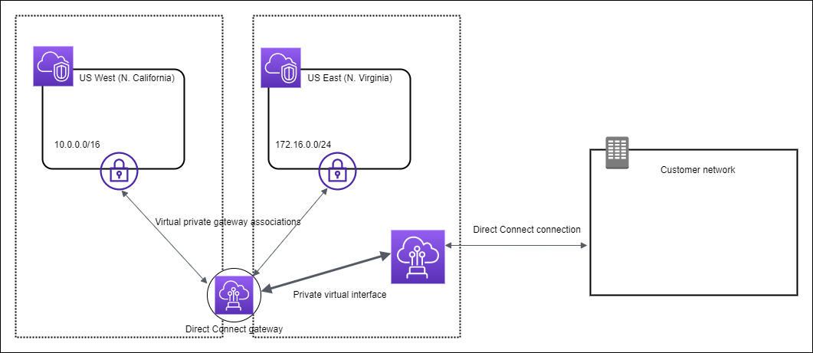
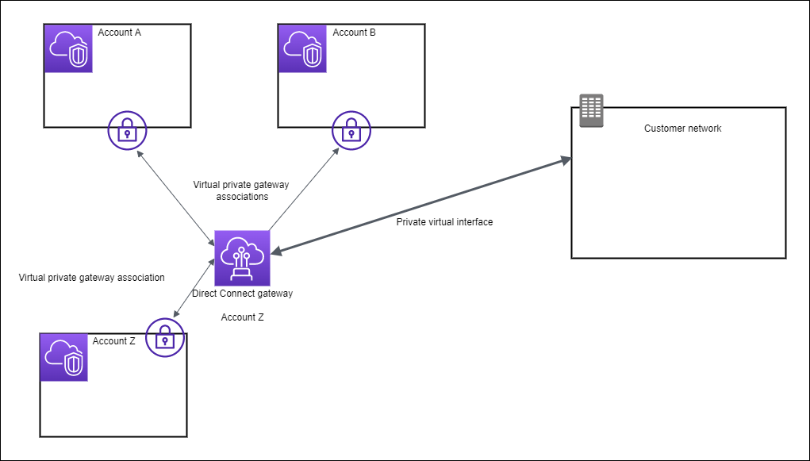
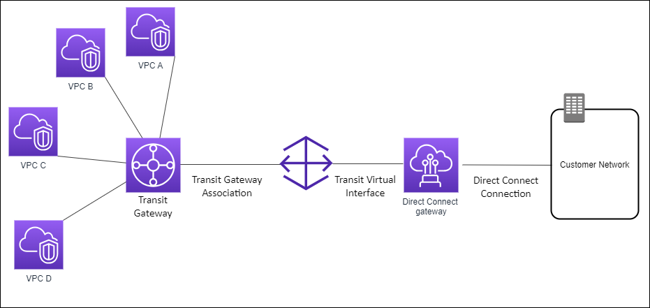
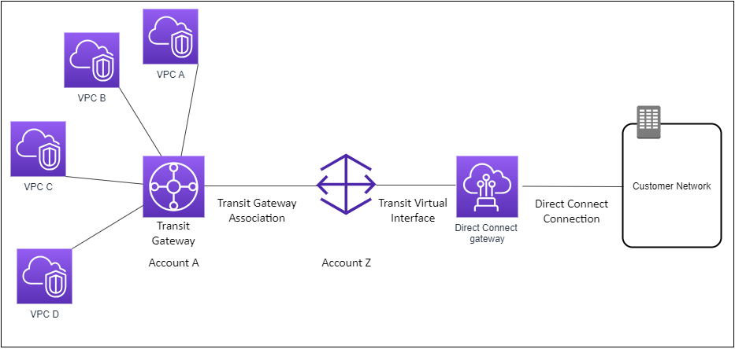

# Direct Connect gateways

Use Direct Connect gateway to connect your VPCs. You associate an Direct Connect gateway with any of
the following:

- A transit gateway when you have multiple VPCs in the same Region
- A virtual private gateway
- An AWS Cloud WAN core network
  You can also use a virtual private gateway to extend your Local Zone. This
  configuration allows the VPC associated with the Local Zone to connect to a Direct Connect
  gateway. The Direct Connect gateway connects to a Direct Connect location in a
  Region. The on-premises data center has a Direct Connect connection to the
  Direct Connect location. For more information, see [Accessing Local Zones
  using a Direct Connect gateway](../../../vpc/latest/userguide/Extend_VPCs.md#access-local-zone "../../../vpc/latest/userguide/Extend_VPCs.md#access-local-zone") in the _Amazon VPC User Guide_.

A Direct Connect gateway is a globally available resource. You can connect to any
Region globally using a Direct Connect gateway. This includes AWS GovCloud (US), but
it does not include the AWS China Regions. A Direct Connect gateway is a virtual component of
Direct Connect designed to act as a distributed set of BGP route reflectors. Because it operates
outside the data traffic path, it avoids creating a single point of failure or introducing
dependencies on specific AWS Regions. High availability is inherently built into its
design, eliminating the need for multiple Direct Connect gateways.

Customers using Direct Connect with VPCs that currently bypass a parent Availability
Zone will not be able to migrate their Direct Connect connections or virtual
interfaces.

The following describe scenarios where you can use a Direct Connect gateway.

A Direct Connect gateway does not allow gateway associations that are on the same
Direct Connect gateway to send traffic to each other (for example, a virtual private
gateway to another virtual private gateway). An exception to this rule, implemented in
November 2021, is when a supernet is advertised across two or more VPCs, which have
their attached virtual private gateways (VGWs) associated to the same Direct Connect
gateway and on the same virtual interface. In this case, VPCs can communicate with each
other via the Direct Connect endpoint. For example, if you advertise a supernet (for
example, 10.0.0.0/8 or 0.0.0.0/0) that overlaps with the VPCs attached to a Direct
Connect gateway (for example, 10.0.0.0/24 and 10.0.1.0/24), and on the same virtual
interface, then from your on-premises network, the VPCs can communicate with each other.

If you want to block VPC-to-VPC communication within a Direct Connect gateway, do the
following:

1. Set up security groups on the instances and other resources in the VPC to
   block traffic between VPCs, also using this as part of the default security
   group in the VPC.
2. Avoid advertising a supernet from your on- premises network that overlaps with
   your VPCs. Instead you can advertise more specific routes from your on-premises
   network that do not overlap with your VPCs.
3. Provision a single Direct Connect Gateway for each VPC that you want to
   connect to your on-premises network instead of using the same Direct Connect
   Gateway for multiple VPCs. For example, instead of using a single Direct Connect
   Gateway for your development and production VPCs, use separate Direct Connect
   Gateways for each of these VPCs.
   A Direct Connect gateway does not prevent traffic from being sent from one gateway
   association back to the gateway association itself (for example when you have an
   on-premises supernet route that contains the prefixes from the gateway association). If
   you have a configuration with multiple VPCs connected to transit gateways associated to same
   Direct Connect gateway, the VPCs could communicate. To prevent the VPCs from communicating,
   associate a route table with the VPC attachments that have the
   **blackhole** option set.

###### Topics

- [Scenarios](#dx-gateway-scenarios "#dx-gateway-scenarios")
- [Create a Direct Connect gateway](create-direct-connect-gateway.md "create-direct-connect-gateway.md")
- [Migrate from a virtual private
  gateway to a Direct Connect gateway](migrate-to-direct-connect-gateway.md "migrate-to-direct-connect-gateway.md")
- [Delete a Direct Connect
  gateway](delete-direct-connect-gateway.md "delete-direct-connect-gateway.md")

## Scenarios

The following describe just a few scenarios for using Direct Connect gateways.

In the following diagram, the Direct Connect gateway enables you to use your
Direct Connect connection in the US East (N. Virginia) Region to access VPCs in your account
in both the US East (N. Virginia) and US West (N. California) Regions.

Each VPC has a virtual private gateway that connects to the Direct Connect gateway
using a virtual private gateway association. The Direct Connect gateway uses a
private virtual interface for the connection to the Direct Connect location. There is an
Direct Connect connection from the location to the customer data center.

Consider this scenario of a Direct Connect gateway owner (Account Z) who owns the
Direct Connect gateway. Account A and Account B want to use the Direct Connect
gateway. Account A and Account B each send an association proposal to Account Z.
Account Z accepts the association proposals and can optionally update the prefixes
that are allowed from Account A's virtual private gateway or Account B's virtual
private gateway. After Account Z accepts the proposals, Account A and Account B can
route traffic from their virtual private gateway to the Direct Connect gateway.
Account Z also owns the routing to the customers because Account Z owns the
gateway.

The following diagram illustrates how the Direct Connect gateway enables you to
create a single connection to your Direct Connect connection that all of your VPCs
can use.

The solution involves the following components:

- A transit gateway that has VPC attachments.
- A Direct Connect gateway.
- An association between the Direct Connect gateway and the transit gateway.
- A transit virtual interface that is attached to the Direct Connect
  gateway.
  This configuration offers the following benefits. You can:

- Manage a single connection for multiple VPCs or VPNs that are in the same
  Region.
- Advertise prefixes from on-premises to AWS and from AWS to
  on-premises.
  For information about configuring transit gateways, see [Working with Transit
  Gateways](../../../vpc/latest/tgw/tgw-dcg-attachments.md "../../../vpc/latest/tgw/tgw-dcg-attachments.md") in the _Amazon VPC Transit Gateways
  Guide_.

Consider this scenario of a Direct Connect gateway owner (Account Z) who owns the
Direct Connect gateway. Account A owns the transit gateway and wants to use the Direct Connect
gateway. Account Z accepts the association proposals and can optionally update the
prefixes that are allowed from Account A's transit gateway. After Account Z accepts the
proposals, the VPCs attached to the transit gateway can route traffic from the transit gateway to the
Direct Connect gateway. Account Z also owns the routing to the customers because
Account Z owns the gateway.

