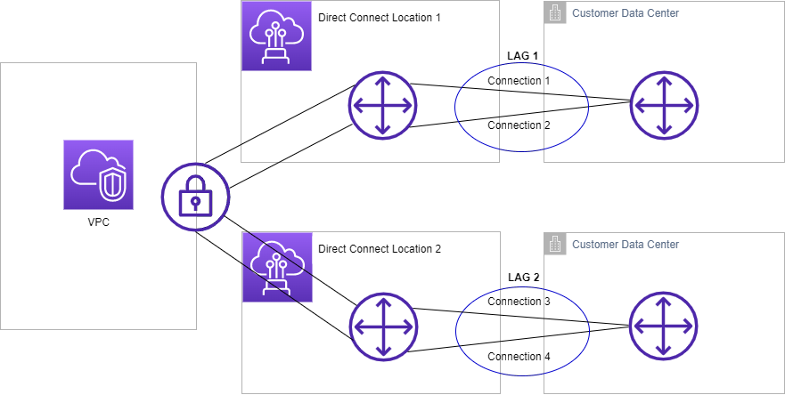

# AWS Direct Connect link aggregation groups (LAGs)

You can use multiple connections to increase available bandwidth. A link aggregation group
(LAG) is a logical interface that uses the Link Aggregation Control Protocol (LACP) to
aggregate multiple connections at a single AWS Direct Connect endpoint, allowing you to treat them as
a single, managed connection. LAGs streamline configuration because the LAG configuration
applies to all connections in the group.

###### Note

Multi-chassis LAG (MLAG) is not supported by AWS.

In the following diagram, you have four connections, with two connections to each location.
You can create a LAG for connections that terminate on the same AWS device and in the same
location, and then use the two LAGs instead of the four connections for configuration and
management.

You can create a LAG from existing connections, or you can provision new connections. After
you've created the LAG, you can associate existing connections (whether standalone or part
of another LAG) with the LAG.

The following rules apply:

- All connections must be dedicated connections and have a port speed of 1 Gbps, 10 Gbps, 100
  Gbps, or 400 Gbps.
- All connections in the LAG must use the same bandwidth.
- You can have a maximum of two 100 Gbps or 400 Gbps connections, or four connections with a
  port speed less than 100 Gbps in a LAG. Each connection in the LAG counts towards
  your overall connection limit for the Region.
- All connections in the LAG must terminate at the same AWS Direct Connect endpoint.
- LAGs are supported for all virtual interface types—public, private, and
  transit.
  When you create a LAG, you can download the Letter of Authorization and Connecting Facility
  Assignment (LOA-CFA) for a new physical connection individually from the AWS Direct Connect console.
  For more information, see [Letter of Authorization and Connecting Facility
  Assignment (LOA-CFA)](dedicated_connection.md#create-connection-loa-cfa "dedicated_connection.md#create-connection-loa-cfa").

All LAGs have an attribute that determines the minimum number of connections in the LAG that
must be operational for the LAG itself to be operational. By default, new LAGs have this
attribute set to 0. You can update your LAG to specify a different value—doing so
means that your entire LAG becomes non-operational if the number of operational connections
falls below this threshold. This attribute can be used to prevent over-utilization of the
remaining connections.

All connections in a LAG operate in Active/Active mode.

###### Note

When you create a LAG or associate more connections with the LAG, we may not be able to
guarantee enough available ports on a given AWS Direct Connect endpoint.

###### Topics

- [MACsec considerations](#lag-macsec-considerations "#lag-macsec-considerations")
- [Create a LAG](create-lag.md "create-lag.md")
- [View LAG details](view-lag.md "view-lag.md")
- [Update a LAG](update-lag.md "update-lag.md")
- [Associate a connection with a LAG](associate-connection-with-lag.md "associate-connection-with-lag.md")
- [Disassociate a connection from a LAG](disassociate-connection-from-lag.md "disassociate-connection-from-lag.md")
- [Associate a MACsec CKN/CAK with a LAG](associate-key-lag.md "associate-key-lag.md")
- [Remove the association between a MACsec secret key and a
  LAG](disassociate-key-lag.md "disassociate-key-lag.md")
- [Delete a LAG](delete-lag.md "delete-lag.md")

## MACsec considerations for AWS Direct Connect

Take the following into consideration when you want to configure MACsec on
LAGs:

- When you create a LAG from existing connections, we disassociate all of the MACsec keys
  from the connections. Then we add the connections to the LAG, and associate the
  LAG MACsec key with the connections.
- When you associate an existing connection to a LAG, the MACsec keys that are
  currently associated with the LAG are associated with the connection. Therefore,
  we disassociate the MACsec keys from the connection, add the connection to the
  LAG, and then associate the LAG MACsec key with the connection.
- Only a single MACsec key can be utilized across all LAG links at any time. The
  ability to support multiple MACsec keys is for key rotation purposes
  only.
