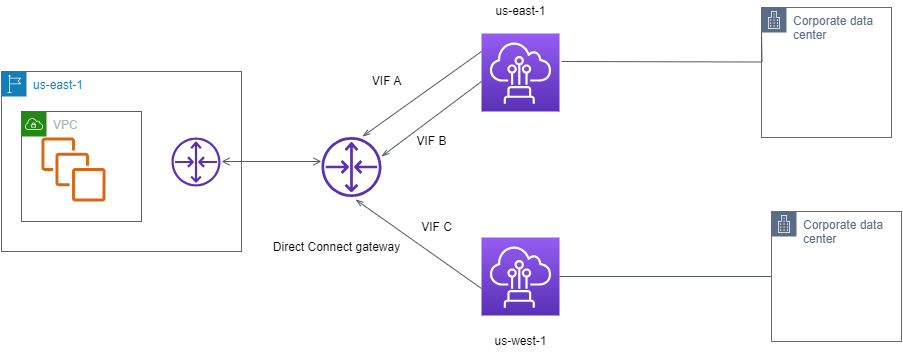
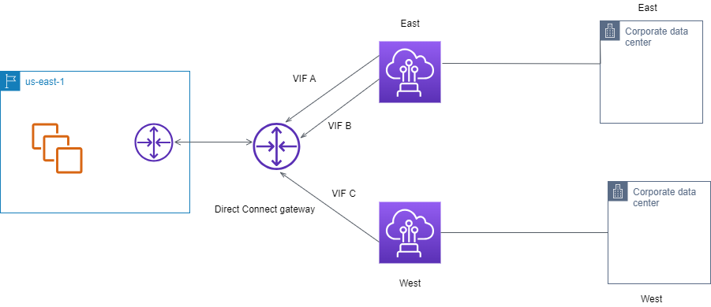

# Direct Connect private virtual interface routing

example

Consider the configuration where the Direct Connect location 1 home Region is the same as
the VPC home Region. There is a redundant Direct Connect location in a different Region There
are two private VIFs (VIF A and VIF B) from Direct Connect location 1 (us-east-1) to the
Direct Connect gateway. There is one private VIF (VIF C) from Direct Connect location
(us-west-1) to the Direct Connect gateway. To have AWS route traffic over VIF B before
VIF A, set the AS_PATH attribute of VIF B to be shorter than the VIF A AS_PATH
attribute.

The VIFs have the following configurations:

- VIF A (in us-east-1) advertises 172.16.0.0/16 and has an AS_PATH attribute of
  65001, 65001, 65001
- VIF B (in us-east-1) advertises 172.16.0.0/16 and has an AS_PATH attribute of
  65001, 65001
- VIF C (in us-west-1) advertises 172.16.0.0/16 and has an AS_PATH attribute of
  65001

If you change the CIDR range configuration of VIF C, routes that fall in to the VIF C
CIDR range use VIF C because it has the longest prefix length.

- VIF C (in us-west-1) advertises 172.16.0.0/24 and has an AS_PATH attribute of
  65001

