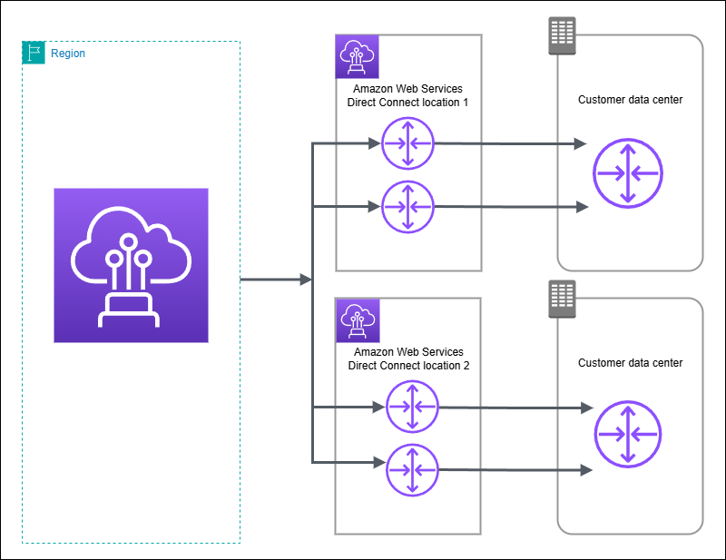
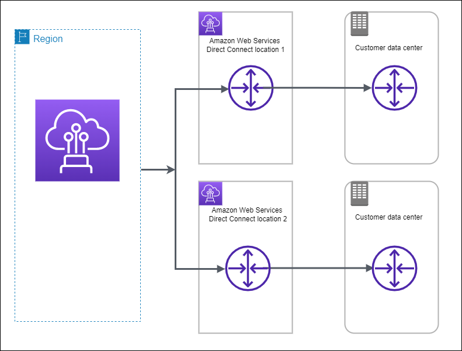
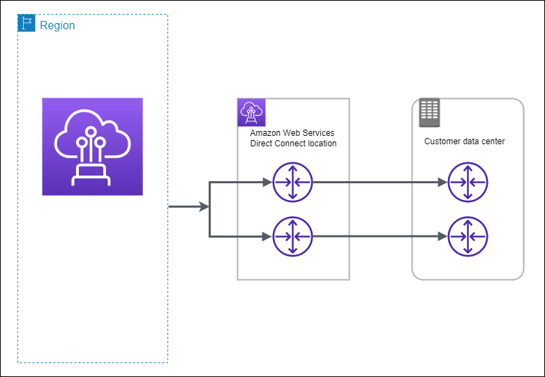

# AWS Direct Connect Resiliency Toolkit

AWS offers customers the ability to achieve highly resilient network connections between
Amazon Virtual Private Cloud (Amazon VPC) and their on-premises infrastructure. The AWS Direct Connect Resiliency Toolkit provides a
connection wizard with multiple resiliency models. These models help you to determine, and
then place an order for the number of dedicated connections to achieve your SLA objective.
You select a resiliency model, and then the AWS Direct Connect Resiliency Toolkit guides you through the
dedicated connection ordering process. The resiliency models are designed to ensure that you
have the appropriate number of dedicated connections in multiple locations.

The AWS Direct Connect Resiliency Toolkit has the following benefits:

- Provides guidance on how you determine and then order the appropriate redundant
  AWS Direct Connect dedicated connections.
- Ensures that the redundant dedicated connections have the same speed.
- Automatically configures the dedicated connection names.
- Automatically approves your dedicated connections when you have an existing AWS
  account and you select a known AWS Direct Connect Partner. The Letter of Authority (LOA) is
  available for immediate download.
- Automatically creates a support ticket for the dedicated connection approval when
  you are a new AWS customer, or you select an unknown (**Other**)
  partner.
- Provides an order summary for your dedicated connections, with the SLA that you
  can achieve and the port-hour cost for the ordered dedicated connections.
- Creates link aggregation groups (LAGs), and adds the appropriate number of
  dedicated connections to the LAGs when you choose a speed other than 1 Gbps, 10
  Gbps, 100 Gbps, or 400 Gbps.
- Provides a LAG summary with the dedicated connection SLA that you can achieve, and
  the total port-hour cost for each ordered dedicated connection as part of the
  LAG.
- Prevents you from terminating the dedicated connections on the same AWS Direct Connect
  device.
- Provides a way for you to test your configuration for resiliency. You work with
  AWS to bring down the BGP peering session in order to verify that traffic routes
  to one of your redundant virtual interfaces. For more information, see [AWS Direct Connect Failover Test](resiliency_failover.md "resiliency_failover.md").
- Provides Amazon CloudWatch metrics for connections and virtual interfaces. For more
  information, see [Monitor AWS Direct Connect resources](monitoring-overview.md "monitoring-overview.md").
  After you select the resiliency model, the AWS Direct Connect Resiliency Toolkit steps you through the following
  procedures:

- Selecting the number of dedicated connections
- Selecting the connection capacity, and the dedicated connection location
- Ordering the dedicated connections
- Verifying that the dedicated connections are ready to use
- Downloading your Letter of Authority (LOA-CFA) for each dedicated
  connection
- Verifying that your configuration meets your resiliency requirements

## Available resiliency models

The following resiliency models are available in the AWS Direct Connect Resiliency Toolkit:

- **Maximum resiliency**: This model provides you a way to order
  dedicated connections to achieve an SLA of 99.99%. It requires you to meet all
  of the requirements for achieving the SLA that are specified in the [AWS Direct Connect Service Level
  Agreement](https://aws.amazon.com/directconnect/sla/ "https://aws.amazon.com/directconnect/sla/").
- **High resiliency**: This model provides you a way to order
  dedicated connections to achieve an SLA of 99.9%. It requires you to meet all of
  the requirements for achieving the SLA that are specified in the [AWS Direct Connect Service Level
  Agreement](https://aws.amazon.com/directconnect/sla/ "https://aws.amazon.com/directconnect/sla/").
- **Development and test**: This model provides you a way to
  achieve development and test resiliency for non-critical workloads, by using
  separate connections that terminate on separate devices in one location.

The best practice is to use the **Connection wizard** in the AWS Direct Connect Resiliency Toolkit
to order to achieve your SLA objective.

###### Note

If you do not want to create a resiliency model using the AWS Direct Connect Resiliency Toolkit, you can create
a Classic connection. For more information about Classic connections, see [Classic connection](classic_connection.md "classic_connection.md").

## AWS Direct Connect Resiliency Toolkit prerequisites

Note the following information before you begin your configuration:

- Familiarize yourself with the [Connection prerequisites](connection_options.md#connect-prereqs.title "connection_options.md#connect-prereqs.title").
- The available resiliency model that you want to use.

## Maximum resiliency

You can achieve maximum resiliency for critical workloads by using separate
connections that terminate on separate devices in more than one location (as shown in
the following figure). This model provides resiliency against device, connectivity, and
complete location failures. The following figure shows both connections from each
customer data center going to the same AWS Direct Connect locations. You can optionally
have each connection from a customer data center going to different locations.

For the procedure for using the AWS Direct Connect Resiliency Toolkit to configure a
maximum resiliency model, see [Configure maximum resiliency](max-resiliency-set-up.md "max-resiliency-set-up.md").

## High resiliency

You can achieve high resiliency for critical workloads by using two single connections
to multiple locations (as shown in the following figure). This model provides resiliency
against connectivity failures caused by a fiber cut or a device failure. It also helps
prevent a complete location failure.

For the procedure for using the AWS Direct Connect Resiliency Toolkit to configure a
high resiliency model, see [Configure high resiliency](high-resiliency-set-up.md "high-resiliency-set-up.md").

## Development and test

You can achieve development and test resiliency for non-critical workloads by using
separate connections that terminate on separate devices in one location (as shown in the
following figure). This model provides resiliency against device failure, but does not
provide resiliency against location failure.

For the procedure for using the AWS Direct Connect Resiliency Toolkit to configure a
maximum resiliency model, see [Configure development and test resiliency](devtest-resiliency-set-up.md "devtest-resiliency-set-up.md").

## AWS Direct Connect FailoverTest

Use the AWS Direct Connect Resiliency Toolkit to verify traffic routes and that those routes meet your resiliency requirements.

For the procedures for using the AWS Direct Connect Resiliency Toolkit to perform failover tests, see [Direct Connect failover test](resiliency_failover.md "resiliency_failover.md").
