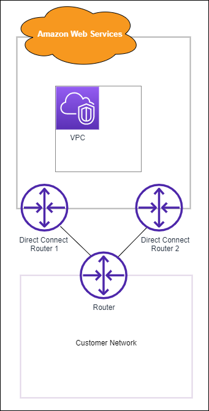

# Configure an Direct Connect Classic connection

Configure a Classic connection when you have existing Direct Connect connections.

## Step 1: Sign up for AWS

To use Direct Connect, you need an account if you don't already have one.

### Sign up for an AWS account

If you do not have an AWS account, complete the following steps to create one.

###### To sign up for an AWS account

1. Open [https://portal.aws.amazon.com/billing/signup](https://portal.aws.amazon.com/billing/signup "https://portal.aws.amazon.com/billing/signup").
2. Follow the online instructions.

Part of the sign-up procedure involves receiving a phone call or text message and entering
a verification code on the phone keypad.

When you sign up for an AWS account, an _AWS account root user_ is created. The root user has access to all AWS services
and resources in the account. As a security best practice, assign administrative access to a user, and use only the root user to perform [tasks that require root user access](../../../IAM/latest/UserGuide/id_root-user.md#root-user-tasks "../../../IAM/latest/UserGuide/id_root-user.md#root-user-tasks").

AWS sends you a confirmation email after the sign-up process is
complete. At any time, you can view your current account activity and manage your account by
going to [https://aws.amazon.com/](https://aws.amazon.com/ "https://aws.amazon.com/") and choosing **My
Account**.

### Create a user with administrative access

After you sign up for an AWS account, secure your AWS account root user, enable AWS IAM Identity Center, and create an administrative user so that you
don't use the root user for everyday tasks.

###### Secure your AWS account root user

1. Sign in to the [AWS Management Console](https://console.aws.amazon.com/ "https://console.aws.amazon.com/") as the account owner by choosing **Root user** and entering your AWS account email address. On the next page, enter your password.

For help signing in by using root user, see [Signing in as the root user](../../../signin/latest/userguide/console-sign-in-tutorials.md#introduction-to-root-user-sign-in-tutorial "../../../signin/latest/userguide/console-sign-in-tutorials.md#introduction-to-root-user-sign-in-tutorial") in the _AWS Sign-In User Guide_. 2. Turn on multi-factor authentication (MFA) for your root user.

For instructions, see [Enable a virtual MFA device for your AWS account root user (console)](../../../IAM/latest/UserGuide/enable-virt-mfa-for-root.md "../../../IAM/latest/UserGuide/enable-virt-mfa-for-root.md") in the _IAM User Guide_.

###### Create a user with administrative access

1. Enable IAM Identity Center.

For instructions, see [Enabling
AWS IAM Identity Center](../../../singlesignon/latest/userguide/get-set-up-for-idc.md "../../../singlesignon/latest/userguide/get-set-up-for-idc.md") in the
_AWS IAM Identity Center User Guide_. 2. In IAM Identity Center, grant administrative access to a user.

For a tutorial about using the IAM Identity Center directory as your identity source, see [Configure user access with the default IAM Identity Center directory](../../../singlesignon/latest/userguide/quick-start-default-idc.md "../../../singlesignon/latest/userguide/quick-start-default-idc.md") in the
_AWS IAM Identity Center User Guide_.

###### Sign in as the user with administrative access

- To sign in with your IAM Identity Center user, use the sign-in URL that was sent to your email address when you created the IAM Identity Center user.

For help signing in using an IAM Identity Center user, see [Signing in to the AWS access portal](../../../signin/latest/userguide/iam-id-center-sign-in-tutorial.md "../../../signin/latest/userguide/iam-id-center-sign-in-tutorial.md") in the _AWS Sign-In User Guide_.

###### Assign access to additional users

1. In IAM Identity Center, create a permission set that follows the best practice of applying least-privilege permissions.

For instructions, see [Create a permission set](../../../singlesignon/latest/userguide/get-started-create-a-permission-set.md "../../../singlesignon/latest/userguide/get-started-create-a-permission-set.md") in the _AWS IAM Identity Center User Guide_. 2. Assign users to a group, and then assign single sign-on access to the group.

For instructions, see [Add groups](../../../singlesignon/latest/userguide/addgroups.md "../../../singlesignon/latest/userguide/addgroups.md") in the _AWS IAM Identity Center User Guide_.

## Step 2: Request an Direct Connect dedicated connection

For dedicated connections, you can submit a connection request using the Direct Connect console. For hosted connections, work with an AWS Direct Connect Partner
to request a hosted connection. Ensure that you have the following information:

- The port speed that you require. You cannot change the port speed after you
  create the connection request.
- The Direct Connect location at which the connection is to be terminated.

###### Note

You cannot use the Direct Connect console to request a hosted connection. Instead,
contact an AWS Direct Connect Partner, who can create a hosted connection for you, which you then
accept. Skip the following procedure and go to [Accept your hosted connection](#get-started-accept-hosted-connection "#get-started-accept-hosted-connection").

###### To create a new Direct Connect connection

1.  Open the **Direct Connect** console at [https://console.aws.amazon.com/directconnect/v2/home](https://console.aws.amazon.com/directconnect/v2/home "https://console.aws.amazon.com/directconnect/v2/home").
2.  In the navigation pane choose **Connections**, and then choose **Create a connection**.
3.  Choose **Classic**.
4.  On the **Create Connection** pane, under
    **Connection settings,** do the following:
    1. For **Name**, enter a name for the
       connection.
    2. For **Location**, select the appropriate Direct Connect
       location.
    3. If applicable, for **Sub Location**, choose the floor
       closest to you or your network provider. This option is only available
       if the location has meet-me rooms (MMRs) in multiple floors of the
       building.
    4. For **Port Speed**, choose the connection
       bandwidth.
    5. For **On-premises**, select **Connect through
       an Direct Connect partner** when you use this
       connection to connect to your data center.
    6. For **Service provider**, select the AWS Direct Connect Partner. If
       you use a partner that is not in the list, select
       **Other**.
    7. If you selected **Other** for **Service
       provider**, for **Name of other
       provider**, enter the name of the partner that you use.
    8. (Optional) Add or remove a tag.

    [Add a tag] Choose **Add tag** and do the following:

        * For **Key**, enter the key name.
        * For **Value**, enter the key value.

    [Remove a tag] Next to the tag, choose **Remove tag**.

5.  Choose **Create Connection**.

It can take up to 72 business hours for AWS to review your request and provision a port for
your connection. During this time, you might receive an email with a request for more
information about your use case or the specified location. The email is sent to the
email address that you used when you signed up for AWS. You must respond within 7 days
or the connection is deleted.

For more information, see [Direct Connect dedicated and hosted connections](WorkingWithConnections.md "WorkingWithConnections.md").

### Accept your hosted connection

You must accept the hosted connection in the Direct Connect console before you can
create a virtual interface. This step only applies to hosted connections.

###### To accept a hosted virtual interface

1. Open the **Direct Connect** console at [https://console.aws.amazon.com/directconnect/v2/home](https://console.aws.amazon.com/directconnect/v2/home "https://console.aws.amazon.com/directconnect/v2/home").
2. In the navigation pane, choose **Connections**.
3. Select the hosted connection, and then choose
   **Accept**.

Choose **Accept**.

## (Dedicated connection) Step 3: Download the LOA-CFA

After you request a connection, we make a Letter of Authorization and Connecting
Facility Assignment (LOA-CFA) available to you to download, or emails you with a request
for more information. The LOA-CFA is the authorization to connect to AWS, and is
required by the colocation provider or your network provider to establish the
cross-network connection (cross-connect).

###### To download the LOA-CFA

1. Open the **Direct Connect** console at [https://console.aws.amazon.com/directconnect/v2/home](https://console.aws.amazon.com/directconnect/v2/home "https://console.aws.amazon.com/directconnect/v2/home").
2. In the navigation pane, choose **Connections**.
3. Select the connection and choose **View Details**.
4. Choose **Download LOA-CFA**.

The LOA-CFA is downloaded to your computer as a PDF file.

###### Note

If the link is not enabled, the LOA-CFA is not yet available for you
to download. Check your email for a request for more information. If it's
still unavailable, or you haven't received an email after 72 business hours, contact
[AWS
Support](https://aws.amazon.com/support/createCase "https://aws.amazon.com/support/createCase"). 5. After you download the LOA-CFA, do one of the following:

    * If you're working with an AWS Direct Connect Partner or network provider, send them
     the LOA-CFA so that they can order a cross-connect for you at the
     Direct Connect location. If they cannot order the cross-connect for you, you
     can [contact the colocation provider](Colocation.md "Colocation.md")
     directly.
    * If you have equipment at the Direct Connect location, contact the colocation
     provider to request a cross-network connection. You must be a customer
     of the colocation provider. You must also present them with the LOA-CFA
     that authorizes the connection to the AWS router, and the necessary
     information to connect to your network.

Direct Connect locations that are listed as multiple sites (for example, Equinix DC1-DC6
& DC10-DC11) are set up as a campus. If your or your network provider’s equipment is
located in any of these sites, you can request a cross-connect to your assigned port
even if it resides in a different campus building.

###### Important

A campus is treated as a single Direct Connect location. To achieve high
availability, configure connections to different Direct Connect
locations.

If you or your network provider experience issues establishing a physical connection,
see [Troubleshoot layer 1 (physical) issues](ts_layer_1.md "ts_layer_1.md").

## Step 4: Create a virtual interface

To begin using your Direct Connect connection, you must create a virtual interface. You can
create a private virtual interface to connect to your VPC. Or, you can create a public
virtual interface to connect to public AWS services that aren't in a VPC. When you
create a private virtual interface to a VPC, you need a private virtual interface for
each VPC to which to connect. For example, you need three private virtual interfaces to
connect to three VPCs.

Before you begin, ensure that you have the following information:

| Resource                                                           | Required information                                                                                                                                                                                                                                                                                                                                                                                                                                                                                                                                                                                                                                                                                                                                                                                                                                                                                                                                                                                                                                                                                                                                                                                                                                                                                                                                                                                                                                                                                                                                                                                                                                                                                                                                                                                                                                                                                                                                                                                                                                                                                                                                                                                                                                                                     |
| ------------------------------------------------------------------ | ---------------------------------------------------------------------------------------------------------------------------------------------------------------------------------------------------------------------------------------------------------------------------------------------------------------------------------------------------------------------------------------------------------------------------------------------------------------------------------------------------------------------------------------------------------------------------------------------------------------------------------------------------------------------------------------------------------------------------------------------------------------------------------------------------------------------------------------------------------------------------------------------------------------------------------------------------------------------------------------------------------------------------------------------------------------------------------------------------------------------------------------------------------------------------------------------------------------------------------------------------------------------------------------------------------------------------------------------------------------------------------------------------------------------------------------------------------------------------------------------------------------------------------------------------------------------------------------------------------------------------------------------------------------------------------------------------------------------------------------------------------------------------------------------------------------------------------------------------------------------------------------------------------------------------------------------------------------------------------------------------------------------------------------------------------------------------------------------------------------------------------------------------------------------------------------------------------------------------------------------------------------------------------------- |
| **Connection**                                                     | The Direct Connect connection or link aggregation group (LAG) for which you are creating the virtual interface.                                                                                                                                                                                                                                                                                                                                                                                                                                                                                                                                                                                                                                                                                                                                                                                                                                                                                                                                                                                                                                                                                                                                                                                                                                                                                                                                                                                                                                                                                                                                                                                                                                                                                                                                                                                                                                                                                                                                                                                                                                                                                                                                                                       |
| **Virtual interface name**                                         | A name for the virtual interface.                                                                                                                                                                                                                                                                                                                                                                                                                                                                                                                                                                                                                                                                                                                                                                                                                                                                                                                                                                                                                                                                                                                                                                                                                                                                                                                                                                                                                                                                                                                                                                                                                                                                                                                                                                                                                                                                                                                                                                                                                                                                                                                                                                                                                                                        |
| **Virtual interface owner**                                        | If you're creating the virtual interface for another account, you need the AWS account ID of the other account.                                                                                                                                                                                                                                                                                                                                                                                                                                                                                                                                                                                                                                                                                                                                                                                                                                                                                                                                                                                                                                                                                                                                                                                                                                                                                                                                                                                                                                                                                                                                                                                                                                                                                                                                                                                                                                                                                                                                                                                                                                                                                                                                                                       |
| (Private virtual interface only) **Connection**                    | For connecting to a VPC in the same AWS Region, you need the virtual private gateway for your VPC. The ASN for the Amazon side of the BGP session is inherited from the virtual private gateway. When you create a virtual private gateway, you can specify your own private ASN. Otherwise, Amazon provides a default ASN. For more information, see [Create a Virtual Private Gateway](../../../vpc/latest/userguide/SetUpVPNConnections.md#vpn-create-vpg "../../../vpc/latest/userguide/SetUpVPNConnections.md#vpn-create-vpg") in the _Amazon VPC User Guide_. For connecting to a VPC through a Direct Connect gateway, you need the Direct Connect gateway. For more information, see [Direct Connect Gateways](direct-connect-gateways.md "direct-connect-gateways.md").                                                                                                                                                                                                                                                                                                                                                                                                                                                                                                                                                                                                                                                                                                                                                                                                                                                                                                                                                                                                                                                                                                                                                                                                                                                                                                                                                                                                                                                                                    |
| **VLAN**                                                           | A unique virtual local area network (VLAN) tag that's not already in use on your connection. The value must be between 1 and 4094 and must comply with the Ethernet 802.1Q standard. This tag is required for any traffic traversing the Direct Connect connection. If you have a hosted connection, your AWS Direct Connect Partner provides this value. You can’t modify the value after you have created the virtual interface.                                                                                                                                                                                                                                                                                                                                                                                                                                                                                                                                                                                                                                                                                                                                                                                                                                                                                                                                                                                                                                                                                                                                                                                                                                                                                                                                                                                                                                                                                                                                                                                                                                                                                                                                                                                                                                           |
| **Peer IP addresses**                                              | A virtual interface can support a BGP peering session for IPv4, IPv6, or one of each (dual-stack). Do not use Elastic IPs (EIPs) or Bring your own IP addresses (BYOIP) from the Amazon Pool to create a public virtual interface. You cannot create multiple BGP sessions for the same IP addressing family on the same virtual interface. The IP address ranges are assigned to each end of the virtual interface for the BGP peering session. • IPv4: + (Public virtual interface only) You must specify unique public IPv4 addresses that you own. The value can be one of the following: • A customer-owned IPv4 CIDR These can be any public IPs (customer-owned or provided by AWS), but the same subnet mask must be used for both your peer IP and the AWS router peer IP. For example, if you allocate a `/31` range, such as `203.0.113.0/31`, you could use `203.0.113.0` for your peer IP and `203.0.113.1` for the AWS peer IP. Or, if you allocate a `/24` range, such as `198.51.100.0/24`, you could use `198.51.100.10` for your peer IP and `198.51.100.20` for the AWS peer IP. • An IP range owned by your AWS Direct Connect Partner or ISP, along with an LOA-CFA authorization • An AWS-provided /31 CIDR. Contact [AWS Support](https://aws.amazon.com/support/createCase "https://aws.amazon.com/support/createCase") to request a public IPv4 CIDR (and provide a use case in your request)NoteWe cannot guarantee that we will be able to fulfill all requests for AWS-provided public IPv4 addresses. + (Private virtual interface only) Amazon can generate private IPv4 addresses for you. If you specify your own, ensure that you specify private CIDRs for your router interface and the AWS Direct Connect interface only. For example, do not specify other IP addresses from your local network. Similar to a public virtual interface, the same subnet mask must be used for both your peer IP and the AWS router peer IP. For example, if you allocate a `/30` range, such as `192.168.0.0/30`, you could use `192.168.0.1` for your peer IP and `192.168.0.2` for the AWS peer IP. • IPv6: Amazon automatically allocates you a /125 IPv6 CIDR. You cannot specify your own peer IPv6 addresses. |
| **Address family**                                                 | Whether the BGP peering session will be over IPv4 or IPv6.                                                                                                                                                                                                                                                                                                                                                                                                                                                                                                                                                                                                                                                                                                                                                                                                                                                                                                                                                                                                                                                                                                                                                                                                                                                                                                                                                                                                                                                                                                                                                                                                                                                                                                                                                                                                                                                                                                                                                                                                                                                                                                                                                                                                                               |
| **BGP information**                                                | • A public or private Border Gateway Protocol (BGP) Autonomous System Number (ASN) for your side of the BGP session. If you are using a public ASN, you must own it. If you are using a private ASN, you can set a custom ASN value. For a 16-bit ASN, the value must be in the 64512 to 65534 range. For a 32-bit ASN, the value must be in the 1 to 4294967294 range. Autonomous System (AS) prepending does not work if you use a private ASN for a public virtual interface. • AWS enables MD5 by default. You cannot modify this option. • An MD5 BGP authentication key. You can provide your own, or you can let Amazon generate one for you.                                                                                                                                                                                                                                                                                                                                                                                                                                                                                                                                                                                                                                                                                                                                                                                                                                                                                                                                                                                                                                                                                                                                                                                                                                                                                                                                                                                                                                                                                                                                                                                                                               |
| (Public virtual interface only) **Prefixes you want to advertise** | Public IPv4 routes or IPv6 routes to advertise over BGP. You must advertise at least one prefix using BGP, up to a maximum of 1,000 prefixes. • IPv4: The IPv4 CIDR can overlap with another public IPv4 CIDR announced using Direct Connect when either of the following is true: + The CIDRs are from different AWS Regions. Make sure that you apply BGP community tags on the public prefixes. + You use AS_PATH when you have a public ASN in an active/passive configuration. For more information, see [Routing policies and BGP communities](routing-and-bgp.md "routing-and-bgp.md"). • Over a Direct Connect public virtual interface, you can specify any prefix length from /1 to /32 for IPv4 and from /1 to /64 for IPv6. • You may add additional prefixes to an existing public VIF and advertise those by contacting [AWS support](https://aws.amazon.com/support/createCase "https://aws.amazon.com/support/createCase"). In your support case, provide a list of additional CIDR prefixes you want to add to the public VIF and advertise.                                                                                                                                                                                                                                                                                                                                                                                                                                                                                                                                                                                                                                                                                                                                                                                                                                                                                                                                                                                                                                                                                                                                                                                                       |
| (Private and transit virtual interfaces only) **Jumbo frames**     | The maximum transmission unit (MTU) of packets over Direct Connect. The default is 1500. Setting the MTU of a virtual interface to 9001 (jumbo frames) can cause an update to the underlying physical connection if it wasn't updated to support jumbo frames. Updating the connection disrupts network connectivity for all virtual interfaces associated with the connection for up to 30 seconds. Jumbo frames apply only to propagated routes from Direct Connect. If you add static routes to a route table that point to your virtual private gateway, then traffic routed through the static routes is sent using 1500 MTU. To check whether a connection or virtual interface supports jumbo frames, select it in the Direct Connect console and find **Jumbo frame capable\* • on the virtual interface **General configuration\* • page.                                                                                                                                                                                                                                                                                                                                                                                                                                                                                                                                                                                                                                                                                                                                                                                                                                                                                                                                                                                                                                                                                                                                                                                                                                                                                                                                                                                                               |

We request additional information from you if your public prefixes or ASNs belong to
an ISP or network carrier. This can be a document using an official company letterhead
or an email from the company's domain name verifying that the network prefix/ASN may be
used by you.

For private virtual interface and public virtual interfaces, the maximum transmission
unit (MTU) of a network connection is the size, in bytes, of the largest permissible
packet that can be passed over the connection. The MTU of a private virtual interface
can be either 1500 or 9001 (jumbo frames). The MTU of a transit virtual interface can be
either 1500 or 8500 (jumbo frames). You can specify the MTU when you create the
interface or update it after you create it. Setting the MTU of a virtual interface to
8500 (jumbo frames) or 9001 (jumbo frames) can cause an update to the underlying
physical connection if it wasn't updated to support jumbo frames. Updating the
connection disrupts network connectivity for all virtual interfaces associated with the
connection for up to 30 seconds. To check whether a connection or virtual interface
supports jumbo frames, select it in the Direct Connect console and find **Jumbo Frame
Capable** on the **Summary** tab.

When you create a public virtual interface, it can take up to 72 business hours for AWS to
review and approve your request.

###### To provision a public virtual interface to non-VPC services

1.  Open the **Direct Connect** console at [https://console.aws.amazon.com/directconnect/v2/home](https://console.aws.amazon.com/directconnect/v2/home "https://console.aws.amazon.com/directconnect/v2/home").
2.  In the navigation pane, choose **Virtual Interfaces**.
3.  Choose **Create virtual interface**.
4.  Under **Virtual interface type**, for
    **Type**, choose **Public**.
5.  Under **Public virtual interface settings**, do the
    following:
    1. For **Virtual interface name**, enter a name for the
       virtual interface.
    2. For **Connection**, choose the Direct Connect
       connection that you want to use for this interface.
    3. For **VLAN**, enter the ID number for your virtual
       local area network (VLAN).
    4. For **BGP ASN**, enter the The Border Gateway
       Protocol Autonomous System Number of your on-premises peer router for
       the new virtual interface. The valid values are 1 to 4294967294. This includes support for both ASNs (1-2147483647) and long ASNs (1-4294967294). For more information about ASNs and long ASNs see [Long ASN support in Direct Connect](long-asn-support.md "long-asn-support.md").

6.  Under **Additional settings**, do the following:
    1. To configure an IPv4 BGP or an IPv6 peer, do the following:

    [IPv4] To configure an IPv4 BGP peer, choose **IPv4**
    and do one of the following:

        * To specify these IP addresses yourself, for **Your
         router peer ip**, enter the destination IPv4 CIDR
         address to which Amazon should send traffic.
        * For **Amazon router peer IP**, enter the IPv4
         CIDR address to use to send traffic to AWS.

    [IPv6] To configure an IPv6 BGP peer, choose
    **IPv6**. The peer IPv6 addresses are automatically
    assigned from Amazon's pool of IPv6 addresses. You cannot specify
    custom IPv6 addresses. 2. To provide your own BGP key, enter your BGP MD5 key.

    If you do not enter a value, we generate a BGP key. 3. To advertise prefixes to Amazon, for **Prefixes you want to
    advertise**, enter the IPv4 CIDR destination addresses
    (separated by commas) to which traffic should be routed over the virtual
    interface. 4. (Optional) Add or remove a tag.

    [Add a tag] Choose **Add tag** and do the
    following:

        * For **Key**, enter the key name.
        * For **Value**, enter the key value.

    [Remove a tag] Next to the tag, choose **Remove
    tag**.

7.  Choose **Create virtual interface**.

###### To provision a private virtual interface to a VPC

1.  Open the **Direct Connect** console at [https://console.aws.amazon.com/directconnect/v2/home](https://console.aws.amazon.com/directconnect/v2/home "https://console.aws.amazon.com/directconnect/v2/home").
2.  In the navigation pane, choose **Virtual Interfaces**.
3.  Choose **Create virtual interface**.
4.  Under **Virtual interface type**, for **Type**, choose **Private**.
5.  Under **Private virtual interface settings**, do the following:
    1. For **Virtual interface name**, enter a name for the virtual interface.
    2. For **Connection**, choose the Direct Connect connection that you want to use for this interface.
    3. For **Gateway type**, choose **Virtual private gateway**, or **Direct Connect gateway**.
    4. For **Virtual interface owner**, choose **Another AWS account**, and then enter the AWS account.
    5. For **Virtual private gateway**, choose the virtual private gateway to use for this interface.
    6. For **VLAN**, enter the ID number for your virtual
       local area network (VLAN).
    7. For **BGP ASN**, enter the Border Gateway Protocol Autonomous System Number of your on-premises peer router for the new virtual interface.

    The valid values are 1 to 4294967294. This includes support for both ASNs (1-2147483647) and long ASNs (1-4294967294). For more information about ASNs and long ASNs see [Long ASN support in Direct Connect](long-asn-support.md "long-asn-support.md").

6.  Under **Additional Settings**, do the following:
    1. To configure an IPv4 BGP or an IPv6 peer, do the following:

    [IPv4] To configure an IPv4 BGP peer, choose **IPv4** and do one of
    the following:

        * To specify these IP addresses yourself, for **Your router peer ip**,
         enter the destination IPv4 CIDR address to which Amazon
         should send traffic.
        * For **Amazon router peer ip**, enter
         the IPv4 CIDR address to use to send traffic to
         AWS.

        ###### Important

        When configuring AWS Direct Connect virtual interfaces, you can specify your own IP addresses using RFC 1918, use other addressing schemes, or opt for AWS assigned IPv4 /29 CIDR addresses allocated from the RFC 3927 169.254.0.0/16 IPv4 Link-Local range for point-to-point connectivity. These point-to-point connections should be used exclusively for eBGP peering between your customer gateway router and the Direct Connect endpoint. For VPC traffic or tunnelling purposes, such as AWS Site-to-Site Private IP VPN, or Transit Gateway Connect, AWS recommends using a loopback or LAN interface on your customer gateway router as the source or destination address instead of the point-to-point connections.

        	+ For more information about RFC 1918, see
        	 [Address Allocation for Private
        	 Internets](https://datatracker.ietf.org/doc/html/rfc1918 "https://datatracker.ietf.org/doc/html/rfc1918").
        	+ For more information about RFC 3927, see
        	 [Dynamic Configuration of IPv4 Link-Local
        	 Addresses](https://datatracker.ietf.org/doc/html/rfc3927 "https://datatracker.ietf.org/doc/html/rfc3927").

    [IPv6] To configure an IPv6 BGP peer, choose **IPv6**. The peer IPv6 addresses are automatically
    assigned from Amazon's pool of IPv6 addresses. You cannot specify custom IPv6 addresses. 2. To change the maximum transmission unit (MTU) from 1500 (default) to 9001 (jumbo frames), select
    **Jumbo MTU (MTU size 9001)**. 3. (Optional) Under **Enable SiteLink**, choose **Enabled** to enable direct connectivity between Direct Connect points of presence. 4. (Optional) Add or remove a tag.

    [Add a tag] Choose **Add tag** and do the following:

        * For **Key**, enter the key name.
        * For **Value**, enter the key value.

    [Remove a tag] Next to the tag, choose **Remove tag**.

7.  Choose **Create virtual interface**.
8.  You need to use your BGP device to advertise the network that you use for the public VIF
    connection.

## Step 5: Download the router configuration

After you have created a virtual interface for your Direct Connect connection, you can
download the router configuration file. The file contains the necessary commands to
configure your router for use with your private or public virtual interface.

###### To download a router configuration

1. Open the **Direct Connect** console at [https://console.aws.amazon.com/directconnect/v2/home](https://console.aws.amazon.com/directconnect/v2/home "https://console.aws.amazon.com/directconnect/v2/home").
2. In the navigation pane, choose **Virtual Interfaces**.
3. Select the connection and choose **View Details**.
4. Choose **Download router configuration**.
5. For **Download router configuration**, do the following:
   1. For **Vendor**, select the manufacturer of your router.
   2. For **Platform**, select the model of your router.
   3. For **Software**, select the software version for your router.

6. Choose **Download**, and then use the appropriate
   configuration for your router to ensure that you can connect to Direct Connect.

For more information about manually configuring your router, see [Download the router configuration file](vif-router-config.md "vif-router-config.md").

After you configure your router, the status of the virtual interface goes to
`UP`. If the virtual interface remains down and you cannot ping
the Direct Connect device's peer IP address, see [Troubleshoot layer 2 (data link) issues](ts-layer-2.md "ts-layer-2.md"). If you can ping the peer IP address, see [Troubleshoot layer 3/4 (Network/Transport) issues](ts-layer-3.md "ts-layer-3.md"). If the BGP peering session
is established but you cannot route traffic, see [Troubleshoot routing issues](ts-routing.md "ts-routing.md").

## Step 6: Verify your virtual interface

After you have established virtual interfaces to the AWS Cloud or to Amazon VPC, you
can verify your AWS Direct Connect connection using the following procedures.

###### To verify your virtual interface connection to the AWS Cloud

- Run `traceroute` and verify that the Direct Connect identifier is in
  the network trace.

###### To verify your virtual int+erface connection to Amazon VPC

1. Using a pingable AMI, such as an Amazon Linux AMI, launch an EC2 instance into the
   VPC that is attached to your virtual private gateway. The Amazon Linux AMIs are
   available in the **Quick Start** tab when you use the
   instance launch wizard in the Amazon EC2 console. For more information, see
   [Launch an
   Instance](../../../AWSEC2/latest/UserGuide/ec2-launch-instance_linux.md "../../../AWSEC2/latest/UserGuide/ec2-launch-instance_linux.md") in the _Amazon EC2 User Guide._ Ensure
   that the security group that's associated with the instance includes a rule
   permitting inbound ICMP traffic (for the ping request).
2. After the instance is running, get its private IPv4 address (for example,
   10.0.0.4). The Amazon EC2 console displays the address as part of the instance
   details.
3. Ping the private IPv4 address and get a response.

## (Recommended) Step 7: Configure redundant connections

To provide for failover, we recommend that you request and configure two dedicated
connections to AWS, as shown in the following figure. These connections can terminate on
one or two routers in your network.

There are different configuration choices available when you provision two
dedicated connections:

- Active/Active (BGP multipath). This is the default configuration, where
  both connections are active. Direct Connect supports multipathing to multiple
  virtual interfaces within the same location, and traffic is load-shared
  between interfaces based on flow. If one connection becomes unavailable, all
  traffic is routed through the other connection.
- Active/Passive (failover). One connection is handling traffic, and the
  other is on standby. If the active connection becomes unavailable, all traffic
  is routed through the passive connection. You need to prepend the AS path to the
  routes on one of your links for that to be the passive link.

How you configure the connections doesn't affect redundancy, but it does affect
the policies that determine how your data is routed over both connections. We recommend
that you configure both connections as active.

If you use a VPN connection for redundancy, ensure that you implement a health check
and failover mechanism. If you use either of the following configurations, then you need
to check your [route table routing](../../../vpc/latest/userguide/SetUpVPNConnections.md#vpn-configure-routing "../../../vpc/latest/userguide/SetUpVPNConnections.md#vpn-configure-routing") to route to the new network interface.

- You use your own instances for routing, for example the instance is the
  firewall.
- You use your own instance that terminates a VPN connection.

To achieve high availability, we strongly recommend that you configure connections to
different Direct Connect locations.

For more information about Direct Connect resiliency, see [Direct Connect Resiliency Recommendations](https://aws.amazon.com/directconnect/resiliency-recommendation/ "https://aws.amazon.com/directconnect/resiliency-recommendation/").
