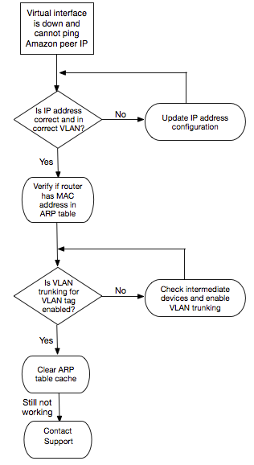

# Troubleshoot layer 2 (data link) issues

If your AWS Direct Connect physical connection is up but your virtual interface is down, use the
following steps to troubleshoot the issue.

1. If you cannot ping the Amazon peer IP address, verify that your peer IP
   address is configured correctly and in the correct VLAN. Ensure that the IP
   address is configured in the VLAN subinterface and not the physical interface
   (for example, GigabitEthernet0/0.123 instead of GigabitEthernet0/0).
2. Verify if the router has a MAC address entry from the AWS endpoint in your
   address resolution protocol (ARP) table.
3. Ensure that any intermediate devices between endpoints have VLAN trunking
   enabled for your 802.1Q VLAN tag. ARP cannot be established on the AWS side
   until AWS receives tagged traffic.
4. Clear your or your provider's ARP table cache.
5. If the above steps do not establish ARP or you still cannot ping the Amazon
   peer IP, [contact AWS Support](https://aws.amazon.com/support/createCase "https://aws.amazon.com/support/createCase").
   The following flow chart contains the steps to diagnose issues with the data
   link.

If the BGP session is still not established after verifying these steps, see [Troubleshoot layer 3/4 (Network/Transport) issues](ts-layer-3.md "ts-layer-3.md"). If the BGP session is established
but you are experiencing routing issues, see [Troubleshoot routing issues](ts-routing.md "ts-routing.md").
