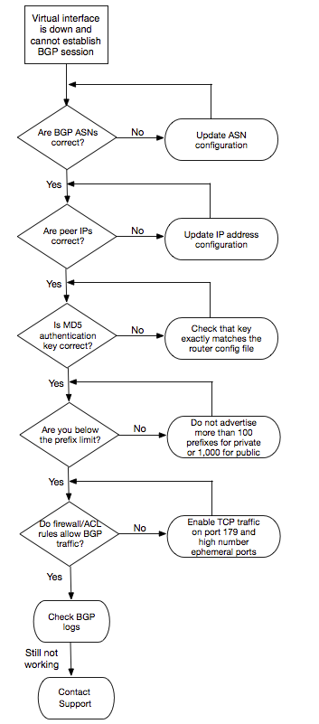

# Troubleshoot layer 3/4 (Network/Transport) issues

Consider a situation where your Direct Connect physical connection is up and you can ping
the Amazon peer IP address. If your virtual interface is up and the BGP peering session
cannot be established, use the following steps to troubleshoot the issue:

1. Ensure that your BGP local Autonomous System Number (ASN) and Amazon's ASN are
   configured correctly.
2. Ensure that the peer IPs for both sides of the BGP peering session are
   configured correctly.
3. Ensure that your MD5 authentication key is configured and exactly matches the
   key in the downloaded router configuration file. Check that there are no extra
   spaces or characters.
4. Verify that you or your provider are not advertising more than 100 prefixes
   for private virtual interfaces or 1,000 prefixes for public virtual interfaces.
   These are hard limits and cannot be exceeded.
5. Ensure that there are no firewall or ACL rules that are blocking TCP port 179
   or any high-numbered ephemeral TCP ports. These ports are necessary for BGP to
   establish a TCP connection between the peers.
6. Check your BGP logs for any errors or warning messages.
7. If the above steps do not establish the BGP peering session, [contact AWS Support](https://aws.amazon.com/support/createCase "https://aws.amazon.com/support/createCase").
   The following flow chart contains the steps to diagnose issues with the BGP peering
   session.

If the BGP peering session is established but you are experiencing routing issues, see
[Troubleshoot routing issues](ts-routing.md "ts-routing.md").
