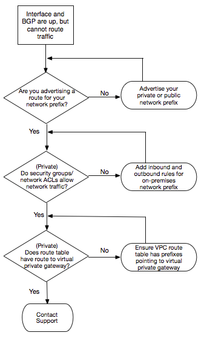

# Troubleshoot routing issues

Consider a situation where your virtual interface is up and you've established a BGP
peering session. If you cannot route traffic over the virtual interface, use the
following steps to troubleshoot the issue:

1. Ensure that you are advertising a route for your on-premises network prefix
   over the BGP session. For a private virtual interface, this can be a private or
   public network prefix. For a public virtual interface, this must be your
   publicly routable network prefix.
2. For a private virtual interface, ensure that your VPC security groups and
   network ACLs allow inbound and outbound traffic for your on-premises network
   prefix. For more information, see [Security Groups](../../../vpc/latest/userguide/VPC_SecurityGroups.md "../../../vpc/latest/userguide/VPC_SecurityGroups.md") and
   [Network ACLs](../../../vpc/latest/userguide/VPC_ACLs.md "../../../vpc/latest/userguide/VPC_ACLs.md") in the
   _Amazon VPC User Guide_.
3. For a private virtual interface, ensure that your VPC route tables have
   prefixes pointing to the virtual private gateway to which your private virtual
   interface is connected. For example, if you prefer to have all your traffic
   routed towards your on-premises network by default, you can add the default
   route (0.0.0.0/0 or ::/0) with the virtual private gateway as the target in your
   VPC route tables.
   - Alternatively, enable route propagation to automatically update routes
     in your route tables based on your dynamic BGP route advertisement. You
     can have up to 100 propagated routes per route table. This limit cannot
     be increased. For more information, see [Enabling and Disabling Route Propagation](../../../vpc/latest/userguide/VPC_Route_Tables.md#EnableDisableRouteProp "../../../vpc/latest/userguide/VPC_Route_Tables.md#EnableDisableRouteProp") in the
     _Amazon VPC User Guide_.

4. If the above steps do not resolve your routing issues, [contact AWS Support](https://aws.amazon.com/support/createCase "https://aws.amazon.com/support/createCase").
   The following flow chart contains the steps to diagnose routing issues.

