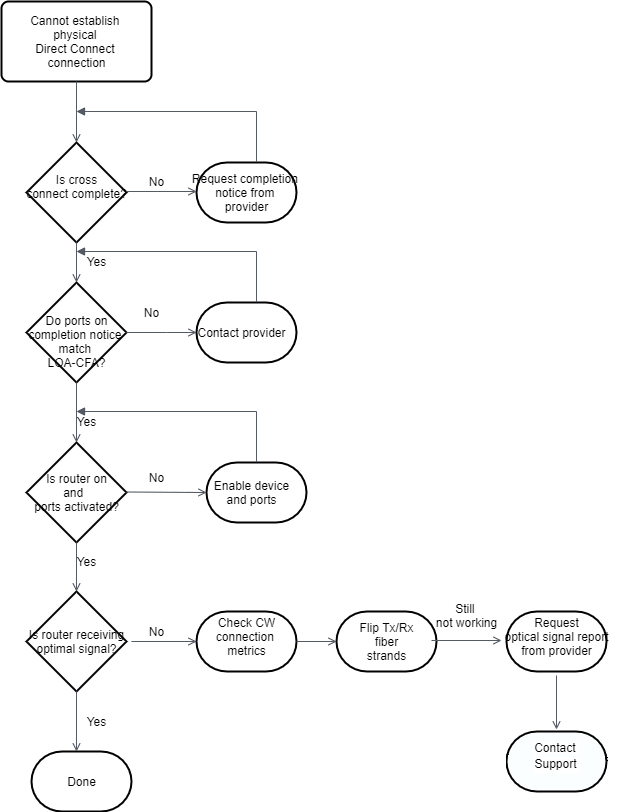

# Troubleshoot layer 1 (physical) issues

If you or your network provider are having difficulty establishing physical
connectivity to an Direct Connect device, use the following steps to troubleshoot the
issue.

1. Verify with the colocation provider that the cross connect is complete. Ask
   them or your network provider to provide you with a cross connect completion
   notice and compare the ports with those listed on your LOA-CFA.
2. Verify that your router or your provider's router is powered on and that the
   ports are activated.
3. Ensure that the routers are using the correct optical transceiver.
   Auto-negotiation for the port must be disabled if you have a connection with a
   port speed more than 1 Gbps. However, depending on the AWS Direct Connect
   endpoint serving your connection, auto-negotiation might need to be enabled or
   disabled for 1 Gbps connections. If auto-negotation needs to be disabled for
   your connections, port speed and full-duplex mode must be configured manually.
   If your virtual interface remains down, see [Troubleshoot layer 2 (data link) issues](ts-layer-2.md "ts-layer-2.md"). Depending on the Direct Connect endpoint
   serving your connection terminates, auto-negotiation might need to be enabled or
   disabled accordingly.
4. Verify that the router is receiving an acceptable optical signal over the
   cross connect.
5. Try flipping (also known as rolling) the Tx/Rx fiber strands.
6. Check the Amazon CloudWatch metrics for Direct Connect. You can verify the Direct Connect device's
   Tx/Rx optical readings (both 1 Gbps and 10 Gbps), physical error count, and
   operational status. For more information, see [Monitoring with Amazon
   CloudWatch](monitoring-cloudwatch.md "monitoring-cloudwatch.md").
7. Contact the colocation provider and request a written report for the Tx/Rx
   optical signal across the cross connect.
8. If the above steps do not resolve physical connectivity issues, [contact AWS Support](https://aws.amazon.com/support/createCase "https://aws.amazon.com/support/createCase") and
   provide the cross connect completion notice and optical signal report from the
   colocation provider.
   The following flow chart contains the steps to diagnose issues with the physical
   connection.

