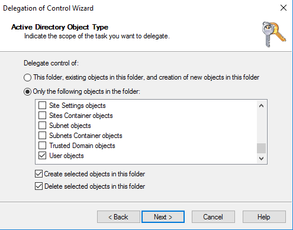
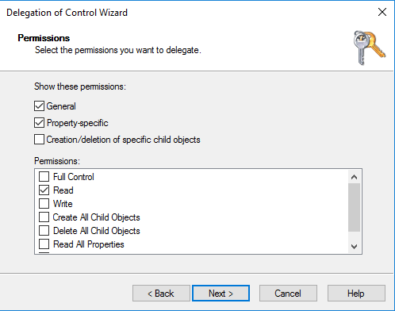

# Getting started with AD Connector

With AD Connector you can connect Directory Service to your existing enterprise Active Directory. When connected
to your existing directory, all of your directory data remains on your domain controllers.
Directory Service does not replicate any of your directory data.

###### Topics

- [AD Connector prerequisites](#prereq_connector "#prereq_connector")
- [Create an AD Connector](#create_ad_connector "#create_ad_connector")
- [What gets created with your
  AD Connector](create_details_ad_connector.md "create_details_ad_connector.md")

## AD Connector prerequisites

To connect to your existing directory with AD Connector, you need the
following:

**Amazon VPC**

Set up a VPC with the following:

- At least two subnets. Each of the subnets must be in a different
  Availability Zone and must be of same network type.

You can use IPv6 for your VPC. For more information, see [IPv6 support
for your VPC](../../../vpc/latest/userguide/vpc-migrate-ipv6.md "../../../vpc/latest/userguide/vpc-migrate-ipv6.md") in the _Amazon Virtual Private Cloud User
Guide_.

- The VPC must be connected to your existing network through a
  virtual private network (VPN) connection or Direct Connect.
- The VPC must have default hardware tenancy.

Directory Service uses a two VPC structure. The EC2 instances which make up your directory run outside
of your AWS account, and are managed by AWS. They have two network adapters,
`ETH0` and `ETH1`. `ETH0` is the management adapter, and
exists outside of your account. `ETH1` is created within your account.

The management IP range of your directory's `ETH0` network is chosen
programmatically to ensure it does not conflict with the VPC where your directory is deployed.
This IP range can be in either of the following pairs (as Directories run in two
subnets):

- 10.0.1.0/24 & 10.0.2.0/24
- 169.254.0.0/16
- 192.168.1.0/24 & 192.168.2.0/24

We avoid conflicts by checking the first octet of the `ETH1` CIDR. If it starts
with a 10, then we choose a 192.168.0.0/16 VPC with 192.168.1.0/24 and 192.168.2.0/24 subnets.
If the first octet is anything else other than a 10 we choose a 10.0.0.0/16 VPC with
10.0.1.0/24 and 10.0.2.0/24 subnets.

The selection algorithm does not include routes on your VPC. It is therefore possible to
have an IP routing conflict result from this scenario.

For more information, see the following topics in the
_Amazon VPC User Guide_:

- [What is
  Amazon VPC?](../../../vpc/latest/userguide/VPC_Introduction.md "../../../vpc/latest/userguide/VPC_Introduction.md")
- [Subnets in
  your VPC](../../../vpc/latest/userguide/VPC_Subnets.md#VPCSubnet "../../../vpc/latest/userguide/VPC_Subnets.md#VPCSubnet")
- [Adding a Hardware Virtual
  Private Gateway to Your VPC](../../../vpc/latest/userguide/VPC_VPN.md "../../../vpc/latest/userguide/VPC_VPN.md")

For more information about AWS Direct Connect, see the [AWS Direct Connect User
Guide](../../../directconnect/latest/UserGuide.md "../../../directconnect/latest/UserGuide.md").

**Existing Active Directory**

You will need to connect to an existing network with an Active Directory
domain.

###### Note

AD Connector does not support [Single Label Domains](https://support.microsoft.com/en-us/help/2269810/microsoft-support-for-single-label-domains "https://support.microsoft.com/en-us/help/2269810/microsoft-support-for-single-label-domains").

The functional level of this Active Directory domain must be `Windows Server
 2003` or higher. AD Connector also supports connecting to a
domain hosted on an Amazon EC2 instance.

###### Note

AD Connector does not support Read-only domain controllers (RODC)
when used in combination with the Amazon EC2 domain-join feature.

**Service account**

You must have credentials for a service account in the existing directory
which has been delegated the following privileges:

- Read users and groups - Required
- Join computers to the domain - Required only when using Seamless
  Domain Join and WorkSpaces
- Create computer objects - Required only when using Seamless Domain
  Join and WorkSpaces
- The service account password should be compliant with AWS
  password requirements. AWS passwords should be:
  - Between 8 and 128 characters in length, inclusive.
  - Contain at least one character from three of the following
    four categories:
    - Lowercase letters (a-z)
    - Uppercase letters (A-Z)
    - Numbers (0-9)
    - Non-alphanumeric characters
      (~!@#$%^&\*\_-+=`|\(){}[]:;"'<>,.?/)

For more information, see [Delegate privileges to your service
account](#connect_delegate_privileges "#connect_delegate_privileges").

###### Note

AD Connector uses Kerberos for authentication and authorization of
AWS applications. LDAP is only used for user and group object lookups
(read operations). With the LDAP transactions, nothing is mutable and
credentials are not passed in clear text. Authentication is handled by
an AWS internal service, which uses Kerberos tickets to perform LDAP
operations as a user.

**User permissions**

All Active Directory users must have permissions to read their own
attributes. Specifically the following attributes:

- GivenName
- SurName
- Mail
- SamAccountName
- UserPrincipalName
- UserAccountControl
- MemberOf

By default, Active Directory users do have read permission to these
attributes. However, Administrators can alter these permissions over time so
you might want to verify your users have these read permissions prior to
setting up AD Connector for the first time.

**IP addresses**

Get the IP addresses of two DNS servers or domain controllers in your
existing directory.

AD Connector obtains the `_ldap._tcp.`<DnsDomainName>``
 and `_kerberos._tcp.`<DnsDomainName>``
SRV records from these servers when connecting to your directory, so these
servers must contain these SRV records. The AD Connector attempts to find
a common domain controller that will provide both LDAP and Kerberos
services, so these SRV records must include at least one common domain
controller. For more information about SRV records, go to [SRV
Resource Records](http://technet.microsoft.com/en-us/library/cc961719.aspx "http://technet.microsoft.com/en-us/library/cc961719.aspx") on Microsoft TechNet.

**Ports for subnets**

For AD Connector to redirect directory requests to your existing Active Directory
domain controllers, the firewall for your existing network must have the
following ports open to the CIDRs for both subnets in your Amazon VPC.

- TCP/UDP 53 - DNS
- TCP/UDP 88 - Kerberos authentication
- TCP/UDP 389 - LDAP

These are the minimum ports that are needed before AD Connector can
connect to your directory. Your specific configuration may require
additional ports be open.

If you want to use AD Connector and Amazon WorkSpaces, the DisableVLVSupportLDAP
attribute needs to be set to 0 for your domain controllers. This is the
default setting for the domain controllers. AD Connector will be unable to
query users in the directory if the DisableVLVSupportLDAP attribute is
enabled. This prevents AD Connector from working with
Amazon WorkSpaces.

###### Note

If the DNS servers or Domain Controller servers for your existing Active Directory
Domain are within the VPC, the security groups associated with those
servers must have the above ports open to the CIDRs for both subnets in
the VPC.

For additional port requirements, see [AD and AD DS Port Requirements](<https://docs.microsoft.com/en-us/previous-versions/windows/it-pro/windows-server-2008-R2-and-2008/dd772723(v=ws.10)> "https://docs.microsoft.com/en-us/previous-versions/windows/it-pro/windows-server-2008-R2-and-2008/dd772723(v=ws.10)") on Microsoft
documentation.

**Kerberos preauthentication**

Your user accounts must have Kerberos preauthentication enabled. For
detailed instructions on how to enable this setting, see [Ensure that Kerberos
pre-authentication is enabled](ms_ad_tutorial_setup_trust_prepare_onprem.md#tutorial_setup_trust_enable_kerberos "ms_ad_tutorial_setup_trust_prepare_onprem.md#tutorial_setup_trust_enable_kerberos"). For general
information about this setting, go to [Preauthentication](http://technet.microsoft.com/en-us/library/cc961961.aspx "http://technet.microsoft.com/en-us/library/cc961961.aspx") on Microsoft TechNet.

**Encryption types**

AD Connector supports the following encryption types when authenticating
via Kerberos to your Active Directory domain controllers:

- AES-256-HMAC
- AES-128-HMAC
- RC4-HMAC

### AWS IAM Identity Center prerequisites

If you plan to use IAM Identity Center with AD Connector, you need to ensure that the
following are true:

- Your AD Connector is set up in your AWS organization's
  management account.
- Your instance of IAM Identity Center is in the same Region where your
  AD Connector is set up.

For more information, see [IAM Identity Center
prerequisites](../../../singlesignon/latest/userguide/prereqs.md "../../../singlesignon/latest/userguide/prereqs.md") in the AWS IAM Identity Center User Guide.

### Multi-factor authentication prerequisites

To support multi-factor authentication with your AD Connector directory, you
need the following:

- A [Remote Authentication
  Dial-In User Service](https://en.wikipedia.org/wiki/RADIUS "https://en.wikipedia.org/wiki/RADIUS") (RADIUS) server in your existing network
  that has two client endpoints. The RADIUS client endpoints have the
  following requirements:
  - To create the endpoints, you need the IP addresses of the Directory Service
    servers. These IP addresses can be obtained from the
    **Directory IP Address** field of your
    directory details.
  - Both RADIUS endpoints must use the same shared secret code.

- Your existing network must allow inbound traffic over the default RADIUS
  server port (1812) from the Directory Service servers.
- The usernames between your RADIUS server and your existing directory must
  be identical.

For more information about using AD Connector with MFA, see [Enabling multi-factor authentication for AD Connector](ad_connector_mfa.md "ad_connector_mfa.md").

### Delegate privileges to your service

account

To connect to your existing directory, you must have the credentials for your
AD Connector service account in the existing directory that has been delegated
certain privileges. While members of the **Domain Admins** group
have sufficient privileges to connect to the directory, as a best practice, you
should use a service account that only has the minimum privileges necessary to
connect to the directory. The following procedure demonstrates how to create a new
group called `Connectors`, delegate the necessary
privileges that are needed to connect Directory Service to this group, and then add a new
service account to this group.

This procedure must be performed on a machine that is joined to your directory and
has the **Active Directory User and Computers** MMC snap-in
installed. You must also be logged in as a domain administrator.

###### To delegate privileges to your service account

1. Open **Active Directory User and Computers** and select
   your domain root in the navigation tree.
2. In the list in the left-hand pane, right-click **Users**,
   select **New**, and then select **Group**.
3. In the **New Object - Group** dialog box, enter the
   following and click **OK**.

| Field           | Value/Selection |
| --------------- | --------------- |
| **Group name**  | `Connectors`    |
| **Group scope** | **Global**      |
| **Group type**  | **Security**    |

4. In the **Active Directory User and Computers** navigation
   tree, select identify the Organizational Unit (OU) where the computer
   accounts will be created. In the menu, select **Action**,
   and then **Delegate Control**. You may select a parent OU
   up to the domain as permissions propagate to the child OUs. If your
   AD Connector is connected to AWS Managed Microsoft AD, you will not have access to
   delegate control at the domain root level. In this case, to delegate
   control, select the OU under your directory OU where your computer objects
   will be created.
5. On the **Delegation of Control Wizard** page, click
   **Next**, then click
   **Add**.
6. In the **Select Users, Computers, or Groups** dialog box,
   enter `Connectors` and click
   **OK**. If more than one object is found, select the
   `Connectors` group created above. Click
   **Next**.
7. On the **Tasks to Delegate** page, select
   **Create a custom task to delegate**, and then choose
   **Next**.
8. Select **Only the following objects in the folder**, and
   then select **Computer objects** and **User
   objects**.
9. Select **Create selected objects in this folder** and
   **Delete selected objects in this folder**. Then choose
   **Next**.

 10. Select **Read**, and then choose
**Next**.

###### Note

If you will be using Seamless Domain Join or WorkSpaces, you must also
enable **Write** permissions so that the Active
Directory can create computer objects.

 11. Verify the information on the **Completing the Delegation of
Control Wizard** page, and click **Finish**. 12. Create a user account with a strong password and add that user to the
`Connectors` group. This user will be
known as your AD Connector service account and since it is now a member of
the `Connectors` group it now has sufficient
privileges to connect Directory Service to the directory.

### Test your AD Connector

For AD Connector to connect to your existing directory, the firewall for your
existing network must have certain ports open to the CIDRs for both subnets in the
VPC. To test if these conditions are met, perform the following steps:

###### To test the connection

1. Launch a Windows instance in the VPC and connect to it over RDP. The
   instance must be a member of your existing domain. The remaining steps are
   performed on this VPC instance.
2. Download and unzip the [DirectoryServicePortTest](samples/DirectoryServicePortTest.md "samples/DirectoryServicePortTest.md") test application. The source code and
   Visual Studio project files are included so you can modify the test
   application if desired.

###### Note

This script is not supported on Windows Server 2003 or older operating
systems. 3. From a Windows command prompt, run the
**DirectoryServicePortTest** test application with the
following options:

###### Note

The DirectoryServicePortTest test application can only be used when
the domain and forest functional levels are set to Windows Server 2012
R2 and below.

```
DirectoryServicePortTest.exe -d `<domain_name>` -ip `<server_IP_address>` -tcp "53,88,389" -udp "53,88,389"
```

`<domain_name>`

The fully qualified domain name. This is used to test the
forest and domain functional levels. If you exclude the domain
name, the functional levels won't be tested.

`<server_IP_address>`

The IP address of a domain controller in your existing domain.
The ports will be tested against this IP address. If you exclude
the IP address, the ports won't be tested.

This test app determines if the necessary ports are open from the VPC to
your domain, and also verifies the minimum forest and domain functional
levels.

The output will be similar to the following:

```
Testing forest functional level.
Forest Functional Level = Windows2008R2Forest : PASSED

Testing domain functional level.
Domain Functional Level = Windows2008R2Domain : PASSED

Testing required TCP ports to `<server_IP_address>`:
Checking TCP port 53: PASSED
Checking TCP port 88: PASSED
Checking TCP port 389: PASSED

Testing required UDP ports to `<server_IP_address>`:
Checking UDP port 53: PASSED
Checking UDP port 88: PASSED
Checking UDP port 389: PASSED
```

The following is the source code for the
**DirectoryServicePortTest** application.

```
using System;
using System.Collections.Generic;
using System.IO;
using System.Linq;
using System.Net;
using System.Net.Sockets;
using System.Text;
using System.Threading.Tasks;
using System.DirectoryServices.ActiveDirectory;
using System.Threading;
using System.DirectoryServices.AccountManagement;
using System.DirectoryServices;
using System.Security.Authentication;
using System.Security.AccessControl;
using System.Security.Principal;

namespace DirectoryServicePortTest
{
    class Program
    {
        private static List<int> _tcpPorts;
        private static List<int> _udpPorts;

        private static string _domain = "";
        private static IPAddress _ipAddr = null;

        static void Main(string[] args)
        {
            if (ParseArgs(args))
            {
                try
                {
                    if (_domain.Length > 0)
                    {
                        try
                        {
                            TestForestFunctionalLevel();

                            TestDomainFunctionalLevel();
                        }
                        catch (ActiveDirectoryObjectNotFoundException)
                        {
                            Console.WriteLine("The domain {0} could not be found.\n", _domain);
                        }
                    }

                    if (null != _ipAddr)
                    {
                        if (_tcpPorts.Count > 0)
                        {
                            TestTcpPorts(_tcpPorts);
                        }

                        if (_udpPorts.Count > 0)
                        {
                            TestUdpPorts(_udpPorts);
                        }
                    }
                }
                catch (AuthenticationException ex)
                {
                    Console.WriteLine(ex.Message);
                }
            }
            else
            {
                PrintUsage();
            }

            Console.Write("Press <enter> to continue.");
            Console.ReadLine();
        }

        static void PrintUsage()
        {
            string currentApp = Path.GetFileName(System.Reflection.Assembly.GetExecutingAssembly().Location);
            Console.WriteLine("Usage: {0} \n-d <domain> \n-ip \"<server IP address>\" \n[-tcp \"<tcp_port1>,<tcp_port2>,etc\"] \n[-udp \"<udp_port1>,<udp_port2>,etc\"]", currentApp);
        }

        static bool ParseArgs(string[] args)
        {
            bool fReturn = false;
            string ipAddress = "";

            try
            {
                _tcpPorts = new List<int>();
                _udpPorts = new List<int>();

                for (int i = 0; i < args.Length; i++)
                {
                    string arg = args[i];

                    if ("-tcp" == arg | "/tcp" == arg)
                    {
                        i++;
                        string portList = args[i];
                        _tcpPorts = ParsePortList(portList);
                    }

                    if ("-udp" == arg | "/udp" == arg)
                    {
                        i++;
                        string portList = args[i];
                        _udpPorts = ParsePortList(portList);
                    }

                    if ("-d" == arg | "/d" == arg)
                    {
                        i++;
                        _domain = args[i];
                    }

                    if ("-ip" == arg | "/ip" == arg)
                    {
                        i++;
                        ipAddress = args[i];
                    }
                }
            }
            catch (ArgumentOutOfRangeException)
            {
                return false;
            }

            if (_domain.Length > 0 || ipAddress.Length > 0)
            {
                fReturn = true;
            }

            if (ipAddress.Length > 0)
            {
                _ipAddr = IPAddress.Parse(ipAddress);
            }

            return fReturn;
        }

        static List<int> ParsePortList(string portList)
        {
            List<int> ports = new List<int>();

            char[] separators = {',', ';', ':'};

            string[] portStrings = portList.Split(separators);
            foreach (string portString in portStrings)
            {
                try
                {
                    ports.Add(Convert.ToInt32(portString));
                }
                catch (FormatException)
                {
                }
            }

            return ports;
        }

        static void TestForestFunctionalLevel()
        {
            Console.WriteLine("Testing forest functional level.");

            DirectoryContext dirContext = new DirectoryContext(DirectoryContextType.Forest, _domain, null, null);
            Forest forestContext = Forest.GetForest(dirContext);

            Console.Write("Forest Functional Level = {0} : ", forestContext.ForestMode);

            if (forestContext.ForestMode >= ForestMode.Windows2003Forest)
            {
                Console.WriteLine("PASSED");
            }
            else
            {
                Console.WriteLine("FAILED");
            }

            Console.WriteLine();
        }

        static void TestDomainFunctionalLevel()
        {
            Console.WriteLine("Testing domain functional level.");

            DirectoryContext dirContext = new DirectoryContext(DirectoryContextType.Domain, _domain, null, null);
            Domain domainObject = Domain.GetDomain(dirContext);

            Console.Write("Domain Functional Level = {0} : ", domainObject.DomainMode);

            if (domainObject.DomainMode >= DomainMode.Windows2003Domain)
            {
                Console.WriteLine("PASSED");
            }
            else
            {
                Console.WriteLine("FAILED");
            }

            Console.WriteLine();
        }

        static List<int> TestTcpPorts(List<int> portList)
        {
            Console.WriteLine("Testing TCP ports to {0}:", _ipAddr.ToString());

            List<int> failedPorts = new List<int>();

            foreach (int port in portList)
            {
                Console.Write("Checking TCP port {0}: ", port);

                TcpClient tcpClient = new TcpClient();

                try
                {
                    tcpClient.Connect(_ipAddr, port);

                    tcpClient.Close();
                    Console.WriteLine("PASSED");
                }
                catch (SocketException)
                {
                    failedPorts.Add(port);
                    Console.WriteLine("FAILED");
                }
            }

            Console.WriteLine();

            return failedPorts;
        }

        static List<int> TestUdpPorts(List<int> portList)
        {
            Console.WriteLine("Testing UDP ports to {0}:", _ipAddr.ToString());

            List<int> failedPorts = new List<int>();

            foreach (int port in portList)
            {
                Console.Write("Checking UDP port {0}: ", port);

                UdpClient udpClient = new UdpClient();

                try
                {
                    udpClient.Connect(_ipAddr, port);
                    udpClient.Close();
                    Console.WriteLine("PASSED");
                }
                catch (SocketException)
                {
                    failedPorts.Add(port);
                    Console.WriteLine("FAILED");
                }
            }

            Console.WriteLine();

            return failedPorts;
        }
    }
}

```

## Create an AD Connector

To connect to your existing directory with AD Connector, perform the following
steps. Before starting this procedure, make sure you have completed the prerequisites
identified in [AD Connector prerequisites](#prereq_connector "#prereq_connector").

###### Note

You cannot create an AD Connector with a Cloud Formation template.

###### To connect with AD Connector

1. In the [AWS Directory Service console](https://console.aws.amazon.com/directoryservicev2/ "https://console.aws.amazon.com/directoryservicev2/") navigation pane, choose
   **Directories** and then choose **Set up
   directory**.
2. On the **Select directory type** page, choose
   **AD Connector**, and then choose
   **Next**.
3. On the **Enter AD Connector information** page, provide the
   following information:

**Directory size**

Choose from either the **Small** or
**Large** size option. For more information
about sizes, see [AD Connector](directory_ad_connector.md "directory_ad_connector.md").

**Directory description**

An optional description for the directory. 4. On the **Choose VPC and subnets** page, provide the following
information, and then choose **Next**.

**VPC**

The VPC for the directory.

**Subnets**

Choose the subnets for the domain controllers. The two subnets
must be in different Availability Zones. 5. On the **Connect to AD** page, provide the following
information:

**Directory DNS name**

The fully qualified name of your existing directory, such as
`corp.example.com`.

**Directory NetBIOS name**

The short name of your existing directory, such as
`CORP`.

**DNS IP addresses**

The IP address of at least one DNS server in your existing
directory. These servers must be accessible from each subnet
specified in step 4. These servers can be located outside of AWS,
as long as there is network connectivity between the specified
subnets and the DNS server IP addresses.

**Service account username**

The user name of a user in the existing directory. For more
information about this account, see the [AD Connector prerequisites](#prereq_connector "#prereq_connector").

**Service account password**

The password for the existing user account. This password is
case-sensitive and must be between 8 and 128 characters in length,
inclusive. It must also contain at least one character from three of
the following four categories:

    * Lowercase letters (a-z)
    * Uppercase letters (A-Z)
    * Numbers (0-9)
    * Non-alphanumeric characters
     (~!@#$%^&\*\_-+=`|\(){}[]:;"'<>,.?/)

**Confirm password**

Retype the password for the existing user account. 6. On the **Review & create** page, review the directory
information and make any necessary changes. When the information is correct,
choose **Create directory**. It takes several minutes for the
directory to be created. Once created, the **Status** value
changes to **Active**.

For more information on what is created with your AD Connector, see [What gets created with your
AD Connector](create_details_ad_connector.md "create_details_ad_connector.md").
