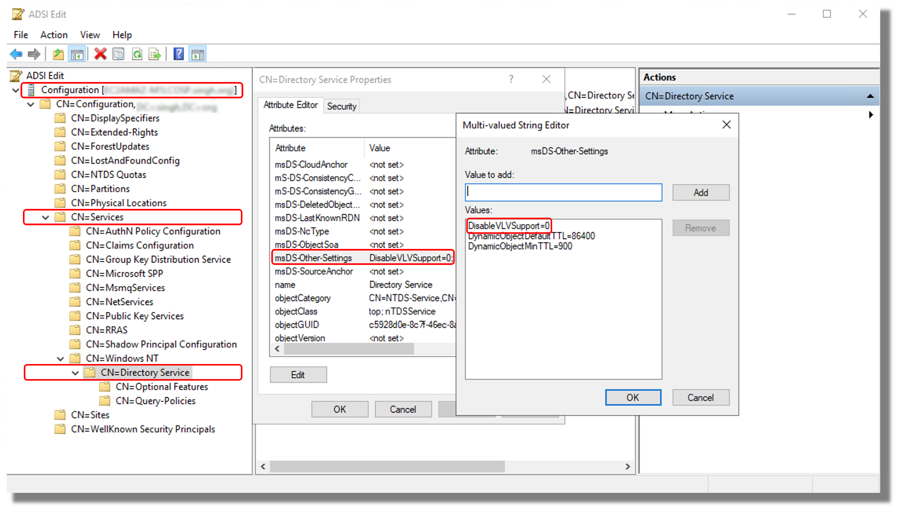
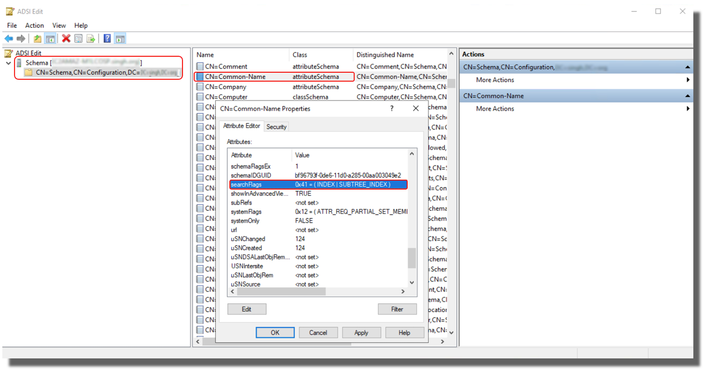

# Troubleshooting AD Connector

The following can help you troubleshoot some common issues you might encounter when
creating or using your AD Connector.

###### Topics

- [Creation issues](#ad_connector_creation_issues "#ad_connector_creation_issues")
- [Connectivity issues](#ad_connector_connectivity_issues "#ad_connector_connectivity_issues")
- [Authentication issues](#ad_connector_auth_issues "#ad_connector_auth_issues")
- [Maintenance issues](#ad_connector_maintenance_issues "#ad_connector_maintenance_issues")
- [I cannot delete my AD Connector](#delete_ad_connector "#delete_ad_connector")
- [General tools for investigating
  AD Connector issuers](#ad_connector_troubleshooting_tools "#ad_connector_troubleshooting_tools")

## Creation issues

###### The following are common creation issues for AD Connector

- [I receive an "AZ Constrained" error when I create a
  directory](#contrained_az2 "#contrained_az2")
- [I receive a "Connectivity issues
  detected" error when I try to create AD Connector](#ad_creation_connectivity_issues "#ad_creation_connectivity_issues")

### I receive an "AZ Constrained" error when I create a

directory

Some AWS accounts created before 2012 might have access to Availability Zones in
the US East (N. Virginia), US West (N. California), or Asia Pacific (Tokyo)
Regions that do not support Directory Service directories. If you receive an
error such as this when creating a Active Directory, choose a subnet in a different Availability
Zone and try to create the directory again.

### I receive a "Connectivity issues

detected" error when I try to create AD Connector

If you receive the "Connectivity issue detected" error when trying to create an
AD Connector, the error could be due to port availability or AD Connector
password complexity. You can test your AD Connector's connection to see whether
the following ports are available:

- 53 (DNS)
- 88 (Kerberos)
- 389 (LDAP)

To test your connection, see [Test your AD Connector](ad_connector_getting_started.md#connect_verification "ad_connector_getting_started.md#connect_verification"). The connection test should be performed
on the instance joined to both subnets that the AD Connector's IP addresses are
associated to.

If the connection test is successful and the instance joins the domain, then check
your AD Connector's password. AD Connector must meet AWS password complexity
requirements. For more information, see Service account in [AD Connector prerequisites](ad_connector_getting_started.md#prereq_connector "ad_connector_getting_started.md#prereq_connector").

If your AD Connector does not meet these requirements, recreate your
AD Connector with a password that complies with these requirements.

### I receive "An internal service error has been

encountered while connecting the directory. Please retry the operation." error
when I create an AD Connector

This error usually occurs when the AD Connector fails to create and can't
connect to a valid domain controller for your self-managed Active Directory domain.

###### Note

As a [best practice](ad_connector_best_practices.md#ad_connector_config_onprem "ad_connector_best_practices.md#ad_connector_config_onprem"), if your
self-managed network has Active Directory Sites defined, you must ensure the
following:

- The VPC subnets where your AD Connector resides are defined in an
  Active Directory Site.
- No conflicts exist between your VPC subnets and the subnets in your
  other sites.

AD Connector uses the Active Directory Site whose subnet IP address ranges are close to
those in the VPC that contain the AD Connector to discover your AD domain
controllers. If you have a site whose subnets have the same IP address ranges as
those in your VPC, AD Connector will discover the domain controllers in that site.
The domain controller may not physically be close to the Region your AD Connector
resides in.

- Inconsistencies in DNS SRV records (These records use the following
  syntax: `_ldap._tcp.*<DnsDomainName>*` and
  `_kerberos._tcp.<DnsDomainName>`) created in customer
  managed Active Directory domain. This can occur when AD Connector couldn't find and
  connect to a valid domain controller based on these SRV records.
- Networking issues between AD Connector and customer managed AD such as
  firewall devices.

You can use [network packet capture](https://techcommunity.microsoft.com/blog/iis-support-blog/capture-a-network-trace-without-installing-anything--capture-a-network-trace-of-/376503 "https://techcommunity.microsoft.com/blog/iis-support-blog/capture-a-network-trace-without-installing-anything--capture-a-network-trace-of-/376503") on your domain controllers, DNS servers, and VPC
flow logs of directory network interfaces to investigate this issue. Contact [AWS Support](../../../awssupport/latest/user/case-management.md "../../../awssupport/latest/user/case-management.md") for further assistance.

## Connectivity issues

###### The following are common connectivity issues for AD Connector

- [I receive a "Connectivity issues
  detected" error when I try to connect to my on-premises directory](#connectivity_issues_detected "#connectivity_issues_detected")
- [I receive a "DNS unavailable" error when I try to
  connect to my on-premises directory](#dns_unavailable "#dns_unavailable")
- [I receive an "SRV record" error when I try to
  connect to my on-premises directory](#srv_record_not_found "#srv_record_not_found")

### I receive a "Connectivity issues

detected" error when I try to connect to my on-premises directory

You receive an error message similar to the following when connecting to your
on-premises directory: **`Connectivity issues detected: LDAP unavailable
 (TCP port 389) for IP: `<IP address>` Kerberos/authentication unavailable (TCP port 88) for IP:`<IP
 address>` Please ensure that the listed ports are available
 and retry the operation.`**

AD Connector must be able to communicate with your on-premises domain
controllers via TCP and UDP over the following ports. Verify that your security
groups and on-premises firewalls allow TCP and UDP communication over these ports.
For more information, see [AD Connector prerequisites](ad_connector_getting_started.md#prereq_connector "ad_connector_getting_started.md#prereq_connector").

- 88 (Kerberos)
- 389 (LDAP)

You may need additional TCP/UDP ports depending on your needs. See the
following list for some of these ports. For more information about ports used by
Active Directory, see [How to configure a firewall for Active Directory domains and trusts](https://learn.microsoft.com/en-us/troubleshoot/windows-server/identity/config-firewall-for-ad-domains-and-trusts "https://learn.microsoft.com/en-us/troubleshoot/windows-server/identity/config-firewall-for-ad-domains-and-trusts") in
Microsoft documentation.

- 135 (RPC Endpoint Mapper)
- 646 (LDAP SSL)
- 3268 (LDAP GC)
- 3269 (LDAP GC SSL)

[Show moreShow less](# "#")

### I receive a "DNS unavailable" error when I try to

connect to my on-premises directory

You receive an error message similar to the following when connecting to your
on-premises directory:

```
DNS unavailable (TCP port 53) for IP: `<DNS IP address>`
```

AD Connector must be able to communicate with your on-premises DNS servers via
TCP and UDP over port 53. Verify that your security groups and on-premises firewalls
allow TCP and UDP communication over this port. For more information, see [AD Connector prerequisites](ad_connector_getting_started.md#prereq_connector "ad_connector_getting_started.md#prereq_connector").

### I receive an "SRV record" error when I try to

connect to my on-premises directory

You receive an error message similar to one or more of the following when
connecting to your on-premises directory:

```
SRV record for LDAP does not exist for IP: `<DNS IP address>` SRV record for Kerberos does not exist for IP: `<DNS IP address>`
```

AD Connector needs to obtain the `_ldap._tcp.`<DnsDomainName>`` and
 `_kerberos._tcp.`<DnsDomainName>`` SRV
records when connecting to your directory. You will get this error if the service
cannot obtain these records from the DNS servers that you specified when connecting
to your directory. For more information about these SRV records, see [SRV record requirements](ad_connector_getting_started.md#srv_records "ad_connector_getting_started.md#srv_records").

## Authentication issues

###### Here are some common authentication issues with AD Connector:

- [I receive a "Certificate Validation
  failed" error when I try to sign in to Amazon WorkSpaces with a smart
  card](#cert_validation_failure "#cert_validation_failure")
- [I receive an "Invalid Credentials" error when the
  service account used by AD Connector attempts to authenticate](#invalid_creds "#invalid_creds")
- [I receive a "Unable to Authenticate" error
  when using AWS applications to search for users or groups](#fails_when_searching "#fails_when_searching")
- [I receive an error about my directory
  credentials when I try to update the AD Connector service account](#error_with_ad_creds "#error_with_ad_creds")
- [Some of my users cannot authenticate with my
  directory](#kerberos_preauth2 "#kerberos_preauth2")

### I receive a "Certificate Validation

failed" error when I try to sign in to Amazon WorkSpaces with a smart
card

You receive an error message similar to the following when you try to sign in to
your WorkSpaces with a smart card: **`**ERROR**: Certificate
Validation failed. Please try again by restarting your browser or application
and make sure you select the correct certificate.`** The error occurs
if the smart card's certificate is not properly stored on the client that uses the
certificates. For more information on AD Connector and smart card requirements,
see [Prerequisites](ad_connector_clientauth.md#prereqs-clientauth "ad_connector_clientauth.md#prereqs-clientauth").

###### Use the following procedures to troubleshoot the smart card's ability to

store certificates in the user's certificate store:

1. On the device that is having trouble accessing the certificates,
   access the Microsoft Management Console (MMC).

###### Important

Before moving forward, create a copy of the smart card's
certificate. 2. Navigate to the certificate store in the MMC. Delete the user's smart
card certificate from the certificate store. For more information about
viewing the certificate store in the MMC, see [How to: View certificates with the MMC snap-in](https://learn.microsoft.com/en-us/dotnet/framework/wcf/feature-details/how-to-view-certificates-with-the-mmc-snap-in "https://learn.microsoft.com/en-us/dotnet/framework/wcf/feature-details/how-to-view-certificates-with-the-mmc-snap-in") in
Microsoft documentation. 3. Remove the smart card. 4. Reinsert the smart card so it can repopulate the smart card
certificate in the user's certificate store.

###### Warning

If the smart card is not repopulating the certificate to the user
store then it cannot be used for WorkSpaces smart card
authentication.

The AD Connector's Service account should have the following:

- `my/spn` added to the Service Principle Name
- Delegated for LDAP service

After the certificate is repopulated on the smart card, the on-premise domain
controller should be checked to determine if they are blocked from User
Principal Name (UPN) mapping for Subject Alternative Name. For more information
about this change, see [How to disable the Subject Alternative Name for UPN mapping](https://learn.microsoft.com/en-us/troubleshoot/windows-server/windows-security/disable-subject-alternative-name-upn-mapping "https://learn.microsoft.com/en-us/troubleshoot/windows-server/windows-security/disable-subject-alternative-name-upn-mapping") in
Microsoft documentation.

###### Use the following procedure to check your domain controller's registry

key:

- In the **Registry Editor**, navigate to the following
  hive key

**HKEY_LOCAL_MACHINE\SYSTEM\CurrentControlSet\Services\Kdc\UseSubjectAltName**

    1. Inspect the value of UseSubjectAltName:


    	1. If the value is set to **0**, then
    	 **Subject Alternative Name**
    	 mapping is **disabled** and you must
    	 explicitly map a given certificate to only 1 user. If a
    	 certificate is mapped to multiple users and this value
    	 is 0, login with that certificate will fail.
    	2. If the value is **not set or set to
    	 1**, you must explicitly map a given
    	 certificate to only 1 user or use the **Subject
    	 Alternative Name** field for login.


    		1. If the **Subject Alternative
    		 Name** field exists on the certificate,
    		 it will be prioritized.
    		2. If the **Subject Alternative
    		 Name** field does not exist on the
    		 certificate and the certificate is explicitly
    		 mapped to more than one user, login with that
    		 certificate will fail.

###### Note

If the registry key is set on the on-premise Domain Controllers then the
AD Connector will not be able to locate the users in Active Directory and result in
the above error message.

The Certificate Authority (CA) certificates should be uploaded to the
AD Connector smart card certificate. The certificate should contain OCSP
information. The following list additional requirements for the CA:

- The certificate should be in the Trusted Root Authority of the Domain
  Controller, the Certificate Authority Server, and the WorkSpaces.
- Offline and Root CA certificates will not contain the OSCP
  information. These certificates contain information about their
  revocation.
- If you are using a third-party CA certificate for smart card
  authentication, then the CA and intermediate certificates need to be
  published to the Active Directory NTAuth store. They must be installed in the
  trusted root authority for all domain controllers, certificate authority
  servers, and WorkSpaces.
  - You can use the follow command to publish certificates to the
    Active Directory NTAuth store:

  ```
  certutil -dspublish -f `Third_Party_CA.cer` NTAuthCA
  ```

For more information about publishing certificates to the NTAuth store, see
[Import the issuing CA certificate into the Enterprise NTAuth store](../../../whitepapers/latest/access-workspaces-with-access-cards/import-the-issuing-ca-certificate-into-the-enterprise-ntauth-store.md "../../../whitepapers/latest/access-workspaces-with-access-cards/import-the-issuing-ca-certificate-into-the-enterprise-ntauth-store.md")
in _Access Amazon WorkSpaces with Common Access Cards Installation
Guide_.

###### You can check to see if the user certificate or CA chain certificates are

verified by OCSP by following this procedure:

1. Export the smart card certificate to a location on the local machine
   like the C: drive.
2. Open a Command Line prompt and navigate to the location where the
   exported smart card certificate is stored.
3. Enter the following command:

```
certutil -URL `Certficate_name.cer`
```

4. A pop-up window should appear following the command. Select the
   **OCSP option** on the right corner and select
   **Retrieve**. The status should return as
   verified.

For more information about the certutil command, see [certutil](https://learn.microsoft.com/en-us/windows-server/administration/windows-commands/certutil "https://learn.microsoft.com/en-us/windows-server/administration/windows-commands/certutil") in Microsoft documentation

[Show moreShow less](# "#")

### I receive an "Invalid Credentials" error when the

service account used by AD Connector attempts to authenticate

This can occur if the hard drive on your domain controller runs out of space.
Ensure that your domain controller's hard drives are not full.

### I receive "An error has occurred" or "An

unexpected error" when I try to update the AD Connector service
account

The following errors or symptoms occur while searching users in AWS Enterprise
Applications such as [Amazon WorkSpaces Console Launch Wizard](../../../workspaces/latest/adminguide/launch-workspace-ad-connector.md#create-workspace-ad-connector "../../../workspaces/latest/adminguide/launch-workspace-ad-connector.md#create-workspace-ad-connector"):

- **`An Error Has Occurred. If you continue to experience an
issue contact the AWS Support Team on the community forums and via
AWS Premium Support.`**
- **`An Error Has Occurred. Your directory needs a credential
update. Please update the directory credentials.`**

If you try to update your AD Connector service account credentials in
AD Connector, you might receive the following errors messages:

- **`Unexpected error. An unexpected error
occurred.`**
- **`An error occurred. There was an error with the service
account/password combination. Please try again.`**

The AD Connector directory's service account resides in the customer managed
Active Directory. The account is used as an identity to perform queries and operations on
the customer managed Active Directory domain through the AD Connector on behalf of AWS
Enterprise Applications. AD Connector uses Kerberos and LDAP to perform these
operations.

**The following list explains what these error messages
mean:**

- There could be an issue with the time synchronization and Kerberos.
  AD Connector sends Kerberos authentication requests to Active Directory. These
  requests are time sensitive and if the requests are delayed, they will
  fail. Ensure that there is no time-sync issues between any of the
  customer managed domain controllers. To resolve this issue, see [Recommendation - Configure the Root PDC with an Authoritative Time
  Source and Avoid Widespread Time Skew](https://learn.microsoft.com/en-us/services-hub/unified/health/remediation-steps-ad/configure-the-root-pdc-with-an-authoritative-time-source-and-avoid-widespread-time-skew "https://learn.microsoft.com/en-us/services-hub/unified/health/remediation-steps-ad/configure-the-root-pdc-with-an-authoritative-time-source-and-avoid-widespread-time-skew") in Microsoft documentation.
  For more information about time service and synchronization, see the
  following:
  - [How the Windows Time Service Works](https://learn.microsoft.com/en-us/windows-server/networking/windows-time-service/how-the-windows-time-service-works "https://learn.microsoft.com/en-us/windows-server/networking/windows-time-service/how-the-windows-time-service-works")
  - [Maximum tolerance for computer clock
    synchronization](https://learn.microsoft.com/en-us/windows/security/threat-protection/security-policy-settings/maximum-tolerance-for-computer-clock-synchronization "https://learn.microsoft.com/en-us/windows/security/threat-protection/security-policy-settings/maximum-tolerance-for-computer-clock-synchronization")
  - [Windows Time service tools and settings](https://learn.microsoft.com/en-us/windows-server/networking/windows-time-service/windows-time-service-tools-and-settings?tabs=config "https://learn.microsoft.com/en-us/windows-server/networking/windows-time-service/windows-time-service-tools-and-settings?tabs=config")

- An intermediate network device, with a network [MTU](https://support.microsoft.com/en-us/topic/the-default-mtu-sizes-for-different-network-topologies-b25262c5-d90f-456d-7647-e09192eeeef4 "https://support.microsoft.com/en-us/topic/the-default-mtu-sizes-for-different-network-topologies-b25262c5-d90f-456d-7647-e09192eeeef4") restriction, such as Firewall or VPN hardware
  configurations, between the AD Connector and customer managed domain
  controllers, can cause this error due to [network
  fragmentation](https://en.wikipedia.org/wiki/IP_fragmentation "https://en.wikipedia.org/wiki/IP_fragmentation").
  - To verify the MTU restriction, you can perform a [Ping test](https://techcommunity.microsoft.com/blog/coreinfrastructureandsecurityblog/mtu-size-matters/1025286 "https://techcommunity.microsoft.com/blog/coreinfrastructureandsecurityblog/mtu-size-matters/1025286") between your customer managed domain
    controller and an Amazon EC2 instance that is launched in one of your
    directory subnets that is connected via AD Connector. The
    frame size should be no larger than the default size of 1500
    Bytes
  - The ping test will help you to understand whether the frame
    size is more than 1500 bytes (also known as Jumbo frames) and
    they are able to reach the AD Connector VPC and subnet without
    the need of fragmentation. Further verify with your network team
    and ensure that Jumbo frames are allowed on the intermediate
    network devices.

- You may face this issue, if [client-side LDAPS](ad_connector_ldap_client_side.md "ad_connector_ldap_client_side.md") is
  enabled on AD Connector, and the certificates are expired. Ensure both
  server side certificate and CA certificate are valid, haven't expired,
  and meets the requirements as per the [LDAPs
  documentation](ad_connector_ldap_client_side.md#prereqs-ldap-client-side "ad_connector_ldap_client_side.md#prereqs-ldap-client-side").
- If [Virtual List View Support](https://learn.microsoft.com/en-us/windows/win32/controls/use-virtual-list-view-controls "https://learn.microsoft.com/en-us/windows/win32/controls/use-virtual-list-view-controls") is disabled in customer managed Active Directory
  domain, then AWS Applications will not be able to search users because
  AD Connector uses VLV search in LDAP queries. Virtual List View
  Support is disabled when the DisableVLVSupport is set to non-zero value.
  Ensure the [Virtual List View (VLV) Support](<https://learn.microsoft.com/en-us/previous-versions/office/exchange-server-analyzer/cc540446(v=exchg.80)?redirectedfrom=MSDN> "https://learn.microsoft.com/en-us/previous-versions/office/exchange-server-analyzer/cc540446(v=exchg.80)?redirectedfrom=MSDN") is enabled in Active Directory using
  the following steps:
  1.  Login to the Domain Controller as the schema master role
      owner using an account with Schema Admin credentials.
  2.  Select **Start** and then
      **Run**, and enter
      `Adsiedit.msc`.
  3.  In the ADSI Edit tool, Connect to **Configuration Partition**, and expand the
      **Configuration[DomainController]** node.
  4.  Expand the**CN=Configuration,DC=DomainName** container.
  5.  Expand the **CN=Services**
      object.
  6.  Expand the **CN=Windows NT**
      object.
  7.  Select the **CN=Directory
      Service** object. Select **Properties**.
  8.  In the Attributes list, select **msds-Other-Settings**. Select **Edit**.
  9.  In the Values list, select any instance of **DisableVLVSupport=x** where x is not
      equal to **0**, and select
      **Remove**.
  10. After removing, enter
      `DisableVLVSupport=0`. Select **Add**.
  11. Select **OK**. You can close the
      ADSI Edit tool. The following image shows the Multi-valued
      String Editor dialog box in the ADSI Edit window:

  

###### Note

In large Active Directory infrastructure with more than 100,000 users, you
might only be able to search specific users. However, if you try to
list all the users (For example, **Show All
Users in WorkSpaces Launch Wizard**) at once, it might
result in the same error even if VLV Support is enabled.
AD Connector requires the results to be sorted for attribute "CN"
using Subtree Index. The Subtree Index is the type of index which
prepares the domain controllers for performing a Virtual List View
(LDAP) search operation that allows AD Connector to complete a
sorted search. This index improves the VLV search and prevents the
use of the temporary database table called [MaxTempTableSize](https://learn.microsoft.com/en-us/troubleshoot/windows-server/active-directory/view-set-ldap-policy-using-ntdsutil "https://learn.microsoft.com/en-us/troubleshoot/windows-server/active-directory/view-set-ldap-policy-using-ntdsutil"). The size of this table can vary, but
by default the maximum number of entries is 10000 (the
MaxTempTableSize setting of the Default Query Policy). Increasing
the MaxTempTableSize is less efficient than using the Subtree
Indexing. To avoid these errors in large AD environments, it is
advised to use Subtree Indexing.

You can enable the Subtree index by modifying the [searchflags](https://techcommunity.microsoft.com/t5/core-infrastructure-and-security/mcm-active-directory-indexing-for-the-masses/ba-p/255867 "https://techcommunity.microsoft.com/t5/core-infrastructure-and-security/mcm-active-directory-indexing-for-the-masses/ba-p/255867") attribute on the attribute definition, in the Active Directory
schema, with a value of 65 (0x41), using ADSEdit as per the following
steps:

1. Login to the Domain Controller as the schema master role owner using
   an account with Schema Admin credentials.
2. Select **Start** and **Run**, enter
   `Adsiedit.msc`.
3. In the ADSI Edit tool, connect to **Schema
   Partition**.
4. Expand the **CN=Schema,CN=Configuration,DC=DomainName**
   container.
5. Locate the "**Common-Name**" attribute
   and right-click and select **Properties**.
6. Locate the **searchFlags** attribute and
   change its value to `65 (0x41)` for enabling
   SubTree indexing along with normal Index.

The following image shows the CN=Common-Name properties dialog box in
the ADSI Edit window:

 7. Select **OK**. You can close the ADSI
Edit tool. 8. For the confirmation, you should be able to see an event ID 1137 (
Source : Active Directory_DomainServices), which indicates that the AD has
successfully created the new index for the specified attribute.

For more information, see [Microsoft documentation](https://techcommunity.microsoft.com/t5/core-infrastructure-and-security/mcm-active-directory-indexing-for-the-masses/ba-p/255867 "https://techcommunity.microsoft.com/t5/core-infrastructure-and-security/mcm-active-directory-indexing-for-the-masses/ba-p/255867").

[Show moreShow less](# "#")

### I receive a "Unable to Authenticate" error

when using AWS applications to search for users or groups

You may experience errors when searching for users or logging into AWS
applications, such as WorkSpaces or Quick Suite, even while the AD Connector status was
active. If the AD Connector's service account's password has been changed or is
expired, AD Connector can no longer query the Active Directory domain. Contact your AD
Administrator and verify the following:

- Check the AD Connector service account password has not expired
- Checked the AD Connector service account does not have the option
  **User must change password at next logon**
  enabled.
- Check the AD Connector service account is not locked.
- If you're not sure whether the password is expired or changed, you can
  reset the service account password and also [update](ad_connector_update_creds.md "ad_connector_update_creds.md") the same password in
  AD Connector.

### I receive an error about my directory

credentials when I try to update the AD Connector service account

You receive an error message similar to one or more of the following when trying
to update the AD Connector service account:

**`Message:An Error Has Occurred Your directory needs a credential
 update. Please update the directory credentials.`**
**`An Error Has Occurred Your directory needs a credential update.
 Please update the directory credentials following Update your AD Connector
 Service Account Credentials`**
**`Message: An Error Has Occurred Your request has a problem. Please see
 the following details. There was an error with the service account/password
 combination`**

There could be an issue with the time synchronization and Kerberos.
AD Connector sends Kerberos authentication requests to Active Directory. These requests
are time sensitive and if the requests are delayed, they will fail. To resolve
this issue, see [Recommendation - Configure the Root PDC with an Authoritative Time Source
and Avoid Widespread Time Skew](https://learn.microsoft.com/en-us/services-hub/unified/health/remediation-steps-ad/configure-the-root-pdc-with-an-authoritative-time-source-and-avoid-widespread-time-skew "https://learn.microsoft.com/en-us/services-hub/unified/health/remediation-steps-ad/configure-the-root-pdc-with-an-authoritative-time-source-and-avoid-widespread-time-skew") in Microsoft
documentation. For more information about time service and synchronization, see
below:

- [How the Windows Time Service Works](https://learn.microsoft.com/en-us/windows-server/networking/windows-time-service/how-the-windows-time-service-works "https://learn.microsoft.com/en-us/windows-server/networking/windows-time-service/how-the-windows-time-service-works")
- [Maximum tolerance for computer clock synchronization](https://learn.microsoft.com/en-us/windows/security/threat-protection/security-policy-settings/maximum-tolerance-for-computer-clock-synchronization "https://learn.microsoft.com/en-us/windows/security/threat-protection/security-policy-settings/maximum-tolerance-for-computer-clock-synchronization")
- [Windows Time service tools and
  settings](https://learn.microsoft.com/en-us/windows-server/networking/windows-time-service/windows-time-service-tools-and-settings?tabs=config "https://learn.microsoft.com/en-us/windows-server/networking/windows-time-service/windows-time-service-tools-and-settings?tabs=config")

[Show moreShow less](# "#")

### Some of my users cannot authenticate with my

directory

Your user accounts must have Kerberos preauthentication enabled. This is the
default setting for new user accounts, but it should not be modified. For more
information about this setting, go to [Preauthentication](http://technet.microsoft.com/en-us/library/cc961961.aspx "http://technet.microsoft.com/en-us/library/cc961961.aspx") on Microsoft TechNet.

## Maintenance issues

###### The following are common maintenance issues for AD Connector

- My directory is stuck in the "Requested" state
- Seamless domain join for Amazon EC2 instances stopped working

### My directory is stuck in the

"Requested" state

If you have a directory that has been in the "Requested" state for more than five
minutes, try deleting the directory and recreating it. If this problem persists,
contact [AWS Support](https://aws.amazon.com/contact-us/ "https://aws.amazon.com/contact-us/").

### Seamless domain join for Amazon EC2 instances stopped

working

If seamless domain join for EC2 instances was working and then stopped while the
AD Connector was active, the credentials for your AD Connector service account
may have expired. Expired credentials can prevent AD Connector from creating
computer objects in your Active Directory.

###### To resolve this issue, update the service account passwords in the following

order so that the passwords match:

1. Update the password for the service account in your Active Directory.
2. Update the password for the service account in your AD Connector in
   Directory Service. For more information, see [Updating your AD Connector service account credentials
   in AWS Management Console](ad_connector_update_creds.md "ad_connector_update_creds.md").

###### Important

Updating the password only in Directory Service does not push the password change to your
existing on-premises Active Directory so it is important to do it in the order shown in the
previous procedure.

## I cannot delete my AD Connector

If your AD Connector switches to an inoperable state, you no longer have access to
your domain controllers. We block the deletion of an AD Connector when there are still
applications linked to it because one of those applications may still be using the
directory. For a list of applications you need to disable in order to delete your
AD Connector, see [Deleting your AD Connector](ad_connector_delete.md "ad_connector_delete.md"). If you still can't delete your
AD Connector, you can request help through [AWS Support](https://aws.amazon.com/contact-us/ "https://aws.amazon.com/contact-us/").

## General tools for investigating

AD Connector issuers

The following tools can be used to troubleshoot various AD Connector issues related
to creation, authentication, and connectivity:

**DirectoryServicePortTest tool**

The [DirectoryServicePortTest](samples/DirectoryServicePortTest.md "samples/DirectoryServicePortTest.md") testing tool can be helpful when
troubleshooting connectivity issues between AD Connector and customer managed
Active Directory or DNS servers. For more information on how to use the tool, see [Test your AD Connector](ad_connector_getting_started.md#connect_verification "ad_connector_getting_started.md#connect_verification").

**Packet capture tool**

You can use the built-in Windows package capture utility ([netsh](<https://learn.microsoft.com/en-us/previous-versions/windows/it-pro/windows-server-2012-r2-and-2012/jj129382(v=ws.11)> "https://learn.microsoft.com/en-us/previous-versions/windows/it-pro/windows-server-2012-r2-and-2012/jj129382(v=ws.11)")) to investigate and troubleshoot
potential network or Active Directory communication (ldap and kerberos) issue. For more
information, see [Capture a Network Trace without installing
anything](https://techcommunity.microsoft.com/t5/iis-support-blog/capture-a-network-trace-without-installing-anything-amp-capture/ba-p/376503 "https://techcommunity.microsoft.com/t5/iis-support-blog/capture-a-network-trace-without-installing-anything-amp-capture/ba-p/376503").

**VPC Flow logs**

To better understand what requests are being received and sent from
AD Connector, you can configure [VPC flow
logs](../../../vpc/latest/userguide/working-with-flow-logs.md "../../../vpc/latest/userguide/working-with-flow-logs.md") for the directory network interfaces. You can identify all
network interfaces reserved for use with Directory Service by the description:
`AWS created network interface for directory
 `your-directory-id``.

A simple use case is during AD Connector creation with a customer managed
Active Directory domain with a large number of domain controllers. You can
use VPC flow logs and filter by the Kerberos port (88) to find out what
domain controllers in the customer managed Active Directory are being contacted
for authentication.
