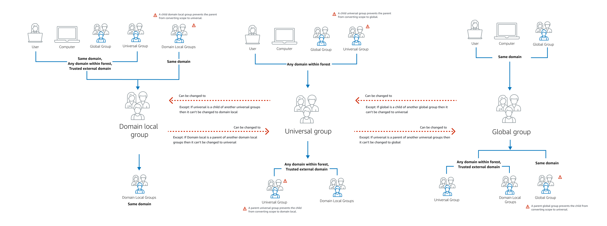

# Group type and group scope

Groups in AWS Managed Microsoft AD have both a group type and a group scope. See the following sections
for more information on each.

###### Topics

- [Group type](#ad_group_type "#ad_group_type")
- [Group scope](#ad_group_scope "#ad_group_scope")

## Group type

Group type determines which shared resources within the Active Directory the group members can access. There
are two group types:

- **Security** - You can assign permissions to these groups so that
  group members can access shared Active Directory resources.
- **Distribution** - You can use this type to create email distribution
  lists. These group members cannot access Active Directory shared resources.

There are no limitations when changing between group types.

For more information about group types, see [Microsoft documentation](https://learn.microsoft.com/en-us/windows-server/identity/ad-ds/manage/understand-security-groups#how-active-directory-security-groups-work "https://learn.microsoft.com/en-us/windows-server/identity/ad-ds/manage/understand-security-groups#how-active-directory-security-groups-work").

## Group scope

Group scope determines how group members are defined with the domain tree or forest. There
are three group scopes:

- **Domain local** - to assign permissions to group members located in the same domain.
- **Universal** - to assign permissions to group members located within any domain.
- **Global** - to assign permissions to group members located within any domain or forest.

There are limitations when changing a group scope. The following list and diagram outline these limitations.

- Changing group scope from **Domain Local** to
  **Universal** - Yes
  - Unless the domain local group is a parent of another domain local group.

- Changing group scope from **Universal** to **Domain
  Local** - Yes
  - Unless the universal group is a child group of another universal group.

- Changing group scope from **Universal** to
  **Global** - Yes
  - Unless the universal group is a parent of another universal group.

- Changing group scope from **Global** to
  **Universal** - Yes
  - Unless the global group is a child of another global group.

For more information about group scopes, see [Microsoft documentation](https://learn.microsoft.com/en-us/windows-server/identity/ad-ds/manage/understand-security-groups#group-scope "https://learn.microsoft.com/en-us/windows-server/identity/ad-ds/manage/understand-security-groups#group-scope").

