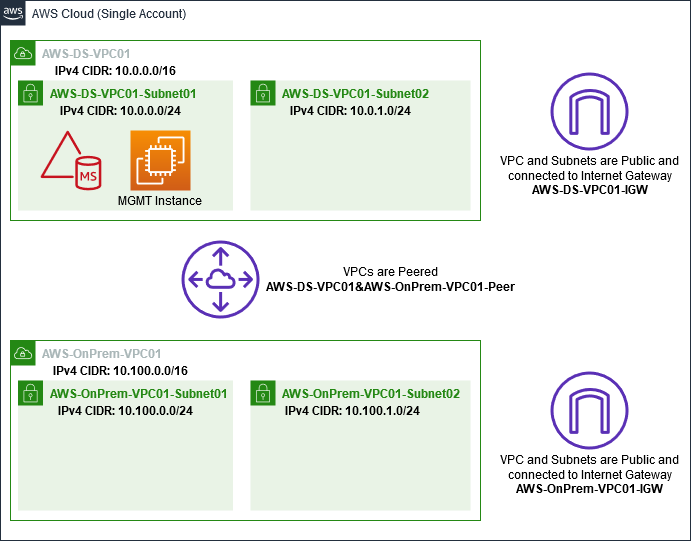

# Step 1: Set up your environment for

trusts

In this section, you set up your Amazon EC2 environment, deploy your new forest, and
prepare your VPC for trusts with AWS.

## Create a Windows Server 2019 EC2 instance

Use the following procedure to create a Windows Server 2019 member server in
Amazon EC2.

###### To create a Windows Server 2019 EC2 instance

1. Open the Amazon EC2 console at
   [https://console.aws.amazon.com/ec2/](https://console.aws.amazon.com/ec2/ "https://console.aws.amazon.com/ec2/").
2. In the Amazon EC2 console, choose **Launch Instance**.
3. On the **Step 1** page, locate **Microsoft
   Windows Server 2019 Base -
   ami-`xxxxxxxxxxxxxxxxx`** in the
   list. Then choose **Select**.
4. On the **Step 2** page, select
   **t2.large**, and then choose **Next: Configure
   Instance Details**.
5. On the **Step 3** page, do the following:
   - For **Network**, select
     **vpc-`xxxxxxxxxxxxxxxxx`
     AWS-OnPrem-VPC01** (which you previously set up in the
     [Base tutorial](microsoftadbasestep1.md#createvpc "microsoftadbasestep1.md#createvpc")).
   - For **Subnet**, select
     **subnet-`xxxxxxxxxxxxxxxxx`
     | AWS-OnPrem-VPC01-Subnet01 |
     AWS-OnPrem-VPC01**.
   - For **Auto-assign Public IP** list, choose
     **Enable** (if the subnet setting is not set to
     **Enable** by default).
   - Leave the rest of the settings at their defaults.
   - Choose **Next: Add Storage**.

6. On the **Step 4** page, leave the default settings, and
   then choose **Next: Add Tags**.
7. On the **Step 5** page, choose **Add
   Tag**. Under **Key** type
   `example.local-DC01`, and then choose
   **Next: Configure Security Group**.
8. On the **Step 6** page, choose **Select an
   existing security group**, select **AWS On-Prem Test Lab Security
   Group** (which you previously set up in the [Base tutorial](microsoftadbasestep1.md#createsecuritygroup "microsoftadbasestep1.md#createsecuritygroup")), and then choose
   **Review and Launch** to review your instance.
9. On the **Step 7** page, review the page, and then choose
   **Launch**.
10. On the **Select an existing key pair or create a new key
    pair** dialog box, do the following:
    - Choose **Choose an existing key pair**.
    - Under **Select a key pair**, choose
      **AWS-DS-KP** (which you previously set up in
      the [Base tutorial](microsoftadbasestep1.md#createkeypair2 "microsoftadbasestep1.md#createkeypair2")).
    - Select the **I acknowledge...** check box.
    - Choose **Launch Instances**.

11. Choose **View Instances** to return to the Amazon EC2 console
    and view the status of the deployment.

## Promote your server to a domain controller

Before you can create trusts, you must build and deploy the first domain
controller for a new forest. During this process you configure a new Active
Directory forest, install DNS, and set this server to use the local DNS server for
name resolution. You must reboot the server at the end of this procedure.

###### Note

If you want to create a domain controller in AWS that replicates with your
on-premises network, you would first manually join the EC2 instance to your
on-premises domain. After that you can promote the server to a domain
controller.

###### To promote your server to a domain controller

1. In the Amazon EC2 console, choose **Instances**, select the
   instance you just created, and then choose **Connect**.
2. In the **Connect To Your Instance** dialog box, choose
   **Download Remote Desktop File**.
3. In the **Windows Security** dialog box, type your local
   administrator credentials for the Windows Server computer to login (for
   example, `administrator`). If you do not yet have the
   local administrator password, go back to the Amazon EC2 console, right-click on
   the instance, and choose **Get Windows Password**. Navigate
   to your `AWS DS KP.pem` file or your personal
   `.pem` key, and then choose **Decrypt
   Password**.
4. From the **Start** menu, choose **Server
   Manager**.
5. In the **Dashboard**, choose **Add Roles and
   Features**.
6. In the **Add Roles and Features Wizard**, choose
   **Next**.
7. On the **Select installation type** page, choose
   **Role-based or feature-based installation**, and then
   choose **Next**.
8. On the **Select destination server** page, make sure that
   the local server is selected, and then choose
   **Next**.
9. On the **Select server roles** page, select
   **Active Directory Domain Services**. In the
   **Add Roles and Features Wizard** dialog box, verify
   that the **Include management tools (if applicable)** check
   box is selected. Choose **Add Features**, and then choose
   **Next**.
10. On the **Select features** page, choose
    **Next**.
11. On the **Active Directory Domain Services** page, choose
    **Next**.
12. On the **Confirm installation selections** page, choose
    **Install**.
13. Once the Active Directory binaries are installed, choose
    **Close**.
14. When Server Manager opens, look for a flag at the top next to the word
    **Manage**. When this flag turns yellow, the server is
    ready to be promoted.
15. Choose the yellow flag, and then choose **Promote this server to a
    domain controller**.
16. On the **Deployment Configuration** page, choose
    **Add a new forest**. In **Root domain
    name**, type `example.local`, and then
    choose **Next**.
17. On the **Domain Controller Options** page, do the
    following:
    - In both **Forest functional level** and
      **Domain functional level**, choose
      **Windows Server 2016**.
    - Under **Specify domain controller capabilities**,
      verify that both **DNS server** and **Global Catalog (GC)**
      are selected.
    - Type and then confirm a Directory Services Restore Mode (DSRM)
      password. Then choose **Next**.

18. On the **DNS Options** page, ignore the warning about
    delegation and choose **Next**.
19. On the **Additional options** page, make sure that
    **EXAMPLE** is listed as the NetBios domain
    name.
20. On the **Paths** page, leave the defaults, and then
    choose **Next**.
21. On **Review Options** page, choose
    **Next**. The server now checks to make sure all the
    prerequisites for the domain controller are satisfied. You may see some
    warnings displayed, but you can safely ignore them.
22. Choose **Install**. Once the installation is complete,
    the server reboots and then becomes a functional domain controller.

## Configure your VPC

The following three procedures guide you through the steps to configure your VPC
for connectivity with AWS.

###### To configure your VPC outbound rules

1. In the [AWS Directory Service console](https://console.aws.amazon.com/directoryservicev2/ "https://console.aws.amazon.com/directoryservicev2/"), make a note of the AWS Managed Microsoft AD directory ID for
   corp.example.com that you previously created in the [Base tutorial](microsoftadbasestep2.md "microsoftadbasestep2.md").
2. Open the Amazon VPC console at
   [https://console.aws.amazon.com/vpc/](https://console.aws.amazon.com/vpc/ "https://console.aws.amazon.com/vpc/").
3. In the navigation pane, choose **Security
   Groups**.
4. Search for your AWS Managed Microsoft AD directory ID. In the search results, select
   the item with the description **AWS created security group for
   d-`xxxxxx` directory
   controllers**.

###### Note

This security group was automatically created when you initially
created your directory. 5. Choose the **Outbound Rules** tab under that security
group. Choose **Edit**, choose **Add another
rule**, and then add the following values:

    * For **Type**, choose **All
     Traffic**.
    * For **Destination**, type
     `0.0.0.0/0`.
    * Leave the rest of the settings at their defaults.
    * Select **Save**.

###### To verify kerberos preauthentication is enabled

1. On the **example.local** domain controller, open
   **Server Manager**.
2. On the **Tools** menu, choose **Active Directory
   Users and Computers**.
3. Navigate to the **Users** directory, right-click on any
   user and select **Properties**, and then choose the
   **Account** tab. In the **Account
   options** list, scroll down and ensure that **Do not
   require Kerberos preauthentication** is
   **not** selected.
4. Perform the same steps for the **corp.example.com**
   domain from the **corp.example.com-mgmt** instance.

###### To configure DNS conditional forwarders

###### Note

A conditional forwarder is a DNS server on a network that is used to
forward DNS queries according to the DNS domain name in the query. For
example, a DNS server can be configured to forward all the queries it
receives for names ending with widgets.example.com to the IP address of a
specific DNS server or to the IP addresses of multiple DNS servers.

1. Open the [AWS Directory Service console](https://console.aws.amazon.com/directoryservicev2/ "https://console.aws.amazon.com/directoryservicev2/").
2. In the navigation pane, choose **Directories**.
3. Select the **directory ID** of your AWS Managed Microsoft AD.
4. Take note of the fully qualified domain name (FQDN),
   **corp.example.com**, and the DNS addresses of your
   directory.
5. Now, return to your **example.local** domain controller,
   and then open **Server Manager**.
6. On the **Tools** menu, choose
   **DNS**.
7. In the console tree, expand the DNS server of the domain for which you are
   setting up the trust, and navigate to **Conditional
   Forwarders**.
8. Right-click **Conditional Forwarders**, and then choose
   **New Conditional Forwarder**.
9. In DNS domain, type `corp.example.com`.
10. Under **IP addresses of the primary servers**, choose
    **<Click here to add ...>**, type the first DNS
    address of your AWS Managed Microsoft AD directory (which you made note of in the
    previous procedure), and then press **Enter**. Do the same
    for the second DNS address. After typing the DNS addresses, you might get a
    "timeout" or "unable to resolve" error. You can generally ignore these
    errors.
11. Select the **Store this conditional forwarder in Active Directory,
    and replicate as follows** check box. In the drop-down menu,
    choose **All DNS servers in this Forest**, and then choose
    **OK**.
