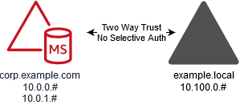

# Step 2: Create the trusts

In this section, you create two separate forest trusts. One trust is created from the
Active Directory domain on your EC2 instance and the other from your AWS Managed Microsoft AD in
AWS.

###### To create the trust from your EC2 domain to your AWS Managed Microsoft AD

1. Log into **example.local**.
2. Open **Server Manager** and in the console tree choose
   **DNS**. Take note of the IPv4 address listed for the
   server. You will need this in the next procedure when you create a conditional
   forwarder from **corp.example.com** to the
   **example.local** directory.
3. In the **Tools** menu, choose **Active Directory
   Domains and Trusts**.
4. In the console tree, right-click **example.local** and then
   choose **Properties**.
5. On the **Trusts** tab, choose **New Trust**,
   and then choose **Next**.
6. On the **Trust Name** page, type
   `corp.example.com`, and then choose
   **Next**.
7. On the **Trust Type** page, choose **Forest
   trust**, and then choose **Next**.

###### Note

AWS Managed Microsoft AD also supports external trusts. However, for the purposes of
this tutorial, you will create a two-way forest trust. 8. On the **Direction of Trust** page, choose
**Two-way**, and then choose
**Next**.

###### Note

If you decide later to try this with a one-way trust instead, ensure that
the trust directions are setup correctly (Outgoing on trusting domain,
Incoming on trusted domain). For general information, see [Understanding trust direction](<https://docs.microsoft.com/en-us/previous-versions/windows/it-pro/windows-server-2008-R2-and-2008/cc731404(v=ws.11)> "https://docs.microsoft.com/en-us/previous-versions/windows/it-pro/windows-server-2008-R2-and-2008/cc731404(v=ws.11)") on Microsoft's website. 9. On the **Sides of Trust** page, choose **This domain
only**, and then choose **Next**. 10. On the **Outgoing Trust Authentication Level** page, choose
**Forest-wide authentication**, and then choose
**Next**.

###### Note

Although **Selective authentication** in an option, for
the simplicity of this tutorial we recommend that you do not enable it here.
When configured it restricts access over an external or forest trust to only
those users in a trusted domain or forest who have been explicitly given
authentication permissions to computer objects (resource computers) residing
in the trusting domain or forest. For more information, see [Configuring selective authentication settings](<https://docs.microsoft.com/en-us/previous-versions/windows/it-pro/windows-server-2008-R2-and-2008/cc816580(v=ws.10)> "https://docs.microsoft.com/en-us/previous-versions/windows/it-pro/windows-server-2008-R2-and-2008/cc816580(v=ws.10)"). 11. On the **Trust Password** page, type the trust password
twice, and then choose **Next**. You will use this same
password in the next procedure. 12. On the **Trust Selections Complete** page, review the
results, and then choose **Next**. 13. On the **Trust Creation Complete** page, review the results,
and then choose **Next**. 14. On the **Confirm Outgoing Trust** page, choose **No,
do not confirm the outgoing trust**. Then choose
**Next** 15. On the **Confirm Incoming Trust** page, choose **No,
do not confirm the incoming trust**. Then choose
**Next** 16. On the **Completing the New Trust Wizard** page, choose
**Finish**.

###### Note

Trust relationships is a global feature of AWS Managed Microsoft AD.
If you are using [Configure Multi-Region
replication for AWS Managed Microsoft AD](ms_ad_configure_multi_region_replication.md "ms_ad_configure_multi_region_replication.md"), the following procedures must be
performed in the [Primary Region](multi-region-global-primary-additional.md#multi-region-primary "multi-region-global-primary-additional.md#multi-region-primary"). The changes will be applied across all replicated Regions
automatically. For more information, see [Global vs Regional features](multi-region-global-region-features.md "multi-region-global-region-features.md").

###### To create the trust from your AWS Managed Microsoft AD to your EC2 domain

1.  Open the [AWS Directory Service console](https://console.aws.amazon.com/directoryservicev2/ "https://console.aws.amazon.com/directoryservicev2/").
2.  Choose the **corp.example.com** directory.
3.  On the **Directory details** page, do one of the
    following:
    - If you have multiple Regions showing under **Multi-Region
      replication**, select the primary Region, and then choose
      the **Networking & security** tab. For more
      information, see [Primary vs additional Regions](multi-region-global-primary-additional.md "multi-region-global-primary-additional.md").
    - If you do not have any Regions showing under **Multi-Region
      replication**, choose the **Networking &
      security** tab.

4.  In the **Trust relationships** section, choose
    **Actions**, and then select **Add trust
    relationship**.
5.  In the **Add a trust relationship** dialog box, do the
    following:
    - Under **Trust type** select **Forest
      trust**.

    ###### Note

    Make sure that the **Trust type** you choose here
    matches the same trust type configured in the previous procedure (To
    create the trust from your EC2 domain to your AWS Managed Microsoft AD).
    - For **Existing or new remote domain name**, type
      **example.local**.
    - For **Trust password**, type the same password that
      you provided in the previous procedure.
    - Under **Trust direction**, select
      **Two-Way**.

    ###### Note

        + If you decide later to try this with a one-way trust
         instead, ensure that the trust directions are setup
         correctly (Outgoing on trusting domain, Incoming on trusted
         domain). For general information, see [Understanding trust direction](https://docs.microsoft.com/en-us/previous-versions/windows/it-pro/windows-server-2008-R2-and-2008/cc731404(v=ws.11) "https://docs.microsoft.com/en-us/previous-versions/windows/it-pro/windows-server-2008-R2-and-2008/cc731404(v=ws.11)") on Microsoft's
         website.
        + Although **Selective authentication** in
         an option, for the simplicity of this tutorial we recommend
         that you do not enable it here. When configured it restricts
         access over an external or forest trust to only those users
         in a trusted domain or forest who have been explicitly given
         authentication permissions to computer objects (resource
         computers) residing in the trusting domain or forest. For
         more information, see [Configuring selective authentication
         settings](https://docs.microsoft.com/en-us/previous-versions/windows/it-pro/windows-server-2008-R2-and-2008/cc816580(v=ws.10) "https://docs.microsoft.com/en-us/previous-versions/windows/it-pro/windows-server-2008-R2-and-2008/cc816580(v=ws.10)").

    - For **Conditional forwarder**, type the IP address of
      your DNS server in the **example.local** forest (which
      you noted in the previous procedure).

    ###### Note

    A conditional forwarder is a DNS server on a network that is used
    to forward DNS queries according to the DNS domain name in the
    query. For example, a DNS server can be configured to forward all
    the queries it receives for names ending with widgets.example.com to
    the IP address of a specific DNS server or to the IP addresses of
    multiple DNS servers.

6.  Choose **Add**.
