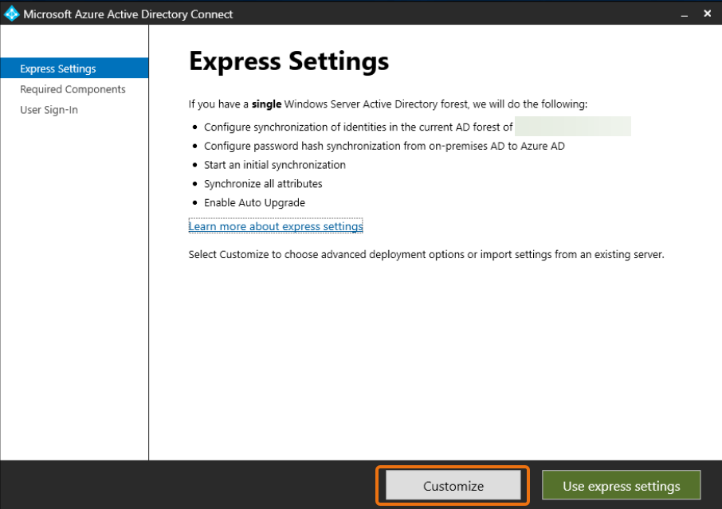
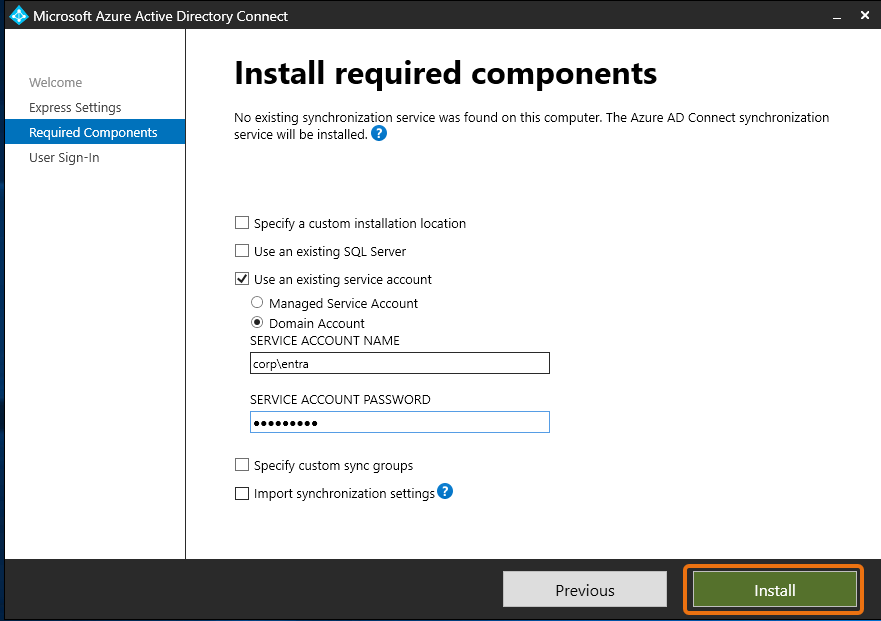
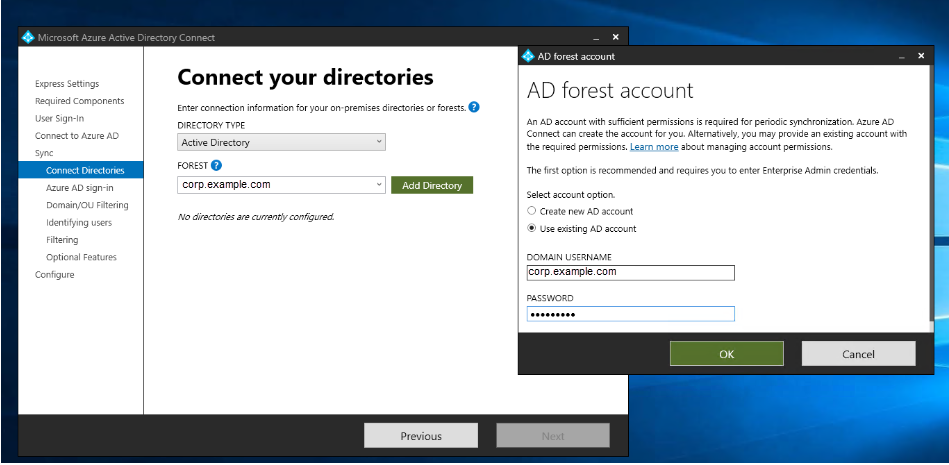

# Connecting your AWS Managed Microsoft AD to

Microsoft Entra Connect Sync

This tutorial walks you through the necessary steps to install [Microsoft Entra Connect Sync](https://learn.microsoft.com/en-us/entra/identity/hybrid/connect/how-to-connect-sync-whatis "https://learn.microsoft.com/en-us/entra/identity/hybrid/connect/how-to-connect-sync-whatis") to sync your [Microsoft Entra ID](https://learn.microsoft.com/en-us/entra/fundamentals/whatis "https://learn.microsoft.com/en-us/entra/fundamentals/whatis") to
your AWS Managed Microsoft AD.

In this tutorial, you do the following:

1. Create an AWS Managed Microsoft AD domain user.
2. Download Entra Connect Sync.
3. Use PowerShell to run a script to provision the appropriate permissions for
   the newly created user.
4. Install Entra Connect Sync.

## Prerequisites

You will need the following to complete this tutorial:

- An AWS Managed Microsoft AD. For more information, see [Creating your AWS Managed Microsoft AD](ms_ad_getting_started.md#ms_ad_getting_started_create_directory "ms_ad_getting_started.md#ms_ad_getting_started_create_directory").
- An Amazon EC2 Windows Server instance joined to your AWS Managed Microsoft AD. For more information,
  see [Joining a Windows instance](launching_instance.md "launching_instance.md").
- An EC2 Windows Server with Active Directory Administration Tools installed to manage your AWS Managed Microsoft AD.
  For more information, see [Installing Active Directory Administration
  Tools for AWS Managed Microsoft AD](ms_ad_install_ad_tools.md "ms_ad_install_ad_tools.md").

## Create an Active Directory domain user

This tutorial assumes you already have an AWS Managed Microsoft AD as well as an EC2 Windows Server
instance with Active Directory Administration Tools installed. For more information, see [Installing Active Directory Administration
Tools for AWS Managed Microsoft AD](ms_ad_install_ad_tools.md "ms_ad_install_ad_tools.md").

1. Connect to the instance where the Active Directory Administration Tools were installed.
2. Create an AWS Managed Microsoft AD domain user. This user will become the Active Directory Directory Service (AD DS) Connector account for
   Entra Connect Sync. For detailed steps on this process, see [Creating an AWS Managed Microsoft AD user](ms_ad_manage_users_groups_create_user.md "ms_ad_manage_users_groups_create_user.md").

## Download Entra Connect Sync

- Download Entra Connect Sync from [Microsoft
  website](https://www.microsoft.com/en-us/download/details.aspx?id=47594 "https://www.microsoft.com/en-us/download/details.aspx?id=47594") onto the EC2 instance that is the AWS Managed Microsoft AD admin.

###### Warning

Do not open or run Entra Connect Sync at this point. The next steps will provision
the necessary permissions for your domain user created in Step 1.

## Run PowerShell Script

- [Open PowerShell as an Administrator](https://learn.microsoft.com/en-us/powershell/scripting/windows-powershell/starting-windows-powershell?view=powershell-7.4 "https://learn.microsoft.com/en-us/powershell/scripting/windows-powershell/starting-windows-powershell?view=powershell-7.4") and run the following
  script.

While the script is running, you will be asked to enter the [sAMAccountName](https://learn.microsoft.com/en-us/windows/win32/ad/naming-properties#samaccountname "https://learn.microsoft.com/en-us/windows/win32/ad/naming-properties#samaccountname") for the newly created domain user from Step 1.

###### Note

See the following for more information on running the script:

    + You can save the script with the `ps1` extension to a folder like
     `temp`. Then, you can use the following PowerShell command to load the script:


    ```
    import-module "c:\temp\entra.ps1"
    ```
    + After loading the script, you can use the following command to set the necessary
     permissions to run the script, replacing
     `Entra_Service_Account_Name` with your
     Entra service account name:


    ```
    Set-EntraConnectSvcPerms -ServiceAccountName `Entra_Service_Account_Name`
    ```

```
$modulePath = "C:\Program Files\Microsoft Azure Active Directory Connect\AdSyncConfig\AdSyncConfig.psm1"

try {
    # Attempt to import the module
    Write-Host -ForegroundColor Green "Importing Module for Azure Entra Connect..."
    Import-Module $modulePath -ErrorAction Stop
    Write-Host -ForegroundColor Green "Success!"
}
catch {
    # Display the exception message
    Write-Host -ForegroundColor Red "An error occurred: $($_.Exception.Message)"
}

Function Set-EntraConnectSvcPerms {
    [CmdletBinding()]
    Param (
        [String]$ServiceAccountName
    )

    #Requires -Modules 'ActiveDirectory' -RunAsAdministrator

    Try {
        $Domain = Get-ADDomain -ErrorAction Stop
    } Catch [System.Exception] {
        Write-Output "Failed to get AD domain information $_"
    }

    $BaseDn = $Domain | Select-Object -ExpandProperty 'DistinguishedName'
    $Netbios = $Domain | Select-Object -ExpandProperty 'NetBIOSName'

    Try {
        $OUs = Get-ADOrganizationalUnit -SearchBase "OU=$Netbios,$BaseDn" -SearchScope 'Onelevel' -Filter * -ErrorAction Stop | Select-Object -ExpandProperty 'DistinguishedName'
    } Catch [System.Exception] {
        Write-Output "Failed to get OUs under OU=$Netbios,$BaseDn $_"
    }

    Try {
        $ADConnectorAccountDN = Get-ADUser -Identity $ServiceAccountName -ErrorAction Stop | Select-Object -ExpandProperty 'DistinguishedName'
    } Catch [System.Exception] {
        Write-Output "Failed to get service account DN $_"
    }

    Foreach ($OU in $OUs) {
        try {
        Set-ADSyncMsDsConsistencyGuidPermissions -ADConnectorAccountDN $ADConnectorAccountDN -ADobjectDN $OU -Confirm:$false -ErrorAction Stop
        Write-Host "Permissions set successfully for $ADConnectorAccountDN and $OU"

        Set-ADSyncBasicReadPermissions -ADConnectorAccountDN $ADConnectorAccountDN -ADobjectDN $OU -Confirm:$false -ErrorAction Stop
        Write-Host "Basic read permissions set successfully for $ADConnectorAccountDN on OU $OU"
    }
    catch {
        Write-Host "An error occurred while setting permissions for $ADConnectorAccountDN on OU $OU : $_"
    }
    }
}
```

[Show moreShow less](# "#")

## Install Entra Connect Sync

1. Once the script has completed, you can run the downloaded Microsoft Entra Connect (formerly known as Azure Active Directory Connect)
   configuration file.
2. A Microsoft Azure Active Directory Connect window opens after running the
   configuration file from the previous step. On the **Express Settings**
   window, select **Customize**.

 3. On the **Install required components** window, select the
**Use an existing service account** checkbox. In **SERVICE
ACCOUNT NAME** and **SERVICE ACCOUNT PASSWORD**, enter the
AD DS Connector account name and password for the user you created in Step 1. For example,
if your AD DS Connector account name is `entra`, the account name would be
`corp\entra`. Then select **Install**.

 4. On the **User Sign-in** window, select one of the following
options:

    1. [Pass-through Authentication](https://learn.microsoft.com/en-us/entra/identity/hybrid/connect/how-to-connect-pta "https://learn.microsoft.com/en-us/entra/identity/hybrid/connect/how-to-connect-pta") - This option allows you to sign in to your
     Active Directory with your username and password.
    2. **Do not configure** - This allows you to use federated sign in
     with Microsoft Entra (formerly known as Azure Active Directory (Azure AD)) or Office 365.


    Then select **Next**.

5. On the **Connect to Azure** window, enter your [Global Administrator](https://learn.microsoft.com/en-us/entra/identity/role-based-access-control/permissions-reference#global-administrator "https://learn.microsoft.com/en-us/entra/identity/role-based-access-control/permissions-reference#global-administrator") username and password for Entra ID and select
   **Next**.
6. On the **Connect your directories** window, choose
   **Active Directory** for **DIRECTORY TYPE**. Choose the forest for
   your AWS Managed Microsoft AD for **FOREST**. Then select **Add
   Directory**.
7. A pop-up box appears requesting your account options. Select **Use existing AD
   account**. Enter the AD DS Connector account username and password created in
   Step 1 and then select **OK**. Then select
   **Next**.

 8. On the **Azure AD Sign-in** window, select
**Continue without matching all UPN suffixes to verified domains**,
only if you do not have a verified vanity domain added to Entra ID. Then select
**Next**. 9. On **Domain/OU filtering** window, select the options to suit your
needs. For more information, see [Entra Connect Sync: Configure filtering](https://learn.microsoft.com/en-us/entra/identity/hybrid/connect/how-to-connect-sync-configure-filtering "https://learn.microsoft.com/en-us/entra/identity/hybrid/connect/how-to-connect-sync-configure-filtering") in Microsoft documentation. Then select
**Next**. 10. On the **Identifying Users, Filtering and Optional Features** window,
keep the default values and select **Next**. 11. On the **Configure** window, review the configuration settings and
select **Configure**. The installation for Entra Connect Sync will
finalize and users will begin to synchronize with Microsoft Entra ID.
