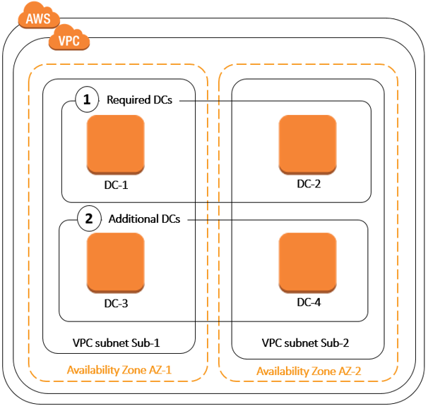

# Deploying additional domain controllers for your

AWS Managed Microsoft AD

Deploying additional domain controllers for your AWS Managed Microsoft AD increases the redundancy,
which results in even greater resilience and higher availability. This also improves the
performance of your directory by supporting a greater number of Active Directory requests. For example, you
can now use AWS Managed Microsoft AD to support multiple .NET applications that are deployed on large fleets
of Amazon EC2 and Amazon RDS for SQL Server instances.

When you first create your directory, AWS Managed Microsoft AD deploys two domain controllers across
multiple Availability Zones, which is required for highly availability purposes. Later, you can
easily deploy additional domain controllers via the AWS Directory Service console by just specifying the total
number of domain controllers that you want. AWS Managed Microsoft AD distributes the additional domain
controllers to the Availability Zones and Amazon VPC subnets on which your directory is running.

For example, in the below illustration, DC-1 and DC-2 represent the two domain controllers
that were originally created with your directory. The AWS Directory Service console refers to these default
domain controllers as **Required**. AWS Managed Microsoft AD intentionally locates each of
these domain controllers in separate Availability Zones during the directory creation process.
Later, you might decide to add two more domain controllers to help distribute the authentication
load over peak login times. Both DC-3 and DC-4 represent the new domain controllers, which the
console now refers to as **Additional**. As before, AWS Managed Microsoft AD again
automatically places the new domain controllers in different Availability Zones to ensure your
domain's high availability.


This process eliminates the need for you to manually configure directory data replication,
automated daily snapshots, or monitoring for the additional domain controllers. It's also easier
for you to migrate and run mission critical Active Directory–integrated workloads in the AWS Cloud
without having to deploy and maintain your own Active Directory infrastructure.

You can use either of the following tools to deploy or remove additional domain controllers
to your AWS Managed Microsoft AD:

- [`update-number-of-domain-controllers`](https://awscli.amazonaws.com/v2/documentation/api/latest/reference/ds/update-number-of-domain-controllers.html "https://awscli.amazonaws.com/v2/documentation/api/latest/reference/ds/update-number-of-domain-controllers.html") AWS CLI command
- [UpdateNumberOfDomainControllers](../devguide/API_UpdateNumberOfDomainControllers.md "../devguide/API_UpdateNumberOfDomainControllers.md") API
- [Adding or removing additional domain controllers with the
  AWS Management Console](#addremovedcs "#addremovedcs")

###### Note

Additional domain controllers is a Regional feature of AWS Managed Microsoft AD.
If you are using [Multi-Region replication](ms_ad_configure_multi_region_replication.md "ms_ad_configure_multi_region_replication.md"), the
following procedures must be applied separately in each Region. For more information, see
[Global vs Regional features](multi-region-global-region-features.md "multi-region-global-region-features.md").

## Adding or removing additional domain controllers with the

AWS Management Console

You can use the AWS Management Console to add or remove additional domain controllers to your
AWS Managed Microsoft AD.

### Prerequisites

Before adding or removing additional domain controllers to your AWS Managed Microsoft AD, here's
more information about domain controller requirements:

- After deploying additional domain controllers, you can reduce the number of domain
  controllers to two, which is the minimum required for fault-tolerance and high
  availability purposes.
- The deleted domain controllers will be delete from the list of additional domain
  controllers. The primary and secondary domain controllers are required and can't be
  deleted.
- If you have configured your AWS Managed Microsoft AD to enable LDAPS, any additional domain
  controllers you add will also have LDAPS enabled automatically. For more information,
  see [Enable Secure LDAP or LDAPS](ms_ad_ldap.md "ms_ad_ldap.md").

### Procedure

Use the following procedure to deploy or remove additional domain controllers in your
AWS Managed Microsoft AD with the AWS Management Console, AWS CLI, or PowerShell.

AWS Management Console

###### To add or remove additional domain controllers with the AWS Management Console

1. In the [AWS Directory Service console](https://console.aws.amazon.com/directoryservicev2/ "https://console.aws.amazon.com/directoryservicev2/") navigation pane, choose
   **Directories**.
2. On the **Directories** page, choose your directory ID.
3. On the **Directory details** page, do one of the
   following:
   - If you have multiple Regions showing under
     **Multi-Region replication**, select the
     Region where you want to add or remove domain controllers, and
     then choose the **Scale & share** tab. For
     more information, see [Primary vs additional Regions](multi-region-global-primary-additional.md "multi-region-global-primary-additional.md").
   - If you do not have any Regions showing under
     **Multi-Region replication**, choose the **Scale & share** tab.

4. In the **Domain controllers** section, choose
   **Edit**.
5. Specify the number of domain controllers to add or remove from your directory,
   and then choose **Modify**.
6. When AWS Managed Microsoft AD completes the deployment process, all domain controllers
   show **Active** status, and both the assigned
   Availability Zone and Amazon VPC subnets appear. New domain controllers are equally
   distributed across the Availability Zones and subnets where your directory is
   already deployed.

AWS CLI

###### To add or remove additional domain controllers with AWS CLI

1. Open the AWS CLI. To check the current number of domain controllers, run the
   following command, replacing the Directory ID with your AWS Managed Microsoft AD Directory ID:

```
aws ds describe-directories --directory-id `d-1234567890` | grep DesiredNumberOfDomainControllers
```

2. To add or remove domain controllers, you can use the [`update-number-of-domain-controllers`](https://awscli.amazonaws.com/v2/documentation/api/latest/reference/ds/update-number-of-domain-controllers.html "https://awscli.amazonaws.com/v2/documentation/api/latest/reference/ds/update-number-of-domain-controllers.html") command. For
   example, you can use the following command to set the total number of domain
   controllers to 4. Ensure you replace the Directory ID with your AWS Managed Microsoft AD
   Directory ID and the `desired-number` parameter with the number of domain
   controllers you want to deploy.

```
aws ds update-number-of-domain-controllers --directory-id `d-1234567890` --desired-number `4`
```

PowerShell

###### To add or remove additional domain controllers with

PowerShell

1. Open PowerShell. To check the current number of domain
   controllers, run the following command, replacing the Directory ID with your
   AWS Managed Microsoft AD Directory ID:

```
Get-DSDirectory -DirectoryId `d-1234567890` | Select-Object DesiredNumberOfDomainControllers
```

2. To add or remove domain controllers, you can use the [`Set-DSDomainControllerCount`](../../../powershell/latest/reference/items/Set-DSDomainControllerCount.md "../../../powershell/latest/reference/items/Set-DSDomainControllerCount.md") command. For example, you
   can use the following command to set the total number of domain controllers to 4.
   Ensure you replace the Directory ID with your AWS Managed Microsoft AD Directory ID and the
   `DesiredNumber` parameter with the number of domain controllers you want to
   deploy.

```
Set-DSDomainControllerCount -DirectoryId `d-1234567890` -DesiredNumber `4`
```

**Related AWS Security Blog Article**

- [How to increase the redundancy and performance of your AWS Directory Service for AWS Managed Microsoft AD by adding
  domain controllers](https://aws.amazon.com/blogs/security/how-to-increase-the-redundancy-and-performance-of-your-aws-directory-service-for-microsoft-ad-directory-by-adding-domain-controllers/ "https://aws.amazon.com/blogs/security/how-to-increase-the-redundancy-and-performance-of-your-aws-directory-service-for-microsoft-ad-directory-by-adding-domain-controllers/")
