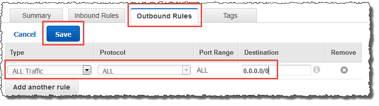
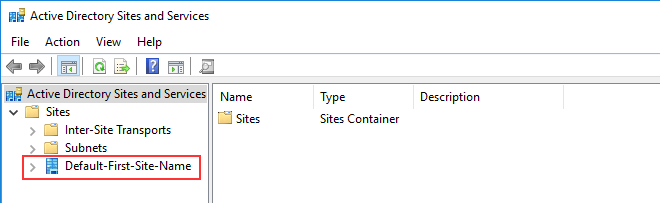

# Trust creation status reasons

When trust creation fails for AWS Managed Microsoft AD, the status message contains additional
information. The following can help you understand what those messages mean.

## Access is denied

Access was denied when trying to create the trust. Either the trust password is incorrect
or the remote domain's security settings do not allow a trust to be configured. For more
information on trusts, see [Enhancing Trust Efficiency with Site Names and
DCLocator](#enhancing-trust-site-names "#enhancing-trust-site-names"). To resolve this problem, try the
following:

- Verify that you are using the same trust password that you used when creating the
  corresponding trust on the remote domain.
- Verify that your domain security settings allow for trust creation.
- Verify that your local security policy is set correctly. Specifically check
  `Local Security Policy > Local Policies > Security Options > Network access: Named
Pipes that can be accessed anonymously` and ensure that it contains at least the
  following three named pipes:
  - netlogon
  - samr
  - lsarpc

- Verify that the above named pipes exist as the value(s) on the
  **NullSessionPipes** registry key which is in the registry path
  **HKLM\SYSTEM\CurrentControlSet\services\LanmanServer\Parameters**.
  These values must be inserted on separated rows.

###### Note

By default, `Network access: Named Pipes that can be accessed
 anonymously` is not set and will display `Not Defined`. This is
normal, as the domain controller's effective default settings for `Network access:
 Named Pipes that can be accessed anonymously` is `netlogon`,
`samr`, `lsarpc`.

- Verify the following Server Message Block (SMB) Signing Setting in the
  _Default Domain Controllers Policy_. These settings can be found
  under **Computer Configuration** > **Windows Settings**

  > **Security Settings** > **Local Policies/Security
  > Options**. They should match the following settings:
  - Microsoft network client: Digitally sign communications (always): Default:
    Enabled
  - Microsoft network server: Digitally sign communications (always): Enabled

### Enhancing Trust Efficiency with Site Names and

DCLocator

The First Site name like Default-First-Site-Name is not a requirement for establishing
trust relationships between domains. However, aligning site names between domains can
significantly improve the efficiency of the Domain Controller Locator (DCLocator) process.
This alignment improves predicting and controlling the selection of domain controllers
across the forest trusts.

The DCLocator process is crucial for finding domain controllers across different domains
and forests. For more information on the DCLocator process, see [Microsoft documentation](https://learn.microsoft.com/en-us/troubleshoot/windows-server/active-directory/troubleshoot-domain-controller-location-issues "https://learn.microsoft.com/en-us/troubleshoot/windows-server/active-directory/troubleshoot-domain-controller-location-issues"). Efficient site configuration allows for quicker and more
accurate domain controller location, which leads to better performance and reliability in
cross-forest operations.

For more information on how site names and DCLocator process interacts, see the
following Microsoft articles:

- [How Domain Controllers are Located Across Trusts](https://techcommunity.microsoft.com/t5/core-infrastructure-and-security/how-domain-controllers-are-located-across-trusts/ba-p/256180 "https://techcommunity.microsoft.com/t5/core-infrastructure-and-security/how-domain-controllers-are-located-across-trusts/ba-p/256180")
- [Domain Locator Across Forests](https://techcommunity.microsoft.com/blog/askds/domain-locator-across-a-forest-trust/395689 "https://techcommunity.microsoft.com/blog/askds/domain-locator-across-a-forest-trust/395689")

## The specified domain name does not exist or could not be

contacted

To resolve
this problem, ensure the security group settings for your domain and access control list (ACL)
for your VPC are correct and you have accurately entered the information for your conditional
forwarder. AWS configures the security group to open only the ports that are required for Active Directory
communications. In the default configuration, the security group accepts traffic to these
ports from any IP address. Outbound traffic is restricted to the Security group. You will need
to update the outbound rule on the security group to allow traffic to your on premise network.
For more information about security requirements, please see [Step 2: Prepare your
AWS Managed Microsoft AD](ms_ad_tutorial_setup_trust_prepare_mad.md "ms_ad_tutorial_setup_trust_prepare_mad.md").

If the DNS servers for the networks of the other directories use public (non-RFC 1918) IP
addresses, you will need add an IP route on the directory from the Directory Services Console
to the DNS Servers. For more information, see [Create, verify, or delete a trust relationship](ms_ad_setup_trust.md#trust_steps "ms_ad_setup_trust.md#trust_steps") and [Prerequisites](ms_ad_setup_trust.md#trust_prereq "ms_ad_setup_trust.md#trust_prereq").

The Internet Assigned Numbers Authority (IANA) has reserved the following three blocks of
the IP address space for private internets:

- 10.0.0.0 - 10.255.255.255 (10/8 prefix)
- 172.16.0.0 - 172.31.255.255 (172.16/12 prefix)
- 192.168.0.0 - 192.168.255.255 (192.168/16 prefix)

For more information, see [https://tools.ietf.org/html/rfc1918](https://tools.ietf.org/html/rfc1918 "https://tools.ietf.org/html/rfc1918").

Verify that the **Default AD Site Name** for your AWS Managed Microsoft AD matches
the **Default AD Site Name** in your on-premises infrastructure. The computer
determines the site name using a domain of which the computer is a member, not the user's
domain. Renaming the site to match the closest on-premises ensures the DC locator will use a
domain controller from the closest site. If this does not solve the issue, it is possible that
information from a previously created conditional forwarder has been cached, preventing the
creation of a new trust. Wait several minutes, and then try creating the trust and conditional
forwarder again.

For more information about how this works, see [Domain Locator Across a Forest Trust](https://techcommunity.microsoft.com/t5/ask-the-directory-services-team/domain-locator-across-a-forest-trust/ba-p/395689 "https://techcommunity.microsoft.com/t5/ask-the-directory-services-team/domain-locator-across-a-forest-trust/ba-p/395689") on Microsoft website.

## The operation could not be performed on this

domain

To resolve this, ensure both domains / directories do not have overlapping NETBIOS
name(s). If the domains / directories do have overlapping NETBIOS names, recreate one of them
with a different NETBIOS name, and then try again.

## Trust creation is failing because of the error

"Required and valid domain name"

DNS names can contain only alphabetical characters (A-Z), numeric characters (0-9), the
minus sign (-), and a period (.). Period characters are allowed only when they are used to
delimit the components of domain style names. Also, consider the following:

- AWS Managed Microsoft AD does not support trusts with Single label domains. For more information,
  see [Microsoft support for Single Label Domains](https://docs.microsoft.com/en-US/troubleshoot/windows-server/networking/single-label-domains-support-policy "https://docs.microsoft.com/en-US/troubleshoot/windows-server/networking/single-label-domains-support-policy").
- According to RFC 1123 ([https://tools.ietf.org/html/rfc1123](https://tools.ietf.org/html/rfc1123 "https://tools.ietf.org/html/rfc1123")), the only characters that can be used in
  DNS labels are "A" to "Z", "a" to "z", "0" to "9", and a hyphen ("-"). A period [.] is
  also used in DNS names, but only between DNS labels and at the end of an FQDN.
- According to RFC 952 ([https://tools.ietf.org/html/rfc952](https://tools.ietf.org/html/rfc952 "https://tools.ietf.org/html/rfc952")), a "name" (Net, Host, Gateway, or Domain
  name) is a text string up to 24 characters drawn from the alphabet (A-Z), digits (0-9),
  minus sign (-), and period (.). Note that periods are only allowed when they serve to
  delimit components of "domain style names".

For more information, see [Complying with Name Restrictions for Hosts and Domains](<https://docs.microsoft.com/en-us/previous-versions/windows/it-pro/windows-2000-server/cc959336(v=technet.10)> "https://docs.microsoft.com/en-us/previous-versions/windows/it-pro/windows-2000-server/cc959336(v=technet.10)") on Microsoft website.

## General tools for testing trusts

The following are tools that can be used to troubleshoot various trust related
issues.

**AWS Systems Manager Automation troubleshooting tool**

[Support Automation Workflows (SAW)](../../../systems-manager/latest/userguide/automation-walk-support.md "../../../systems-manager/latest/userguide/automation-walk-support.md") leverage AWS Systems Manager Automation to provide you
with a predefined runbook for Directory Service. The [AWSSupport-TroubleshootDirectoryTrust](../../../systems-manager/latest/userguide/automation-awssupport-troubleshootdirectorytrust.md "../../../systems-manager/latest/userguide/automation-awssupport-troubleshootdirectorytrust.md") runbook tool helps you diagnose common trust
creation issues between AWS Managed Microsoft AD and an on-premises Microsoft Active Directory.

**DirectoryServicePortTest tool**

The [DirectoryServicePortTest](samples/DirectoryServicePortTest.md "samples/DirectoryServicePortTest.md")
testing tool can be helpful when troubleshooting trust creation issues between AWS Managed Microsoft AD
and on-premises Active Directory. For an example on how the tool can be used, see [Test your AD Connector](ad_connector_getting_started.md#connect_verification "ad_connector_getting_started.md#connect_verification").

**NETDOM and NLTEST tool**

Administrators can use both the **Netdom** and
**Nltest** command-line tools to find, display, create, remove and manage
trusts. These tools communicate directly with the LSA authority on a domain controller. For an
example on how to use these tools, see [Netdom](<https://docs.microsoft.com/en-us/previous-versions/windows/it-pro/windows-server-2012-r2-and-2012/cc772217(v=ws.11)> "https://docs.microsoft.com/en-us/previous-versions/windows/it-pro/windows-server-2012-r2-and-2012/cc772217(v=ws.11)") and [NLTEST](<https://docs.microsoft.com/en-us/previous-versions/windows/it-pro/windows-server-2012-r2-and-2012/cc731935(v=ws.11)> "https://docs.microsoft.com/en-us/previous-versions/windows/it-pro/windows-server-2012-r2-and-2012/cc731935(v=ws.11)") on Microsoft website.

**Packet capture tool**

You can use the built-in Windows package capture utility to investigate and troubleshoot a
potential network issue. For more information, see [Capture a Network Trace without installing anything](https://techcommunity.microsoft.com/t5/iis-support-blog/capture-a-network-trace-without-installing-anything-amp-capture/ba-p/376503 "https://techcommunity.microsoft.com/t5/iis-support-blog/capture-a-network-trace-without-installing-anything-amp-capture/ba-p/376503").
