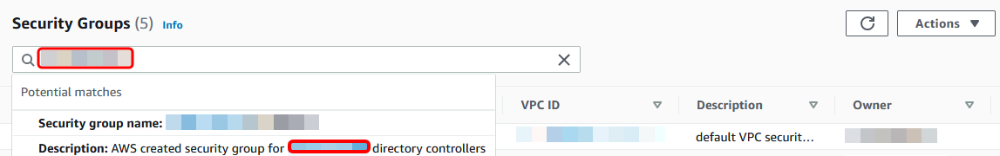
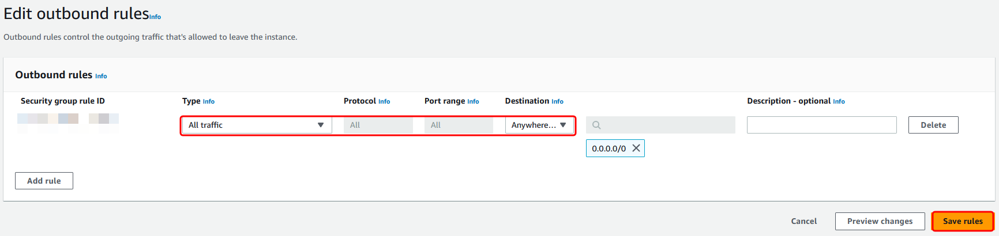

# Step 2: Prepare your

AWS Managed Microsoft AD

Now let's get your AWS Managed Microsoft AD ready for the trust relationship. Many of the
following steps are almost identical to what you just completed for your self-managed domain.
This time, however, you are working with your AWS Managed Microsoft AD.

## Configure your VPC subnets and security

groups

You must allow traffic from your self-managed network to the VPC containing
your AWS Managed Microsoft AD. To do this, you will need to make sure that the ACLs associated with the
subnets used to deploy your AWS Managed Microsoft AD and the security group rules configured on your
domain controllers, both allow the requisite traffic to support trusts.

Port requirements vary based on the version of Windows Server used by your domain
controllers and the services or applications that will be leveraging the trust. For the
purposes of this tutorial, you will need to open the following ports:

**Inbound**

- TCP/UDP 53 - DNS
- TCP/UDP 88 - Kerberos authentication
- UDP 123 - NTP
- TCP 135 - RPC
- TCP/UDP 389 - LDAP
- TCP/UDP 445 - SMB
- TCP/UDP 464 - Kerberos authentication
- TCP 636 - LDAPS (LDAP over TLS/SSL)
- TCP 3268-3269 - Global Catalog
- TCP/UDP 49152-65535 - Ephemeral ports for RPC

###### Note

SMBv1 is no longer supported.

**Outbound**

- ALL

###### Note

These are the minimum ports that are needed to be able to connect the VPC and self-managed
directory. Your specific configuration may require additional ports be open.

###### To configure your AWS Managed Microsoft AD domain controller outbound and inbound

rules

1. Return to the [AWS Directory Service console](https://console.aws.amazon.com/directoryservicev2/ "https://console.aws.amazon.com/directoryservicev2/"). In the list of directories, take note the directory ID for your AWS Managed Microsoft AD directory.
2. Open the Amazon VPC console at
   [https://console.aws.amazon.com/vpc/](https://console.aws.amazon.com/vpc/ "https://console.aws.amazon.com/vpc/").
3. In the navigation pane, choose **Security
   Groups**.
4. Use the search box to search for your AWS Managed Microsoft AD directory ID. In
   the search results, select the Security Group with the description `AWS created security
group for `yourdirectoryID` directory controllers`.

 5. Go to the **Outbound Rules** tab for that security
group. Choose **Edit outbound rules**, and then **Add rule**.
For the new rule, enter the following values:

    * **Type**: ALL Traffic
    * **Protocol**: ALL
    * **Destination** determines the traffic that
     can leave your domain controllers and where it can go. Specify a single
     IP address or an IP address range in CIDR notation (for example,
     203.0.113.5/32). You can also specify the name or ID of another security
     group in the same Region. For more information, see [Understand your directory's AWS security group
     configuration and use](ms_ad_best_practices.md#understandsecuritygroup "ms_ad_best_practices.md#understandsecuritygroup").

6. Select **Save Rule**.

## Ensure that Kerberos pre-authentication is enabled

Now you want to confirm that users in your AWS Managed Microsoft AD also have Kerberos
pre-authentication enabled. This is the same process you completed for your self-managed
directory. This is the default, but let's check to make sure nothing has changed.

###### To view user kerberos settings

1. Log in to an instance that is a member of your AWS Managed Microsoft AD
   directory using either the [AWS Managed Microsoft AD Administrator account and
   group permissions](ms_ad_getting_started_admin_account.md "ms_ad_getting_started_admin_account.md") for the domain or an account that
   has been delegated permissions to manage users in the domain.
2. If they are not already installed, install the Active Directory Users
   and Computers tool and the DNS tool. Learn how to install these tools in
   [Installing Active Directory Administration
   Tools for AWS Managed Microsoft AD](ms_ad_install_ad_tools.md "ms_ad_install_ad_tools.md").
3. Open Server Manager. On the **Tools** menu, choose **Active Directory Users and Computers**.
4. Choose the **Users** folder in your domain. Note that this is the **Users** folder under your NetBIOS name, not the **Users** folder under the fully qualified domain name (FQDN).

 5. In the list of users, right-click on a user, and then choose
**Properties**. 6. Choose the **Account** tab. In the **Account options** list, ensure that **Do not require Kerberos preauthentication** is _not_ checked.

**Next Step**

[Step 3: Create the trust
relationship](ms_ad_tutorial_setup_trust_create.md "ms_ad_tutorial_setup_trust_create.md")
