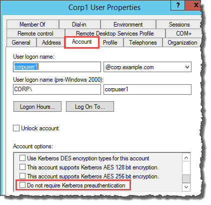
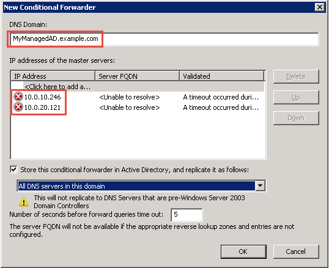

# Step 1: Prepare your

self-managed AD Domain

First you need to complete several prerequisite steps on your self-managed (on-premises)
domain.

## Configure your self-managed

firewall

You must configure your self-managed firewall so that the following ports are open to
the CIDRs for all subnets used by the VPC that contains your AWS Managed Microsoft AD. In this
tutorial, we allow both incoming and outgoing traffic from 10.0.0.0/16 (the CIDR block
of our AWS Managed Microsoft AD's VPC) on the following ports:

- TCP/UDP 53 - DNS
- TCP/UDP 88 - Kerberos authentication
- TCP/UDP 389 - Lightweight Directory Access Protocol (LDAP)
- TCP 445 - Server Message Block (SMB)
- TCP 9389 - Active Directory Web Services (ADWS) (_Optional_

* This port needs to be open if you want to use your NetBIOS name instead of your full domain name for authentication with AWS applications like
  Amazon WorkDocs or Amazon Quick Suite.)

###### Note

SMBv1 is no longer supported.

These are the minimum ports that are needed to connect the VPC to the self-managed
directory. Your specific configuration may require additional ports be open.

## Ensure that Kerberos

pre-authentication is enabled

User accounts in both directories must have Kerberos preauthentication enabled. This
is the default, but let's check the properties of any random user to make sure nothing
has changed.

###### To view user's Kerberos settings

1. On your self-managed domain controller, open Server Manager.
2. On the **Tools** menu, choose **Active Directory
   Users and Computers**.
3. Choose the **Users** folder and open the context
   (right-click) menu. Select any random user account listed in the right pane.
   Choose **Properties**.
4. Choose the **Account** tab. In the **Account
   options** list, scroll down and ensure that **Do not
   require Kerberos preauthentication** is _not_
   checked.

## Configure DNS conditional

forwarders for your self-managed domain

You must set up DNS conditional forwarders on each domain. Before doing this on your
self-managed domain, you will first get some information about your AWS Managed Microsoft AD.

###### To configure conditional forwarders on your self-managed domain

1. Sign into the AWS Management Console and open the [AWS Directory Service console](https://console.aws.amazon.com/directoryservicev2/ "https://console.aws.amazon.com/directoryservicev2/").
2. In the navigation pane, select **Directories**.
3. Choose the directory ID of your AWS Managed Microsoft AD.
4. On the **Details** page, take note of the values in
   **Directory name** and the **DNS address**
   of your directory.
5. Now, return to your self-managed domain controller. Open Server
   Manager.
6. On the **Tools** menu, choose
   **DNS**.
7. In the console tree, expand the DNS server of the domain for which you are
   setting up the trust. Our server is WIN-5V70CN7VJ0.corp.example.com.
8. In the console tree, choose **Conditional
   Forwarders**.
9. On the **Action** menu, choose **New conditional
   forwarder**.
10. In **DNS domain**, type the fully qualified domain name
    (FQDN) of your AWS Managed Microsoft AD, which you noted earlier. In this example, the FQDN
    is MyManagedAD.example.com.
11. Choose **IP addresses of the primary servers** and type the
    DNS addresses of your AWS Managed Microsoft AD directory, which you noted earlier. In this
    example those are: 10.0.10.246, 10.0.20.121

After entering the DNS addresses, you might get a "timeout" or "unable to
resolve" error. You can generally ignore these errors.

 12. Select **Store this conditional forwarder in Active Directory, and
replicate it as follows**. 13. Select **All DNS servers in this domain**, and then choose
**OK**.

**Next Step**

[Step 2: Prepare your
AWS Managed Microsoft AD](ms_ad_tutorial_setup_trust_prepare_mad.md "ms_ad_tutorial_setup_trust_prepare_mad.md")
