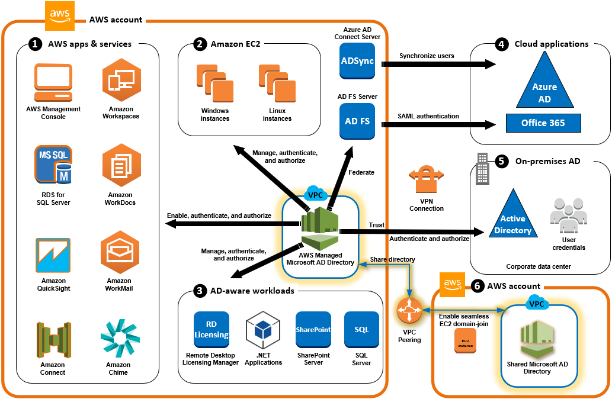

# Use cases for AWS Managed Microsoft AD

With AWS Managed Microsoft AD, you can share a single directory for multiple use cases. For example, you
can share a directory to authenticate and authorize access for .NET applications, [Amazon RDS for SQL Server](https://aws.amazon.com/rds/sqlserver/ "https://aws.amazon.com/rds/sqlserver/") with [Windows
authentication](../../../AmazonRDS/latest/UserGuide/USER_SQLServerWinAuth.md "../../../AmazonRDS/latest/UserGuide/USER_SQLServerWinAuth.md") enabled, and [Amazon Chime](https://chime.aws/ "https://chime.aws/") for
messaging and video conferencing.

The following diagram shows some of the use cases for your AWS Managed Microsoft AD directory. These
include the ability to grant your users access to external cloud applications and allow your
on-premises Active Directory users to manage and have access to resources in the AWS Cloud.

Use AWS Managed Microsoft AD for either of the following business use cases.

###### Topics

- [Use Case 1: Sign in to AWS applications and services with Active Directory
  credentials](usecase1.md "usecase1.md")
- [Use Case 2: Manage Amazon EC2 instances](usecase2.md "usecase2.md")
- [Use Case 3: Provide directory services to your Active Directory-aware
  workloads](usecase3.md "usecase3.md")
- [Use Case 4: AWS IAM Identity Center to Office 365 and other cloud applications](usecase4.md "usecase4.md")
- [Use Case 5: Extend your on-premises Active Directory to the AWS Cloud](usecase5.md "usecase5.md")
- [Use Case 6: Share your directory to seamlessly join Amazon EC2 instances
  to a domain across AWS accounts](usecase6.md "usecase6.md")
