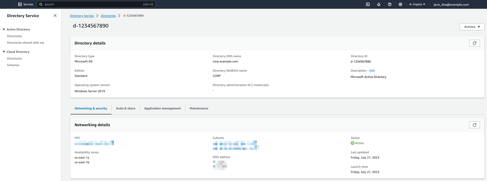

# Viewing AWS Managed Microsoft AD directory

information

You can use the AWS Management Console to view your AWS Managed Microsoft AD directory details like:

- Directory type
- Directory ID
- Directory status
- Networking details for your AWS Managed Microsoft AD like:

      + Amazon VPC
      + Subnets
      + Availability zones
      + DNS addresses

  You can find the following information about your AWS Managed Microsoft AD:

- Under the **Share & share** tab, you can share your
  AWS Managed Microsoft AD with other AWS accounts and learn the networking details for your
  domain controllers.
- Under the **Application management** tab, you can enable an
  application access URL for your AWS Managed Microsoft AD and enable AWS applications and
  services for your AWS Managed Microsoft AD.
- Under the **Maintenance** tab, you can enable Amazon Simple Notification Service to
  receive notifications of your AWS Managed Microsoft AD status and review snapshots of your
  AWS Managed Microsoft AD.
- For more information about the **Status** field, see [Understanding your AWS Managed Microsoft AD directory status](ms_ad_directory_status.md "ms_ad_directory_status.md").
  You can view AWS Managed Microsoft AD directory information using the AWS Management Console, AWS CLI,
  or PowerShell:

AWS Management Console

###### To view detailed directory information

1. In the [AWS Directory Service console](https://console.aws.amazon.com/directoryservicev2/ "https://console.aws.amazon.com/directoryservicev2/") navigation pane, under **Active Directory**, select
   **Directories**.
2. Choose the directory ID link for your directory. Information about the
   directory is displayed in the **Directory details**
   page.



AWS CLI

###### To view detailed directory information with the AWS CLI

- Open the AWS CLI. To view your AWS Managed Microsoft AD directory information, run the
  following command, replacing the Directory ID with your AWS Managed Microsoft AD
  Directory ID:

```
aws ds describe-directories --directory-id `d-1234567890` --output table
```

For more information, see [`describe-directories`](https://awscli.amazonaws.com/v2/documentation/api/latest/reference/ds/describe-directories.html "https://awscli.amazonaws.com/v2/documentation/api/latest/reference/ds/describe-directories.html").

PowerShell

###### To view detailed directory information with PowerShell

- Open PowerShell. To view your AWS Managed Microsoft AD directory
  information, run the following command, replacing the Directory ID with
  your AWS Managed Microsoft AD Directory ID:

```
(Get-DSDirectory -DirectoryId `d-1234567890` |
    ForEach-Object {$_, $_.RegionsInfo, $_.VpcSettings}) |
Format-List *
```

For more information, see [`Get-DSDirectory`](../../../powershell/latest/reference/items/Get-DSDirectory.md "../../../powershell/latest/reference/items/Get-DSDirectory.md").
