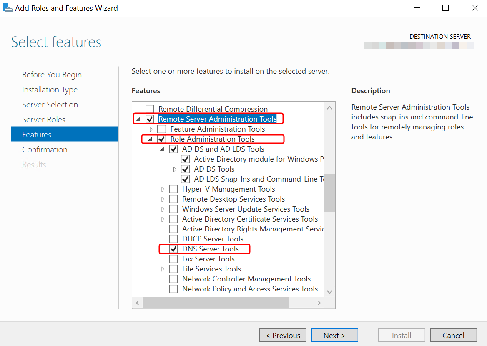

# Installing the Active Directory Administration

Tools for Simple AD

To manage your Active Directory from an Amazon EC2 Windows Server instance, you need to install the
Active Directory Domain Services and Active Directory Lightweight Directory Services Tools on the
instance. Use the following procedure to install these tools on an EC2 Windows Server
instance.

## Prerequisites

Before you can begin this procedure, complete the following:

1. Create a Simple AD Active Directory. For more information, see [Create your Simple AD](simple_ad_getting_started.md#how_to_create_simple_ad "simple_ad_getting_started.md#how_to_create_simple_ad").
2. Launch and join an EC2 Windows Server instance to your Simple AD Active Directory.
   The EC2 instance needs the following policies to create users and groups:
   `AmazonSSMManagedInstanceCore` and
   `AmazonSSMDirectoryServiceAccess`. For more
   information, see [Joining an Amazon EC2 Windows instance to your
   Simple AD Active Directory](simple_ad_launching_instance.md "simple_ad_launching_instance.md").
3. You will need the credentials for your Active Directory domain
   Administrator. These credentials were created when the Simple AD was
   created. If you followed the procedure in [Create your Simple AD](simple_ad_getting_started.md#how_to_create_simple_ad "simple_ad_getting_started.md#how_to_create_simple_ad"), your Administrator username
   includes your NetBIOS name,
   `corp\administrator`.

###### To install the Active Directory administration tools on EC2 Windows Server instance

1. Open the Amazon EC2 console at
   [https://console.aws.amazon.com/ec2/](https://console.aws.amazon.com/ec2/ "https://console.aws.amazon.com/ec2/").
2. In the Amazon EC2 console, choose **Instances**, select the Windows Server instance, and then choose **Connect**.
3. In the **Connect to instance** page, choose **RDP client**.
4. In the **RDP client** tab, choose **Download Remote Desktop File**, then choose **Get Password** to retrieve your password.
5. In the **Get Windows password**, choose **Upload private key file**. Choose the .pem private key file associated with the Windows Server instance. After uploading the private key file, select **Decrypt password**.
6. In the **Windows Security** dialog box, copy your local administrator credentials for the Windows Server computer to sign in. The username can be in the following formats: ``NetBIOS-Name`\administrator`
or ``DNS-Name`\administrator`. For example, `corp\administrator` would be the username if you followed the procedure in [Create your Simple AD](simple_ad_getting_started.md#how_to_create_simple_ad "simple_ad_getting_started.md#how_to_create_simple_ad").
7. Once signed in to the Windows Server instance, open **Server Manager** from the Start menu by choosing **Server
   Manager**.
8. In the **Server Manager Dashboard**, choose **Add
   roles and features**.
9. In the **Add Roles and Features Wizard** choose
   **Installation Type**, select **Role-based or
   feature-based installation**, and choose
   **Next**.
10. Under **Server Selection**, make sure the local server is
    selected, and choose **Features** in the left navigation pane.
11. In the **Features** tree, select and open **Remote Server
    Administration Tools**, **Role Administration
    Tools**, and **AD DS and AD LDS Tools**. With **AD DS and AD LDS Tools** selected, **Active Directory module for PowerShell**, **AD DS Tools**,
    and **AD LDS Snap-ins and Command-Line Tools** are selected. Scroll down and select **DNS Server Tools**, and then choose **Next**.

 12. Review the information and choose **Install**. When the
feature installation is finished, the Active Directory Domain Services and
Active Directory Lightweight Directory Services Tools are available from the Start
menu in the **Administrative Tools** folder.
