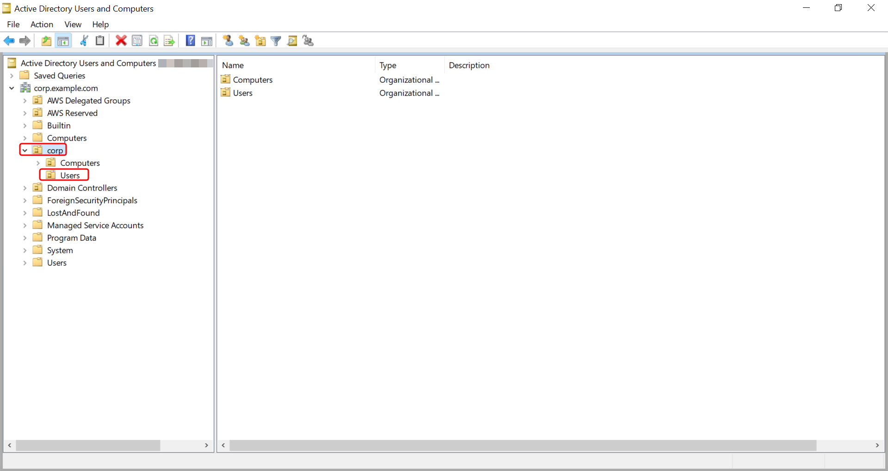

# Adding a Simple AD user to a group

Use the following procedure to add a user to a security group with an EC2 instance that is joined
to your Simple AD directory.

###### To add a user to a group

1. Connect to the instance where the Active Directory Administration Tools were installed.
2. Open the Active Directory Users and Computers tool. There is a shortcut to
   this tool in the **Administrative Tools** folder.

###### Tip

You can run the following from a command prompt on the instance to
open the Active Directory Users and Computers tool box directly.

```
%SystemRoot%\system32\dsa.msc
```

3. In the directory tree, select the OU under your directory's NetBIOS name OU where
   you stored your group, and select the group that you want to add a user as a member.

 4. On the **Action** menu, click **Properties** to open
the properties dialog box for the group. 5. Select the **Members** tab and click **Add**. 6. For **Enter the object names to select**, type the username you want to
add and click **OK**. The name will be displayed in the
**Members** list. Click **OK** again to update the group
membership. 7. Verify that the user is now a member of the group by selecting the user in the
**Users** folder and clicking **Properties** in the
**Action** menu to open the properties dialog box. Select the
**Member Of** tab. You should see the name of the group in the list of
groups that the user belongs to.
