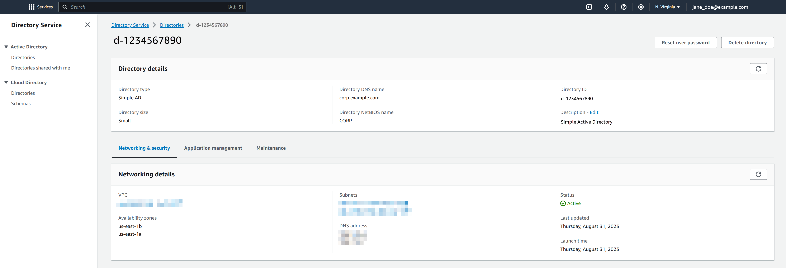

# Viewing Simple AD directory information

###### To view detailed directory information

1. In the [AWS Directory Service console](https://console.aws.amazon.com/directoryservicev2/ "https://console.aws.amazon.com/directoryservicev2/") navigation pane, under **Active Directory**, select
   **Directories**.
2. Choose the directory ID link for your directory. Information about the
   directory is displayed in the **Directory details**
   page.
   For more information about the **Status** field, see [Understanding your Simple AD directory
   status](simple_ad_directory_status.md "simple_ad_directory_status.md").

