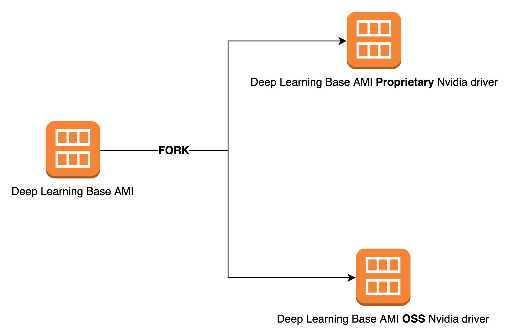

# Important NVIDIA driver changes to DLAMIs

On November 15, 2023, AWS made important changes to AWS Deep Learning AMIs (DLAMI) related to the
NIVIDA driver that DLAMIs use. For information about what changed and whether it affects
your usage of DLAMIs, see [DLAMI NVIDIA driver change FAQs](#important-changes-faq "#important-changes-faq").

## DLAMI NVIDIA driver change FAQs

- [What changed?](#important-changes-faq-changing "#important-changes-faq-changing")
- [Why was this change required?](#important-changes-faq-why "#important-changes-faq-why")
- [Which DLAMIs did this change
  affect?](#important-changes-faq-impact "#important-changes-faq-impact")
- [What does this mean for
  you?](#important-changes-faq-customer "#important-changes-faq-customer")
- [Is there any loss of functionality
  with the newer DLAMIs?](#important-changes-faq-function "#important-changes-faq-function")
- [Did this change affect Deep Learning Containers?](#important-changes-faq-dlc "#important-changes-faq-dlc")

### What changed?

We split DLAMIs into two separate groups:

- DLAMIs that use NVIDIA proprietary driver (to support P3, P3dn, G3)
- DLAMIs that use NVIDIA OSS driver (to support G4dn, G5, P4, P5)

As a result, we created new DLAMIs for each of the two categories with new names
and new AMI IDs. These DLAMIs are _not_
interchangeable. That is, DLAMIs from one group don't support instances that the
other group supports. For example, the DLAMI that supports P5 doesn't support G3,
and the DLAMI that supports G3 doesn't support P5.



### Why was this change required?

Previously, DLAMIs for NVIDIA GPUs included a proprietary kernel driver from
NVIDIA. However, the upstream Linux kernel community accepted a change that isolates
proprietary kernel drivers, such as the NVIDIA GPU driver, from communicating with
other kernel drivers. This change disables GPUDirect RDMA on P4 and P5 series
instances, which is the mechanism that allows GPUs to efficiently use EFA for
distributed training. As a result, DLAMIs now use OpenRM driver (NVIDIA open source
driver), linked against the open source EFA drivers to support G4dn,G5, P4, and P5.
However, this OpenRM driver doesn't support older instances (such as P3 and G3).
Therefore, to ensure that we continue to provide current, performant, and secure
DLAMIs that support both instance types, we split DLAMIs into two groups: one with
the OpenRM driver (that supports G4dn, G5, P4, and P5), and one with the older
proprietary driver (that supports P3, P3dn, and G3).

### Which DLAMIs did this change

affect?

This change affected all DLAMIs.

### What does this mean for

you?

All DLAMIs will continue to provide functionality, performance, and security as
long as you run them on a supported Amazon Elastic Compute Cloud (Amazon EC2) instance type. To determine
the EC2 instance types that a DLAMI supports, check the release notes for
that DLAMI, and then look for **Supported EC2 Instances**.
For a list of currently supported DLAMI options and links to their release notes,
see [Deep Learning AMIs Release Notes](appendix-ami-release-notes.md "appendix-ami-release-notes.md").

Additionally, you must use the correct AWS Command Line Interface (AWS CLI) commands to invoke the
current DLAMIs.

For base DLAMIs that support P3, P3dn, and G3, use this command:

```
aws ec2 describe-images --region us-east-1 --owners amazon \
--filters 'Name=name,Values=Deep Learning Base Proprietary Nvidia Driver AMI (Amazon Linux 2) Version ??.?' 'Name=state,Values=available' \
--query 'reverse(sort_by(Images, &CreationDate))[:1].ImageId' --output text
```

For base DLAMIs that support G4dn, G5, P4, and P5, use this command:

```
aws ec2 describe-images --region us-east-1 --owners amazon \
--filters 'Name=name,Values=Deep Learning Base OSS Nvidia Driver AMI (Amazon Linux 2) Version ??.?' 'Name=state,Values=available' \
--query 'reverse(sort_by(Images, &CreationDate))[:1].ImageId' --output text
```

### Is there any loss of functionality

with the newer DLAMIs?

No, there is no loss of functionality. The current DLAMIs provide all the
functionality, performance, and security of the previous DLAMIs, provided you run
them on a supported EC2 instance type.

### Did this change affect Deep Learning Containers?

No, this change didn't affect AWS Deep Learning Containers, because they don't include the NVIDIA
driver. However, make sure to run Deep Learning Containers on AMIs that are compatible with the
underlying instances.
