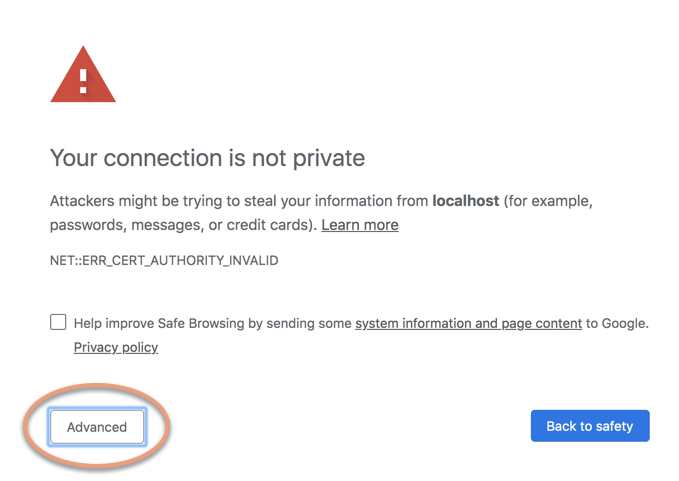
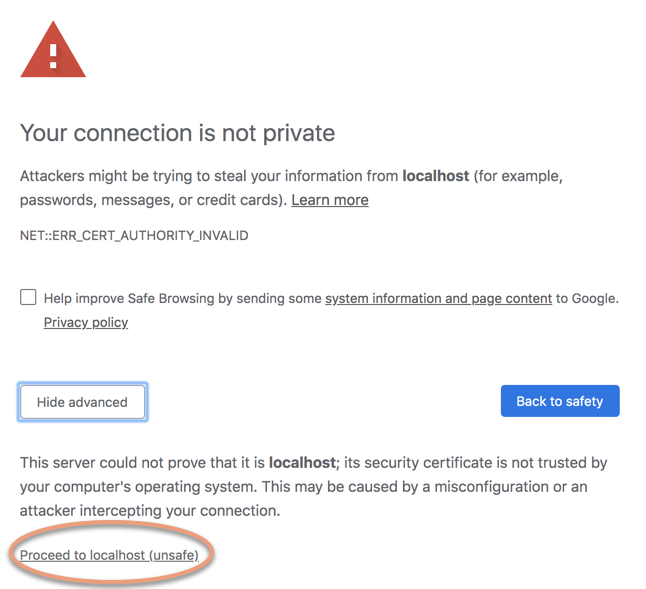

# Logging in to the Jupyter Notebook server on a DLAMI instance

After you [connect your client to the Jupyter Notebook server on your
DLAMI instance](setup-jupyter-connect.md "setup-jupyter-connect.md"), you can log in to the server.

###### To log in to the server in your browser

1. In the address bar of your browser, enter the following URL, or click on this link: [https://localhost:8888](https://localhost:8888 "https://localhost:8888")
2. With a self-signed SSL certificate, your browser will warn you and prompt you to avoid
   continuing to visit the website.

Since you set this up yourself, it is safe to continue.
Depending your browser you will get an "advanced", "show details", or similar button.

Click on this, then click on the "proceed to localhost" link. If the connection is
successful, you see the Jupyter Notebook server webpage. At this point, you will be asked for the
password you previously set up.

Now you have access to the Jupyter Notebook server that is running on the DLAMI instance. You can create new
notebooks or run the provided [Tutorials](tutorials.md "tutorials.md").
