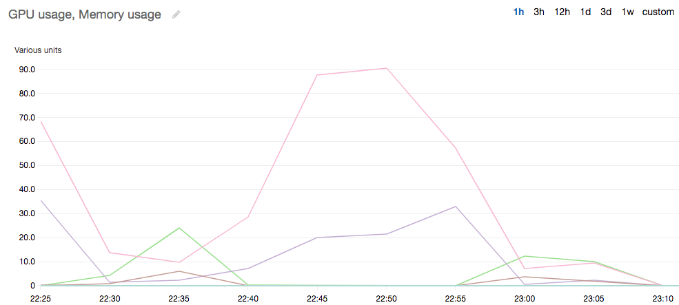

# Monitor GPUs with CloudWatch

When you use your DLAMI with a GPU
you might find that you are looking for ways to track its usage during
training or inference.
This can be useful for optimizing your data pipeline,
and tuning your deep learning network.

There are two ways to configure GPU metrics with CloudWatch:

- [Configure metrics with the AWS CloudWatch agent (Recommended)](#tutorial-gpu-monitoring-gpumon-cloudwatch-agent-guide "#tutorial-gpu-monitoring-gpumon-cloudwatch-agent-guide")
- [Configure metrics with the preinstalled gpumon.py script](#tutorial-gpu-monitoring-gpumon-script "#tutorial-gpu-monitoring-gpumon-script")

## Configure metrics with the AWS CloudWatch agent (Recommended)

Integrate your DLAMI with the [unified CloudWatch agent](../../../AmazonCloudWatch/latest/monitoring/Install-CloudWatch-Agent.md "../../../AmazonCloudWatch/latest/monitoring/Install-CloudWatch-Agent.md") to configure GPU metrics and monitor the utilization of GPU coprocesses in Amazon EC2 accelerated instances.

There are four ways to configure [GPU metrics](../../../AmazonCloudWatch/latest/monitoring/CloudWatch-Agent-NVIDIA-GPU.md "../../../AmazonCloudWatch/latest/monitoring/CloudWatch-Agent-NVIDIA-GPU.md") with your DLAMI:

- [Configure minimal GPU metrics](#tutorial-gpu-monitoring-gpumon-cloudwatch-agent-minimal "#tutorial-gpu-monitoring-gpumon-cloudwatch-agent-minimal")
- [Configure partial GPU metrics](#tutorial-gpu-monitoring-gpumon-cloudwatch-agent-partial "#tutorial-gpu-monitoring-gpumon-cloudwatch-agent-partial")
- [Configure all available GPU metrics](#tutorial-gpu-monitoring-gpumon-cloudwatch-agent-all "#tutorial-gpu-monitoring-gpumon-cloudwatch-agent-all")
- [Configure custom GPU metrics](#tutorial-gpu-monitoring-gpumon-cloudwatch-agent-custom "#tutorial-gpu-monitoring-gpumon-cloudwatch-agent-custom")

For information on updates and security patches, see [Security patching for the AWS CloudWatch agent](#tutorial-gpu-monitoring-gpumon-cloudwatch-agent-security "#tutorial-gpu-monitoring-gpumon-cloudwatch-agent-security")

### Prerequisites

To get started, you must configure Amazon EC2 instance IAM permissions that allow your instance to push metrics to CloudWatch.
For detailed steps, see [Create IAM roles and users for use with the CloudWatch agent](../../../AmazonCloudWatch/latest/monitoring/create-iam-roles-for-cloudwatch-agent.md "../../../AmazonCloudWatch/latest/monitoring/create-iam-roles-for-cloudwatch-agent.md").

### Configure minimal GPU metrics

Configure minimal GPU metrics using the `dlami-cloudwatch-agent@minimal` `systemd` service.
This service configures the following metrics:

- `utilization_gpu`
- `utilization_memory`

You can find the `systemd` service for minimal preconfigured GPU metrics in the following location:

```
/opt/aws/amazon-cloudwatch-agent/etc/dlami-amazon-cloudwatch-agent-minimal.json
```

Enable and start the `systemd` service with the following commands:

```
sudo systemctl enable dlami-cloudwatch-agent@minimal
sudo systemctl start dlami-cloudwatch-agent@minimal
```

### Configure partial GPU metrics

Configure partial GPU metrics using the `dlami-cloudwatch-agent@partial` `systemd` service.
This service configures the following metrics:

- `utilization_gpu`
- `utilization_memory`
- `memory_total`
- `memory_used`
- `memory_free`

You can find the `systemd` service for partial preconfigured GPU metrics in the following location:

```
/opt/aws/amazon-cloudwatch-agent/etc/dlami-amazon-cloudwatch-agent-partial.json
```

Enable and start the `systemd` service with the following commands:

```
sudo systemctl enable dlami-cloudwatch-agent@partial
sudo systemctl start dlami-cloudwatch-agent@partial
```

### Configure all available GPU metrics

Configure all available GPU metrics using the `dlami-cloudwatch-agent@all` `systemd` service.
This service configures the following metrics:

- `utilization_gpu`
- `utilization_memory`
- `memory_total`
- `memory_used`
- `memory_free`
- `temperature_gpu`
- `power_draw`
- `fan_speed`
- `pcie_link_gen_current`
- `pcie_link_width_current`
- `encoder_stats_session_count`
- `encoder_stats_average_fps`
- `encoder_stats_average_latency`
- `clocks_current_graphics`
- `clocks_current_sm`
- `clocks_current_memory`
- `clocks_current_video`

You can find the `systemd` service for all available preconfigured GPU metrics in the following location:

```
/opt/aws/amazon-cloudwatch-agent/etc/dlami-amazon-cloudwatch-agent-all.json
```

Enable and start the `systemd` service with the following commands:

```
sudo systemctl enable dlami-cloudwatch-agent@all
sudo systemctl start dlami-cloudwatch-agent@all
```

### Configure custom GPU metrics

If the preconfigured metrics do not meet your requirements, you can create a custom CloudWatch agent configuration file.

#### Create a custom configuration file

To create a custom configuration file, refer to the detailed steps in
[Manually create or edit the CloudWatch agent configuration file](../../../AmazonCloudWatch/latest/monitoring/CloudWatch-Agent-Configuration-File-Details.md "../../../AmazonCloudWatch/latest/monitoring/CloudWatch-Agent-Configuration-File-Details.md").

For this example, assume that the schema definition is located at `/opt/aws/amazon-cloudwatch-agent/etc/amazon-cloudwatch-agent.json`.

#### Configure metrics with your custom file

Run the following command to configure the CloudWatch agent according to your custom file:

```
sudo /opt/aws/amazon-cloudwatch-agent/bin/amazon-cloudwatch-agent-ctl \
-a fetch-config -m ec2 -s -c \
file:/opt/aws/amazon-cloudwatch-agent/etc/amazon-cloudwatch-agent.json
```

### Security patching for the AWS CloudWatch agent

Newly released DLAMIs are configured with the latest available AWS CloudWatch agent security patches.
Refer to the following sections to update your current DLAMI with the latest security patches depending on your operating system of choice.

#### Amazon Linux 2

Use `yum` to get the latest AWS CloudWatch agent security patches for an Amazon Linux 2 DLAMI.

```
 sudo yum update
```

#### Ubuntu

To get the latest AWS CloudWatch security patches for a DLAMI with Ubuntu, it is necessary to
reinstall the AWS CloudWatch agent using an Amazon S3 download link.

```
wget https://s3.`region`.amazonaws.com/amazoncloudwatch-agent-`region`/ubuntu/arm64/latest/amazon-cloudwatch-agent.deb
```

For more information on installing the AWS CloudWatch agent using Amazon S3 download links, see [Installing and running the CloudWatch agent on your servers](../../../AmazonCloudWatch/latest/monitoring/install-CloudWatch-Agent-commandline-fleet.md "../../../AmazonCloudWatch/latest/monitoring/install-CloudWatch-Agent-commandline-fleet.md").

## Configure metrics with the preinstalled `gpumon.py` script

A utility called gpumon.py is preinstalled on your DLAMI.
It integrates with CloudWatch and supports monitoring of per-GPU
usage: GPU memory, GPU temperature, and GPU Power.
The script periodically sends the monitored data to CloudWatch.
You can configure the level of granularity for data being sent to
CloudWatch by changing a few settings in the script.
Before starting the script, however, you will need to setup
CloudWatch to receive the metrics.

###### How to setup and run GPU monitoring with CloudWatch

1. Create an IAM user, or modify an existing one to have a
   policy for publishing the metric to CloudWatch.
   If you create a new user please take note of the credentials
   as you will need these in the next step.

The IAM policy to search for is “cloudwatch:PutMetricData”.
The policy that is added is as follows:

JSON

```
`{
 "Version":"2012-10-17",
 "Statement": [
 {
 "Action": [
 "cloudwatch:PutMetricData"
 ],
 "Effect": "Allow",
 "Resource": "*"
 }
 ]
}`

```

###### Tip

For more information on creating an IAM user and adding
policies for CloudWatch, refer to the
[CloudWatch documentation](../../../AmazonCloudWatch/latest/monitoring/create-iam-roles-for-cloudwatch-agent.md "../../../AmazonCloudWatch/latest/monitoring/create-iam-roles-for-cloudwatch-agent.md"). 2. On your DLAMI, run
[AWS configure](../../../cli/latest/userguide/cli-chap-configure.md#cli-quick-configuration "../../../cli/latest/userguide/cli-chap-configure.md#cli-quick-configuration") and specify the IAM user credentials.

```
`$` aws configure
```

3. You might need to make some modifications to the gpumon utility before you
   run it. You can find the gpumon utility and README in the location defined
   in the following code block. For more information on the
   `gpumon.py` script, see [the Amazon S3 location of the script.](https://s3.amazonaws.com/aws-bigdata-blog/artifacts/GPUMonitoring/gpumon.py "https://s3.amazonaws.com/aws-bigdata-blog/artifacts/GPUMonitoring/gpumon.py")

```
Folder: ~/tools/GPUCloudWatchMonitor
Files: 	~/tools/GPUCloudWatchMonitor/gpumon.py
      	~/tools/GPUCloudWatchMonitor/README
```

Options:

    * Change the region in gpumon.py if your instance is
     NOT in us-east-1.
    * Change other parameters such as the CloudWatch
     `namespace` or the reporting period with
     `store_reso`.

4. Currently the script only supports Python 3. Activate your preferred
   framework’s Python 3 environment or activate the DLAMI general Python 3
   environment.

```
`$` source activate python3
```

5. Run the gpumon utility in background.

```
`(python3)$` python gpumon.py &
```

6. Open your browser to the
   [https://console.aws.amazon.com/cloudwatch/](https://console.aws.amazon.com/cloudwatch/ "https://console.aws.amazon.com/cloudwatch/")
   then select metric. It will have a namespace 'DeepLearningTrain'.

###### Tip

You can change the namespace by modifying gpumon.py. You can also
modify the reporting interval by adjusting `store_reso`.

The following is an example CloudWatch chart reporting on a run of
gpumon.py monitoring a training job on p2.8xlarge instance.



You might be interested in these other topics on GPU monitoring and
optimization:

- [Monitoring](tutorial-gpu-monitoring.md "tutorial-gpu-monitoring.md")
  - Monitor GPUs with CloudWatch

- [Optimization](tutorial-gpu-opt.md "tutorial-gpu-opt.md")
  - [Preprocessing](tutorial-gpu-opt-preprocessing.md "tutorial-gpu-opt-preprocessing.md")
  - [Training](tutorial-gpu-opt-training.md "tutorial-gpu-opt-training.md")
