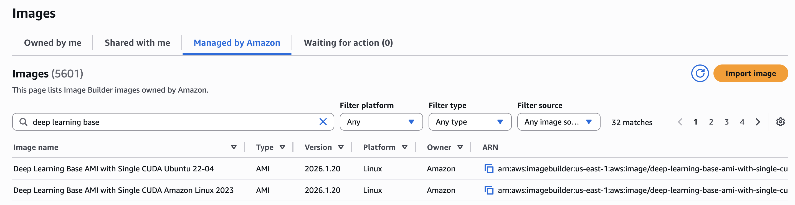
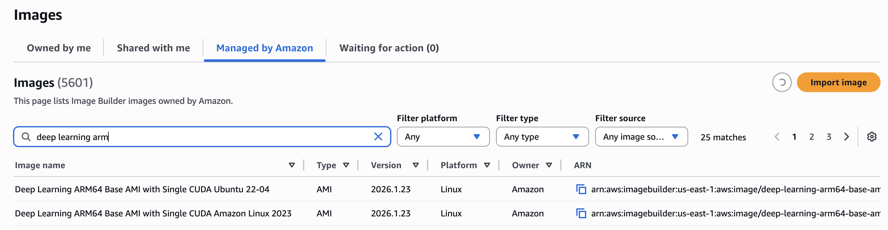
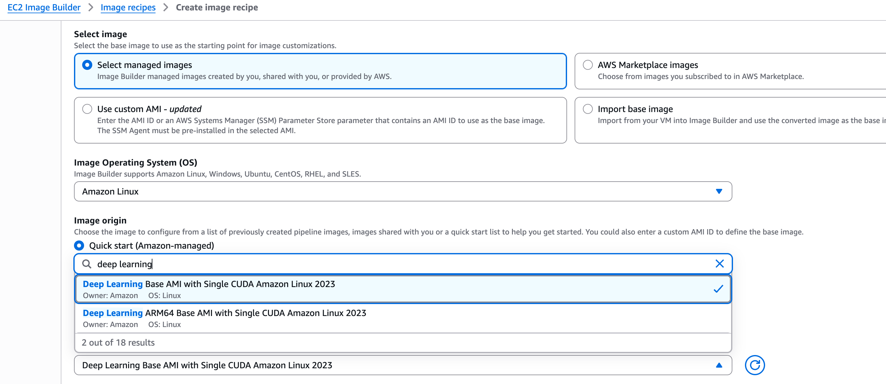
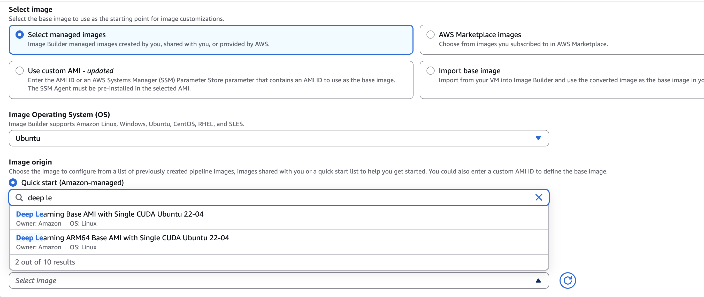

# Using Deep Learning AMIs with EC2 Image Builder

AWS Deep Learning AMIs (DLAMIs) are now available as Amazon-managed images on [EC2 Image Builder](../../../imagebuilder/latest/userguide/what-is-image-builder.md "../../../imagebuilder/latest/userguide/what-is-image-builder.md") service. This integration simplifies the usage of DLAMIs as Base Images and ensures the latest version is used at any given time.

## Available DLAMIs

The following DLAMIs are available as Amazon-managed images found under the **Images section** of the service:

- [Base AMI with Single CUDA (Amazon Linux 2023)](aws-deep-learning-x86-base-with-single-cuda-ami-amazon-linux-2023.md "aws-deep-learning-x86-base-with-single-cuda-ami-amazon-linux-2023.md")
- [Base AMI with Single CUDA (Ubuntu 22.04)](aws-deep-learning-x86-base-with-single-cuda-ami-ubuntu-22-04.md "aws-deep-learning-x86-base-with-single-cuda-ami-ubuntu-22-04.md")
- [ARM64 Base AMI with Single CUDA (Amazon Linux 2023)](aws-deep-learning-arm64-base-with-single-cuda-ami-amazon-linux-2023.md "aws-deep-learning-arm64-base-with-single-cuda-ami-amazon-linux-2023.md")
- [ARM64 Base AMI with Single CUDA (Ubuntu 22.04)](aws-deep-learning-arm64-base-with-single-cuda-ami-ubuntu-22-04.md "aws-deep-learning-arm64-base-with-single-cuda-ami-ubuntu-22-04.md")

## Using DLAMIs as Base Image

DLAMIs can be used as Base Image during Image Recipe creation.

1. Go to the Image Builder console
2. Select **Image recipes**
3. Select **Create image recipe**
4. In the **Base image** section, select **Quick Start (Amazon-managed)**
5. From the dropdown menu, choose one of the available DLAMIs based on your **Image Operating System (OS)** selection
   - If **Amazon Linux** is selected:
     - Deep Learning Base AMI with Single CUDA Amazon Linux 2023
     - Deep Learning ARM64 Base AMI with Single CUDA Amazon Linux 2023

   
   - If **Ubuntu** is selected:
     - Deep Learning Base AMI with Single CUDA Ubuntu 22-04
     - Deep Learning ARM64 Base AMI with Single CUDA Ubuntu 22-04

   
