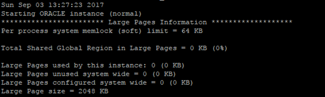
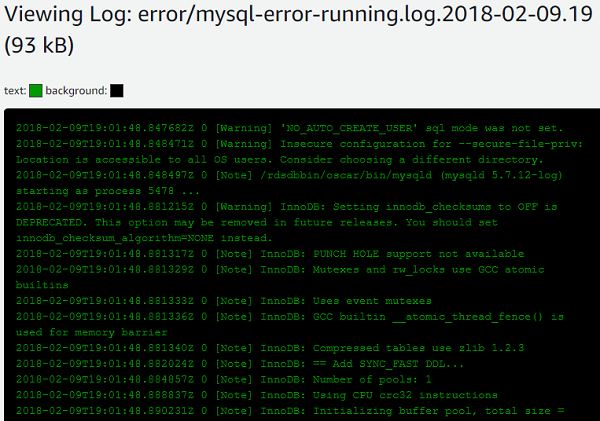

# Oracle alert log and MySQL error log

With AWS DMS, you can capture and analyze Oracle alert log and MySQL error log during database migration tasks. The Oracle alert log records notifications and errors raised by the Oracle database, while the MySQL error log tracks errors, warnings, and notes generated by the MySQL server.

| Feature compatibility                                  | AWS SCT / AWS DMS automation level                                                                                                                      | AWS SCT action code index                                                                                                                                                                                                                                                                                                                                                                                                                                                                                                                                                                                                                                                                                                                                                                                                                                                                                                                                                                         | Key differences                                                                                                                                                                                                                                                                                                                                                                                                                                   |
| ------------------------------------------------------ | ------------------------------------------------------------------------------------------------------------------------------------------------------- | ------------------------------------------------------------------------------------------------------------------------------------------------------------------------------------------------------------------------------------------------------------------------------------------------------------------------------------------------------------------------------------------------------------------------------------------------------------------------------------------------------------------------------------------------------------------------------------------------------------------------------------------------------------------------------------------------------------------------------------------------------------------------------------------------------------------------------------------------------------------------------------------------------------------------------------------------------------------------------------------------- | ------------------------------------------------------------------------------------------------------------------------------------------------------------------------------------------------------------------------------------------------------------------------------------------------------------------------------------------------------------------------------------------------------------------------------------------------- | ----------------------------------------------------------------------------------------------------------------------------------------------------------------------------------------------------------------------------------------------------------------------------------------------------------------------------------------------------------------------------------------------------------------------------------------------------------------------------------------------------------------------------------------------------------------------------------------------------------------------------------------------------------------------------------------------------------------------------------------------------------------------------------------------------------------------------------------------------------------------------------------------------------------------------------------------------------------------------------------------------------------------------------------------------------------------------------------------------------------------------------------------------------------------------------------------------------------------------------------------------------------------------------------------------------------------------------------------------------------------------------------------------------------------------------------------------------------------------------------------------------------------------------------------------------------------------------------------------------------------------------------------------------------------------------------------------------------------------------------------------------------------------------------------------------------------------------------------------------------------------------------------------------------------------------------------------------------------------------------------------------------------------------------------------------------------- | --------------------------------------------------------------------------------------------------------------- |
| One star feature compatibility                         | N/A                                                                                                                                                     | N/A                                                                                                                                                                                                                                                                                                                                                                                                                                                                                                                                                                                                                                                                                                                                                                                                                                                                                                                                                                                               | Use [Event Notifications Subscription](../../../AmazonRDS/latest/UserGuide/USER_Events.md "../../../AmazonRDS/latest/UserGuide/USER_Events.md") with [Amazon Simple Notification Service (SNS)](https://aws.amazon.com/sns/?whats-new-cards.sort-by=item.additionalFields.postDateTime&whats-new-cards.sort-order=desc "https://aws.amazon.com/sns/?whats-new-cards.sort-by=item.additionalFields.postDateTime&whats-new-cards.sort-order=desc"). | ## Oracle usage The primary Oracle error log file is the _alert log_. It contains verbose information about database activity including informational messages and errors. Each event includes a timestamp indicating when the event occurred. The alert log filename format is `alert<sid>.log`. The alert log is the first place to look when troubleshooting or investigating errors, failures, and other messages indicating a potential database problem. Common events logged in the alert log include:  • Database startup or shutdown.  • Database redo log switch.  • Database errors and warnings, which begin with `ORA-` followed by an Oracle error number.  • Network and connection issues.  • Links for a detailed trace files about specific database events. The Oracle Alert Log can be found inside the database Automatic Diagnostics Repository (ADR), which is a hierarchical file-based repository for diagnostic information: `$ADR_BASE/diag/rdbms/{DB-name}/{SID}/trace`. In addition, several other Oracle server components have unique log files such as the database listener and the Automatic Storage Manager (ASM). ### Examples The following screenshot displays partial contents of the Oracle database alert log file.  For more information, see [Monitoring Errors and Alerts](https://docs.oracle.com/en/database/oracle/oracle-database/19/admin/monitoring-the-database.html#GUID-E5F89E8E-7FBC-47DD-BA5D-96AFD9CE4BC7 "https://docs.oracle.com/en/database/oracle/oracle-database/19/admin/monitoring-the-database.html#GUID-E5F89E8E-7FBC-47DD-BA5D-96AFD9CE4BC7") in the _Oracle documentation_. ## MySQL usage MySQL provides detailed logging and reporting of errors that occur during the database and connected sessions life cycle. In an Amazon Aurora deployment, these informational and error messages are accessible using the Amazon Relational Database Service console. ### MySQL and Oracle error codes |
| Oracle                                                 | MySQL                                                                                                                                                   |                                                                                                                                                                                                                                                                                                                                                                                                                                                                                                                                                                                                                                                                                                                                                                                                                                                                                                                                                                                                   | ---                                                                                                                                                                                                                                                                                                                                                                                                                                               | ---                                                                                                                                                                                                                                                                                                                                                                                                                                                                                                                                                                                                                                                                                                                                                                                                                                                                                                                                                                                                                                                                                                                                                                                                                                                                                                                                                                                                                                                                                                                                                                                                                                                                                                                                                                                                                                                                                                                                                                                                                                                                     |
| ORA-00001: unique constraint `string.string` violated. | Error [1062][23000]: Duplicate entry `value` for key `column`.                                                                                          | For more information, see [Server Error Message Reference](https://dev.mysql.com/doc/mysql-errors/8.0/en/server-error-reference.html "https://dev.mysql.com/doc/mysql-errors/8.0/en/server-error-reference.html") in the _MySQL documentation_. ### Error log types MySQL provides several types of logs.                                                                                                                                                                                                                                                                                                                                                                                                                                                                                                                                                                                                                                                                                         | Log type                                                                                                                                                                                                                                                                                                                                                                                                                                          | Information written to log                                                                                                                                                                                                                                                                                                                                                                                                                                                                                                                                                                                                                                                                                                                                                                                                                                                                                                                                                                                                                                                                                                                                                                                                                                                                                                                                                                                                                                                                                                                                                                                                                                                                                                                                                                                                                                                                                                                                                                                                                                              |
| ---                                                    | ---                                                                                                                                                     |                                                                                                                                                                                                                                                                                                                                                                                                                                                                                                                                                                                                                                                                                                                                                                                                                                                                                                                                                                                                   | Error log                                                                                                                                                                                                                                                                                                                                                                                                                                         | Problems encountered starting, running, or stopping mysqld.                                                                                                                                                                                                                                                                                                                                                                                                                                                                                                                                                                                                                                                                                                                                                                                                                                                                                                                                                                                                                                                                                                                                                                                                                                                                                                                                                                                                                                                                                                                                                                                                                                                                                                                                                                                                                                                                                                                                                                                                             |
| General query log                                      | Established client connections and statements received from clients.                                                                                    |                                                                                                                                                                                                                                                                                                                                                                                                                                                                                                                                                                                                                                                                                                                                                                                                                                                                                                                                                                                                   | Binary log                                                                                                                                                                                                                                                                                                                                                                                                                                        | Statements that change data (also used for replication).                                                                                                                                                                                                                                                                                                                                                                                                                                                                                                                                                                                                                                                                                                                                                                                                                                                                                                                                                                                                                                                                                                                                                                                                                                                                                                                                                                                                                                                                                                                                                                                                                                                                                                                                                                                                                                                                                                                                                                                                                |
| Relay log                                              | Data changes received from a replication master server.                                                                                                 |                                                                                                                                                                                                                                                                                                                                                                                                                                                                                                                                                                                                                                                                                                                                                                                                                                                                                                                                                                                                   | Slow query log                                                                                                                                                                                                                                                                                                                                                                                                                                    | Queries that took more than `long_query_time` seconds to execute.                                                                                                                                                                                                                                                                                                                                                                                                                                                                                                                                                                                                                                                                                                                                                                                                                                                                                                                                                                                                                                                                                                                                                                                                                                                                                                                                                                                                                                                                                                                                                                                                                                                                                                                                                                                                                                                                                                                                                                                                       |
| DDL log (metadata log)                                 | Meta-data operations performed by DDL statements.                                                                                                       | For more information, see [MySQL Server Logs](https://dev.mysql.com/doc/refman/5.7/en/server-logs.html "https://dev.mysql.com/doc/refman/5.7/en/server-logs.html") in the _MySQL documentation_. ### Examples Access the MySQL error log using the Amazon Relational Database Service or Amazon Aurora console: 1. Sign in to the AWS Management Console, choose **RDS**, and then choose **Databases**. 2. Choose the instance name. 3. Choose **Logs & events** and select the log to inspect. For example, select the log during the hour the data was experiencing problems. The following screenshot displays partial contents of a MySQL database error log as viewed from the Amazon Relational Database Service console.  ### MySQL error log configuration Several parameters specify the location of the MySQL log and errors files. The following table identifies common Amazon Aurora configuration options. | Parameter                                                                                                                                                                                                                                                                                                                                                                                                                                         | Description                                                                                                                                                                                                                                                                                                                                                                                                                                                                                                                                                                                                                                                                                                                                                                                                                                                                                                                                                                                                                                                                                                                                                                                                                                                                                                                                                                                                                                                                                                                                                                                                                                                                                                                                                                                                                                                                                                                                                                                                                                                             |
| ---                                                    | ---                                                                                                                                                     |                                                                                                                                                                                                                                                                                                                                                                                                                                                                                                                                                                                                                                                                                                                                                                                                                                                                                                                                                                                                   | `log_error`                                                                                                                                                                                                                                                                                                                                                                                                                                       | Sets the file name and path for the error log. You can modify it through an Aurora Database Parameter Group.                                                                                                                                                                                                                                                                                                                                                                                                                                                                                                                                                                                                                                                                                                                                                                                                                                                                                                                                                                                                                                                                                                                                                                                                                                                                                                                                                                                                                                                                                                                                                                                                                                                                                                                                                                                                                                                                                                                                                            |
| `log_error_verbosity`                                  | Sets the message levels that are logged such as error, warning, note messages, and so on. You can modify it through an Aurora Database Parameter Group. |                                                                                                                                                                                                                                                                                                                                                                                                                                                                                                                                                                                                                                                                                                                                                                                                                                                                                                                                                                                                   | `USE SLOW LOG`                                                                                                                                                                                                                                                                                                                                                                                                                                    | Sets the minimum execution time above which statements are logged in ms. You can modify it through an Aurora Database Parameter Group.                                                                                                                                                                                                                                                                                                                                                                                                                                                                                                                                                                                                                                                                                                                                                                                                                                                                                                                                                                                                                                                                                                                                                                                                                                                                                                                                                                                                                                                                                                                                                                                                                                                                                                                                                                                                                                                                                                                                  | ###### Note Modifications of certain parameters, such as `log_error` are turned off for Aurora MySQL instances. |
