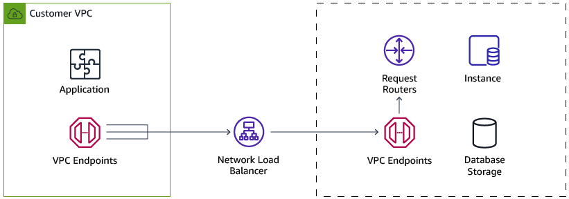

# Migrate to Aurora MySQL Serverless

Another great option can be Amazon Aurora MySQL using Serverless option, this option it currently available only with Aurora MySQL 5.6 compatible.

Amazon Aurora Serverless is an on-demand, auto-scaling configuration for Amazon Aurora MySQL-compatible edition, where the database will automatically start up, shut down, and scale capacity up or down based on your application’s needs. It enables you to run your database in the cloud without managing any database instances. It’s a simple, cost-effective option for infrequent, intermittent, or unpredictable workloads.

Manually managing database capacity can take up valuable time and can lead to inefficient use of database resources. With Aurora Serverless, you simply create a database endpoint, optionally specify the desired database capacity range, and connect your applications. You pay on a per-second basis for the database capacity you use when the database is active, and migrate between standard and serverless configurations with a few clicks in the Amazon RDS Management Console.

For some use cases, this option can be very easy to integrate and it has a big advantage over the Oracle RAC in terms of costs. This instance can be adjusted according to your work load and this is more relevant in terms of scale-out for performance.

You can set the minimum and maximum capacity units required. By doing that, your MySQL serverless instance will scale in/out automatically according to the current workload.

You can choose the following capacity units:

- CPU: 2, RAM: 4 GB
- CPU: 4, RAM: 8 GB
- CPU: 8, RAM: 16 GB
- CPU: 16, RAM: 32 GB
- CPU: 32, RAM: 64 GB
- CPU: 64, RAM: 122 GB
- CPU: 128, RAM: 244 GB
- CPU: 256, RAM: 488 GB

## How it works

- Create an Aurora storage volume replicated across multiple AZs.
- Create an endpoint in your VPC for the application to connect to.
- Configure an invisible to the customer network load balancer behind that endpoint.
- Configure multi-tenant request routers to route database traffic to the underlying instances.
- Provision the initial minimum instance capacity.

This option can be easier than using Oracle RAC because with this option you don’t need to add or remove servers from the cluster. Also, you don’t need to spend on unused hardware, it can scale to even more than you thought you will need when the cluster was created.

For more information, see [Amazon Aurora Serverless](https://aws.amazon.com/rds/aurora/serverless/ "https://aws.amazon.com/rds/aurora/serverless/").
