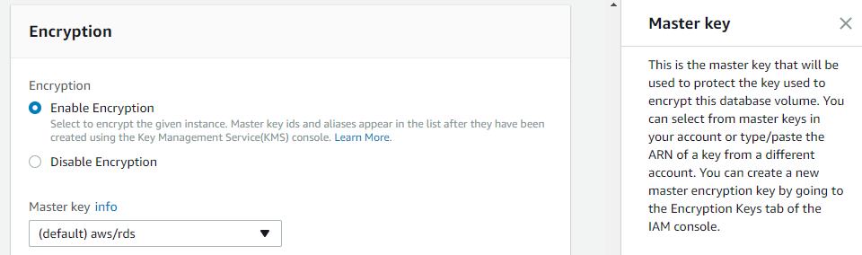

# Oracle transparent data encryption and Amazon Aurora MySQL encryption and column encryption

With AWS DMS, you can migrate databases that use Oracle transparent data encryption or Amazon Aurora MySQL encryption and column encryption to maintain data security during and after the migration process. Oracle transparent data encryption and Aurora MySQL encryption and column encryption provide data-at-rest encryption to protect sensitive information stored in databases.

| Feature compatibility            | AWS SCT / AWS DMS automation level | AWS SCT action code index | Key differences                                                                                                                                                 |
| -------------------------------- | ---------------------------------- | ------------------------- | --------------------------------------------------------------------------------------------------------------------------------------------------------------- | ------------------------------------------------------------------------------------------------------------------------------------------------------------------------------------------------------------------------------------------------------------------------------------------------------------------------------------------------------------------------------------------------------------------------------------------------------------------------------------------------------------------------------------------------------------------------------------------------------------------------------------------------------------------------------------------------------------------------------------------------------------------------------------------------------------------------------------------------------------------------------------------------------------------------------------------------------------------------------------------------------------------------------------------------------------------------------------------------------------------------------------------------------------------------------------------------------------------------------------------------------------------------------------------------------------------------------------------------------------------------------------------------------------------------------------------------------------------------------------------------------------------------------------------------------------------------------------------------------------------------------------------------------------------------------------------------------------------------------------------------------------------------------------------------------------------------------------------------------------------------------------------------------------------------------------------------------------------------------------------------------------------------------------------------------------------------------------------------------------------------------------------------------------------------------------------------------------------------------------------------------------------------------------------------------------------------------------------------------------------------------------------------------------------------------------------------------------------------------------------------------------------------------------------------------------------------------------------------------------------------------------------------------------------------------------------------------------------------------------------------------------------------------------------------------------------------------------------------------------------------------------------------------------------------------------------------------------------------------------------------------------------------------------------------------------------------------------------------------------------------------------------------------------------------------------------------------------------------------------------------------------------------------------------------------------------------------------------------------------------------------------------------------------------------------------------------------------------------------------------------------------------------------------------------------------------------------------------------------------------------------------------------------------------------------------------------------------------------------------------------------------------------------------------------------------------------------------------------------------------------------------------------------------------------------------------------------------------------------------------------------------------------------------------------------------------------------------------------------------------------------------------------------------------------------------------------------------------------------------------------------------------------------------------------------------------------------------------------------------------------------------------------------------------------------------------------------------------------------------------------------------------------------------------------------------------------------------------------------------------------------------------------------------------------------------------------------------------------------------------------------------------------------------------------------------------------------------------------------------------------------------------------------------------------------------------------------------------------------------------------------------------------------------------------------------------------------------------------------------------------------------------------------------------------------------------------------------------------------------------------------------------------------------------------------------------------------------------------------------------------------------------------------------------------------------------------------------------------------------------------------------------------------------------------------------------------------------------------------------------------------------------------------------------------------------------------------------------------------------------------------------------------------------------------------------------------------------------------------------------------------------------------------------------------------------------------------------------------------------------------------------------------------------------------------------------------------------------------------------------------------------------------------------------------------------------------------------------------------------------------------------------------------------------------------------------------------------------------------------------------------------------------------------------------------------------------------------------------------------------------------------------------------------------------------------------------------------------------------------------------------------------------------------------------------------------------------------------------------------------------------------------------------------------------------------------------------------------------------------------------------------------------------------------------------------------------------------------------------------------------------------------------------------------------------------------------------------------------------------------------------------------------------------------------------------------------------------------------------------------------------------------------------------------------------------------------------------------------------------------------------------------------------------------------------------------------------------------------------------------------------------------------------------------------------------------------------------------------------------------------------------------------------------------------------------------------------------------------------------------------------------------------------------------------------------------------------------------------------------------------------------------------------------------------------------------------------------------------------------------------------------------------------------------------------------------------------------------------------------------------------------------------------------------------------------------------------------------------------------------------------------------------------------------------------------------------------------------------------------------------------------------------------------------------------------------------------------------------------------------------------------------------------------------------------------------------------------------------------------------------------------------------------------------------------------------------------------------------------------------------------------------------------------------------------------------------------------------------------------------------------------------------------------------------------------------------------------------------------------------------------------------------------------------------------------------------------------------------------------------------------------------------------------------------------------------------------------------------------------------------------------------------------------------------------------------------------------------------------------------------------------------------------------------------------------------------------------------------------------------------------------------------------------------------------------------------------------------------------------------------------------------------------------------------------------------------------------------------------------------------------------------------------------------------------------------------------------------------------------------------------------------------------------------------------------------------------------------------------------------------------------------------------------------------------------------------------------------------------------------------------------------------------------------------------------------------------------------------------------------------------------------------------------------------------------------------------------------------------------------------------------------------------------------------------------------------------------------------------------------------------------------------------------------------------------------------------------------------------------------------------------------------------------------------------------------------------------------------------------------------------------------------------------------------------------------------------------------------------------------------------------------------------------------------------------------------------------------------------------------------------------------------------------------------------------------------------------------------------ | ---------------------------------------------------------------------------------- | -------------------------------------------------------------------------------------------------------------------------------------------------------------------------------------------------------------------------------------------------------------------------------------------------------------------------------------------------------------------------------------------------------------------------------------------------------------------------------------------------------------------------------------------------------------------------------------------------------------------------------------------------------------------------------------------------------------------------------------------------------------------------------------------------------------------------------------------------------------------------------------------------------------------------------------------------------------------------------------------------------------------------------------------------------------------------------------------------------------------------------------------------------------------------------------------------------------------------------------------------------------------------------------------------------------------------------------------------------------------------------------------------------------------------------------------------------------------------------------------------------------------------------------------------------------------------------------------------------------------------------------------------------------------------------------------------------------------------------------------------------------------------------------------------------------------------------------------------------------------------------------------------------------------------------------------------------------------------------------------------------------------------------------------------------------------------------------------------------------------------------------------------------------------- |
| Three star feature compatibility | N/A                                | N/A                       | For more information, see [Encrypting Amazon RDS resources](../../../AmazonRDS/latest/UserGuide/Overview.md "../../../AmazonRDS/latest/UserGuide/Overview.md"). | ## Oracle usage Oracle uses Transparent Data Encryption (TDE) to encrypt data stored on media in order to provide data at rest protection. Although Oracle uses authentication, authorization, and auditing to secure data in the database, TDE provides additional security at the operating system level. As the name implies, encryption operations are performed automatically and are transparent to client applications. However, TDE does not address data in transit, which must be handled by network security protocols. Characteristics of TDE include: <br>• The `ADMINISTER KEY MANAGEMENT` system privilege is required to configure TDE. <br>• Data can be encrypted at the column level or the tablespace level. <br>• Key encryption is managed in the external TDE Master Encryption Module. <br>• There is one root key for each database. ### Examples **Configure the root encryption key** Specify the location of the encryption wallet using the `ENCRYPTION_WALLET_LOCATION` parameter. Use one of the following options: <br>• Regular filesystem. <br>• Multiple databases share the same file. <br>• ASM file system. <br>• ASM disk group. Register the key file in the ASM disk group. `ENCRYPTION_WALLET_LOCATION= (SOURCE= (METHOD=FILE) (METHOD_DATA= (DIRECTORY=+ASM_file_path_of_the_diskgroup)))` **Create a software keystore** Use one of the following three types of software keystores: <br>• Password-based. <br>• Auto-login. <br>• Local auto-login. Create a password-based software keystore. The user must have the `ADMINISTER KEY MANAGEMENT` or `SYSKM` privilege. `sqlplus c##sec_admin as syskm Enter password: password Connected. ADMINISTER KEY MANAGEMENT CREATE KEYSTORE '/etc/ORACLE/WALLETS/orcl' IDENTIFIED BY password; keystore altered.` **Open a keystore** When you use a password-based keystore, make sure that you open it before creating TDE master encryption keys or accessing the keystore. Keystores are automatically opened when using auto-login or local auto login. `sqlplus c##sec_admin as syskm Enter password: password Connected. ADMINISTER KEY MANAGEMENT SET KEYSTORE OPEN IDENTIFIED BY password; keystore altered.` **Set the software root encryption key** The master encryption key protects the TDE table and tablespace encryption keys. By default, the master encryption key is generated by TDE. To set the master encryption key, ensure the database is open in `READ WRITE` mode, connect with a user account having the required privileges (see the preceding example), and create the master key. `sqlplus c##sec_admin as syskm Enter password: password Connected. ADMINISTER KEY MANAGEMENT SET KEY IDENTIFIED BY keystore_password WITH BACKUP USING 'emp_key_backup'; keystore altered.` **Encrypt data** Create an encrypted column. `CREATE TABLE employee ( FIRST_NAME VARCHAR2(128), LAST_NAME VARCHAR2(128), EMP_ID NUMBER, SALARY NUMBER(6) ENCRYPT);` Column data types support for encryption include `BINARY_DOUBLE`, `BINARY_FLOAT`, `CHAR`, `DATE`, `INTERVAL DAY TO SECOND`, `INTERVAL YEAR TO MONTH`, `NCHAR`, `NUMBER`, `NVARCHAR2`, `RAW` (legacy or extended), `TIMESTAMP` (includes `TIMESTAMP WITH TIME ZONE` and `TIMESTAMP WITH LOCAL TIME ZONE`), `VARCHAR2` (legacy or extended). Column encryption can’t be used with the following features: <br>• Index types other than B-tree. <br>• Range scan search through an index. <br>• Synchronous change data capture. <br>• Transportable tablespaces. <br>• Columns used in foreign key constraints. You can change the encryption algorithm using the `NO SALT` clause to encrypt without an algorithm or the `USING` clause to specify an algorithm. `CREATE TABLE EMPLOYEE ( FIRST_NAME VARCHAR2(128), LAST_NAME VARCHAR2(128), EMP_ID NUMBER ENCRYPT NO SALT, SALARY NUMBER(6) ENCRYPT USING '3DES168');` Change the algorithm on an existing table. `ALTER TABLE EMPLOYEE REKEY USING 'SHA-1';` Remove column encryption. `ALTER TABLE employee MODIFY (SALARY DECRYPT);` <br>• Make sure that the `COMPATIBLE` initialization parameter is set to at least 11.2.0.0. <br>• Log in to your database. <br>• Create the tablespace. You can’t modify an existing tablespace; you can only create a new one. In the following example, the first tablespace is created with AES256 algorithm and the second is created with the default algorithm. `sqlplus sec_admin@hrpdb Enter password: password Connected. CREATE TABLESPACE encrypt_ts DATAFILE '$ORACLE_HOME/dbs/encrypt_df.dbf' SIZE 1M ENCRYPTION USING 'AES256' DEFAULT STORAGE (ENCRYPT); CREATE TABLESPACE securespace_2 DATAFILE '/home/user/oradata/secure01.dbf' SIZE 150M ENCRYPTION DEFAULT STORAGE(ENCRYPT);` For more information, see [Introduction to Transparent Data Encryption](https://docs.oracle.com/en/database/oracle/oracle-database/19/asoag/introduction-to-transparent-data-encryption.html "https://docs.oracle.com/en/database/oracle/oracle-database/19/asoag/introduction-to-transparent-data-encryption.html") in the _Oracle documentation_. ## MySQL usage Amazon provides the ability to encrypt data at rest (data stored in persistent storage). When data encryption is turned on, it automatically encrypts the database server storage, automated backups, read replicas, and snapshots using the AES-256 encryption algorithm. AWS Key Management Service (AWS KMS) performs the encryption. For more information, see [AWS Key Management Service](../../../kms/latest/developerguide/overview.md "../../../kms/latest/developerguide/overview.md"). Once enabled, AWS transparently encrypts and decrypts the data without any impact on performance or any user intervention. There is no need to modify clients to support encryption. ###### Note Amazon Relational Database Service (Amazon RDS) for MySQL version 8 supports FIPS mode if compiled using OpenSSL and an OpenSSL library and FIPS Object Module are available at runtime. FIPS mode imposes conditions on cryptographic operations such as restrictions on acceptable encryption algorithms or requirements for longer key lengths. For more information, see [FIPS Support](https://dev.mysql.com/doc/refman/8.0/en/fips-mode.html "https://dev.mysql.com/doc/refman/8.0/en/fips-mode.html") in the _MySQL documentation_. Table encryption can now be managed globally by defining and enforcing encryption defaults. The `default_table_encryption` variable defines an encryption default for newly created schemas and general tablespace. The encryption default for a schema can also be defined using the `DEFAULT ENCRYPTION` clause when creating a schema. By default a table inherits the encryption of the schema or general tablespace it is created in. Encryption defaults are enforced by enabling the `table_encryption_privilege_check` variable. The privilege check occurs when creating or altering a schema or general tablespace with an encryption setting that differs from the `default_table_encryption` setting or when creating or altering a table with an encryption setting that differs from the default schema encryption. The `TABLE_ENCRYPTION_ADMIN` privilege permits overriding default encryption settings when `table_encryption_privilege_check` is enabled. For more information, see [Defining an Encryption Default for Schemas and General Tablespaces](https://dev.mysql.com/doc/refman/8.0/en/innodb-data-encryption.html#innodb-schema-tablespace-encryption-default "https://dev.mysql.com/doc/refman/8.0/en/innodb-data-encryption.html#innodb-schema-tablespace-encryption-default") in the _MySQL documentation_. ### Create an encryption key To create your own key, follow these steps. 1. Sign in to the AWS Management Console and choose **Key Management Service**. 2. Choose **Customer managed keys**, and then choose **Create key**. 3. For **Key type**, choose **Symmetric**. Expand **Advanced options**. For **Key material origin**, choose **KMS**, and then choose **Next**. 4. For **Alias**, enter the name of your key. Choose **Next**. 5. On the **Define key administrative permissions** tab, choose **Next**. 6. On the next step, make sure that you assign the key to the relevant users who will need to interact with Amazon Aurora. Choose **Next**. 7. Review the key settings and choose **Finish** to create the key. 8. Set the Master encryption key. Use the ARN of the key that you created or choose this key from the list. Now you can launch your instance. ### Enabling encryption As part of the database settings, you will be prompted to enable encryption and select a master key. You can turn on encryption for an Amazon RDS DB instance only during the instance creation.  You can select the default key provided for the account or define a specific key based on an IAM KMS ARN from your account or a different account. ### SSE-S3 encryption feature overview Server-side encryption with Amazon S3-managed encryption keys (SSE-S3) uses multi-factor encryption. Amazon S3 encrypts its objects with a unique key and it also encrypts the key itself with a master key that rotates periodically. SSE-S3 uses AES-256 as its encryption standard. After you turn on the server-side encryption for an Amazon S3 bucket, the data will be encrypted at rest. Make sure that all API calls now include the special header as shown following: `-x-amz-server-side-encryption`. For more information, see [Specifying Amazon S3 encryption](../../../AmazonS3/latest/userguide/specifying-s3-encryption.md "../../../AmazonS3/latest/userguide/specifying-s3-encryption.md") and [s3](https://awscli.amazonaws.com/v2/documentation/api/latest/reference/s3/index.html "https://awscli.amazonaws.com/v2/documentation/api/latest/reference/s3/index.html"). **To turn on SSE-S3** 1. Create an AWS Glue job. 2. Define the role, bucket, and script and then open **Script libraries and job parameters (optional)**. 3. Turn on **Server-side encryption**. 4. Submit and run the job. From this point forward, the only way to access the files is to use AWS CLI s3 with the `--sse` switch, or by adding `x-amz-server-side-encryption` to your API calls. ### Usage of column encryption Aurora MySQL provides encryption and decryption functions similar to Oracle with a much less elaborate security hierarchy that is easier to manage. The encryption functions require the actual key as a string, so you must take extra measures to protect the data. For example, hashing the key values on the client. Aurora MySQL supports the AES and DES encryption algorithms. You can use the following functions for data encryption and decryption: <br>• `AES_DECRYPT` <br>• `AES_ENCRYPT` <br>• `DES_DECRYPT` <br>• `DEC_ENCRYPT` ### Syntax General syntax for the encryption functions is shown following: ``` [A | D]ES_ENCRYPT(<string to be encrypted>, <key string> [,<initialization vector>]) [A | D]ES_DECRYPT(<encrypted string>, <key string> [,<initialization vector>]) `For more information, see [AES\_ENCRYPT](https://dev.mysql.com/doc/refman/5.7/en/encryption-functions.html#function_aes-encrypt "https://dev.mysql.com/doc/refman/5.7/en/encryption-functions.html#function_aes-encrypt") in the *MySQL documentation*. It is highly recommended to use the optional initialization vector to circumvent whole value replacement attacks. When encrypting column data, it is common to use an immutable key as the initialization vector. With this approach, decryption fails if a whole value moves to another row. Consider using SHA2 instead of SHA1 or MD5 because there are known exploits available for the SHA1 and MD5. Passwords, keys, or any sensitive data passed to these functions from the client are not encrypted unless you are using an SSL connection. One benefit of using AWS Identity and Access Management (IAM) is that database connections are encrypted with SSL by default. For more information, see [Users](chap-oracle-aurora-mysql.security.md "chap-oracle-aurora-mysql.security.md") and [Roles](chap-oracle-aurora-mysql.security.md "chap-oracle-aurora-mysql.security.md"). ### Examples The following example demonstrates how to encrypt an employee social security number. Create an employees table.` CREATE TABLE Employees ( EmployeeID INT NOT NULL PRIMARY KEY, SSN_Encrypted BINARY(32) NOT NULL); `Insert the encrypted data.` INSERT INTO Employees (EmployeeID, SSN_Encrypted) VALUES (1, AES_ENCRYPT('1112223333', UNHEX(SHA2('MyPassword',512)), 1)); ``###### Note Use the `UNHEX` function for more efficient storage and comparisons. Verify decryption.`` SELECT EmployeeID, SSN_Encrypted, AES_DECRYPT(SSN_Encrypted, UNHEX(SHA2('MyPassword', 512)), EmployeeID) AS SSN FROM Employees EmployeeID SSN_Encrypted SSN 1 ` ©> +yp°øýNZ~Gø 1112223333 ``` For more information, see [Encryption and Compression Functions](https://dev.mysql.com/doc/refman/5.7/en/encryption-functions.html "https://dev.mysql.com/doc/refman/5.7/en/encryption-functions.html") in the _MySQL documentation_. |
