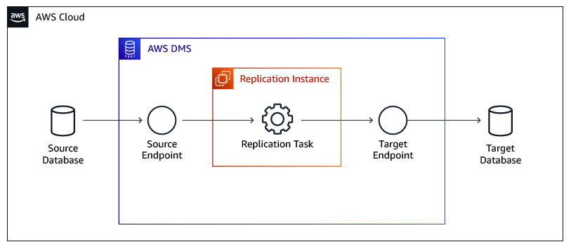

# AWS Database Migration Service

The AWS Database Migration Service (AWS DMS) helps you migrate databases to AWS quickly and securely. The source database remains fully operational during the migration, minimizing downtime to applications that rely on the database. The AWS Database Migration Service can migrate your data to and from most widely-used commercial and open-source databases.

The service supports homogenous migrations such as Oracle to Amazon RDS for Oracle as well as heterogeneous migrations between different database platforms such as Oracle to Amazon Aurora MySQL. You can also use AWS DMS to stream data to Amazon Redshift, Amazon DynamoDB, and Amazon S3 from any of the supported sources, which are Amazon Aurora, PostgreSQL, MySQL, MariaDB, Oracle Database, SAP ASE, SQL Server, IBM DB2 LUW, and MongoDB, enabling consolidation and easy analysis of data in a petabyte-scale data warehouse. The AWS Database Migration Service can also be used for continuous data replication with high availability.

For AWS DMS pricing, see [Database Migration Service pricing](https://aws.amazon.com/dms/pricing "https://aws.amazon.com/dms/pricing").

For all supported sources for AWS DMS, see [Sources for data migration](../userguide/CHAP_Source.md "../userguide/CHAP_Source.md").

For all supported targets for AWS DMS, see [Targets for data migration](../userguide/CHAP_Target.md "../userguide/CHAP_Target.md").

## Migration tasks performed by AWS DMS

In a traditional solution, you need to perform capacity analysis, procure hardware and software, install and administer systems, and test and debug the installation. AWS DMS automatically manages the deployment, management, and monitoring of all hardware and software needed for your migration. You can start your migration within minutes of starting the AWS DMS configuration process.

With AWS DMS, you can scale up (or scale down) your migration resources as needed to match your actual workload. For example, if you determine that you need additional storage, you can easily increase your allocated storage and restart your migration, usually within minutes. On the other hand, if you discover that you aren’t using all of the resource capacity you configured, you can easily downsize to meet your actual workload.

AWS DMS uses a pay-as-you-go model. You only pay for AWS DMS resources while you use them as opposed to traditional licensing models with up-front purchase costs and ongoing maintenance charges.

AWS DMS automatically manages all of the infrastructure that supports your migration server including hardware and software, software patching, and error reporting.

AWS DMS provides automatic failover. If your primary replication server fails for any reason, a backup replication server can take over with little or no interruption of service.

AWS DMS can help you switch to a modern, perhaps more cost-effective database engine than the one you are running now. For example, AWS DMS can help you take advantage of the managed database services provided by Amazon RDS or Amazon Aurora. Or, it can help you move to the managed data warehouse service provided by Amazon Redshift, NoSQL platforms like Amazon DynamoDB, or low-cost storage platforms like Amazon S3. Conversely, if you want to migrate away from old infrastructure but continue to use the same database engine, AWS DMS also supports that process.

AWS DMS supports nearly all of modern popular DBMS engines as data sources, including Oracle, Microsoft SQL Server, MySQL, MariaDB, PostgreSQL, Db2 LUW, SAP, MongoDB, and Amazon Aurora.

AWS DMS provides a broad coverage of available target engines including Oracle, Microsoft SQL Server, PostgreSQL, MySQL, Amazon Redshift, SAP ASE, Amazon S3, and Amazon DynamoDB.

You can migrate from any of the supported data sources to any of the supported data targets. AWS DMS supports fully heterogeneous data migrations between the supported engines.

AWS DMS ensures that your data migration is secure. Data at rest is encrypted with AWS Key Management Service (AWS KMS) encryption. During migration, you can use Secure Socket Layers (SSL) to encrypt your in-flight data as it travels from source to target.

## How AWS DMS works

At its most basic level, AWS DMS is a server in the AWS Cloud that runs replication software. You create a source and target connection to tell AWS DMS where to extract from and load to. Then, you schedule a task that runs on this server to move your data. AWS DMS creates the tables and associated primary keys if they don’t exist on the target. You can pre-create the target tables manually if you prefer. Or you can use AWS SCT to create some or all of the target tables, indexes, views, triggers, and so on.

The following diagram illustrates the AWS DMS process.

For more information about AWS DMS, see [What is Database Migration Service?](../userguide/Welcome.md "../userguide/Welcome.md") and [Best practices for Database Migration Service](../userguide/CHAP_BestPractices.md "../userguide/CHAP_BestPractices.md").
