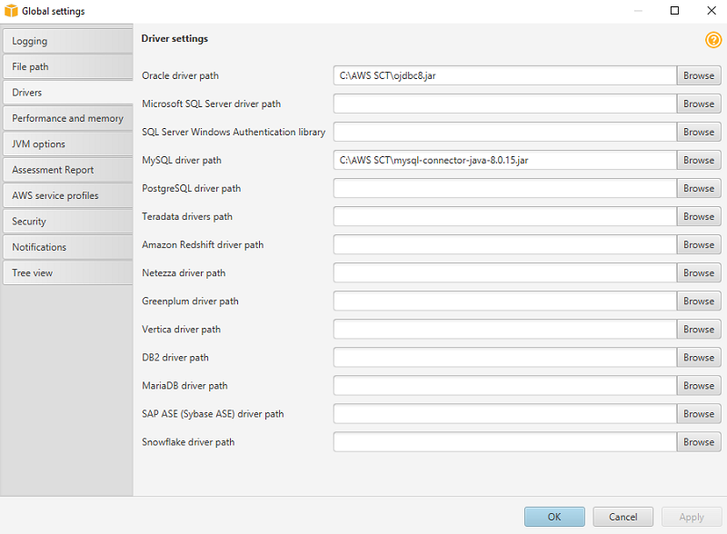
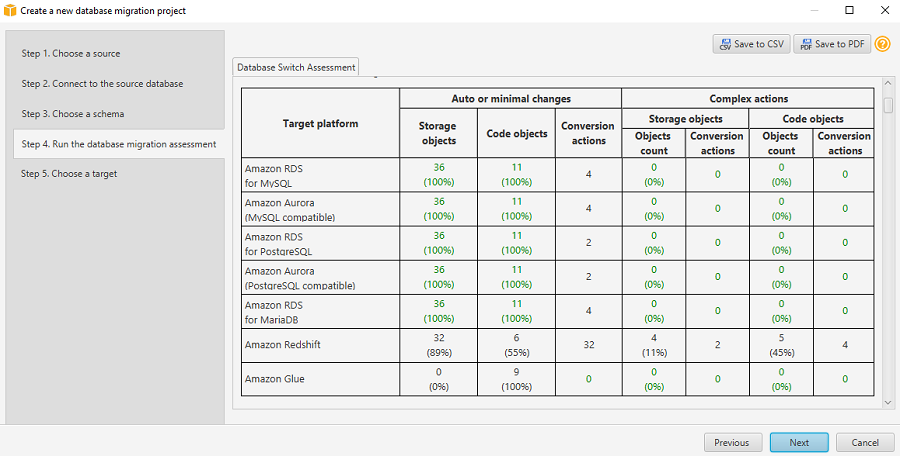
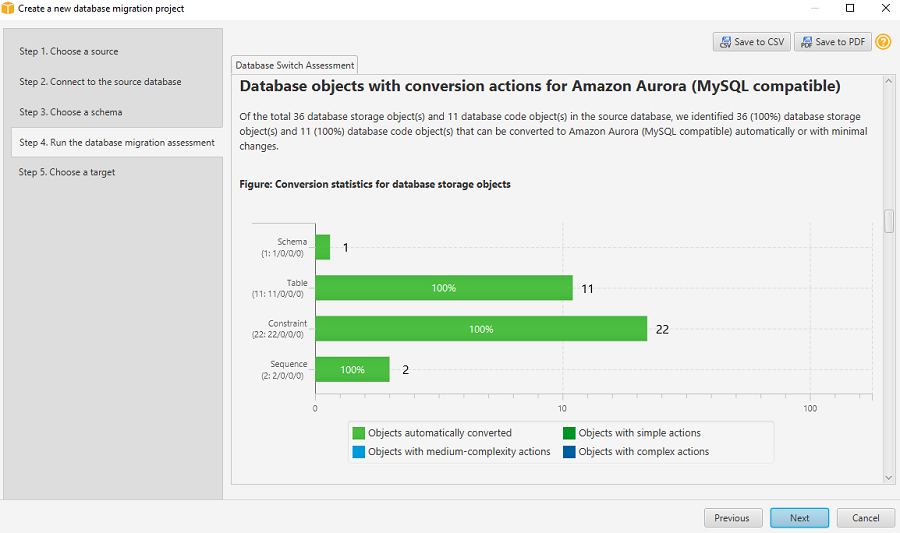

# AWS Schema Conversion Tool

The AWS Schema Conversion Tool (AWS SCT) is a Java utility that connects to source and target databases, scans the source database schema objects (tables, views, indexes, procedures, and so on), and converts them to target database objects.

This section provides a step-by-step process for using AWS SCT to migrate an Oracle database to an Aurora MySQL database cluster. Since AWS SCT can automatically migrate most of the database objects, it greatly reduces manual effort.

We recommend to start every migration with the process outlined in this section and then use the rest of the Playbook to further explore manual solutions for objects that couldn’t be migrated automatically. For more information, see the AWS Schema Conversion Tool
[User Guide](../../../SchemaConversionTool/latest/userguide/Welcome.md "../../../SchemaConversionTool/latest/userguide/Welcome.md").

###### Note

This walkthrough uses the AWS Database Migration Service Sample Database. You can download it from [GitHub](https://github.com/aws-samples/aws-database-migration-samples "https://github.com/aws-samples/aws-database-migration-samples").

## Download the software and drivers

Download and install AWS SCT. For more information, see [Installing, verifying, and updating](../../../SchemaConversionTool/latest/userguide/CHAP_Installing.md "../../../SchemaConversionTool/latest/userguide/CHAP_Installing.md") in the AWS Schema Conversion Tool User Guide.

Download the [Oracle](http://www.oracle.com/technetwork/database/features/jdbc/jdbc-drivers-12c-download-1958347.html "http://www.oracle.com/technetwork/database/features/jdbc/jdbc-drivers-12c-download-1958347.html") and [MySQL](https://dev.mysql.com/downloads/connector/j/ "https://dev.mysql.com/downloads/connector/j/") drivers. For more information, see [Installing the required database drivers](../../../SchemaConversionTool/latest/userguide/CHAP_Installing.md#CHAP_Installing.JDBCDrivers "../../../SchemaConversionTool/latest/userguide/CHAP_Installing.md#CHAP_Installing.JDBCDrivers").

## Configure AWS SCT

Follow this procedure for configuring `AWSSCT` to streamline your database migration process.

1. Start AWS Schema Conversion Tool (AWS SCT).
2. Choose **Settings** and then choose **Global settings**.
3. On the left navigation bar, choose **Drivers**.
4. Enter the paths for the Oracle and MySQL drivers downloaded in the first step.

 5. Choose **Apply** and then **OK**.

## Create a new migration project

Create a new migration project to define the source and target databases, configure migration settings, and launch the replication process.

1. In AWS SCT, choose **File**, and then choose **New project wizard**. Alternatively, use the keyboard shortcut **Ctrl+W**.
2. Enter a project name and select a location for the project files. For **Source engine**, choose **Oracle**, and then choose **Next**.
3. Enter connection details for the source Oracle database and choose **Test connection** to verify. Choose **Next**.
4. Select the schema or database to migrate and choose **Next**.
5. The progress bar displays the objects that AWS SCT analyzes. When AWS SCT completes the analysis, the application displays the database migration assessment report. Read the Executive summary and other sections. Note that the information on the screen is only partial. To read the full report, including details of the individual issues, choose **Save to PDF** at the top right and open the PDF document.

 6. Scroll down to the **Database objects with conversion actions for Amazon Aurora (MySQL compatible)** section.

 7. Scroll further down to the **Detailed recommendations for Amazon Aurora (MySQL compatible) migrations** section and review the migration recommendations. 8. Return to AWS SCT and choose **Next**. Enter the connection details for the target Aurora MySQL database and choose **Finish**. 9. When the connection is complete, AWS SCT displays the main window. In this interface, you can explore the individual issues and recommendations discovered by AWS SCT. 10. Choose the schema, open the context (right-click) menu, and then choose **Create report** to create a report tailored for the target database type. You can view this report in AWS SCT. 11. The progress bar updates while the report is generated. 12. AWS SCT displays the executive summary page of the database migration assessment report. 13. Choose **Action items**. In this window, you can investigate each issue in detail and view the suggested course of action. For each issue, drill down to view all instances of that issue. 14. Choose the database name, open the context (right-click) menu, and choose **Convert schema**. Make sure that you uncheck the `sys` and `information_schema` system schemas. This step doesn’t make any changes to the target database. 15. On the right pane, AWS SCT displays the new virtual schema as if it exists in the target database. Drilling down into individual objects displays the actual syntax generated by AWS SCT to migrate the objects. 16. Choose the database on the right pane, open the context (right-click) menu, and choose either **Apply to database** to automatically run the conversion script against the target database, or choose **Save as SQL** to save to an SQL file. 17. We recommend saving to an SQL file because you can verify and QA the converted code. Also, you can make the adjustments needed for objects that couldn’t be automatically converted.

For more information, see the AWS Schema Conversion Tool
[User Guide](../../../SchemaConversionTool/latest/userguide/Welcome.md "../../../SchemaConversionTool/latest/userguide/Welcome.md").
