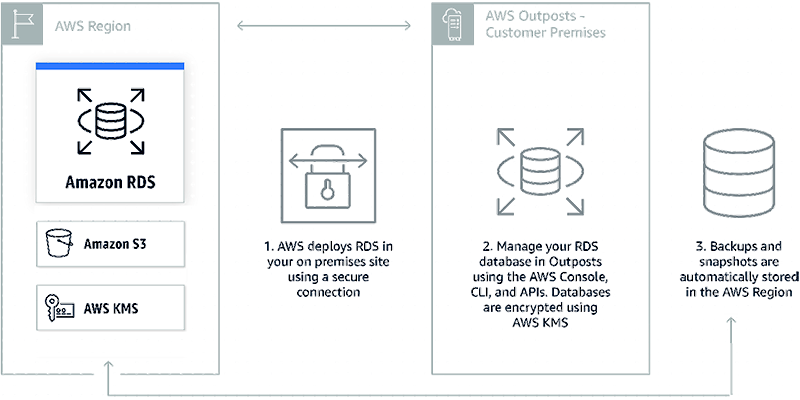

# Amazon RDS on Outposts

###### Note

This topic is related to Amazon Relational Database Service (Amazon RDS) and isn’t supported with Amazon Aurora.

Amazon RDS on Outposts is a fully managed service that offers the same AWS infrastructure, AWS services, APIs, and tools to virtually any data center, co-location space, or on-premises facility for a truly consistent hybrid experience. Amazon RDS on Outposts is ideal for workloads that require low latency access to on-premises systems, local data processing, data residency, and migration of applications with local system inter-dependencies.

When you deploy Amazon RDS on Outposts, you can run Amazon RDS on premises for low latency workloads that need to be run in close proximity to your on-premises data and applications. Amazon RDS on Outposts also enables automatic backup to an AWS Region. You can manage Amazon RDS databases both in the cloud and on premises using the same AWS Management Console, APIs, and CLI. Amazon RDS on Outposts supports Microsoft SQL Server, MySQL, and PostgreSQL database engines, with support for additional database engines coming soon.

## How it works

Amazon RDS on Outposts enables you to run Amazon RDS in your on-premises or co-location site. You can deploy and scale an Amazon RDS database instance in Outposts just as you do in the cloud, using the AWS Management Console, APIs, or CLI. Amazon RDS databases in Outposts are encrypted at rest using AWS KMS keys. Amazon RDS automatically stores all automatic backups and manual snapshots in the AWS Region.

This option is helpful when you need to run Amazon RDS on premises for low latency workloads that need to be run in close proximity to your on-premises data and applications.

For more information, see [AWS Outposts Family](https://aws.amazon.com/outposts "https://aws.amazon.com/outposts"), [Amazon RDS on Outposts](https://aws.amazon.com/rds/outposts "https://aws.amazon.com/rds/outposts"), and [Create Amazon RDS DB Instances on Outposts](https://aws.amazon.com/blogs/aws/new-create-amazon-rds-db-instances-on-aws-outposts "https://aws.amazon.com/blogs/aws/new-create-amazon-rds-db-instances-on-aws-outposts").
