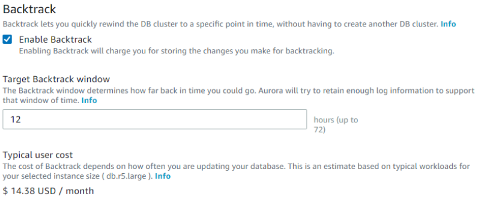
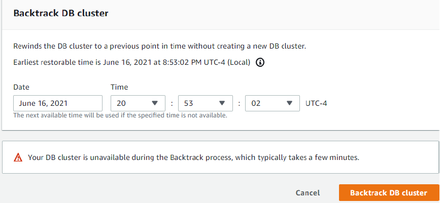

# Amazon Aurora Backtrack

We’ve all been there, you need to make a quick, seemingly simple fix to an important production database. You compose the query, give it a once-over, and let it run. Seconds later you realize that you forgot the `WHERE` clause, dropped the wrong table, or made another serious mistake, and interrupt the query, but the damage has been done. You take a deep breath, whistle through your teeth, wish that reality came with an Undo option.

Backtracking rewinds the DB cluster to the time you specify. Backtracking isn’t a replacement for backing up your DB cluster so that you can restore it to a point in time. However, backtracking provides the following advantages over traditional backup and restore:

- You can easily undo mistakes. If you mistakenly perform a destructive action, such as a `DELETE` without a `WHERE` clause, you can backtrack the DB cluster to a time before the destructive action with minimal interruption of service.
- You can backtrack a DB cluster quickly. Restoring a DB cluster to a point in time launches a new DB cluster and restores it from backup data or a DB cluster snapshot, which can take hours. Backtracking a DB cluster doesn’t require a new DB cluster and rewinds the DB cluster in minutes.
- You can explore earlier data changes. You can repeatedly backtrack a DB cluster back and forth in time to help determine when a particular data change occurred. For example, you can backtrack a DB cluster three hours and then backtrack forward in time one hour. In this case, the backtrack time is two hours before the original time.

Amazon Aurora uses a distributed, log-structured storage system (read Design Considerations for High Throughput Cloud-Native Relational Databases to learn a lot more); each change to your database generates a new log record, identified by a Log Sequence Number (LSN). Enabling the backtrack feature provisions a FIFO buffer in the cluster for storage of LSNs. This allows for quick access and recovery times measured in seconds.

When you create a new Aurora MySQL DB cluster, backtracking is configured when you choose **Enable Backtrack** and specify a **Target Backtrack window** value that is greater than zero in the Backtrack section.

To create a DB cluster, follow the instructions in [Creating an Amazon Aurora DB cluster](../../../AmazonRDS/latest/AuroraUserGuide/Aurora.md "../../../AmazonRDS/latest/AuroraUserGuide/Aurora.md"). The following image shows the Backtrack section.

After a production error, you can simply pause your application, open up the Aurora console, select the cluster, and choose **Backtrack DB cluster**.

Then you select **Backtrack** and choose the point in time just before your epic fail, and choose **Backtrack DB cluster**.

Then you wait for the rewind to take place, unpause your application and proceed as if nothing had happened. When you initiate a backtrack, Aurora will pause the database, close any open connections, drop uncommitted writes, and wait for the backtrack to complete. Then it will resume normal operation and be able to accept requests. The instance state will be backtracking while the rewind is underway.

## Backtrack window

With backtracking, there is a target backtrack window and an actual backtrack window:

- The target backtrack window is the amount of time you want to be able to backtrack your DB cluster. When you enable backtracking, you specify a target backtrack window. For example, you might specify a target backtrack window of 24 hours if you want to be able to backtrack the DB cluster one day.
- The actual backtrack window is the actual amount of time you can backtrack your DB cluster, which can be smaller than the target backtrack window. The actual backtrack window is based on your workload and the storage available for storing information about database changes, called change records.

As you make updates to your Aurora DB cluster with backtracking enabled, you generate change records. Aurora retains change records for the target backtrack window, and you pay an hourly rate for storing them. Both the target backtrack window and the workload on your DB cluster determine the number of change records you store. The workload is the number of changes you make to your DB cluster in a given amount of time. If your workload is heavy, you store more change records in your backtrack window than you do if your workload is light.

You can think of your target backtrack window as the goal for the maximum amount of time you want to be able to backtrack your DB cluster. In most cases, you can backtrack the maximum amount of time that you specified. However, in some cases, the DB cluster can’t store enough change records to backtrack the maximum amount of time, and your actual backtrack window is smaller than your target. Typically, the actual backtrack window is smaller than the target when you have extremely heavy workload on your DB cluster. When your actual backtrack window is smaller than your target, we send you a notification.

When backtracking is turned on for a DB cluster, and you delete a table stored in the DB cluster, Aurora keeps that table in the backtrack change records. It does this so that you can revert back to a time before you deleted the table. If you don’t have enough space in your backtrack window to store the table, the table might be removed from the backtrack change records eventually.

## Backtracking limitations

The following limitations apply to backtracking:

- Backtracking an Aurora DB cluster is available in certain AWS Regions and for specific Aurora MySQL versions only. For more information, see Backtracking in Aurora.
- Backtracking is only available for DB clusters that were created with the Backtrack feature enabled. You can enable the Backtrack feature when you create a new DB cluster or restore a snapshot of a DB cluster. For DB clusters that were created with the Backtrack feature enabled, you can create a clone DB cluster with the Backtrack feature enabled. Currently, you can’t perform backtracking on DB clusters that were created with the Backtrack feature turned off.
- The limit for a backtrack window is 72 hours.
- Backtracking affects the entire DB cluster. For example, you can’t selectively backtrack a single table or a single data update.
- Backtracking isn’t supported with binary log (binlog) replication. Cross-Region replication must be turned off before you can configure or use backtracking.
- You can’t backtrack a database clone to a time before that database clone was created. However, you can use the original database to backtrack to a time before the clone was created. For more information about database cloning, see Cloning an Aurora DB cluster volume.
- Backtracking causes a brief DB instance disruption. You must stop or pause your applications before starting a backtrack operation to ensure that there are no new read or write requests. During the backtrack operation, Aurora pauses the database, closes any open connections, and drops any uncommitted reads and writes. It then waits for the backtrack operation to complete.
- Backtracking isn’t supported for the following AWS Regions:
  - Africa (Cape Town)
  - China (Ningxia)
  - Asia Pacific (Hong Kong)
  - Europe (Milan)
  - Europe (Stockholm)
  - Middle East (Bahrain)
  - South America (São Paulo)

- You can’t restore a cross-region snapshot of a backtrack-enabled cluster in an AWS Region that doesn’t support backtracking.
- You can’t use backtrack with Aurora multi-master clusters.
- If you perform an in-place upgrade for a backtrack-enabled cluster from Aurora MySQL version 1 to version 2, you can’t backtrack to a point in time before the upgrade happened.

For more information, see: [Amazon Aurora Backtrack — Turn Back Time](https://aws.amazon.com/blogs/aws/amazon-aurora-backtrack-turn-back-time "https://aws.amazon.com/blogs/aws/amazon-aurora-backtrack-turn-back-time").
