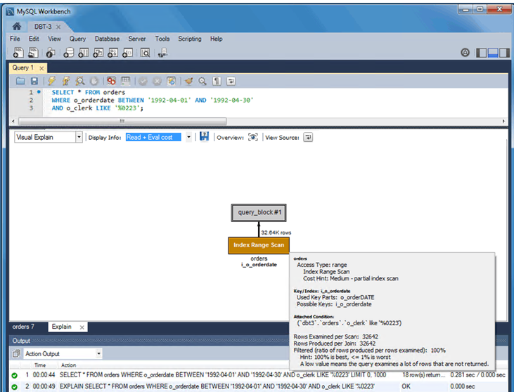

# Oracle and MySQL run plans

With AWS DMS, you can analyze the performance of your database migration tasks by reviewing Oracle and MySQL run plans. An Oracle or MySQL run plan provides detailed information about the run plan for a specific SQL statement, including the steps involved, data access methods, and potential performance bottlenecks.

| Feature compatibility          | AWS SCT / AWS DMS automation level | AWS SCT action code index | Key differences                                                                        |
| ------------------------------ | ---------------------------------- | ------------------------- | -------------------------------------------------------------------------------------- |
| Two star feature compatibility | N/A                                | N/A                       | Syntax differences. Completely different optimizer with different operators and rules. |

## Oracle usage

Run plans represent the choices made by the query optimizer for accessing database data. The query optimizer generates run plans for `SELECT`, `INSERT`, `UPDATE`, and `DELETE` statements. Users and database administrators can view run plans for specific queries and DML operations.

Run plans are especially useful for performance tuning of queries. For example, determining if new indexes should be created. Run plans can be affected by data volumes, data statistics, and instance parameters such as global or session-level parameters.

Run plans are displayed as a structured tree with the following information:

- Tables access by the SQL statement and the referenced order for each table.
- Access method for each table in the statement such as full table scan or index access.
- Algorithms used for join operations between tables such as hash or nested loop joins.
- Operations performed on retrieved data as such as filtering, sorting, and aggregations.
- Information about rows being processed (cardinality) and the cost for each operation.
- Table partitions being accessed.
- Information about parallel runs.

Oracle 19 introduces SQL Quarantine: now queries that consume resources excessively can be automatically quarantined and prevented from running. These queries run plans are also quarantined.

### Examples

Review the potential run plan for a query using the `EXPLAIN PLAN` statement.

```
SET AUTOTRACE TRACEONLY EXPLAIN
SELECT EMPLOYEE_ID, LAST_NAME, FIRST_NAME FROM EMPLOYEES
WHERE LAST_NAME='King' AND FIRST_NAME='Steven';
Run Plan

Plan hash value: 2077747057
| Id | Operation                   | Name        | Rows | Bytes | Cost (%CPU) | Time
| 0  | SELECT STATEMENT            |             | 1    | 16    | 2 (0)       | 00:00:01
| 1  | TABLE ACCESS BY INDEX ROWID | EMPLOYEES   | 1    | 16    | 2 (0)       | 00:00:01
|* 2 | INDEX RANGE SCAN            | EMP_NAME_IX | 1    |       | 1 (0)       | 00:00:01

Predicate Information (identified by operation id):
2 - access("LAST_NAME"='King' AND "FIRST_NAME"='Steven')
```

`SET AUTOTRACE TRACEONLY EXPLAIN` instructs SQL\*PLUS to show the run plan without actually running the query itself.

The `EMPLOYEES` table contains indexes for both the `LAST_NAME` and `FIRST_NAME` columns. Step 2 of the run plan above indicates the optimizer is performing an `INDEX RANGE SCAN` to retrieve the filtered employee name.

View a different run plan displaying a `FULL TABLE SCAN`.

```
SET AUTOTRACE TRACEONLY EXPLAIN
SELECT EMPLOYEE_ID, LAST_NAME, FIRST_NAME FROM EMPLOYEES
WHERE SALARY > 10000;
Run Plan

Plan hash value: 1445457117
| Id | Operation         | Name      | Rows | Bytes | Cost (%CPU) | Time
| 0  | SELECT STATEMENT  |           | 72   | 1368  | 3 (0)       | 00:00:01
|* 1 | TABLE ACCESS FULL | EMPLOYEES | 72   | 1368  | 3 (0)       | 00:00:01

Predicate Information (identified by operation id):
1 - filter("SALARY">10000)
```

For more information, see [Explaining and Displaying Execution Plans](https://docs.oracle.com/en/database/oracle/oracle-database/19/tgsql/generating-and-displaying-execution-plans.html#GUID-60E30B1C-342B-4D71-B154-C26623D6A3B1 "https://docs.oracle.com/en/database/oracle/oracle-database/19/tgsql/generating-and-displaying-execution-plans.html#GUID-60E30B1C-342B-4D71-B154-C26623D6A3B1") in the _Oracle documentation_.

## MySQL usage

Aurora MySQL provides the `EXPLAIN/DESCRIBE` statement—used with the `SELECT`, `DELETE`, `INSERT`, `REPLACE`, and `UPDATE` statements—to display run plans.

###### Note

You can use the `EXPLAIN/DESCRIBE` statement to retrieve table and column metadata.

When you use `EXPLAIN` with a statement, MySQL returns the run plan generated by the query optimizer. MySQL explains how the statement will be processed including information about table joins and order.

When you use `EXPLAIN` with the `FOR CONNECTION` option, it returns the run plan for the statement running in the named connection. You can use the `FORMAT` option to select either a `TRADITIONAL` tabular format or `JSON`.

The `EXPLAIN` statement requires `SELECT` permissions for all tables and views accessed by the query directly or indirectly. For views, `EXPLAIN` requires the `SHOW VIEW` permission.

`EXPLAIN` can be extremely valuable for improving query performance when used to find missing indexes. You can also use `EXPLAIN` to determine if the optimizer joins tables in an optimal order.

MySQL Workbench includes an easy to read visual explain feature similar to Oracle Execution Manager (OEM) graphical run plans.

###### Note

Amazon Relational Database Service (Amazon RDS) for MySQL version 8.0.18 implements `EXPLAIN ANALYZE`, a new form of the `EXPLAIN` statement. This statement provides expanded information about the run of `SELECT` statements in the `TREE` format for each iterator used in processing the query and making it possible to compare estimated cost with the actual cost of the query. This information includes startup cost, total cost, number of rows returned by this iterator and the number of loops executed. In MySQL 8.0.21 and later, this statement also supports a `FORMAT=TREE` specifier. `TREE` is the only supported format. For more information, see [Obtaining Information with EXPLAIN ANALYZE](https://dev.mysql.com/doc/refman/8.0/en/explain.html#explain-analyze "https://dev.mysql.com/doc/refman/8.0/en/explain.html#explain-analyze") in the _MySQL documentation_.

### Syntax

The following example shows the simplified syntax for the `EXPLAIN` statement.

```
{EXPLAIN | DESCRIBE | DESC} [EXTENDED | FORMAT = TRADITIONAL | JSON]
[SELECT statement | DELETE statement | INSERT statement | REPLACE statement | UPDATE
statement | FOR CONNECTION <connection id>]
```

### Examples

View the run plan for a statement.

```
CREATE TABLE Employees (
    EmployeeID INT NOT NULL PRIMARY KEY,
    Name VARCHAR(100) NOT NULL,
    INDEX USING BTREE(Name));
```

```
EXPLAIN SELECT * FROM Employees WHERE Name = 'Jason';
```

For the preceding example, the result looks as shown following.

```
id  select_type  table      partitions  type  possible_keys  key   key_len ref  rows   Extra
1   SIMPLE       Employees              ref   Name           Name  102          const  1
```

The following image demonstrates the MySQL Workbench graphical run plan.



###### Note

To instruct the optimizer to use a join order corresponding to the order in which the tables are specified in a `SELECT` statement, use `SELECT STRAIGHT_JOIN`.

For more information, see [EXPLAIN Statement](https://dev.mysql.com/doc/refman/5.7/en/explain.html "https://dev.mysql.com/doc/refman/5.7/en/explain.html") in the _MySQL documentation_.
